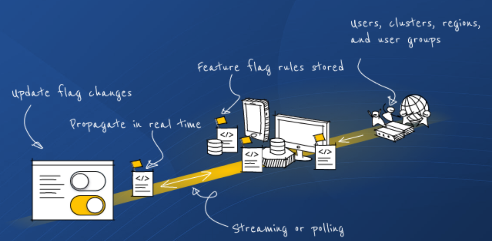

# Making flags resilient during a mobile web browser refresh



With the need to save battery life, mobile operating systems such as iOS and Android are very aggressive in saving system resources when an app is placed in the background. This means that when you switch to another app on your phone, the old app is suspended and frozen. This can cause problems if your app needs to maintain and update its internal state with a remote server - as most Feature Flag SDKs need to do.

With the [Javascript SDK 1.14.0](https://github.com/harness/ff-javascript-client-sdk/releases/tag/1.14.0), a new method has been added to allow the SDK to support this special case. It's called `refreshEvaluations()` and can be used by embedded WebViews and mobile browsers to tell the SDK that it needs to update its local cache. It's typically called when the mobile OS fires a notification to indicate that the app has come to the foreground.

Follow these instructions and code snippets to make your mobile app flags resilient during a mobile web browser refresh.

## Integrating refreshEvaluations() WebView on mobile devices

The SDK can be used inside WebView on native mobile apps for iOS and Android. You will need to add some additional code to tell the SDK to update its local evaluations when the app comes to the foreground after being placed in the background. This will ensure the SDK has the latest evaluations, as the SSE stream will not receive events while the app is suspended in the background. Similarly, you may want to refresh the SDK if the network comes online after a period of no connectivity.

The SDK provides a function on the client instance called `refreshEvaluations()`. Calling this allows you to soft poll the servers for the latest evaluations. To avoid overloading the backend servers, this function will only call out to the network after enough time has elapsed.

### toForeground() JS function
Once you have a client instance add a function that can be easily invoked from the device's native language

```
 function toForeground() {
    client.refreshEvaluations()
  }
```

### iOS
On iOS, add an observer to wait for [willEnterForegroundNotification](https://developer.apple.com/documentation/uikit/uiapplication/1622944-willenterforegroundnotification) on the [WKWebView](https://developer.apple.com/documentation/webkit/wkwebview) to call [evaluateJavaScript()](https://developer.apple.com/documentation/webkit/wkwebview/1415017-evaluatejavascript).

```
  _ = NotificationCenter.default.addObserver(
      forName: UIApplication.willEnterForegroundNotification,
      object: nil,
      queue: .main
  ) { (notification: Notification) in

      if UIApplication.shared.applicationState == .background {

          // tell the embedded JS SDK to refresh itself
          getWebView().evaluateJavaScript("toForeground();") { (result, error) in
             ...
          }
      }
  }
```

### Android
On Android, register an [ActivityLifecycleCallbacks](https://developer.android.com/reference/android/app/Application.ActivityLifecycleCallbacks) listener and override [onActivityStarted](https://developer.android.com/reference/android/app/Application.ActivityLifecycleCallbacks#onActivityStarted(android.app.Activity)) (API level 29). Then once a foreground event arrives, you can call [evaluateJavascript()](https://developer.android.com/reference/android/webkit/WebView#evaluateJavascript(java.lang.String,%20android.webkit.ValueCallback%3Cjava.lang.String%3E)) on the [WebView](https://developer.android.com/reference/android/webkit/WebView).

```
  @Override
  protected void onCreate(Bundle savedInstanceState) {
      super.onCreate(savedInstanceState);

      registerActivityLifecycleCallbacks(new Application.ActivityLifecycleCallbacks() {

          @Override
          public void onActivityStarted(@NonNull Activity activity) {
              WebView webView = findViewById(R.id.webview);
              // tell the embedded JS SDK to refresh itself
              webView.evaluateJavascript("toForeground();", (result) -> {
                  ...
              });
          }
      });
  }
```

### Mobile web browsers
When not embedded inside a WebView and using a mobile browser, you can detect when the browser app comes to the foreground by listening for the 'visibilitychange' event as described here [Page Lifecycle API](https://developer.chrome.com/blog/page-lifecycle-api/).

```
document.addEventListener('visibilitychange', () => {
  if (document.visibilityState === 'visible') {
    client.refreshEvaluations();
  }
})
```

## Summary
Ensure your mobile apps are resilient by leveraging the `refreshEvaluations()` method. Create a [Feature Flag Free Forever Account](https://app.harness.io/auth/#/signup/?module=cf) today and use these code snippets to get started.
