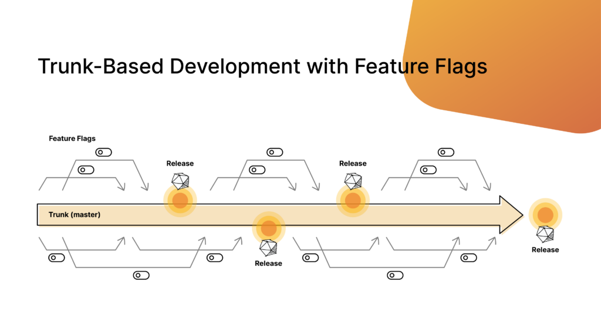

# Using Feature Flags For Trunk-Based Development

## What is trunk-based development?

To understand trunk-based development (TBD) best, it may be helpful to start with how most engineering teams work today:

- Developers make a new feature branch for each initiative.

- After some amount of time, when they deploy and test their feature in a specific environment, they will merge that into a lower env branch, such as dev or QA.

- Most of the time, they will keep working on the feature branch, and merge at infrequent intervals going forward.

- On fixed, recurring occasions, the lower level branches like dev and QA will get merged upward (i.e. dev into QA), until eventually one is merged into the repo’s main branch to cut a new production release.

Sometimes, you will see modifications of this with repo forks instead of feature branches. The specifics almost always vary a bit team by team - but this general approach tends to be the most common.

This is usually described as a branching strategy, and sometimes referred to as working with long lived feature branches. It emerged from a working practice called, at the time, gitflow.

And, on the surface, trunk-based development is not all that dissimilar. Developers will open their own branches, there may still be lower level environment branches such as dev and QA though it’s less common, and production releases will be keyed against the repo’s main branch.

So, how is it different?

## The Power of trunk-based development

Trunk-based development differs from the above scenario in principle as much as in practice. Namely, TBD declares that:

- Feature branches should not be long lived.

- Changes should roll into the main trunk (branch) constantly, ideally daily or faster.

In trunk-based development, you will see teams working more like this:

- Developers open up a feature branch for a new initiative.

- At the end of the day, all work from all teams is merged back into the main branch (or, occasionally, a lower env branch like qa which itself is merged upwards constantly).

- The source of truth is always the main branch. Feature branches are started over or recreated from main once the previous work has been merged.

The benefits of this are immediate. You’ll have less merge complexity, as you won’t be merging codebases that have drifted apart by days or weeks. As you build a new feature, you ensure that you’re constantly running against the current version of your app. You're pulling in other teams’ changes every day, and avoiding the painful scenario of having to refactor based on a change made by another team days, weeks, or even months ago that you missed.

Trunk-based development is an accelerant to CI/CD because it means less complexity. Less complexity means more releases faster, less time spent rebasing and refactoring, and higher quality as you catch conflicts and errors much sooner.

## Common Challenges

So, why don’t all teams use trunk-based development then? The short answer is, it’s not always easy!

Merging into your main branch constantly and keeping all teams up-to-date on the latest changes as they work on new features sounds great, but the reality is that creates a lot of room for collisions.

And, what about releases? How can you cut a production release safely, maybe with an urgently-needed hotfix, if you have four feature teams shipping incomplete work into the only branch you use, with no ability to pick and choose features by branch anymore?

Because of these issues, a lot of teams continue using long-lived feature branches rather than trunk-based development. They do this knowing that this is creating added friction to their CI/CD process, impacting their velocity, and introducing risk.

## Achieving Trunk-Based Development With Feature Flags

The missing piece here, often, is feature flags.

If you’re not familiar with feature flags, you can learn more on our introductory blog, [What Are Feature Flags](https://www.harness.io/blog/what-are-feature-flags). Essentially, flags are a way of working where changes are served behind a conditional flag in your code. This allows you to serve different versions of the code based on certain criteria. Most critically for trunk-based development, feature flags keep changes that are not ready for production yet from being used - while still merging them into the code.

Adding feature flags to your trunk-based development workflow, you will find most of the risk removed (on top of the numerous other benefits of feature flags):

- Developers open up a feature branch for a new initiative.

- Developers put all changes in this branch behind a feature flag by default (we have some recommendations for use cases for feature flags, if you need ideas).

- As developers merge back into the main branch constantly, the work in progress is all served in an off or false state by the feature flag solution, so the work is disabled and at no risk.

- The team can ship to production constantly - daily! hourly! - from the source of truth main branch. They don’t have to care at all how much incomplete work is included; it will be safely dark behind a flag.

## Summary

In this last flow, we see developers leveraging trunk-based development to increase velocity, remove long-lived feature branches, and ship to production constantly. All without the risk of incomplete and untested work causing chaos.

This removes merge conflicts without adding risk and helps teams increase velocity without sacrificing quality or control.

It’s safe to say that feature flags are a necessary part of trunk-based development. The closer any team gets to trunk-based development, the higher their impact and velocity will be.
