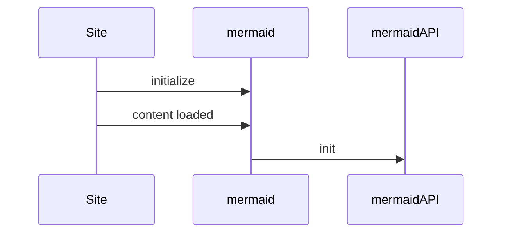

```mdx-code-block
import harness_atl from './static/atlanta_light.png'
```

# Markdown Capabilities

Thanks for checking out the Harness Developer Hub and learning more how to contribute. The HDH is powered by [Docusaurus](https://docusaurus.io/). Can leverage this Markdown File to see the facets of what is possible with Docusaurus's Markdown capabilities in an HDH styled post. Feel free to take a look at this page in `raw` format on GitHub. We look forward to seeing your creativity! 


## Headings
H2 Heading
Can see how different headings look. 

### H3 Heading
H3 Heading

#### H4 Heading
H4 Heading

##### H5 Heading
H5 Heading

## Tables

| Column       | Column | Column                                                                                                                                                              
| :------------------------------ | :------------------------------ | :------------------------------ | 
|**1. Row** | | |
|| Row | Row |

	
## Details
Details are toggle elements. 

<details>
  <summary>Toggle Heading</summary>
  <div>
    <div>This is the detailed content</div>
    <br/>
    <details>
      <summary>
        Nested Toggle
      </summary>
      <div>
       This is the nested detailed content
      </div>
    </details>
  </div>
</details>

### Notes

These are called [admonitions](https://docusaurus.io/docs/markdown-features/admonitions).

:::note

Note text.

:::

:::tip

Tip text.

:::

:::caution

Caution text.

:::

:::info

Information text.

:::

:::danger

Danger text.

:::

## Tabs
Tabs can also now have direct query strings in this example.


```mdx-code-block
import Tabs from '@theme/Tabs';
import TabItem from '@theme/TabItem';
```

```mdx-code-block
<Tabs queryString="tab-number">
<TabItem value="1" label="Tab One">
```

This is an `TabItem` 1.

```mdx-code-block
</TabItem>
<TabItem value="2" label="Tab Two">
```

This is an `TabItem` 2.

```mdx-code-block
</TabItem>
</Tabs>
```

## Code Formatting
Can enable syntax highlighting with these [common languages](https://github.com/FormidableLabs/prism-react-renderer/blob/master/src/vendor/prism/includeLangs.js). 

```js
console.log('Check out Harness, Today!');
```

## Diagram

Docusaurus supports [Mermaid Diagrams](https://mermaid.js.org/config/configuration.html). 



## Images
In HDH, we provide a few ways to include images. We support the standard Markdown format to include also additional control to re-size. 

### Standard Include


### Formattable Include
Can apply what an `img` tag in HTML would apply. 

```
import harness_atl from './static/atlanta_light.png'


```

```mdx-code-block

```

### Lightbox / Image Expand
Can use the `docimage` plugin for this. 

```
<docimage path={require('./static/atlanta_light.png')} />
```

<docimage path={require('./static/atlanta_light.png')} />

## Videos	

Videos are great tools to embed. You can embed a video in your Markdown.

```
<docvideo src="https://www.youtube.com/watch?v=_Nj9EYYuSqY" />
```


<docvideo src="https://www.youtube.com/watch?v=_Nj9EYYuSqY" />

## Quotes
> Software Delivery, made easy!
>
> — Harness

## Includes
Can include MD files as entire files. Import the asset as a tag then
leverage the tag. 

```
import CISignupTip from '/tutorials/shared/ci-signup-tip.md';
<CISignupTip />
```


```mdx-code-block
import CISignupTip from '/tutorials/shared/ci-signup-tip.md';
```

<CISignupTip />

