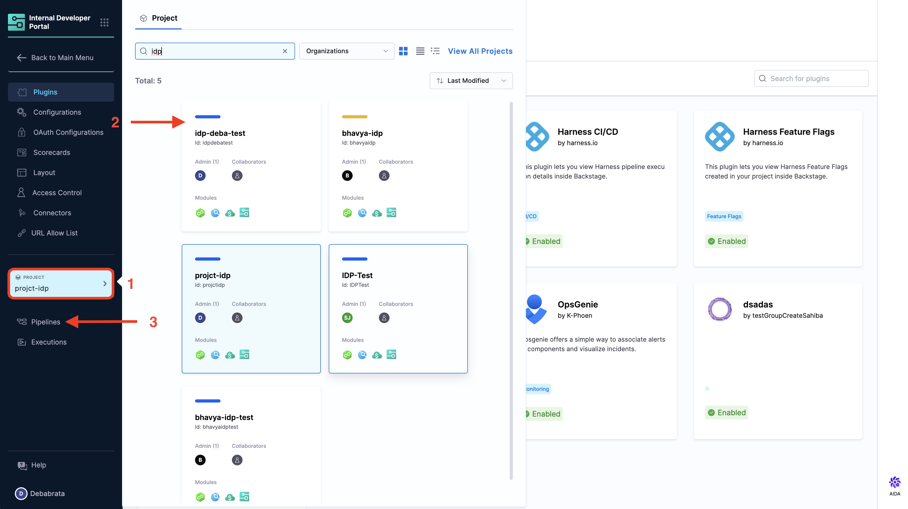
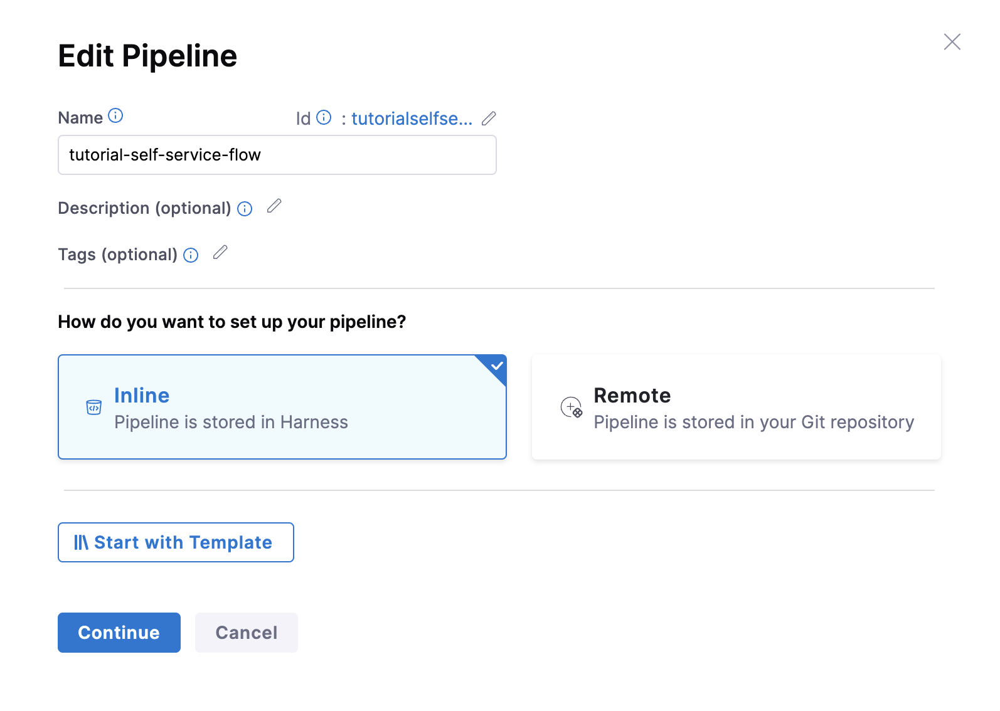
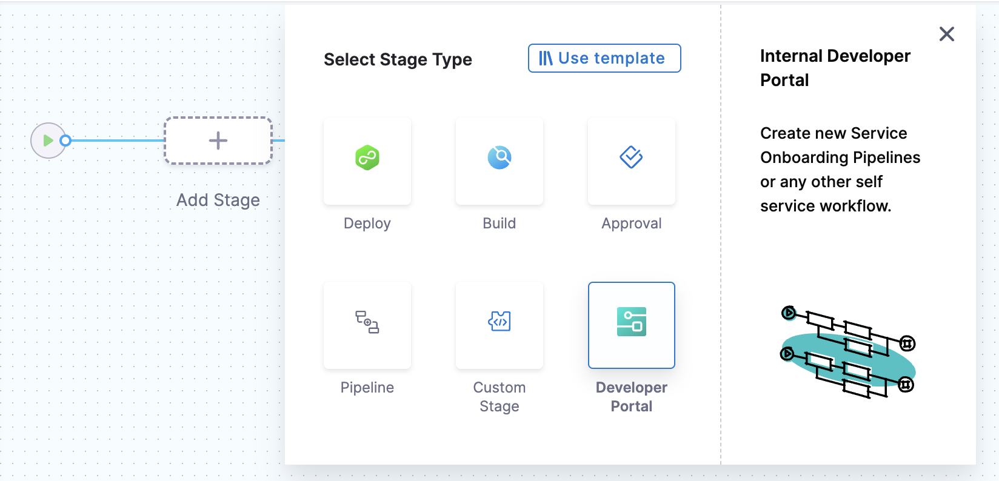
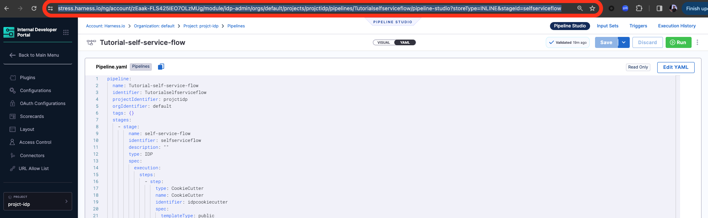
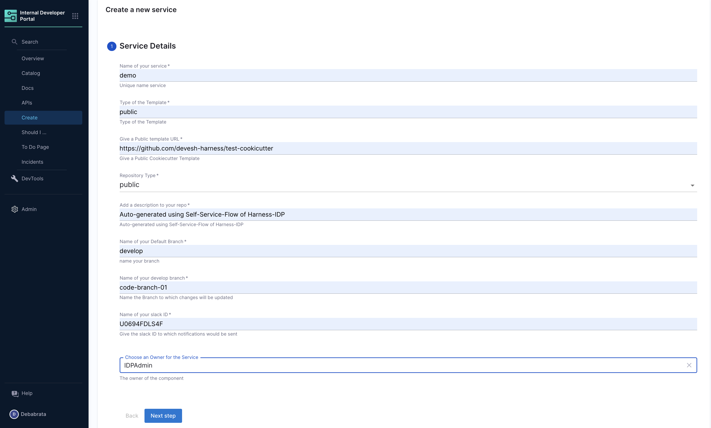
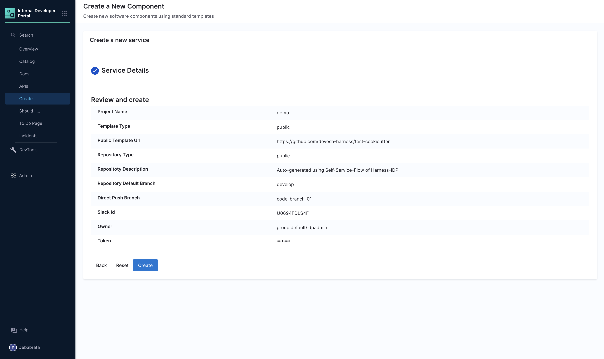
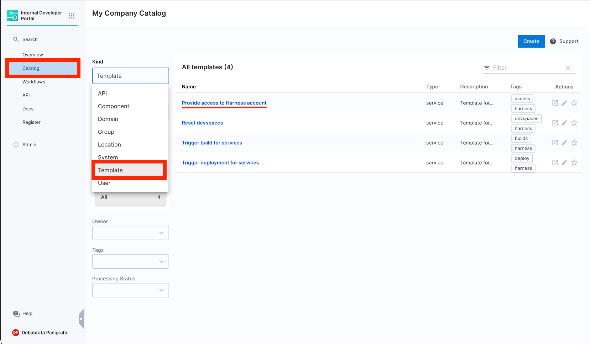
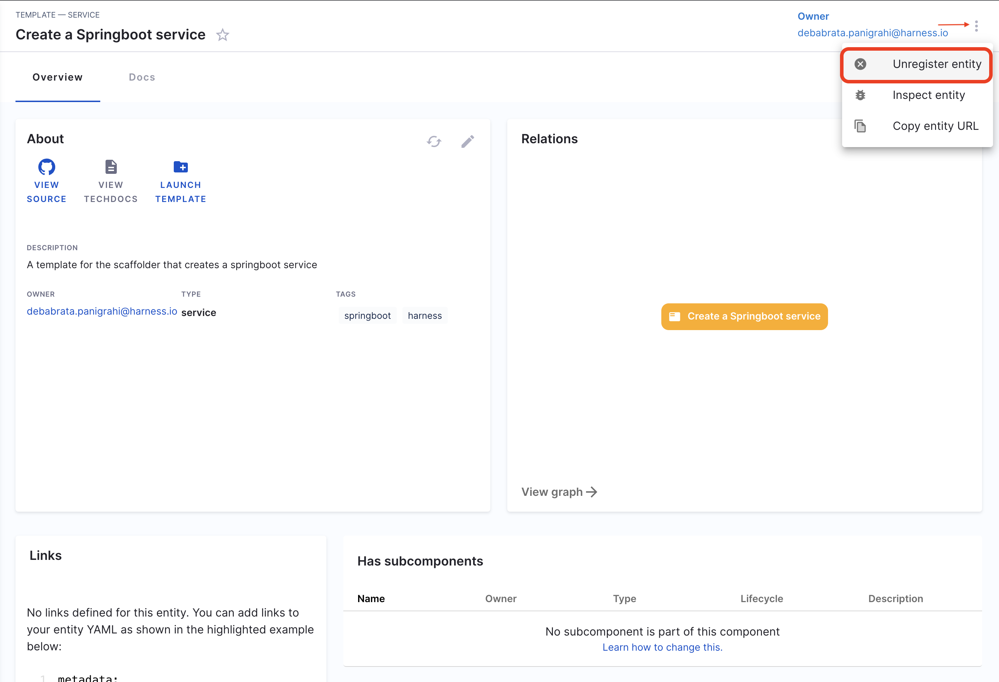
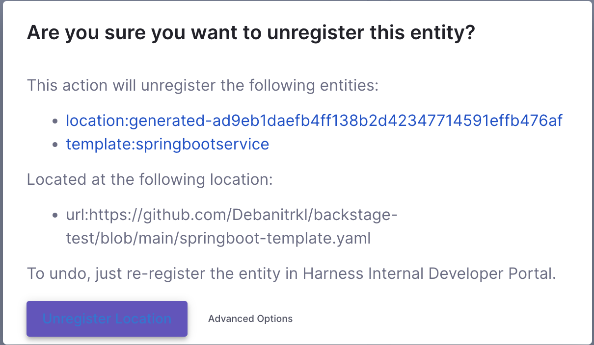

## Introduction

This tutorial is designed to help a platform engineer to get started with Harness IDP. We will create a basic service onboarding pipeline that uses a software template and provisions a application templated by cookiecutter for a developer. After you create the software template, developers can choose the template on the **Workflow** page and enter details such as a name for the application and the path to their Git repository. The service onboarding pipeline creates a new repository and adds a `catalog-info.yaml` to it and registers it back into your software catalog all using the new **Developer Portal** stage. 

Users (developers) must perform a sequence of tasks to create the application. First, they interact with a software template. A software template is a form that collects a user's requirements. After a user submits the form, IDP executes a Harness pipeline that onboards the new service. Usually the pipeline fetches a cookiecutter template code, creates a new repository, and interacts with third-party providers such as cloud providers, Jira, and Slack.


## Prerequisites

Before you begin this tutorial, make sure that you fulfil the following requirements:

- Enable Harness IDP for your account.
- Make sure you are assigned the [IDP-Admin Role](https://developer.harness.io/docs/internal-developer-portal/rbac/resources-roles#1-idp-admin). 
- Create a connector where you want to create the repository, make sure you keep the name same as used below `connectorRef: account.democonnector` where democonnector is the connector name and we are using **Github** in the following tutorial you can [change that](https://developer.harness.io/internal-developer-portal/flows/idp-stage#connector) and update the YAML below as well. 

## Create a pipeline

Begin by creating a pipeline for onboarding the service.

To create a **Developer Portal** stage, perform the following steps:

1. Go to **Admin** section under IDP, select **Projects**, and then select a project.

You can also create a new project for the service onboarding pipelines. Eventually, all the users in your account should have permissions to execute the pipelines in this project. For information about creating a project, go to [Create organizations and projects](/docs/platform/organizations-and-projects/create-an-organization/).



2.  Then select **Create a Pipeline**, add a name for the pipeline and select the type as **Inline**



3. In **Pipeline Studio**, select **Add Stage**. In **Select Stage Type**, select **Developer Portal**.



4. In **Stage Name**, enter a name **self-service-flow** for the stage, and then click **Set Up Stage**.

5. The below given YAML will create a service onbaording pipeline for you using IDP stage as [described in this docs](https://developer.harness.io/docs/internal-developer-portal/flows/idp-stage/#execution-steps). 

6. Now go to the YAML view and from line number 7 `stages:` replace it with the following YAML (make sure you have used the same stage name as described above.)

```YAML
  stages:
    - stage:
        name: self-service-flow
        identifier: selfserviceflow
        description: ""
        type: IDP
        spec:
          execution:
            steps:
              - step:
                  type: CookieCutter
                  name: CookieCutter
                  identifier: idpcookiecutter
                  spec:
                    templateType: public
                    publicTemplateUrl: https://github.com/devesh-harness/test-cookicutter
                    cookieCutterVariables:
                      app_name: <+pipeline.variables.project_name>
              - step:
                  type: CreateRepo
                  name: CreateRepo
                  identifier: createrepo
                  spec:
                    connectorType: Github
                    connectorRef: account.democonnector
                    organization: <+pipeline.variables.organization>
                    repository: <+pipeline.variables.project_name>
                    repoType: public
                    description: <+pipeline.variables.repositoty_description>
                    defaultBranch: <+pipeline.variables.repository_default_branch>
              - step:
                  type: CreateCatalog
                  name: createcatalog
                  identifier: createcatalog
                  spec:
                    fileName: <+pipeline.variables.catalog_file_name>
                    filePath: <+pipeline.variables.project_name>
                    fileContent: |-
                      apiVersion: backstage.io/v1alpha1
                      kind: Component
                      metadata:
                        name: <+pipeline.variables.project_name>
                        description: <+pipeline.variables.project_name> created using self service flow
                        annotations:
                          backstage.io/techdocs-ref: dir:.
                      spec:
                        type: service
                        owner: test
                        lifecycle: experimental
              - step:
                  type: DirectPush
                  name: DirectPush
                  identifier: directpush
                  spec:
                    connectorRef: account.democonnector
                    connectorType: Github
                    repository: <+pipeline.variables.project_name>
                    organization: <+pipeline.variables.organization>
                    codeDirectory: <+pipeline.variables.project_name>
                    branch: <+pipeline.variables.direct_push_branch>
              - step:
                  type: RegisterCatalog
                  name: registercatalog
                  identifier: registercatalog
                  spec:
                    connectorRef: account.democonnector
                    connectorType: Github
                    repository: <+pipeline.variables.project_name>
                    organization: <+pipeline.variables.organization>
                    filePath: <+pipeline.variables.catalog_file_name>
                    branch: <+pipeline.variables.direct_push_branch>
              - step:
                  type: SlackNotify
                  name: slacknotify
                  identifier: slacknotify
                  spec:
                    slackId: <+pipeline.variables.slack_id>
                    messageContent: " Hello <@<+pipeline.variables.slack_id>>, <+pipeline.variables.project_name> project is created using flows in Harness IDP,\\n*Created Catalog Yaml -* <<+pipeline.stages.serviceonboarding.spec.execution.steps.registercatalog.output.outputVariables.catalogInfoUrl>|Link>\\n*Created Repository -* <<+pipeline.stages.serviceonboarding.spec.execution.steps.createrepo.output.outputVariables.repositoryUrl>|Link>\\n*Registered Catlog -* <<+pipeline.stages.serviceonboarding.spec.execution.steps.createcatalog.output.outputVariables.registeredCatalogUrl>|Link>"
                    token: slacksecrettestws
          cloneCodebase: false
          caching:
            enabled: false
            paths: []
          platform:
            os: Linux
            arch: Amd64
          runtime:
            type: Cloud
            spec: {}
  variables:
    - name: test_content
      type: String
      description: ""
      required: false
      value: devesh
    - name: project_name
      type: String
      description: ""
      required: false
      value: <+input>
    - name: organization
      type: String
      description: ""
      required: false
      value: test-org-devesh
    - name: template_type
      type: String
      description: ""
      required: false
      value: <+input>.default(public).allowedValues(public,private)
    - name: public_template_url
      type: String
      description: ""
      required: false
      value: <+input>
    - name: repository_type
      type: String
      description: ""
      required: false
      value: <+input>.default(private).allowedValues(private,public)
    - name: repositoty_description
      type: String
      description: ""
      required: false
      value: <+input>
    - name: repository_default_branch
      type: String
      description: ""
      required: false
      value: <+input>
    - name: direct_push_branch
      type: String
      description: ""
      required: false
      value: <+input>
    - name: catalog_file_name
      type: String
      description: ""
      required: false
      value: catalog-info.yaml
    - name: slack_id
      type: String
      description: ""
      required: false
      value: <+input>
```


7. Now Save the pipeline. 

### Create a software template definition in IDP

Now that our pipeline is ready to execute when a project name and a GitHub repository name are provided, let's create the UI counterpart of it in IDP. This is powered by the [Backstage Software Template](https://backstage.io/docs/features/software-templates/writing-templates). Create a `template.yaml` file anywhere in your Git repository. Usually, that would be the same place as your cookiecutter template.

[Source](https://github.com/Debanitrkl/backstage-test/blob/main/tutorial-self-service-flow-template.yaml)

```YAML
apiVersion: scaffolder.backstage.io/v1beta3
kind: Template
metadata:
  name: react-app
  title: Create a new service
  description: A template to create a new service
  tags:
    - nextjs
    - react
    - javascript
spec:
  owner: debabrata.panigrahi@harness.io
  type: service
  parameters:
    - title: Service Details
      required:
        - project_name
        - template_type
        - repository_type
        - repositoty_description
        - repository_default_branch
        - direct_push_branch
        - slack_id
      properties:
        project_name:
          title: Name of your service
          type: string
          description: Unique name service     
        template_type:
          title: Type of the Template
          type: string
          description: Type of the Template 
        repository_type:
          type: string
          title: Repository Type
          enum:
            - public
            - private
          default: Public
        repositoty_description:
          type: string
          title: Add a description to your repo
          description: Auto-generated using Self-Service-Flow of Harness-IDP 
        repository_default_branch:
          title: Name of your Default Branch
          type: string
          description: name your branch 
        direct_push_branch:
          title: Name of your develop branch
          type: string
          description: Name the Branch to which changes will be updated
        slack_id:
          title: Name of your slack ID
          type: string
          description: Give the slack ID to which notifications would be sent      
        owner:
          title: Choose an Owner for the Service
          type: string
          ui:field: OwnerPicker
          ui:options:
            allowedKinds:
              - Group
        # This field is hidden but needed to authenticate the request to trigger the pipeline
        token:
          title: Harness Token
          type: string
          ui:widget: password
          ui:field: HarnessAuthToken
  steps:
    - id: trigger
      name: Creating your react app
      action: trigger:harness-custom-pipeline
      input:
        url: "https://app.harness.io/ng/account/*******************/module/idp-admin/orgs/default/projects/projctidp/pipelines/newdjangoproject_Clone/pipeline-studio?storeType=INLINE"
        inputset:
          project_name: ${{ parameters.project_name }}
          template_type: ${{ parameters.template_type }}
          repository_type: ${{ parameters.repository_type }}
          repositoty_description: ${{ parameters.repository_description }}
          repository_default_branch: ${{ parameters.repository_default_branch }}
          direct_push_branch: ${{ parameters.direct_push_branch }}
          slack_id: ${{ parameters.slack_id }}
        apikey: ${{ parameters.token }}
    # The final step is to register our new component in the catalog.


  output:
    links:
      - title: Pipeline Details
        url: ${{ steps.trigger.output.PipelineUrl }}
```

Replace the `url` with the pipeline URL that you created.



This YAML code is governed by Backstage. You can change the name and description of the software template. The template has the following parts:

1. Input from the user
2. Execution of pipeline




Let's take a look at the inputs that the template expects from a developer. The inputs are written in the `spec.parameters` field. It has two parts, but you can combine them. The keys in `properties` are the unique IDs of fields (for example, `github_repo` and `project_name`). If you recall, they are the pipeline variables that we set as runtime inputs earlier. This is what we want the developer to enter when creating their new application.

The YAML definition includes fields such as cloud provider and database choice. They are for demonstration purposes only and are not used in this tutorial.

### Authenticate the request

Once you have written all the inputs that the template requires, you must add the following YAML snippet under `spec.parameters.properties`.

```yaml
token:
  title: Harness Token
  type: string
  ui:widget: password
  ui:field: HarnessAuthToken
```

Also the token input is used as a paremeter under `steps` as `apikey`

```yaml
  steps:
    - id: trigger
      name: ...
      action: trigger:harness-custom-pipeline
      input:
        url: ...
        inputset:
          key: value
          ...
        apikey: ${{ parameters.token }}
```

This is a custom component we created to authenticate the call to execute the pipeline on the basis of the logged-in user's credentials.

### Action to trigger the pipeline

:::info

The template actions currently supports only [IDP Stage](https://developer.harness.io/docs/internal-developer-portal/flows/idp-stage)[custom stage](https://developer.harness.io/docs/platform/pipelines/add-a-stage/#add-a-custom-stage) and codebase disabled [CI stage with Run step](https://developer.harness.io/docs/continuous-integration/use-ci/run-step-settings/#add-the-run-step), also all input, except for [pipeline input as variables](https://developer.harness.io/docs/platform/variables-and-expressions/harness-variables/#pipeline), must be of [fixed value](https://developer.harness.io/docs/platform/variables-and-expressions/runtime-inputs/#fixed-values).

:::

The `spec.steps` field contains only one action, and that is to trigger a Harness pipeline. Update the `url` and replace it with the URL of your service onboarding pipeline. Also, ensure that the `inputset` is correct and it contains all the runtime input variables that the pipeline needs.

### Conditional Inputs in Templates

1. One Of: Helps you create a dropdown in the template, where only one of all the options available could be selected. 

```YAML
      dependencies:
        technology:
          oneOf:
            - properties:
                technology:
                  enum:
                    - java
                java version:
                  type: "string"
                  enum:
                    - java8
                    - java11
```
2. All Of: Helps you create a dropdown in the template, where only all the options available could be selected.

```YAML
type: object
allOf:
- properties:
    lorem:
      type:
      - string
      - boolean
      default: true
- properties:
    lorem:
      type: boolean
    ipsum:
      type: string
```
3. Any Of: Helps you to select from multiple properties where both can't be selected together at once. 

```YAML
type: object
properties:
  age:
    type: integer
    title: Age
  items:
    type: array
    items:
      type: object
      anyOf:
      - properties:
          foo:
            type: string
      - properties:
          bar:
            type: string
anyOf:
- title: First method of identification
  properties:
    firstName:
      type: string
      title: First name
      default: Chuck
    lastName:
      type: string
      title: Last name
- title: Second method of identification
  properties:
    idCode:
      type: string
      title: ID code
```

For more such references and validate your conditional steps take a look at the [react-json schema project](https://rjsf-team.github.io/react-jsonschema-form/). 

### Register the template

Use the URL to the `template.yaml` created above and register it by using the same process for [registering a new software component](/docs/internal-developer-portal/get-started/register-a-new-software-component).

Now navigate to the **Create** page in IDP. You will see the newly created template appear. Try it out!

### Unregister/Delete Template

1. Navigate to the **Catalog** page, and select **Template** under Kind.



2. Select the Template Name you want to Unregister.
3. Now on the Template overview page, click on the 3 dots on top right corner and select **Unregister Entity**.



4. Now on the Dialog box select **Unregister Location**.



5. This will delete the Template.