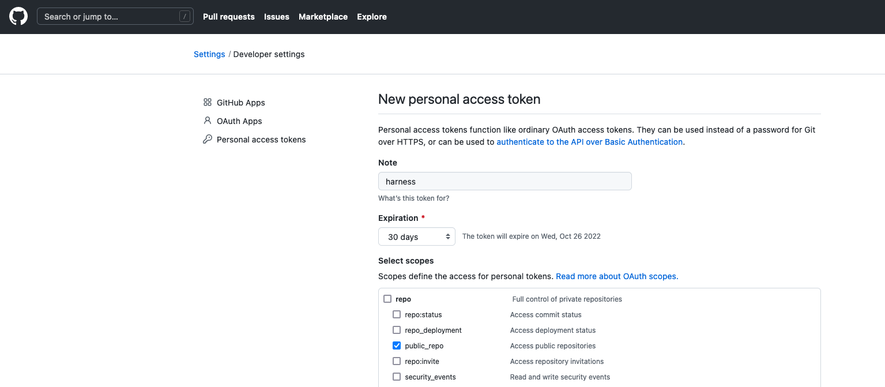

# Scan a NodeJS App for security vulnerabilities

## DevSecOps Background

The DevSecOps movement is all about shifting left; empowering the development teams to make more hygienic decisions. With the pace and velocity that engineering teams are creating changes/features, in days gone by, security could be seen as an afterthought in the SDLC. Today, modern teams and organizations try to disseminate application security expertise throughout the development pipeline and security decisions and posture are being educated upfront during development.

There are a few categories of application centric security tools out there. The first is [SAST](https://www.gartner.com/en/information-technology/glossary/static-application-security-testing-sast) or Static Application Security Testing. SAST tools typically inspect application code and configuration for known good and bad patterns. The second type, [DAST](https://www.gartner.com/en/information-technology/glossary/dynamic-application-security-testing-dast) or Dynamic Application Security Testing, tool will try to perform an exploit on your behalf. DAST tools typically run against running applications, having the ability to take into compensating controls of the infrastructure. Third are [RASPs](https://www.gartner.com/en/information-technology/glossary/runtime-application-self-protection-rasp) or Runtime Application Self Protection Platforms are dependencies deployed with your application which will analyze calls in and out of the application e.g method calls.

## Setting Up Your First Automatable Security Scan

In this example, we will be using [OWASP Dependency Check](https://owasp.org/www-project-dependency-check/) (SAST tool) which will match project dependencies against vulnerability databases such as the [National Vulnerability Database](https://nvd.nist.gov/vuln/search) (NVD). We will be scanning against OWASP’s own [NodeGoat project](https://github.com/OWASP/NodeGoat), which is a purpose-built vulnerable Node application to teach security concepts. You can replace NodeGoat with an application of your choice.

### Install Delegate

Harness will facilitate the running of the security scan against your codebase. A workload runner, e.g. a [Harness Delegate](https://docs.harness.io/article/2k7lnc7lvl-delegates-overview) will need to be installed into a Kubernetes cluster of your choice. The first step is to request a [Harness Security Test Orchestration Account](https://harness.io/demo/sto) and install a [Harness Delegate](../platform/install-delegate).

### Security Tests Pipeline

With the Delegate installation out of the way, next is to create a Pipeline that will just run your security scan. Harness runs off the concept of Projects which are logical groupings of resources. The Default Project which is created for you upon account signup can be used for this example.

## Creating Your First STO Pipeline

To get started with your security scan that can be run in a pipeline, head to the Security Tests module and then Pipelines.

Click + Create Pipeline then give a name to the new Pipeline.

- Name: my_security_scan
- Setup: Inline

Click start and you will be brought to a canvas to start adding in steps into your Pipeline. Click + Add Stage and select Security Tests.

In the Stage configuration, name the Security Stage and configure connectivity to OWASP’s of your repository which houses the application code base. Harness can clone and execute a scan on your code base.

- Stage Name: owasp_scan
- Clode Codebase: selected (true)

In the Connector section, set up a new GitHub Connector which will allow connectivity to GitHub.

### GitHub Connector Configuration

In the connector dropdown, click + New Connector and select the type as GitHub.

Name: owasp_gh

The repository hosting NodeGoat is located at [https://github.com/OWASP/NodeGoat](https://github.com/OWASP/NodeGoat). In the details section, can wire this address in.

- URL Type: Repository
- Connection Type: HTTP
- GitHub URL: https://github.com/OWASP/NodeGoat

Click Continue to add the credentials.

#### GitHub Personal Access Tokens

GitHub as of 2021 requires token authentication e.g. no more passwords for git operations. You’ll need to create a GitHub Personal Access Token to ensure that the pipeline can access the public repository.

If you have not created a Personal Access Token before.
GitHub -> Settings -> Developer Settings -> Personal Access Tokens

- Name: harness
- Scopes: repo -> public_repo [or if you are using a private repo or want to enable Harness API Access, [scope appropriately](https://docs.harness.io/article/sip9rr6ogy-add-github-repo)]
- Expiration: 30 days

Make sure to copy down the token that is generated.

In the Credentials Section, enter your User Name and your Personal Access Token which will be stored as a Harness Secret.

Select Continue and select where you want the Git Commands to be run. Can select the Harness Delegate that you have installed to run the Git Operations. Once selected, Harness will run a quick validation.

Back in the About your Stage section, the Git Connector should be there and can provide the Repository Name, “NodeGoat”.

Now click Set Up Stage and we will go through filling in the necessary pieces.

The first step is to wire in a Docker-in-Docker [DIND] image to run the scan.

## Configuring Your Security Pipeline

In the + Add Service Dependency Section, configure a Service Dependency.

- Dependency Name: dind
- Container Registry: Harness Docker Connector [this will be there by default, linking up to public Docker Hub]
- Image: docker:dind
- Privileged: True

Click Apply Changes, and now can configure the Infrastructure and Execution steps.

Click on Overview, then add a shared path of '/var/run` to execute the tests in.

Click Continue to wire in your Kubernetes cluster to run and execute the scan.

### Adding a Kubernetes Cluster

With Harness, you can leverage the Harness Delegate that is running in Kubernetes to spin up and down workloads on your behalf.

In the Kubernetes Cluster section, add a New Connector.

- Name: sto-cluster
- Details: Use credentials of specific Harness Delegate

Click Continue and select the Harness Delegate that is running on your Kubernetes cluster. With that selected, connectivity validation will occur. Now specify a Kubernetes Namespace to leverage, in this case “default” is fine.

Moving on to the Execution, add a Security Step from the Step Library.

### Configuring Security Step

Since Harness STO can orchestrate multiple security scanning tools, wiring requires a few details such as what type of scanner will be used and location information for what will be scanned. These are entered as key value pairs. Can enter the following key value pairs:

- policy_type: orchestratedScan
- scan_type: repository
- product_name: owasp
- product_config_name: default
- repository_project: nodegoat [or what project you have selected]
- repository_branch: <+codebase.branch>

With those filled out, click Apply Changes and you are now ready to run the scan.

## Running Your Security Scan Pipeline

Click Save to save your Pipeline Configuration. In “my_security_scan”, click Run.

Security Tests -> Pipelines -> `my_security_scan`

Per the GitHub Project, the default branch is called master. Can specify master as the Git Branch.

Click Run Pipeline, and your security scan will be executed against the codebase. This execution and scan can take 2-3 minutes to complete.

Once executed, you can take a look at the Scan Results. Over time as you make improvements, the scan results will change. Harness STO can help prioritize the criticality of security vulnerabilities for you.

Security Tests -> Security Tests -> latest `my_security_scan`

Congratulations on your first security scan placement inside a Pipeline with Harness STO.
Harness can help prioritize issues and provide information on how to investigate and fix specific issues.
