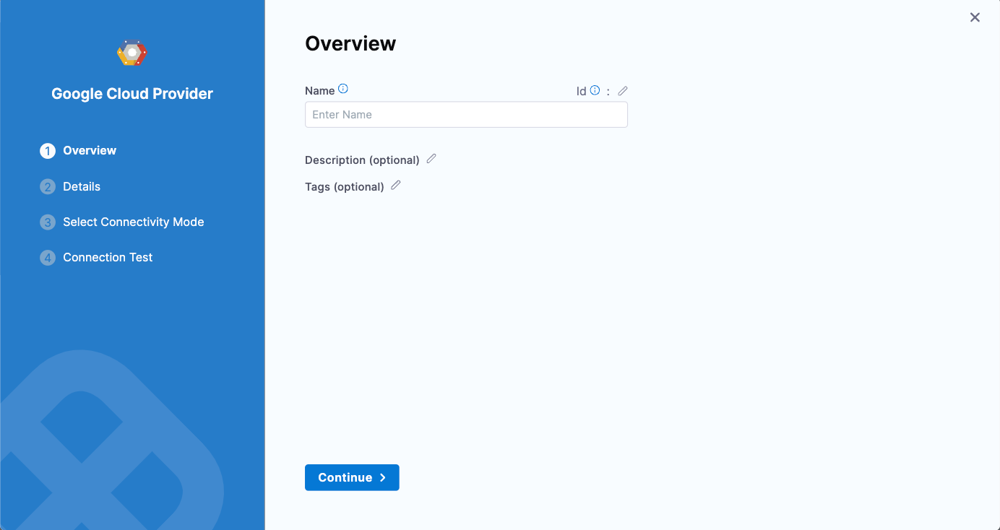
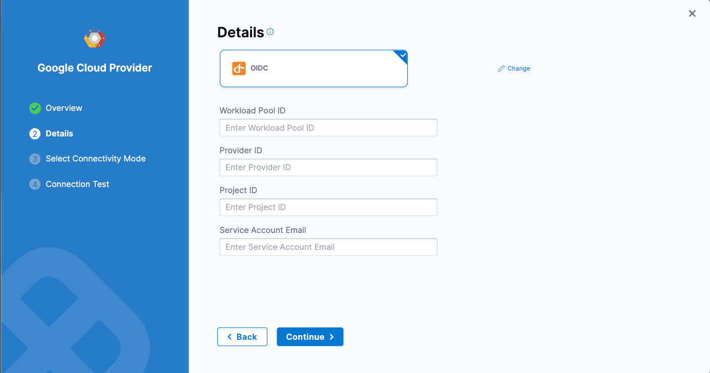

This tutorial shows how to Configure OpenID Connect (OIDC) with GCP Workload Identity Federation (WIF) for the Continuous Integration hosted builds workflow (beta feature).

:::info note
This feature is currently behind the feature flag `PL_GCP_OIDC_AUTHENTICATION`. Contact [Harness Support](mailto:support@harness.io) to enable the feature.
:::

## Prerequisites

This tutorial assumes you have experience with GCP workload identity providers. For more information, go to [Identities for workloads](https://cloud.google.com/iam/docs/workload-identities) in the GCP documentation.

In addition to a Harness account, you to create a GCP workload identity provider.

## Set up a GCP workload identity provider and Harness connector

To create a GCP workload identity provider, do the following:

1. Set up an identity provider in the workload identity federation with the following configuration. For more information, go to [Manage workload identity pool providers](https://cloud.google.com/iam/docs/manage-workload-identity-pools-providers#manage-providers) in the GCP documentation.
   
   a. Name: <User_defined>

   b. Issuer: https://app.harness.io/ng/api/oidc/account/<YOUR_HARNESS_ACCOUNT_ID>

   c. Attribute mapping: 
      - Google.subject = assertion.sub
      - attribute.account_id = assertion.account_id

2. Grant access using the connected service accounts for GCR/GAR.

   a. Select the service account that has permission to push/pull GCR/GAR.

   b. Select principles (identities that can access the service account) 
   - Only identities matching the filter
   - Select account_id = <YOUR_HARNESS_ACCOUNT_ID>

3. Configure your GCP connector in Harness.

To configure your GCP connector in Harness, do the following:

## Create a GCP connector

1. Open a Harness project, and then select **Project Settings**.
2. Under **Project-level resources**, select **Connectors**.
2. Select **New Connector**, and then, under **Cloud Providers**, select **GCP**.

   
   
3. Input a **Name** for the connector. **Description** and **Tags** are optional.
   Harness automatically creates an **Id** ([entity identifier](/docs/platform/references/entity-identifier-reference.md)) for the connector based on the **Name**.
4. Select **Continue** to configure credentials, and then select **OIDC**.

   

5. Enter the following.
   - **Workload Pool ID:** This identifies the workload pool created in GCP, and it is the `Pool ID` value. To get the **Workload Pool ID**, go to [Manage workload identity pools](https://cloud.google.com/iam/docs/manage-workload-identity-pools-providers#pools) in the GCP documentation. 
   - **Provider ID:** This identifies the OIDC provider configured in GCP, and it is the `Provider ID` value. To get the **Provider ID**, go to [Manage workload identity pool providers](https://cloud.google.com/iam/docs/manage-workload-identity-pools-providers#manage-providers) in the GCP documentation.
   - **Project ID:** The project number of the GCP project that is used to create the workload identity federation. To get the **Project ID**, go to [Creating and managing projects](https://cloud.google.com/resource-manager/docs/creating-managing-projects) in the GCP documentation. 
   - **Service Account Email:** This is the service account that was linked to the workload identity pool in the last step.
6. Select **Continue** to proceed to **Select Connectivity Mode**.
7. Select **Connect through Harness Platform for OIDC workflow**.
8. Select **Save and Continue** to run the connection test. If the test succeeds, select **Finish**. The connection test confirms that your authentication and delegate selections are valid.

   After you configure the OIDC connection and role, the Harness hosted build for CI can retrieve the temporary credentials from the GCP STS. While running the Build step, you can use the GCP connector to enable this workflow.

### Troubleshooting GCP connector errors

For troubleshooting details, go to [Troubleshooting GCP connector errors](/docs/platform/connectors/cloud-providers/connect-to-google-cloud-platform-gcp#troubleshooting-gcp-connector-errors).

## Create a pipeline to publish the artifact to GAR using OIDC

Build and Push to GAR using the GCP connector for the OIDC step. 

Run the pipeline and it will use the Google STS to exchange the tokens and access the GAR as shown in the step logs.
