[Harness Delegate](/docs/platform/Delegates/delegate-concepts/delegate-overview) is a lightweight worker process that is installed on your infrastructure and communicates only via outbound HTTP/HTTPS to the Harness Platform. This enables the Harness Platform to leverage the delegate for executing the CI/CD and other tasks on your behalf, without any of your secrets leaving your network. 

Connecting to external systems usually requires a third-party client tool or library to be present locally. Some of the Harness CD and Platform tasks require such client tools to be present in the same container instance where the delegate runs. You can either create a custom delegate image (using the harness-provided delegate image as base image) or install these client tools along with the delegate. The former approach works best when you know all the client tools ahead of time while the latter approach works best when you are still building your CD pipelines and do not have the final list of client tools yet. This tutorials shows you to execute the latter approach using a delegate feature known as `INIT_SCRIPT`.

## Prerequisites

- A free [Harness cloud](https://app.harness.io/auth/#/signup/utm_source=website&utm_medium=harness-developer-hub&utm_campaign=cd-plg&utm_content=get-started) account 
- A deployment target such as Kubernetes cluster. You can use Minikube or Kind to create a cluster. In this tutorial, we'll use a cluster that was created on Google Cloud.
- Install a Kubernetes delegate onto the above Kubernetes cluster using the [Install Delegate](./install-delegate) tutorial. Use the `Kubernetes Manifest` option since we will modify the same manifest YAML to add customizations in this tutorial. Since the delegate is declaratively defined in YAML, it is easy to add new custom scripts and customize the delegate in other ways too. 

You can have the Git client, Helm, Terraform, PowerShell, Docker, AWS CLI, and other tools installed with your delegate, so there's a lot you can do. 

## Install Git Client

Open the delegate YAML file and look for the location of the `INIT_SCRIPT'.


You'll need to add your custom scripts to this location and install any utilities on top of the delegate.

Let’s begin by installing `git` on the delegate. We'll need to add the following script as the value of the `INIT_SCRIPT` field: 

`apt-get update 
yes | apt-get install git`

Let’s add it.

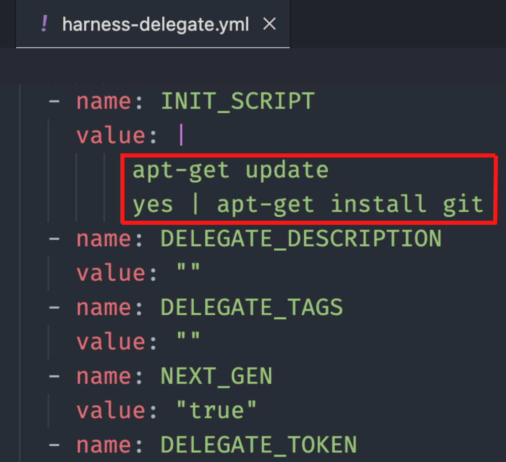

Save the above configured Delegate YAML and run the kubectl command to apply it

`kubectl apply -f harness-delegate.yml`

You should see the delegate up and running in a minute or two.


Let’s create a pipeline and add a custom stage

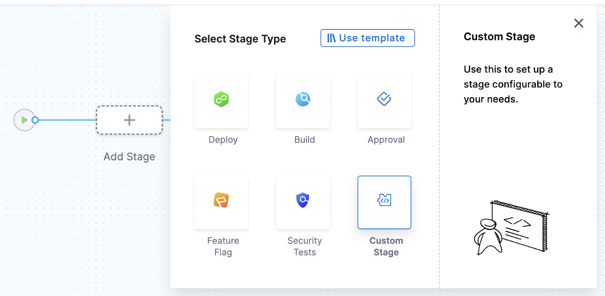

Add a step and select **Shell Script** from the options.


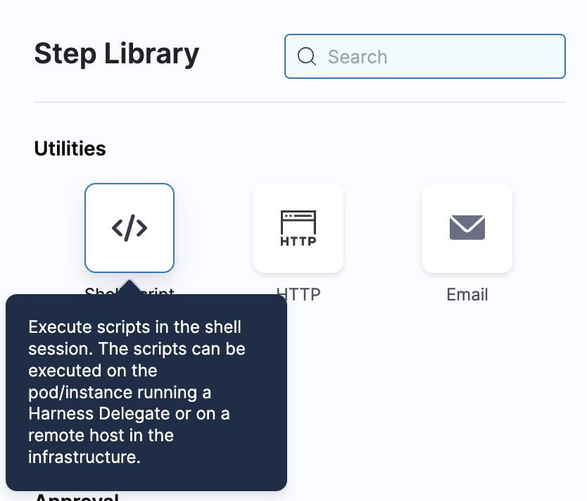

Let’s add the command to check the Git version installed on the delegate.

Add the command `git --version` in the Script tab. 


Make sure the Execution Target is set to **On Delegate**. 

In the **Advanced** tab, select the delegate that's running and where Git is installed.


Now, apply your changes, save everything, and run the pipeline.

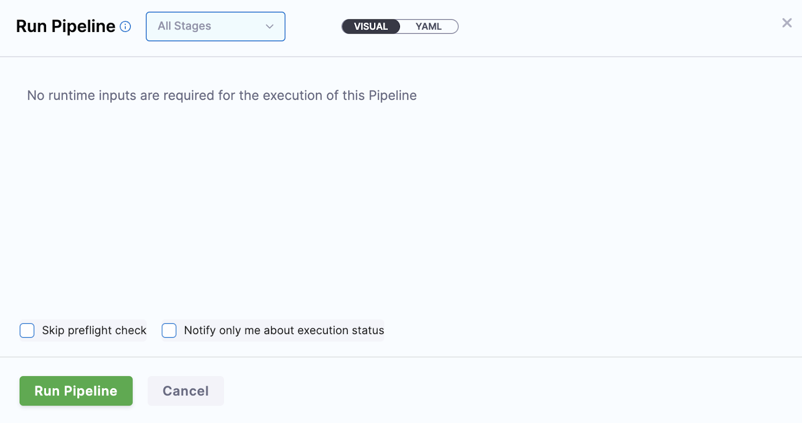

You should see the Git command execution. 

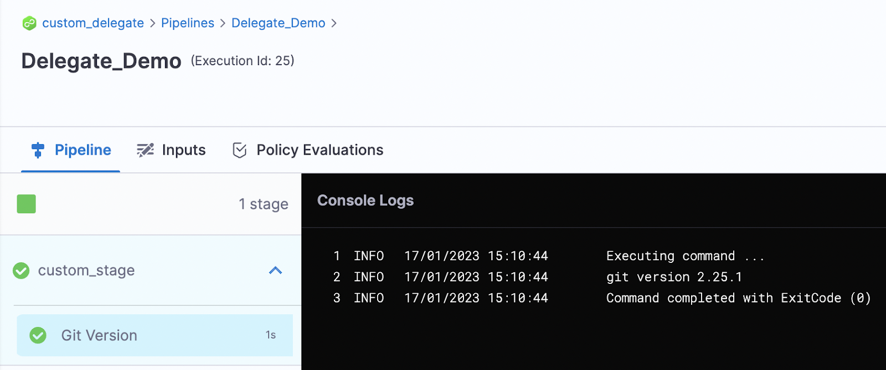

Now, you can use any Git command in your project. 

## Install AWS CLI

You can add AWS CLI tooling to your delegate the same way we added Git.

Here is the AWS CLI script to add into our `INIT_SCRIPT` section:

```
curl "https://awscli.amazonaws.com/awscli-exe-linux-x86_64.zip" -o "awscliv2.zip"
unzip awscliv2.zip
./aws/install
```

See the screenshot below for more clarity.


Let’s add the shell script as a step the same way we added Git.

In the script, add the command `aws –version`
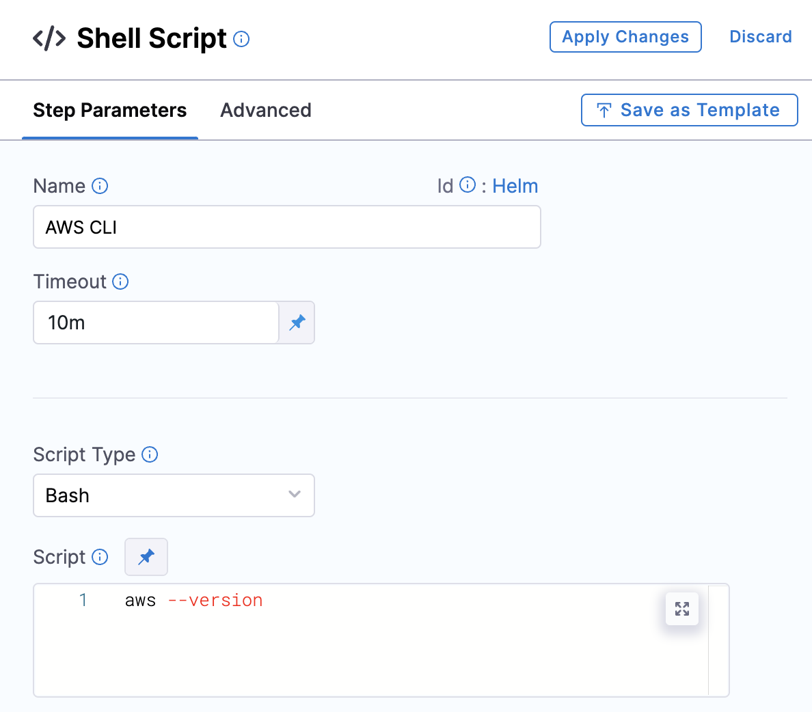

Also, specify the delegate in the advanced settings.
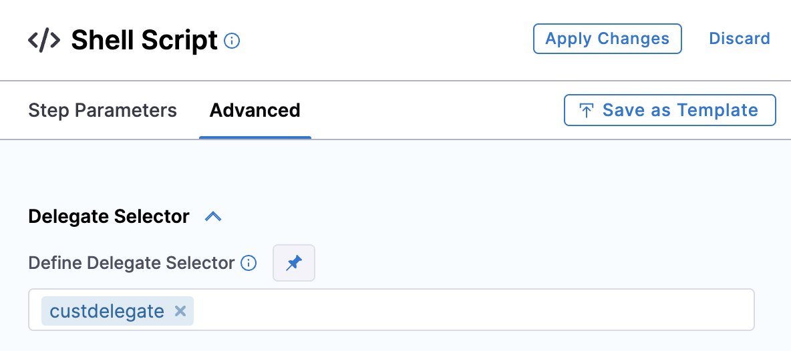

Save everything and run the pipeline. 


You can see the AWS CLI version.

## Install kubectl

Add the following script into your script and apply the YAML the same way we did before.

```
curl -L0 https://dl.k8s.io/release/v1.24.3/bin/linux/amd64/kubectl -o kubectl  
chmod +x ./kubectl  
mv kubectl /opt/harness-delegate/custom-client-tools/kubectl
```

See the screenshot below for more clarity.

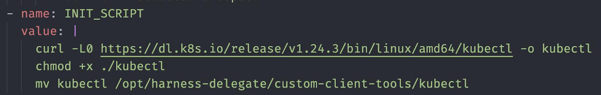

Save the YAML and apply the `kubectl` command for the delegate.

Add the shell script step as shown below. Use the `kubectl version` command.

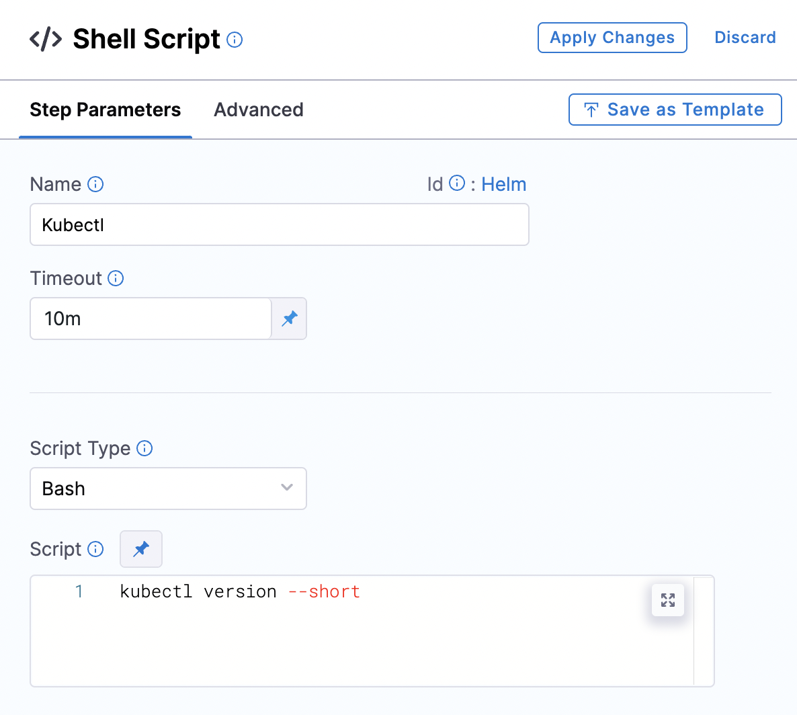

Make sure you specify the delegate on the **Advanced** tab of the step.

Save everything and run the pipeline.


The `kubectl` version information is displayed. 

## Install Terraform

Add this script to the `INIT_SCRIPT` section:

```
curl -O -L  https://releases.hashicorp.com/terraform/0.12.25/terraform_0.12.25_linux_amd64.zip  
unzip terraform_0.12.25_linux_amd64.zip  
mv ./terraform /usr/bin/  
```

Save the YAML and apply the `kubectl` command.

Add the shell script step as follows. Use the `terraform --version` command.

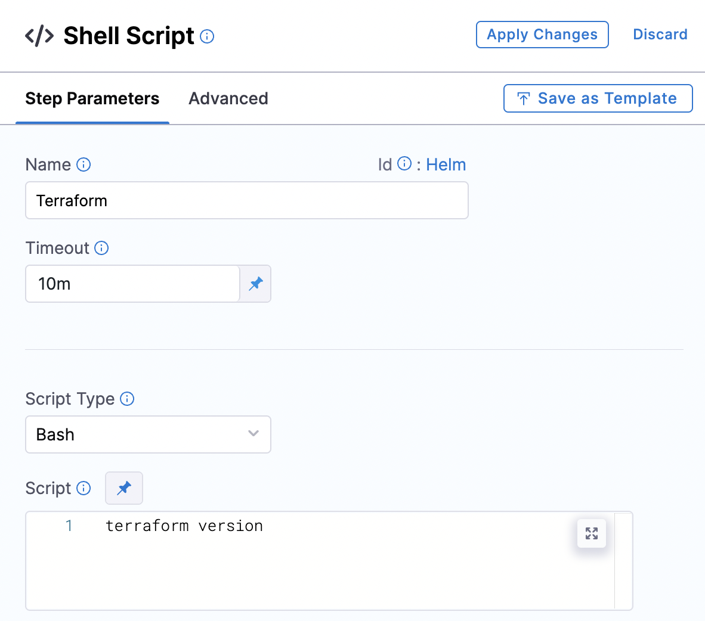

Then specify the delegate that's running on the **Advanced** tab.

Apply your changes, save everything, and run the pipeline. You should see the Terraform version displayed in the output.

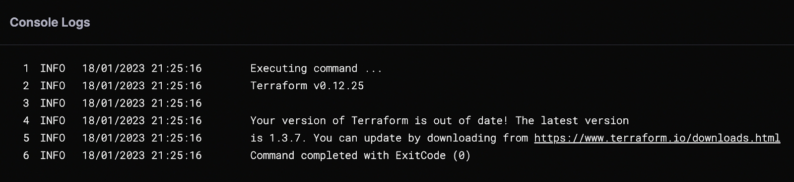

## Install Helm

The following `IN_IT` script installs Helm 3:

```
curl -fsSL -o get_helm.sh https://raw.githubusercontent.com/helm/helm/main/scripts/get-helm-3  
chmod 700 get_helm.sh  
./get_helm.sh
```

Save the YAML and apply the `kubectl` command to the delegate.

To check whether Helm is installed, use the ‘helm version’ command.

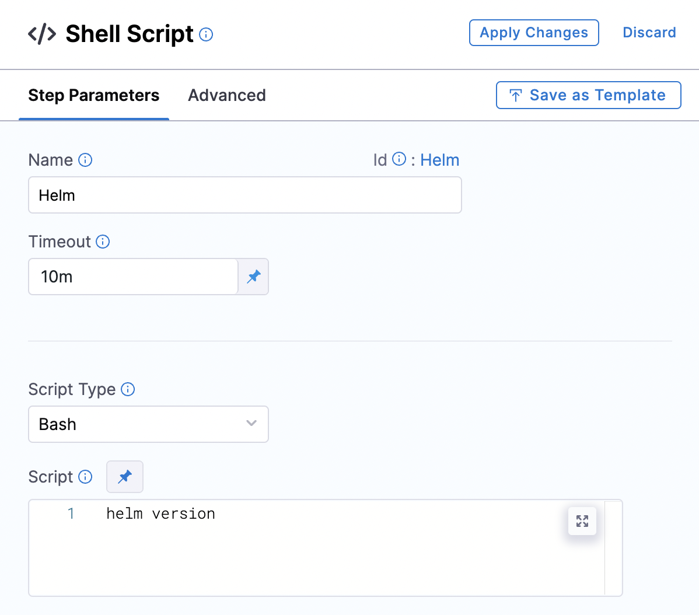

Apply your changes and run the pipeline. If all goes well, you'll see the Helm version information.


Let’s verify that we can deploy our charts.

In the Shell Script, replace the existing command with the following:

```
helm create my-new-chart
helm install my-new-chart ./my-new-chart
helm ls
```
Apply changes, save the configuration, and run the pipeline. Your chart should be deployed.

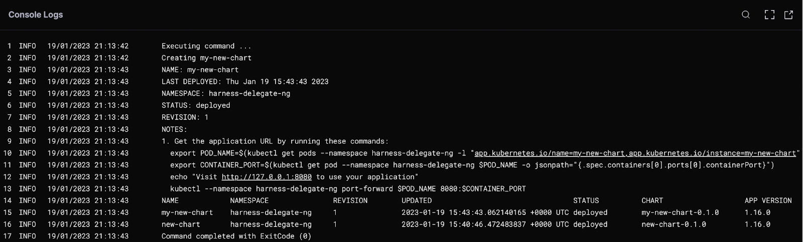

## Install all at once

Let’s combine all the tools and add them all to the `IN_IT` script. 

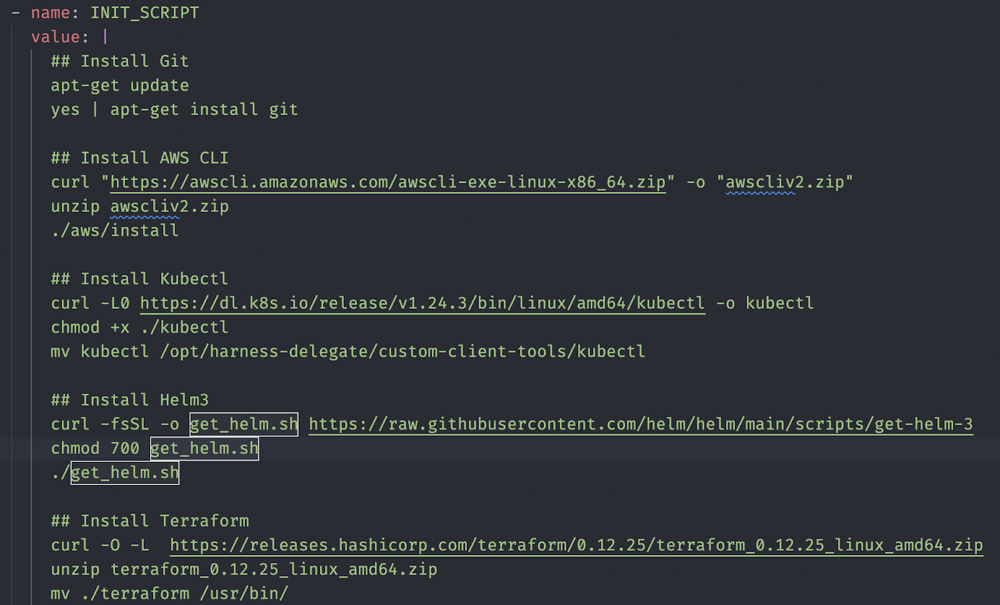

Save the changes and use `kubectl` to apply the YAML to the delegate.

You can create everything from one step or create separate steps for each tool. In this tutorial, we created separate steps for each tool.


Save the configuration and run the pipeline. On success, you should see output that includes the different tool version numbers. 


You can use these steps to install and play with any of your favorite tools on Harness Delegate. This customization gives you a lot of flexibility.  
