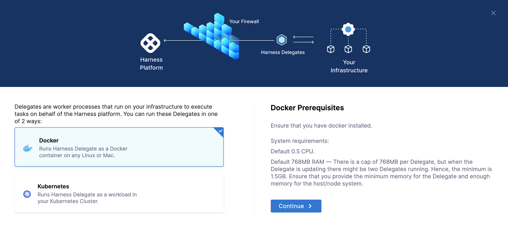
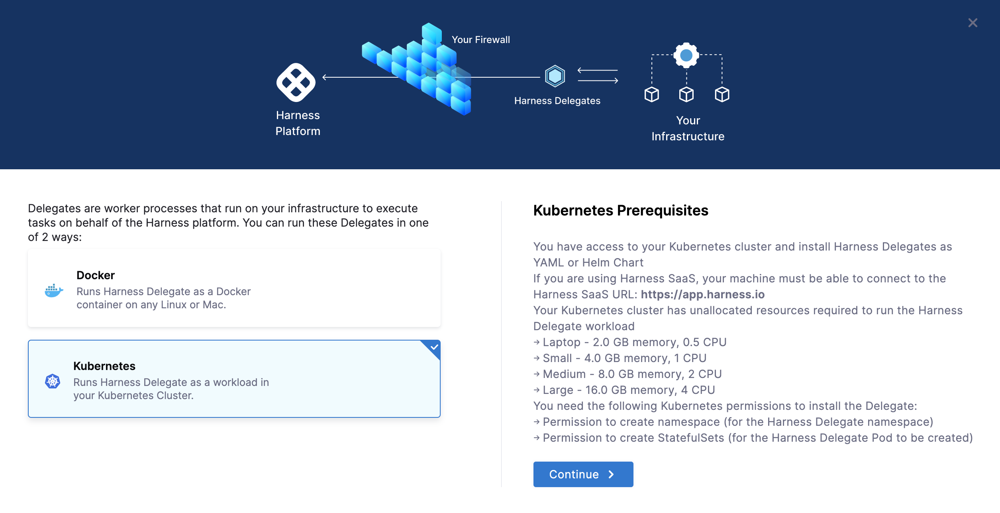
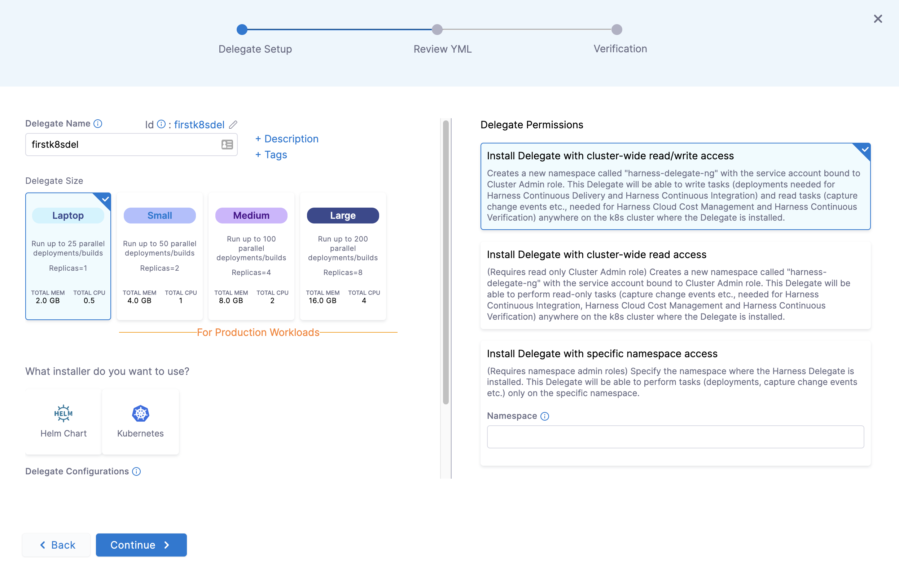
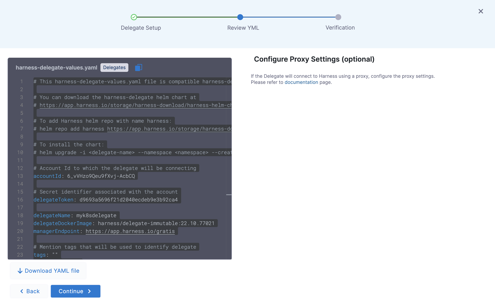

# Install Delegate

```mdx-code-block
import Tabs from '@theme/Tabs';
import TabItem from '@theme/TabItem';
```

## What is a Delegate?

[Harness Delegate](https://docs.harness.io/article/2k7lnc7lvl-delegates-overview) is a lightweight worker process that is installed on your infrastructure and communicates only via outbound HTTP/HTTPS to the Harness Platform. This enables the Harness Platform to leverage the delegate for executing the CI/CD and other tasks on your behalf, without any of your secrets leaving your network.

You can install the Harness Delegate on either Docker or Kubernetes. 

## Install Delegate

Login to the Harness Platform and go to Account Settings -> Account Resources -> Delegates


Click on Delegates then click +New Delegate. You now have two options `Docker` and `Kubernetes`.

```mdx-code-block
<Tabs>
<TabItem value="Docker">
```
### Docker Prerequisite

Ensure that you have the Docker runtime installed on your host. If not, use one of the following options to install Docker:

- [Docker for Mac](https://docs.docker.com/desktop/install/mac-install/)

- [Docker for CentOS](https://docs.docker.com/engine/install/centos/)

- [Docker for Ubuntu](https://docs.docker.com/engine/install/ubuntu/)

- [Docker for Debian](https://docs.docker.com/engine/install/debian/)

- [Docker for Windows](https://docs.docker.com/desktop/install/windows-install/)

### Download Docker Compose YAML

After ensuring that your Docker runtime is installed, select `Docker` on the Delegate Install Wizard above. 



1. Click Continue and fill out a name `firstdockerdel` for your delegate.

2. Click Continue and download the `docker-compose.yml` file that is pre-populated with default delegate token specific to your account. 

### Install on Docker

Now you can install the delegate using the following command.

```bash
docker-compose -f docker-compose.yml up -d
```
### Verify Docker Delegate Connectivity

Click Continue and in a few moments after the health checks pass, your Docker Delegate will be available for you to leverage. Click Done and can verify your new Delegate is on the list.


```mdx-code-block
</TabItem>
<TabItem value="Kubernetes">
```
### Kubernetes Prerequisite

Ensure that you access to a Kubernetes cluster. For the purposes of this tutorial, we will use `minikube`.

Install  `minikube`
- On Windows: 
```
choco install minikube
```
- On macOS: 
```
brew install minikube
```

Now start `minikube` with the following config.
```
minikube config set memory 8128
minikube start
```

Validate that you have kubectl access to your cluster.

`kubectl get pods -A`

Now that you have access to a Kubernetes cluster, select `Kubernetes` in the Delegate Install Wizard above.



Click Continue and fill the following details.

- Delegate Name: `firstk8sdel`
- Delegate Size: `Laptop` is fine for this tutorial. 
- Delegate Token: _default_token_ is the auto-created token specific for your account (that you can rotate any time you wish)
- Delegate Permissions: Cluster wide read/write. This will allow the Delegate to deploy and spin up workloads, resources, objects, etc that are needed on the Kubernetes cluster that the Delegate is deployed to.



You are presented with two options `Helm` and `Kubernetes` for installation. The first one uses a helm chart while the second one uses the Kubernetes manifest directly. 

```mdx-code-block
<Tabs>
<TabItem value="Helm Chart">
```
### Download Helm Chart Values YAML

Click Continue and now you can download and apply the Helm values YAML that has been generated.



### Install Helm Chart

With the downloaded `harness-delegate-values.yaml`, you can now install the delegate using the Delegate Helm Chart. Let us first add the `harness` helm chart repo to your local helm registry.

```
helm repo add harness https://app.harness.io/storage/harness-download/harness-helm-charts/

helm search repo harness
```

You can see that there are two helm charts available. We will use the `harness/harness-delegate-ng` chart in this tutorial.
```
NAME                       	CHART VERSION	APP VERSION	DESCRIPTION                
harness/harness-delegate   	1.0.8        	           	Delegate for Harness FirstGen Platform 
harness/harness-delegate-ng	1.0.0        	1.16.0     	Delegate for Harness NextGen Platform
```

Now we are ready to install the delegate. The following command installs/upgrades `firstk8sdel` delegate (which is a kubernetes workload) in the `harness-delegate-ng` namespace by using the `harness/harness-delegate-ng` helm chart. The configuration provided in `harness-delegate-values.yaml` is used for this install/upgrade.
```
helm upgrade -i firstk8sdel \
--namespace harness-delegate-ng --create-namespace \
harness/harness-delegate-ng \
-f harness-delegate-values.yaml
```

### Verify Helm Delegate Connectivity

Click Continue and in a few moments after the health checks pass, your Harness Delegate will be available for you to leverage. Click Done and can verify your new Delegate is on the list.


```mdx-code-block
</TabItem>
<TabItem value="Kubernetes Manifest">
```

### Download Kubernetes Manifest

Click Continue and now you can download and apply the Kubernetes YAML that has been generated.


### Apply Kubernetes Manifest

With the downloaded _harness-delegate.yml_ can apply this to your wired Kubernetes cluster.

```
kubectl apply -f harness-delegate.yml
```

### Verify Kubernetes Manifest Delegate Connectivity

Click Continue and in a few moments after the health checks pass, your Harness Delegate will be available for you to leverage. Click Done and can verify your new Delegate is on the list.


```mdx-code-block
</TabItem>
</Tabs>
```

```mdx-code-block
</TabItem>
</Tabs>
```
You can now route communication to external systems in Harness connectors and pipelines by simply selecting this delegate via a delegate selector. 
