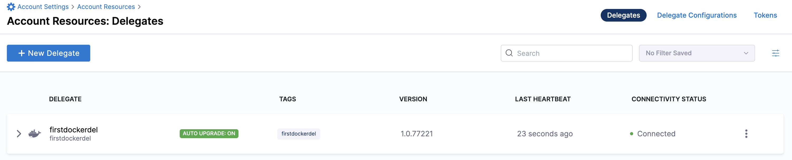

# Install Delegate

```mdx-code-block
import Tabs from '@theme/Tabs';
import TabItem from '@theme/TabItem';
```

## What is a Delegate?

[Harness Delegate](https://docs.harness.io/article/2k7lnc7lvl-delegates-overview) is a lightweight worker process that is installed on your infrastructure and communicates only via outbound HTTP/HTTPS to the Harness Platform. This enables the Harness Platform to leverage the delegate for executing the CI/CD and other tasks on your behalf, without any of your secrets leaving your network.

You can install the Harness Delegate on either Docker or Kubernetes. 

## Install Delegate

<h3> Create New Delegate Token </h3>
Login to the Harness Platform and go to Account Settings -> Account Resources -> Delegates


Click on Delegates then click the Tokens tab. Click +New Token and give your token a name `firstdeltoken`. When you click Apply, a new token is generated for you. Click on the copy button to copy and store the token in a temporary file for now. You will provide this token as an input parameter in the next delegation installation step. The delegate will use this token to authenticate with the Harness Platform.

<h3> Get Your Harness Account ID </h3>
Along with the delegate token, you will also need to provde your Harness accountId as an input parameter to the delegate installation. This accountId is present in every Harness URL. For example, in the following URL

```
https://app.harness.io/ng/#/account/6_vVHzo9Qeu9fXvj-AcQCb/settings/overview
```

`6_vVHzo9Qeu9fXvj-AcQCb` is the accountId. 

Now you are ready to install the delegate on either Docker or Kubernetes. 

```mdx-code-block
<Tabs>
<TabItem value="Docker">
```
<h3> Prerequisite </h3>

Ensure that you have the Docker runtime installed on your host. If not, use one of the following options to install Docker:

- [Docker for Mac](https://docs.docker.com/desktop/install/mac-install/)
- [Docker for CentOS](https://docs.docker.com/engine/install/centos/)
- [Docker for Ubuntu](https://docs.docker.com/engine/install/ubuntu/)
- [Docker for Debian](https://docs.docker.com/engine/install/debian/)
- [Docker for Windows](https://docs.docker.com/desktop/install/windows-install/) 

<h3> Install on Docker </h3>

Now you can install the delegate using the following command.

```bash
docker run -d --name="firstdockerdel" --cpus="0.5" --memory="2g" \
-e DELEGATE_NAME=firstdockerdel \
-e NEXT_GEN=true \
-e DELEGATE_TYPE=DOCKER \
-e ACCOUNT_ID=PUT_YOUR_HARNESS_ACCOUNTID_HERE \
-e DELEGATE_TOKEN=PUT_YOUR_DELEGATE_TOKEN_HERE \
-e MANAGER_HOST_AND_PORT=PUT_YOUR_MANAGER_HOST_AND_PORT_HERE \
harness/delegate:22.11.77436
```
`PUT_YOUR_MANAGER_HOST_AND_PORT_HERE` should be replaced by the Harness Manager Endpoint noted below. For Harness SaaS accounts, you can find your Harness Cluster Location in the Account Overview page under Account Settings section of the left navigation. For Harness CDCE, the endpoint varies based on the Docker vs. Helm installation options.

| Harness Cluster Location| Harness Manager Endpoint on Harness Cluster	|
| ------------------------| -------------------------------------------	|
| SaaS prod-1  	 		| `https://app.harness.io`       				|
| SaaS prod-2  	 		| `https://app.harness.io/gratis`        		|
| SaaS prod-3  	 		| `https://app3.harness.io`        				|
| [CDCE Docker](/tutorials/deploy-services/cdce-helm-k8s)  	 		| `http://<HARNESS_HOST>` if Docker Delegate is remote to CDCE  or  `http://host.docker.internal` if Docker Delegate is on same host as CDCE |
| [CDCE Helm](/tutorials/deploy-services/cdce-helm-k8s)      		| `http://<HARNESS_HOST>:7143`  where HARNESS_HOST is the public IP of the Kubernetes node where CDCE Helm is running|


<h3> Verify Docker Delegate Connectivity </h3>

Click Continue and in a few moments after the health checks pass, your Docker Delegate will be available for you to leverage. Click Done and can verify your new Delegate is on the list.



```mdx-code-block
</TabItem>
<TabItem value="Kubernetes">
```
<h3> Prerequisite </h3>

Ensure that you access to a Kubernetes cluster. For the purposes of this tutorial, we will use `minikube`.

<h4>Install minikube </h4>

- On Windows: 
```
choco install minikube
```
- On macOS: 
```
brew install minikube
```
Now start minikube with the following config.
```
minikube start --memory 4g --cpus 4
```
Validate that you have kubectl access to your cluster.

```
kubectl get pods -A
```

Now that you have access to a Kubernetes cluster, you can install the delegate using either the `Helm Chart` option or the `Kubernetes Manifest` option.
. 

```mdx-code-block
<Tabs>
<TabItem value="Helm Chart">
```
<h3> Download Helm Chart Values YAML </h3>

```
curl -LO https://raw.githubusercontent.com/harness-apps/developer-hub-apps/main/delegate/harness-delegate-values.yaml
```

<h3> Install Helm Chart </h3>

As a prerequisite, you should have [Helm v3](https://helm.sh/docs/intro/install/) installed on the machine from which you connect to your Kubernetes cluster. 

You can now install the delegate using the Delegate Helm Chart. Let us first add the `harness` helm chart repo to your local helm registry.

```
helm repo add harness https://app.harness.io/storage/harness-download/harness-helm-charts/
helm search repo harness
```

You can see that there are two helm charts available. We will use the `harness/harness-delegate-ng` chart in this tutorial.
```
NAME                       	CHART VERSION	APP VERSION	DESCRIPTION                
harness/harness-delegate   	1.0.8        	           	Delegate for Harness FirstGen Platform 
harness/harness-delegate-ng	1.0.0        	1.16.0     	Delegate for Harness NextGen Platform
```

Now we are ready to install the delegate. The following command installs/upgrades `firstk8sdel` delegate (which is a Kubernetes workload) in the `harness-delegate-ng` namespace by using the `harness/harness-delegate-ng` helm chart. The configuration provided in the `harness-delegate-values.yaml` is used for this install/upgrade. Note that we downloaded this values yaml file in the previous step.

```
helm upgrade -i firstk8sdel \
--namespace harness-delegate-ng --create-namespace \
harness/harness-delegate-ng \
-f harness-delegate-values.yaml \
--set delegateName=firstk8sdel \
--set accountId=PUT_YOUR_HARNESS_ACCOUNTID_HERE \
--set delegateToken=PUT_YOUR_DELEGATE_TOKEN_HERE \
--set managerEndpoint=PUT_YOUR_MANAGER_HOST_AND_PORT_HERE
```
`PUT_YOUR_MANAGER_HOST_AND_PORT_HERE` should be replaced by the Harness Manager Endpoint noted below. For Harness SaaS accounts, you can find your Harness Cluster Location in the Account Overview page under Account Settings section of the left navigation. For Harness CDCE, the endpoint varies based on the Docker vs. Helm installation options.

| Harness Cluster Location| Harness Manager Endpoint on Harness Cluster	|
| ------------------------| -------------------------------------------	|
| SaaS prod-1  	 		| `https://app.harness.io`       				|
| SaaS prod-2  	 		| `https://app.harness.io/gratis`        		|
| SaaS prod-3  	 		| `https://app3.harness.io`        				|
| [CDCE Docker](/tutorials/deploy-services/cdce-helm-k8s)  	 		| `http://<HARNESS_HOST>` if Docker Delegate is remote to CDCE  or  `http://host.docker.internal` if Docker Delegate is on same host as CDCE |
| [CDCE Helm](/tutorials/deploy-services/cdce-helm-k8s)      		| `http://<HARNESS_HOST>:7143`  where HARNESS_HOST is the public IP of the Kubernetes node where CDCE Helm is running|
	
<h3> Verify Helm Delegate Connectivity </h3>

Click Continue and in a few moments after the health checks pass, your Harness Delegate will be available for you to leverage. Click Done and can verify your new Delegate is on the list.


```mdx-code-block
</TabItem>
<TabItem value="Kubernetes Manifest">
```

<h3> Download Kubernetes Manifest Template </h3>

```
curl -LO https://raw.githubusercontent.com/harness-apps/developer-hub-apps/main/delegate/harness-delegate.yml
```

Open the `harness-delegate.yml` file in a text editor and replace `PUT_YOUR_DELEGATE_NAME_HERE`, `PUT_YOUR_HARNESS_ACCOUNTID_HERE` and `PUT_YOUR_DELEGATE_TOKEN_HERE` with your delegate name (say `firstk8sdel`), Harness accountId, delegate token value respectively.

`PUT_YOUR_MANAGER_HOST_AND_PORT_HERE` should be replaced by the Harness Manager Endpoint noted below. For Harness SaaS accounts, you can find your Harness Cluster Location in the Account Overview page under Account Settings section of the left navigation. For Harness CDCE, the endpoint varies based on the Docker vs. Helm installation options.

| Harness Cluster Location| Harness Manager Endpoint on Harness Cluster	|
| ------------------------| -------------------------------------------	|
| SaaS prod-1  	 		| `https://app.harness.io`       				|
| SaaS prod-2  	 		| `https://app.harness.io/gratis`        		|
| SaaS prod-3  	 		| `https://app3.harness.io`        				|
| [CDCE Docker](/tutorials/deploy-services/cdce-helm-k8s)  	 		| `http://<HARNESS_HOST>` if Docker Delegate is remote to CDCE  or  `http://host.docker.internal` if Docker Delegate is on same host as CDCE |
| [CDCE Helm](/tutorials/deploy-services/cdce-helm-k8s)      		| `http://<HARNESS_HOST>:7143`  where HARNESS_HOST is the public IP of the Kubernetes node where CDCE Helm is running|

<h3> Apply Kubernetes Manifest </h3>

```
kubectl apply -f harness-delegate.yml
```

<h3> Verify Kubernetes Manifest Delegate Connectivity </h3>

Click Continue and in a few moments after the health checks pass, your Harness Delegate will be available for you to leverage. Click Done and can verify your new Delegate is on the list.


```mdx-code-block
</TabItem>
</Tabs>
```

```mdx-code-block
</TabItem>
</Tabs>
```
You can now route communication to external systems in Harness connectors and pipelines by simply selecting this delegate via a delegate selector. 
