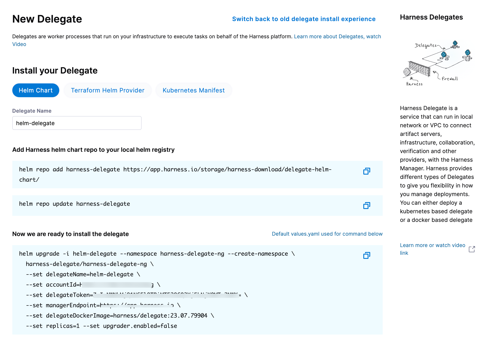

# Install Harness Delegate on Kubernetes or Docker

```mdx-code-block
import Tabs from '@theme/Tabs';
import TabItem from '@theme/TabItem';
```
```mdx-code-block
import delete_project from './static/delete-project.png'
```

## What is Harness Delegate?

[Harness Delegate](/docs/platform/delegates/delegate-concepts/delegate-overview/) is a lightweight worker process that is installed on your infrastructure and communicates only via outbound HTTP/HTTPS to the Harness Platform. This enables the Harness Platform to leverage the delegate to execute the CI/CD and other tasks on your behalf, without any of your secrets leaving your network.

You can install the Harness Delegate on either Docker or Kubernetes. 

## Install Harness Delegate

### Create a new delegate token

Log in to the Harness Platform and go to **Account Settings -> Account Resources -> Delegates**. Select the **Tokens** tab. Select **+New Token**, and enter a token name, for example `firstdeltoken`. Select **Apply**. Harness Platform generates a new token for you. Select **Copy** to copy and store the token in a temporary file. You will provide this token as an input parameter in the next installation step. The delegate will use this token to authenticate with the Harness Platform.

### Get your Harness account ID

Along with the delegate token, you will also need to provide your Harness `accountId` as an input parameter during delegate installation. This `accountId` is present in every Harness URL. For example, in the following URL:

```
https://app.harness.io/ng/#/account/6_vVHzo9Qeu9fXvj-AcQCb/settings/overview
```

`6_vVHzo9Qeu9fXvj-AcQCb` is the `accountId`. 

Now you are ready to install the delegate on either Docker or Kubernetes. 

```mdx-code-block
<Tabs>
<TabItem value="Kubernetes">
```
### Prerequisite

Ensure that you have access to a Kubernetes cluster. For the purposes of this tutorial, we will use `minikube`.

<h4>Install minikube </h4>

- On Windows: 
```
choco install minikube
```
- On macOS: 
```
brew install minikube
```
Now start minikube with the following config.
```
minikube start --memory 4g --cpus 4
```
Validate that you have kubectl access to your cluster.

```
kubectl get pods -A
```

Now that you have access to a Kubernetes cluster, you can install the delegate using any of the options below.

```mdx-code-block
<Tabs>
<TabItem value="Helm Chart">
```

### Install the Helm chart

As a prerequisite, you must have [Helm v3](https://helm.sh/docs/intro/install/) installed on the machine from which you connect to your Kubernetes cluster.


You can now install the delegate using the delegate Helm chart. First, add the `harness-delegate` Helm chart repo to your local Helm registry.

```
helm repo add harness-delegate https://app.harness.io/storage/harness-download/delegate-helm-chart/
helm repo update
helm search repo harness-delegate
```

We will use the `harness-delegate/harness-delegate-ng` chart in this tutorial.
```
NAME                                	CHART VERSION	APP VERSION	DESCRIPTION                                
harness-delegate/harness-delegate-ng	1.0.8        	1.16.0     	A Helm chart for deploying harness-delegate
```

Now we are ready to install the delegate. The following example installs/upgrades `firstk8sdel` delegate (which is a Kubernetes workload) in the `harness-delegate-ng` namespace using the `harness-delegate/harness-delegate-ng` Helm chart. 

To install the delegate, do the following:

1. In Harness, select **Deployments**, then select your project.
2. Select **Delegates** under **Project Setup**.
3. Select **Install a Delegate** to open the **New Delegate** dialog.

   

4. Select **Helm Chart** under **Install your Delegate**.

5. Copy the `helm upgrade` command.

6. Run the command.

The command uses the default [values.yaml](https://github.com/harness/delegate-helm-chart/blob/main/harness-delegate-ng/values.yaml) located in the [delegate-helm-chart](https://github.com/harness/delegate-helm-chart) GitHub repo. If you want change one or more values in a persistent manner instead of the command line, you can download and update the `values.yaml` file as per your need. You can use the updated `values.yaml` file as shown below.

```
helm upgrade -i firstk8sdel --namespace harness-delegate-ng --create-namespace \
  harness-delegate/harness-delegate-ng \
  -f values.yaml \
  --set delegateName=firstk8sdel \
  --set accountId=PUT_YOUR_HARNESS_ACCOUNTID_HERE \
  --set delegateToken=PUT_YOUR_DELEGATE_TOKEN_HERE \
  --set managerEndpoint=PUT_YOUR_MANAGER_HOST_AND_PORT_HERE \
  --set delegateDockerImage=harness/delegate:23.02.78306 \
  --set replicas=1 --set upgrader.enabled=false
```

```mdx-code-block
</TabItem>
<TabItem value="Terraform Helm Provider">
```

### Create main.tf file

Harness uses a Terraform module for the Kubernetes delegate. This module uses the standard Terraform Helm provider to install the Helm chart onto a Kubernetes cluster whose config by default is stored in the same machine at the `~/.kube/config` path. Copy the following into a `main.tf` file stored on a machine from which you want to install your delegate.

```
module "delegate" {
  source = "harness/harness-delegate/kubernetes"
  version = "0.1.5"

  account_id = "PUT_YOUR_HARNESS_ACCOUNTID_HERE"
  delegate_token = "PUT_YOUR_DELEGATE_TOKEN_HERE"
  delegate_name = "firstk8sdel"
  namespace = "harness-delegate-ng"
  manager_endpoint = "PUT_YOUR_MANAGER_HOST_AND_PORT_HERE"
  delegate_image = "harness/delegate:23.02.78306"
  replicas = 1
  upgrader_enabled = false

  # Additional optional values to pass to the helm chart
  values = yamlencode({
    javaOpts: "-Xms64M"
  })
}

provider "helm" {
  kubernetes {
    config_path = "~/.kube/config"
  }
}
```

Now replace the variables in the file with your Harness accound ID and delegate token values. Replace `PUT_YOUR_MANAGER_HOST_AND_PORT_HERE` with the Harness Manager Endpoint noted below. For Harness SaaS accounts, you can find your Harness Cluster Location on the **Account Overview** page under the **Account Settings** section of the left navigation. For Harness CDCE, the endpoint varies based on the Docker vs. Helm installation options.

| Harness Cluster Location| Harness Manager Endpoint on Harness Cluster	|
| ------------------------| -------------------------------------------	|
| SaaS prod-1  	 		| `https://app.harness.io`       				|
| SaaS prod-2  	 		| `https://app.harness.io/gratis`        		|
| SaaS prod-3  	 		| `https://app3.harness.io`        				|
| [CDCE Docker](/tutorials/platform/install-cd-community-edition)  	 		| `http://<HARNESS_HOST>` if Docker Delegate is remote to CDCE  or  `http://host.docker.internal` if Docker Delegate is on same host as CDCE |
| [CDCE Helm](/tutorials/platform/install-cd-community-edition)      		| `http://<HARNESS_HOST>:7143`  where HARNESS_HOST is the public IP of the Kubernetes node where CDCE Helm is running|

### Run Terraform init, plan, and apply

Initialize Terraform. This downloads the Terraform Helm provider to your machine.
```
terraform init
```

Run the following step to view the changes Terraform is going to make on your behalf.
```
terraform plan
```

Finally, run this step to make Terraform install the Kubernetes delegate using the Helm provider.
```
terraform apply
```

When prompted by Terraform if you want to continue with the apply step, type `yes`, and then you will see output similar to the following.

```
helm_release.delegate: Creating...
helm_release.delegate: Still creating... [10s elapsed]
helm_release.delegate: Still creating... [20s elapsed]
helm_release.delegate: Still creating... [30s elapsed]
helm_release.delegate: Still creating... [40s elapsed]
helm_release.delegate: Still creating... [50s elapsed]
helm_release.delegate: Still creating... [1m0s elapsed]
helm_release.delegate: Creation complete after 1m0s [id=firstk8sdel]

Apply complete! Resources: 1 added, 0 changed, 0 destroyed.
```


```mdx-code-block
</TabItem>
<TabItem value="Kubernetes Manifest">
```

### Download a Kubernetes manifest template

```
curl -LO https://raw.githubusercontent.com/harness/delegate-kubernetes-manifest/main/harness-delegate.yaml
```

### Replace variables in the template

Open the `harness-delegate.yaml` file in a text editor and replace `PUT_YOUR_DELEGATE_NAME_HERE`, `PUT_YOUR_HARNESS_ACCOUNTID_HERE`, and `PUT_YOUR_DELEGATE_TOKEN_HERE` with your delegate name (for example, `firstk8sdel`), Harness `accountId`, and delegate token values, respectively.

Replace the `PUT_YOUR_MANAGER_HOST_AND_PORT_HERE` variable with the Harness Manager Endpoint noted below. For Harness SaaS accounts, you can find your Harness Cluster Location on the **Account Overview** page under the **Account Settings** section of the left navigation. For Harness CDCE, the endpoint varies based on the Docker vs. Helm installation options.

| Harness Cluster Location| Harness Manager Endpoint on Harness Cluster	|
| ------------------------| -------------------------------------------	|
| SaaS prod-1  	 		| `https://app.harness.io`       				|
| SaaS prod-2  	 		| `https://app.harness.io/gratis`        		|
| SaaS prod-3  	 		| `https://app3.harness.io`        				|
| [CDCE Docker](/tutorials/platform/install-cd-community-edition)  	 		| `http://<HARNESS_HOST>` if Docker Delegate is remote to CDCE  or  `http://host.docker.internal` if Docker Delegate is on same host as CDCE |
| [CDCE Helm](/tutorials/platform/install-cd-community-edition)      		| `http://<HARNESS_HOST>:7143`  where HARNESS_HOST is the public IP of the Kubernetes node where CDCE Helm is running|

### Apply the Kubernetes manifest

```
kubectl apply -f harness-delegate.yaml
```

```mdx-code-block
</TabItem>
</Tabs>
```

```mdx-code-block
</TabItem>
<TabItem value="Docker">
```
<h3> Prerequisite </h3>

Ensure that you have the Docker runtime installed on your host. If not, use one of the following options to install Docker:

- [Docker for Mac](https://docs.docker.com/desktop/install/mac-install/)
- [Docker for CentOS](https://docs.docker.com/engine/install/centos/)
- [Docker for Ubuntu](https://docs.docker.com/engine/install/ubuntu/)
- [Docker for Debian](https://docs.docker.com/engine/install/debian/)
- [Docker for Windows](https://docs.docker.com/desktop/install/windows-install/)

<h3> Install on Docker </h3>

Now you can install the delegate using the following command.

```bash
docker run --cpus=1 --memory=2g \
  -e DELEGATE_NAME=docker-delegate \
  -e NEXT_GEN="true" \
  -e DELEGATE_TYPE="DOCKER" \
  -e ACCOUNT_ID=PUT_YOUR_HARNESS_ACCOUNTID_HERE \
  -e DELEGATE_TOKEN=PUT_YOUR_DELEGATE_TOKEN_HERE \
  -e LOG_STREAMING_SERVICE_URL=PUT_YOUR_MANAGER_HOST_AND_PORT_HERE/log-service/ \
  -e MANAGER_HOST_AND_PORT=PUT_YOUR_MANAGER_HOST_AND_PORT_HERE \
  harness/delegate:23.03.78904
```
Replace the `PUT_YOUR_MANAGER_HOST_AND_PORT_HERE` variable with the Harness Manager Endpoint noted below. For Harness SaaS accounts, to find your Harness cluster location, select **Account Settings**, and then select **Overview**. In **Account Overview**, look in **Account Settings**. It is listed next to **Harness Cluster Hosting Account**.

For more information, go to [View account info and subscribe to downtime alerts](https://developer.harness.io/docs/platform/1_Get-started/platform-concepts/view-account-info-and-subscribe-to-alerts.md).


For Harness CDCE, the endpoint varies based on the Docker vs. Helm installation options.

| Harness Cluster Location| Harness Manager Endpoint on Harness Cluster	|
| ------------------------| -------------------------------------------	|
| SaaS prod-1  	 		| `https://app.harness.io`       				|
| SaaS prod-2  	 		| `https://app.harness.io/gratis`        		|
| SaaS prod-3  	 		| `https://app3.harness.io`        				|
| [CDCE Docker](/tutorials/platform/install-cd-community-edition)  	 		| `http://<HARNESS_HOST>` if Docker Delegate is remote to CDCE  or  `http://host.docker.internal` if Docker Delegate is on same host as CDCE |
| [CDCE Helm](/tutorials/platform/install-cd-community-edition)      		| `http://<HARNESS_HOST>:7143`  where HARNESS_HOST is the public IP of the Kubernetes node where CDCE Helm is running|

If you are using a local runner CI build infrastructure, modify the delegate install command as explained in [Use local runner build infrastructure](/docs/continuous-integration/use-ci/set-up-build-infrastructure/define-a-docker-build-infrastructure/#install-the-delegate)

```mdx-code-block
</TabItem>
</Tabs>
```

## Verify delegate connectivity

Select **Continue**. After the health checks pass, your delegate is available for you to use. Select **Done** and verify your new delegate is listed.

### Helm chart & Terraform Helm provider


### Kubernetes manifest


### Docker


You can now route communication to external systems in Harness connectors and pipelines by selecting this delegate via a delegate selector.

import Selector from '/docs/platform/2_Delegates/shared/selector-infrastructure.md'

<Selector />

## Troubleshooting

The delegate installer provides troubleshooting information for each installation process. If the delegate cannot be verified, select **Troubleshoot** for steps you can use to resolve the problem. This section includes the same information.

Harness asks for feedback after the troubleshooting steps. You are asked, **Did the delegate come up?** 

If the steps did not resolve the problem, select **No**, and use the form to describe the issue. You'll also find links to Harness Support and to [Delegate docs](/docs/platform/delegates/delegate-concepts/delegate-overview/).

```mdx-code-block
<Tabs>
<TabItem value="Helm Chart">
```

Use the following steps to troubleshoot your installation of the delegate using Helm.

1. Verify that Helm is correctly installed:

   Check for Helm:
   
   ```
   helm
   ```
   
   And then check for the installed version of Helm:

   ```
   helm version
   ```

   If you receive the message `Error: rendered manifests contain a resource that already exists...`, delete the existing namespace, and retry the Helm upgrade command to deploy the delegate.
   
   For further instructions on troubleshooting your Helm installation, go to [Helm troubleshooting guide](https://helm.sh/docs/faq/troubleshooting/).

2. Check the status of the delegate on your cluster:

   ```
   kubectl describe pods -n <namespace>
   ```

3. If the pod did not start, check the delegate logs:

   ```
   kubectl logs -f <harnessDelegateName> -n <namespace>
   ```

   If the state of the delegate pod is `CrashLoopBackOff`, check your allocation of compute resources (CPU and memory) to the cluster. A state of `CrashLoopBackOff` indicates insufficent Kubernetes cluster resources.

4. If the delegate pod is not healthy, use the `kubectl describe` command to get more information:

   ```
   kubectl describe <pod_name> -n <namespace>
   ```


```mdx-code-block
</TabItem>
<TabItem value="Terraform Helm Provider">
```

Use the following steps to troubleshoot your installation of the delegate using Terraform.


1. Verify that Terraform is correctly installed:

   ```
   terraform -version
   ```
   
   For further instructions on troubleshooting your installation of Terraform, go to the [Terraform troubleshooting guide](https://developer.hashicorp.com/terraform/enterprise/vcs/troubleshooting).

2. Check the status of the delegate on your cluster:

   ```
   kubectl describe pods -n <namespace>
   ```

3. If the pod did not start, check the delegate logs:

   ```
   kubectl logs -f <harnessDelegateName> -n <namespace>
   ```

   If the state of the delegate pod is `CrashLoopBackOff`, check your allocation of compute resources (CPU and memory) to the cluster. A state of `CrashLoopBackOff` indicates insufficent Kubernetes cluster resources.

4. If the delegate pod is not healthy, use the `kubectl describe` command to get more information:

   ```
   kubectl describe <pod_name> -n <namespace>
   ```

```mdx-code-block
</TabItem>
<TabItem value="Kubernetes Manifest">
```

Use the following steps to troubleshoot your installation of the delegate using Kubernetes.

1. Check the status of the delegate on your cluster:

   ```
   kubectl describe pods -n <namespace>
   ```

2. If the pod did not start, check the delegate logs:

   ```
   kubectl logs -f <harnessDelegateName> -n <namespace>
   ```

   If the state of the delegate pod is `CrashLoopBackOff`, check your allocation of compute resources (CPU and memory) to the cluster. A state of `CrashLoopBackOff` indicates insufficent Kubernetes cluster resources.

3. If the delegate pod is not healthy, use the `kubectl describe` command to get more information:

   ```
   kubectl describe <pod_name> -n <namespace>
   ```


```mdx-code-block
</TabItem>
<TabItem value="Docker">
```

Use the following steps to troubleshoot your installation of the delegate using Docker:

1. Check the status of the delegate on your cluster:

   ```
   docker container ls -a
   ```
   
2. If the pod is not running, check the delegate logs:

   ```
   docker container logs <delegatename> -f
   ```
   
3. Restart the delegate container. To stop the container:

   ```
   docker container stop <delegatename>
   ```
   
   To start the container:
   
   ```
   docker container start <delegatename>
   ```
   
4. Make sure the container has sufficient CPU and memory resources. If not, remove the older containers:

   ```
   docker container rm [container id]
   ```
```mdx-code-block
</TabItem>
</Tabs>
```