Permission list for the users to work through this tutorial:
1. Permissions to create a cluster (so that namespace, resources, etc, can be created by you)
2. Invite/sign up to prod2/qa
3. ‘kubectl’ command-line tool
4. Access to create environment in the project
5. Access to create Chaos infrastructure
6. Access to hce-play GCP
 
Our next steps include: 

Creating an environment in the Chaos center, 
Creating a chaos infrastructure inside that environment,
Setting up an application (consisting of microservices, think small functionalities that perform different actions), and 
Introducing fault in the application to induce chaos. 

The last step leads you to the goal of the document, i.e, checking how resilient your application is to faults/failure/chaos. 


To induce chaos in an application, 

Go to app.harness.io, and signup or contact Harness support to receive an invite to prod2 (or specify a different test environment). 
Go to ‘Chaos’, and click on the project you are given access to.
Click on ‘New Environment’ to create a new chaos environment. Add a definition/link to chaos environment.
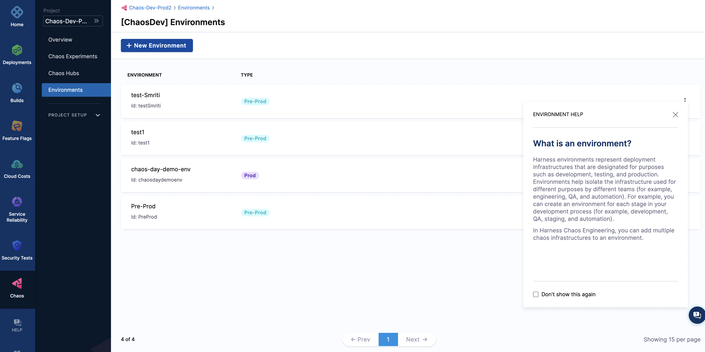

Specify the name of the environment, and the type of environment (production or non-production environment). Click on ‘Create’. 

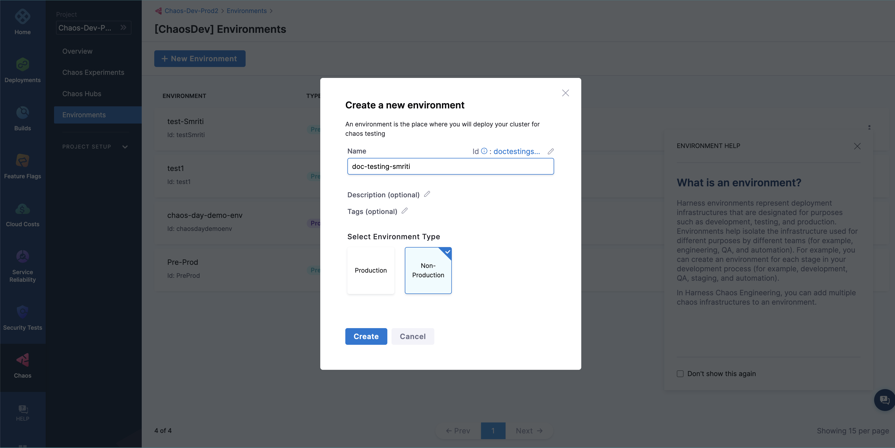

This creates a new chaos environment, and automatically lands you inside your chaos environment. Your next step is to create a new chaos infrastructure.

Note: You can also use a previously created chaos infrastructure. (Explain more about this)

A chaos infrastructure is basically a Kubernetes infrastructure that provides the necessary resources to execute your chaos experiment (link to chaos experiment).

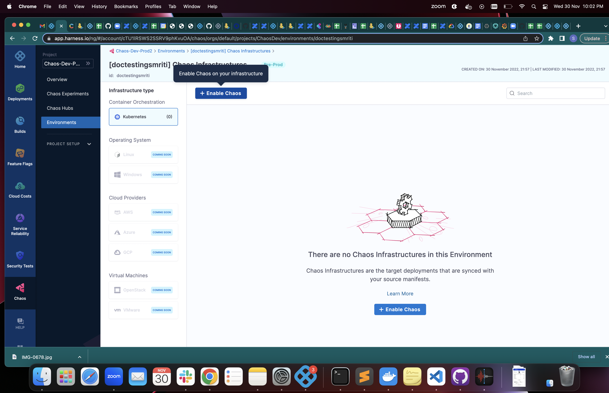

Click on ‘Enable Chaos’, and say ‘Continue’.
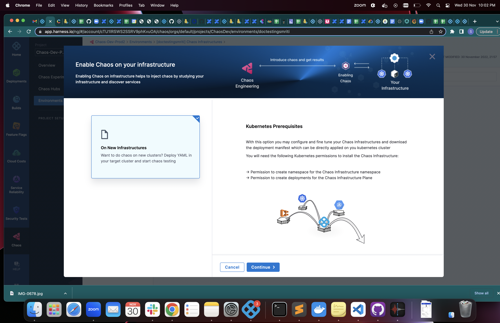

Specify the ‘Name’ of the chaos infrastructure, and click on ‘Next’.
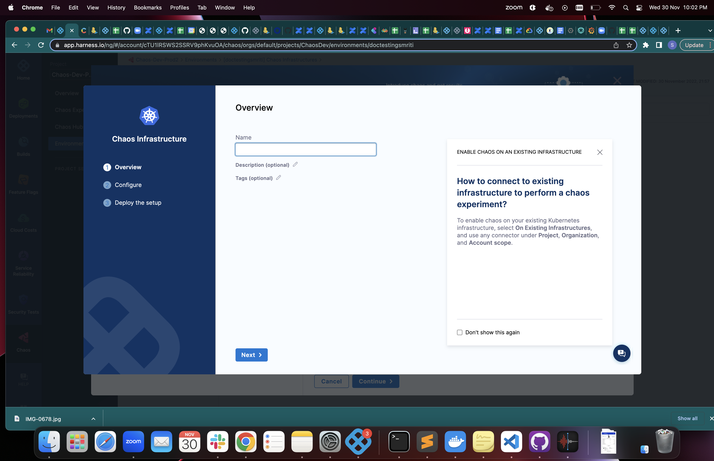

Specify the ‘Installation mode’, ‘Chaos infrastructure namespace’, and ‘Service account name’. (Explain or link these fields)
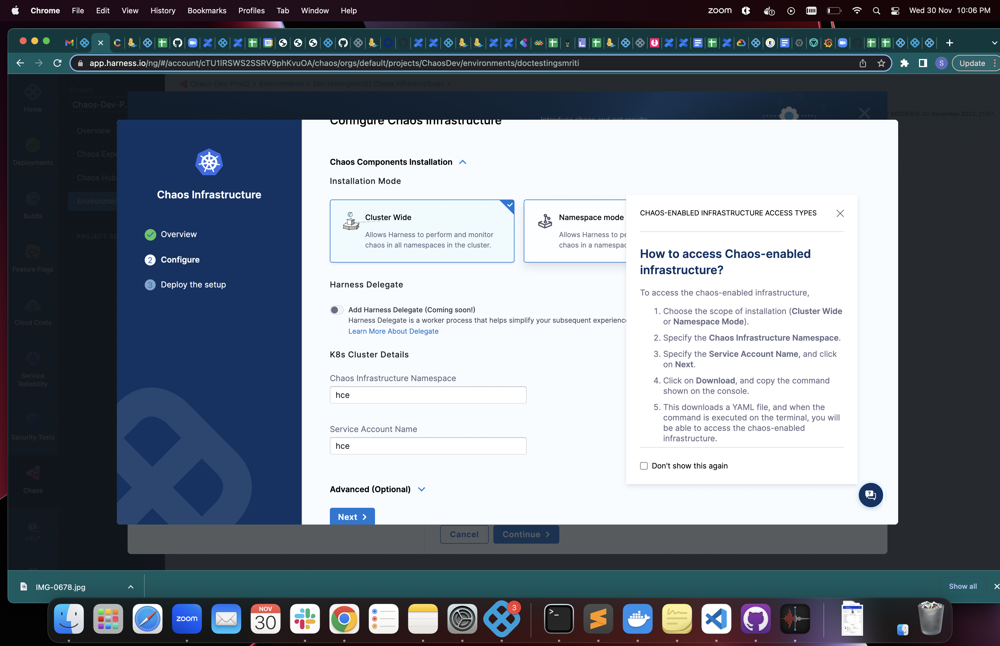

Click on ‘Next’ and download the YAML file that contains information to create the chaos infrastructure with the options you previously chose. Download this YAML file, and copy the command. Click on ‘Done’.
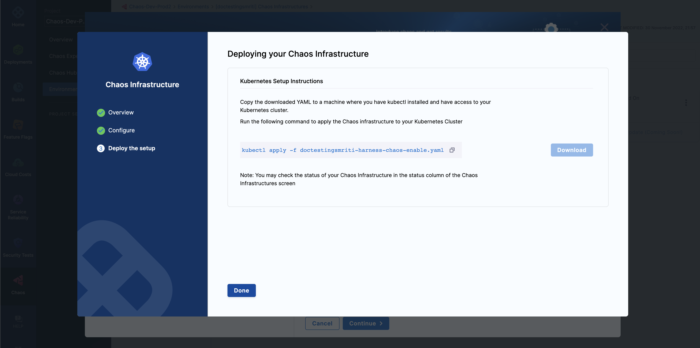

Execute the command you just copied on your terminal. Ensure you are in the folder where this YAML file is present or specify the location of the YAML file. This YAML file creates the necessary configuration and environment required to set up your application and chaos access pods.
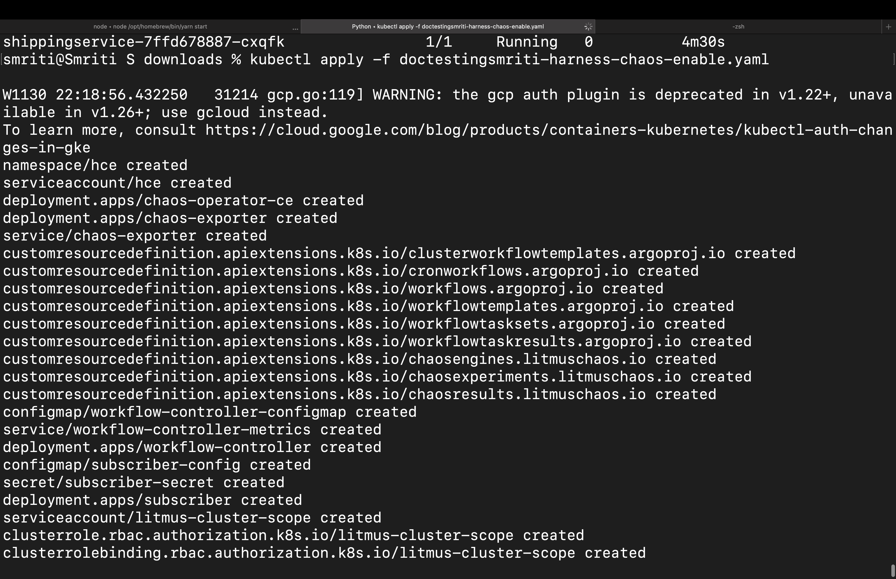

Once all the resources have been created, your chaos infrastructure shows ‘Connected’. This indicates that your cluster has successfully connected to your chaos infrastructure. This may take about 2 to 4 minutes to connect.


Congratulations again. You have completed the second major step in running your own chaos experiment. The third and fourth prominent steps include configuring an application, and introducing fault inside the application, respectively. 

To configure an application, create a new namespace by executing the below command:
```
❯ kubectl create ns <namespace_name>

NAME                           TYPE           CLUSTER-IP    EXTERNAL-IP     PORT(S)          AGE
adservice                      ClusterIP      10.8.23.48    <none>          9555/TCP         92s
cartservice                    ClusterIP      10.8.20.159   <none>          7070/TCP         103s
checkoutservice                ClusterIP      10.8.24.94    <none>          5050/TCP         118s
currencyservice                ClusterIP      10.8.25.254   <none>          7000/TCP         100s
emailservice                   ClusterIP      10.8.25.97    <none>          5000/TCP         2m
frontend                       ClusterIP      10.8.20.227   <none>          80/TCP           112s
frontend-external              LoadBalancer   10.8.23.231   35.222.109.9    80:31998/TCP     111s
grafana                        LoadBalancer   10.8.26.152   34.172.132.87   3000:31288/TCP   53s
paymentservice                 ClusterIP      10.8.29.181   <none>          50051/TCP        109s
productcatalogservice          ClusterIP      10.8.26.0     <none>          3550/TCP         106s
prometheus-blackbox-exporter   ClusterIP      10.8.27.165   <none>          9115/TCP         58s
prometheus-k8s                 LoadBalancer   10.8.21.255   34.135.243.43   9090:32030/TCP   61s
recommendationservice          ClusterIP      10.8.24.34    <none>          8080/TCP         115s
redis-cart                     ClusterIP      10.8.25.135   <none>          6379/TCP         94s
shippingservice                ClusterIP      10.8.28.118   <none>          50051/TCP        97s
```

Execute the following commands to set up your application inside this namespace. 
```
❯ kubectl apply -f https://raw.githubusercontent.com/Adarshkumar14/boutique-app-monitoring/main/manifest/app.yaml -n <namespace_name>

NAME                                            READY   STATUS    RESTARTS   AGE
adservice-56799c4499-pkvv9                      1/1     Running   0          4m25s
cartservice-ccdf9995f-h4smn                     1/1     Running   0          4m37s
checkoutservice-7547cff4bc-cn6cz                1/1     Running   0          4m51s
currencyservice-7f6c66bbc9-dqgtp                1/1     Running   0          4m33s
emailservice-8549b46fd9-4zzzj                   1/1     Running   0          4m53s
frontend-77f8454f67-q78pk                       1/1     Running   0          4m46s
grafana-58fcd9ccc7-pdlhv                        1/1     Running   0          3m46s
loadgenerator-77f7c4fbc8-fvjxt                  1/1     Running   0          4m34s
paymentservice-6774649d9-crq95                  1/1     Running   0          4m42s
productcatalogservice-854596c6c7-kpwhq          1/1     Running   0          4m39s
prometheus-blackbox-exporter-79499f4f8b-fhj2l   2/2     Running   0          3m51s
prometheus-deployment-5f74b545b8-mqmsp          1/1     Running   0          3m54s
recommendationservice-78866677f7-5thbq          1/1     Running   0          4m48s
redis-cart-5cb9ccdf78-gj2vm                     1/1     Running   0          4m28s
shippingservice-7ffd678887-cxqfk                1/1     Running   0          4m30s
```

and

```
❯ kubectl apply -f https://raw.githubusercontent.com/Adarshkumar14/boutique-app-monitoring/main/manifest/monitoring.yaml -n <namespace_name>

namespace/monitoring created
serviceaccount/monitoring created
deployment.apps/chaos-operator-ce created
deployment.apps/chaos-exporter created
service/chaos-exporter created
customresourcedefinition.apiextensions.k8s.io/clusterworkflowtemplates.argoproj.io created
customresourcedefinition.apiextensions.k8s.io/cronworkflows.argoproj.io created
customresourcedefinition.apiextensions.k8s.io/workflows.argoproj.io created
customresourcedefinition.apiextensions.k8s.io/workflowtemplates.argoproj.io created
customresourcedefinition.apiextensions.k8s.io/workflowtasksets.argoproj.io created
customresourcedefinition.apiextensions.k8s.io/workflowtaskresults.argoproj.io created
customresourcedefinition.apiextensions.k8s.io/chaosengines.litmuschaos.io created
customresourcedefinition.apiextensions.k8s.io/chaosexperiments.litmuschaos.io created
customresourcedefinition.apiextensions.k8s.io/chaosresults.litmuschaos.io created
configmap/workflow-controller-configmap created
service/workflow-controller-metrics created
deployment.apps/workflow-controller created
configmap/subscriber-config created
secret/subscriber-secret created
deployment.apps/subscriber created
serviceaccount/litmus-cluster-scope created
clusterrole.rbac.authorization.k8s.io/litmus-cluster-scope created
clusterrolebinding.rbac.authorization.k8s.io/litmus-cluster-scope created
serviceaccount/litmus-admin created
clusterrole.rbac.authorization.k8s.io/litmus-admin created
clusterrolebinding.rbac.authorization.k8s.io/litmus-admin created
serviceaccount/argo-chaos created
clusterrole.rbac.authorization.k8s.io/chaos-cluster-role created
clusterrolebinding.rbac.authorization.k8s.io/chaos-cluster-role-binding created
clusterrole.rbac.authorization.k8s.io/subscriber-cluster-role created
clusterrolebinding.rbac.authorization.k8s.io/subscriber-cluster-role-binding created
serviceaccount/argo created
clusterrole.rbac.authorization.k8s.io/argo-cluster-role created
clusterrolebinding.rbac.authorization.k8s.io/argo-binding created

```

Congratulations! You just created an online boutique application with just two commands!

You can check the services created in this specific namespace using the command:

```
❯ kubectl get svc -n <namespace_name>

NAME                           TYPE           CLUSTER-IP    EXTERNAL-IP     PORT(S)          AGE
adservice                      ClusterIP      10.8.23.48    <none>          9555/TCP         92s
cartservice                    ClusterIP      10.8.20.159   <none>          7070/TCP         103s
checkoutservice                ClusterIP      10.8.24.94    <none>          5050/TCP         118s
currencyservice                ClusterIP      10.8.25.254   <none>          7000/TCP         100s
emailservice                   ClusterIP      10.8.25.97    <none>          5000/TCP         2m
frontend                       ClusterIP      10.8.20.227   <none>          80/TCP           112s
frontend-external              LoadBalancer   10.8.23.231   35.222.109.9    80:31998/TCP     111s
grafana                        LoadBalancer   10.8.26.152   34.172.132.87   3000:31288/TCP   53s
paymentservice                 ClusterIP      10.8.29.181   <none>          50051/TCP        109s
productcatalogservice          ClusterIP      10.8.26.0     <none>          3550/TCP         106s
prometheus-blackbox-exporter   ClusterIP      10.8.27.165   <none>          9115/TCP         58s
prometheus-k8s                 LoadBalancer   10.8.21.255   34.135.243.43   9090:32030/TCP   61s
recommendationservice          ClusterIP      10.8.24.34    <none>          8080/TCP         115s
redis-cart                     ClusterIP      10.8.25.135   <none>          6379/TCP         94s
shippingservice                ClusterIP      10.8.28.118   <none>          50051/TCP        97s
```

You can check the pods created in this specific namespace using the command:

```
❯ kubectl get pods -n namespace

NAME                                            READY   STATUS    RESTARTS   AGE
adservice-56799c4499-pkvv9                      1/1     Running   0          4m25s
cartservice-ccdf9995f-h4smn                     1/1     Running   0          4m37s
checkoutservice-7547cff4bc-cn6cz                1/1     Running   0          4m51s
currencyservice-7f6c66bbc9-dqgtp                1/1     Running   0          4m33s
emailservice-8549b46fd9-4zzzj                   1/1     Running   0          4m53s
frontend-77f8454f67-q78pk                       1/1     Running   0          4m46s
grafana-58fcd9ccc7-pdlhv                        1/1     Running   0          3m46s
loadgenerator-77f7c4fbc8-fvjxt                  1/1     Running   0          4m34s
paymentservice-6774649d9-crq95                  1/1     Running   0          4m42s
productcatalogservice-854596c6c7-kpwhq          1/1     Running   0          4m39s
prometheus-blackbox-exporter-79499f4f8b-fhj2l   2/2     Running   0          3m51s
prometheus-deployment-5f74b545b8-mqmsp          1/1     Running   0          3m54s
recommendationservice-78866677f7-5thbq          1/1     Running   0          4m48s
redis-cart-5cb9ccdf78-gj2vm                     1/1     Running   0          4m28s
shippingservice-7ffd678887-cxqfk                1/1     Running   0          4m30s
```


The last, and the most important step of this experiment is injecting chaos into the application to inspect its resilience. To achieve this, go to your chaos access center, and click on ‘New experiment’.
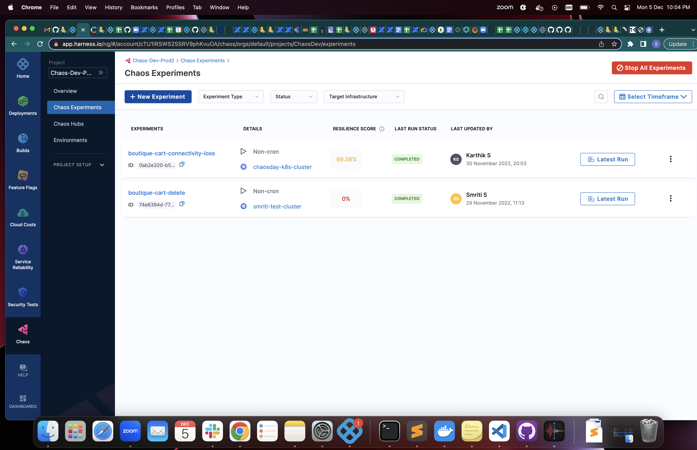

Specify a name, and chaos infrastructure (that you have previously created).
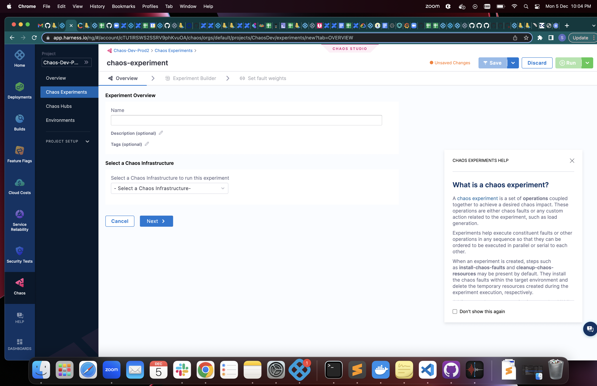

Click on ‘Apply’ and click on ‘Next’.
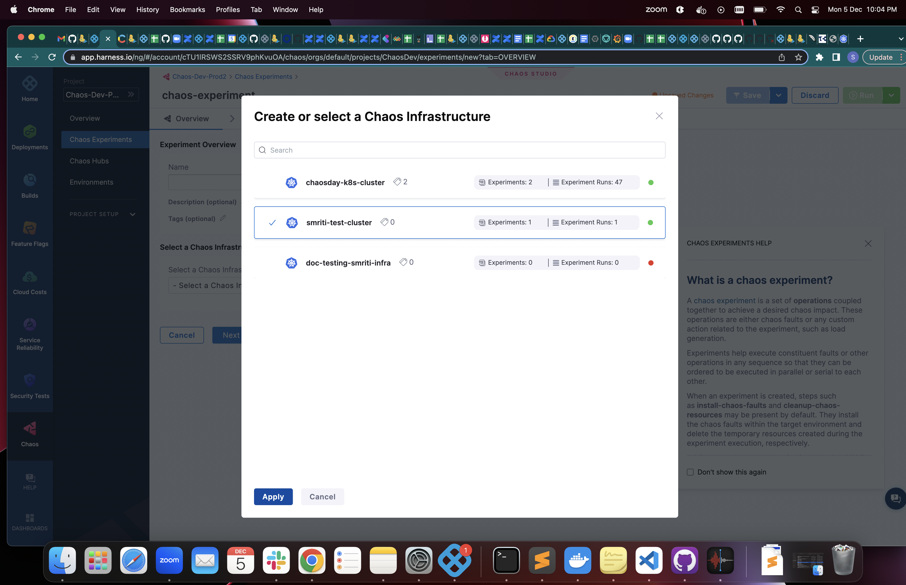

To build an experiment, fill in the information required in the ‘Target application’ field, such as ‘Namespace’, ‘Kind’, and ‘Label’.
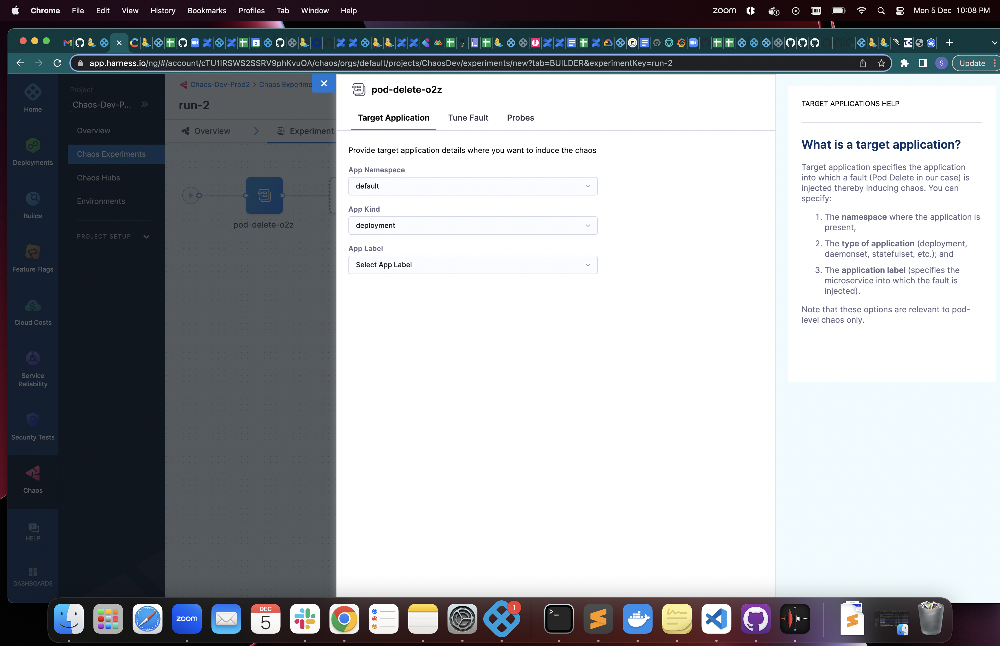

Click on the ‘Run’ button on the top right corner of your screen. This executes the chaos experiment with the parameters you specified. It will run for about 3 to 5 minutes during which the resilience score is calculated, after the following steps:
Fetch pods
…
Specify steps here
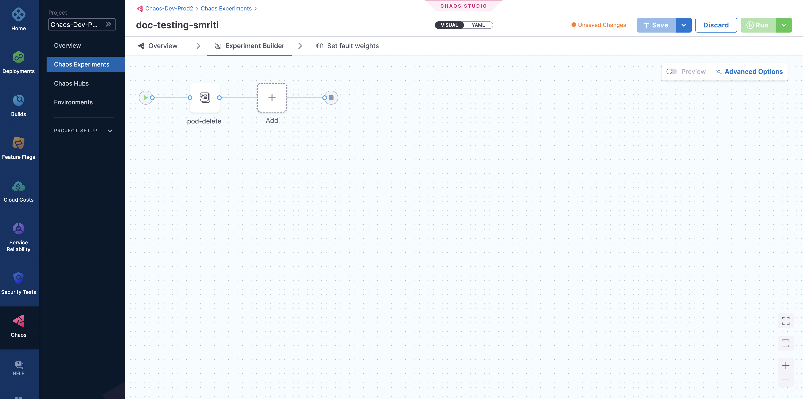

Click on the 'Run' button to inject 'pod delete' chaos into the online boutique application.
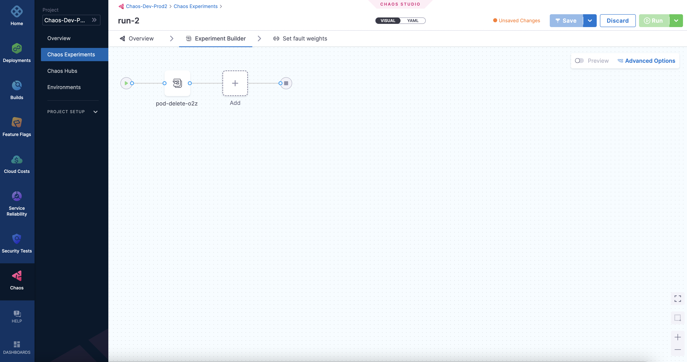

After running for a couple of minutes, the resilience score is calculated based on number of factors. 
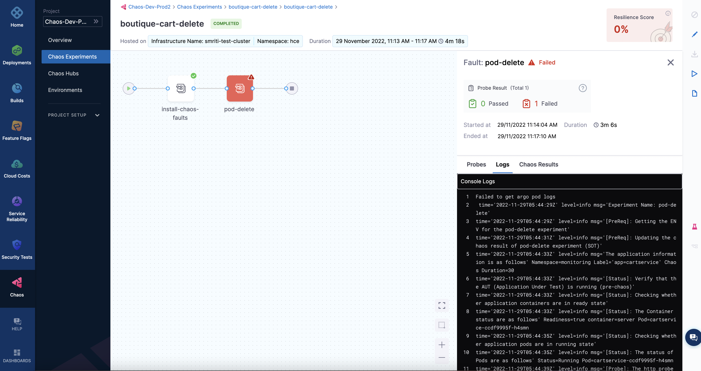


