In this tutorial, you will utilize an already exisiting application or create a new one, and
1. Ceate environment, infrastructure and enable chaos on a chaos infrastructure, 
2. Create a chaos experiment,
3. Run the chaos experiment on the application and observe the actions that take place to determine how resilient the application is, to unforeseen failures.   


## Prerequisites
1. Permissions to create a cluster (so that you can create the namespace, resources, etc.)
2. Invite/sign up to prod2/qa
3. ‘kubectl’ command-line tool
4. Access to create environment in the project
5. Access to create Chaos infrastructure

Let us get started!

## 1. Choose your target application

### a. Choose an existing application
### b. Create a new application (Boutique)
1. To create a new boutique application, first create a new namespace to house your application. 
```
❯ kubectl create ns <namespace_name>
```

2. Execute the following commands to set up your boutique application inside the previously created namespace. 
```
❯ kubectl apply -f https://raw.githubusercontent.com/chaosnative/harness-chaos-demo/main/boutique-app-manifests/manifest/app.yaml -n <namespace_name>
```

```
deployment.apps/emailservice created
service/emailservice created
deployment.apps/checkoutservice created
service/checkoutservice created
deployment.apps/recommendationservice created
service/recommendationservice created
deployment.apps/frontend created
service/frontend created
service/frontend-external created
deployment.apps/paymentservice created
service/paymentservice created
deployment.apps/productcatalogservice created
service/productcatalogservice created
deployment.apps/cartservice created
service/cartservice created
deployment.apps/loadgenerator created
deployment.apps/currencyservice created
service/currencyservice created
deployment.apps/shippingservice created
service/shippingservice created
deployment.apps/redis-cart created
service/redis-cart created
deployment.apps/adservice created
service/adservice created
```

and

```
❯ kubectl apply -f https://raw.githubusercontent.com/chaosnative/harness-chaos-demo/main/boutique-app-manifests/manifest/monitoring.yaml -n <namespace_name>
```

```
serviceaccount/prometheus created
role.rbac.authorization.k8s.io/prometheus created
rolebinding.rbac.authorization.k8s.io/prometheus created
configmap/prometheus-alertrules created
configmap/prometheus-configmap created
deployment.apps/prometheus-deployment created
service/prometheus-k8s created
configmap/prometheus-blackbox-exporter created
deployment.apps/prometheus-blackbox-exporter created
service/prometheus-blackbox-exporter created
configmap/litmus-grafana-provisioner created
configmap/litmus-grafana-dashboards created
configmap/litmus-grafana-datasources created
deployment.apps/grafana created
service/grafana created
```

**Congratulations! You have created an online boutique application with just two commands!**

3. Verify the services created inside this namespace.

```
❯ kubectl get svc -n <namespace_name>
```

```
NAME                           TYPE           CLUSTER-IP    EXTERNAL-IP     PORT(S)          AGE
adservice                      ClusterIP      10.8.23.48    <none>          9555/TCP         92s
cartservice                    ClusterIP      10.8.20.159   <none>          7070/TCP         103s
checkoutservice                ClusterIP      10.8.24.94    <none>          5050/TCP         118s
currencyservice                ClusterIP      10.8.25.254   <none>          7000/TCP         100s
emailservice                   ClusterIP      10.8.25.97    <none>          5000/TCP         2m
frontend                       ClusterIP      10.8.20.227   <none>          80/TCP           112s
frontend-external              LoadBalancer   10.8.23.231   35.222.109.9    80:31998/TCP     111s
grafana                        LoadBalancer   10.8.26.152   34.172.132.87   3000:31288/TCP   53s
paymentservice                 ClusterIP      10.8.29.181   <none>          50051/TCP        109s
productcatalogservice          ClusterIP      10.8.26.0     <none>          3550/TCP         106s
prometheus-blackbox-exporter   ClusterIP      10.8.27.165   <none>          9115/TCP         58s
prometheus-k8s                 LoadBalancer   10.8.21.255   34.135.243.43   9090:32030/TCP   61s
recommendationservice          ClusterIP      10.8.24.34    <none>          8080/TCP         115s
redis-cart                     ClusterIP      10.8.25.135   <none>          6379/TCP         94s
shippingservice                ClusterIP      10.8.28.118   <none>          50051/TCP        97s
```

### View Boutique and its Grafana Dashboards

Access the '**external-ip**' of the '**frontend-external**' service. In our case, it is http://35.222.109.9/. Don't forget to explore the boutique and add your favourite products into the cart, and checkout!


### Access Grafana Dashboard of the Boutique Application

Login to Grafana
You can login to Grafana by accessing the '**external-ip**' of **grafana**' service. In our case, it is http://34.172.132.87:3000. Specify the 'username' as 'admin', and 'password' as 'admin'.

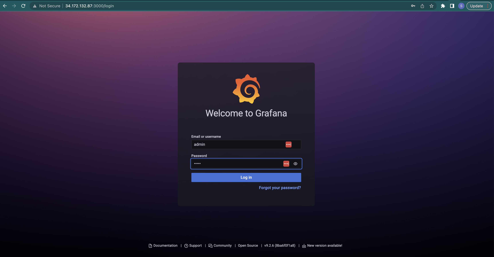

### View the Boutique Dashboard

You can click on '**Boutique App Dashboard**' to view the Grafana dashboard.

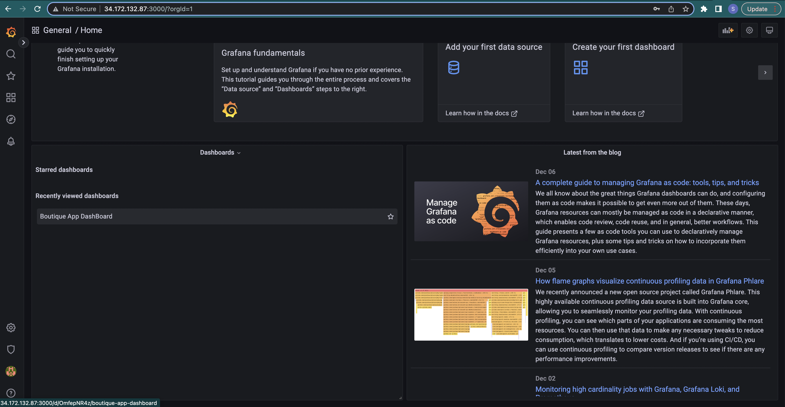

### Visuals before Chaos is Injected

Below is the visualization before chaos is injected into the application. 

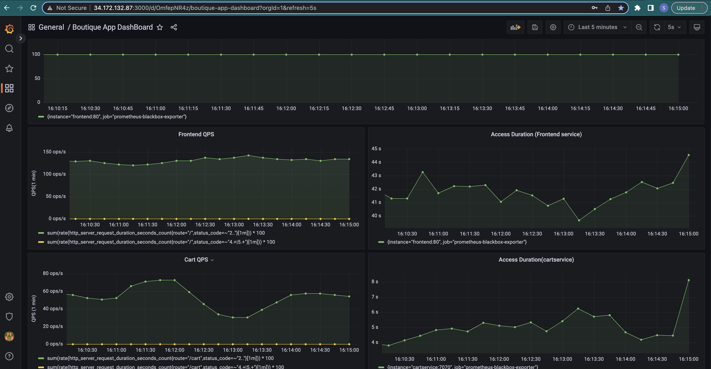


The next step in this tutorial is to configure the chaos control plane, i.e, 
1. Create a chaos environment, a chaos infrastructure; and 
2. Deploy this infrastructure.

## 2. Configure your Chaos Control Plane

### Create an Environment in the Chaos Center

1. Go to app.harness.io, and signup or contact Harness support to receive an invite to prod2 (or specify a different test environment). 

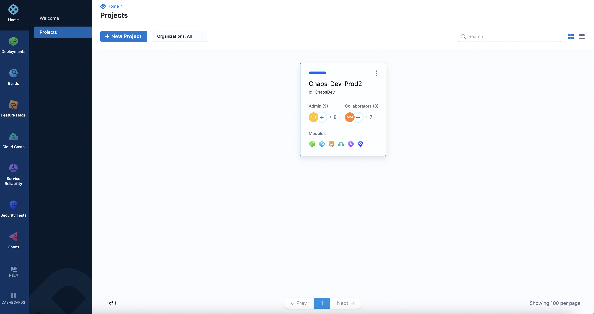

2. Go to ‘**Chaos**’, and click on the project you are given access to.

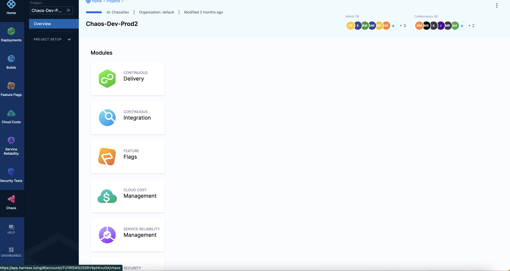

3. Click on ‘**New Environment**’ to create a new [chaos environment](https://developer.harness.io/docs/chaos-engineering/technical-reference/environments/).


4. Specify the name of the environment, and the type of environment (production or non-production environment). Click on ‘**Create**’. 


This creates a new chaos environment, and automatically lands you inside your chaos environment. Your next step is to create a new chaos infrastructure.

> **_Note:_** You can also use a previously created chaos infrastructure. (Explain more about this)

### Create a Chaos Infrastructure

1. A [chaos infrastructure](https://developer.harness.io/docs/chaos-engineering/technical-reference/chaos-infrastructures) is basically a Kubernetes infrastructure that provides the necessary resources to execute your chaos experiment.
To enable chaos on a new chaos infrastructure, click on ‘**Enable Chaos**’, and click on ‘**Continue**’.


2. Specify the ‘**Name**’ of the chaos infrastructure, and click on ‘**Next**’.


3. Specify other Parameters of the chaos infrastructure, such as the ‘**Installation mode**’, ‘**Chaos infrastructure namespace**’, and ‘**Service account name**’.


4. Click on ‘**Next**’ to download the YAML file that contains information to create the chaos infrastructure with the options you previously chose. Download this YAML file, and copy the command. Click on ‘**Done**’.


5. To deploy the chaos infrastructure, execute the command you just copied on your terminal. Ensure you are in the folder where this YAML file is present or specify the location of the YAML file. This YAML file creates the necessary configuration and environment required to set up your application and chaos access pods.
```
❯ kubectl apply -f <file-name.yaml>
```

```
namespace/hce created
serviceaccount/hce created
deployment.apps/chaos-operator-ce created
deployment.apps/chaos-exporter created
service/chaos-exporter created
customresourcedefinition.apiextensions.k8s.io/clusterworkflowtemplates.argoproj.io created
customresourcedefinition.apiextensions.k8s.io/cronworkflows.argoproj.io created
customresourcedefinition.apiextensions.k8s.io/workflows.argoproj.io created
customresourcedefinition.apiextensions.k8s.io/workflowtemplates.argoproj.io created
customresourcedefinition.apiextensions.k8s.io/workflowtasksets.argoproj.io created
customresourcedefinition.apiextensions.k8s.io/workflowtaskresults.argoproj.io created
customresourcedefinition.apiextensions.k8s.io/chaosengines.litmuschaos.io created
customresourcedefinition.apiextensions.k8s.io/chaosexperiments.litmuschaos.io created
customresourcedefinition.apiextensions.k8s.io/chaosresults.litmuschaos.io created
configmap/workflow-controller-configmap created
service/workflow-controller-metrics created
deployment.apps/workflow-controller created
configmap/subscriber-config created
secret/subscriber-secret created
deployment.apps/subscriber created
serviceaccount/litmus-cluster-scope created
clusterrole.rbac.authorization.k8s.io/litmus-cluster-scope created
clusterrolebinding.rbac.authorization.k8s.io/litmus-cluster-scope created
serviceaccount/litmus-admin created
clusterrole.rbac.authorization.k8s.io/litmus-admin created
clusterrolebinding.rbac.authorization.k8s.io/litmus-admin created
serviceaccount/argo-chaos created
clusterrole.rbac.authorization.k8s.io/chaos-cluster-role created
clusterrolebinding.rbac.authorization.k8s.io/chaos-cluster-role-binding created
clusterrole.rbac.authorization.k8s.io/subscriber-cluster-role created
clusterrolebinding.rbac.authorization.k8s.io/subscriber-cluster-role-binding created
serviceaccount/argo created
clusterrole.rbac.authorization.k8s.io/argo-cluster-role created
clusterrolebinding.rbac.authorization.k8s.io/argo-binding created
```

Once all the resources are created, your chaos infrastructure shows **`Connected`**. This indicates that your cluster is successfully connected to your chaos infrastructure. This may take about 2 to 4 minutes to connect.


**Congratulations! You just completed the first major step in running your own chaos experiment, which is creating and deploying a chaos infrastructure. The second and third prominent steps include creating your chaos experiment, and introducing chaos fault inside the application, respectively.**

## 3. Create your Chaos Experiment

### Create a New Experiment
1. To create a new chaos experiment and inject chaos, navigate to your chaos access center, and click on '**Chaos Experiments**'. Now click on ‘**New experiment**’.


2. Specify the parameters of the chaos experiment, such as a '**name**', and '**chaos infrastructure**' (that you have previously created).


### Apply the Chaos Infrastructure

3. Click on ‘**Apply**’ to apply the selected chaos infrastructure to that experiment, and click on ‘**Next**’.


4. Select the template for the experiment. To build an experiment, select '**Templates from ChaosHubs**'.

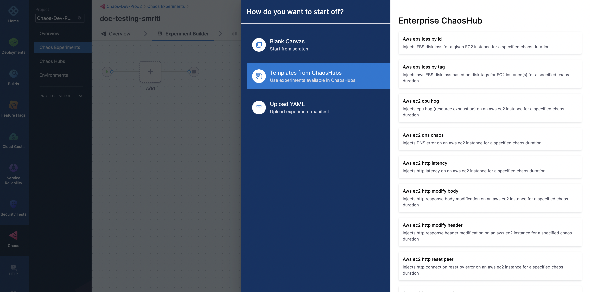

5. Select the '**Boutique cart delete**’ option, and click on '**Use this template**'.

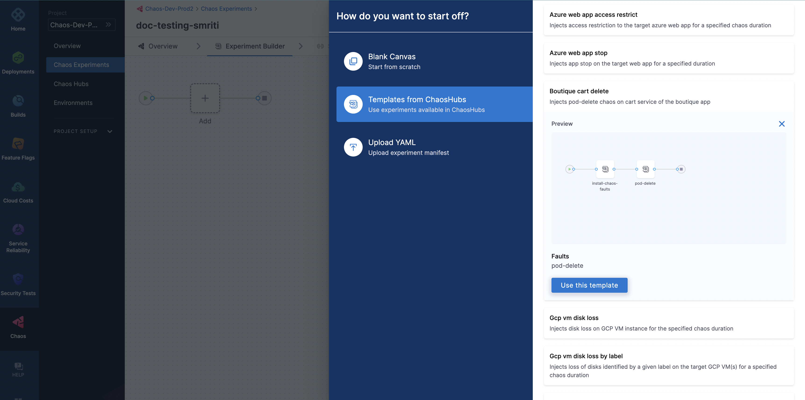

6. Select the chaos fault that you wish to implement.

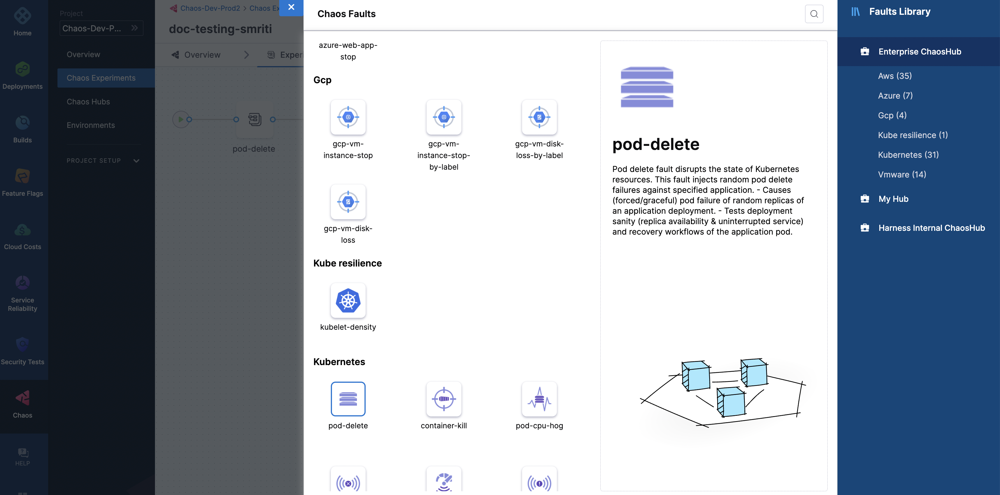

7. Specify parameters in the ‘**Target application**’ field, such as ‘**Namespace**’, ‘**Kind**’, and ‘**Label**’.

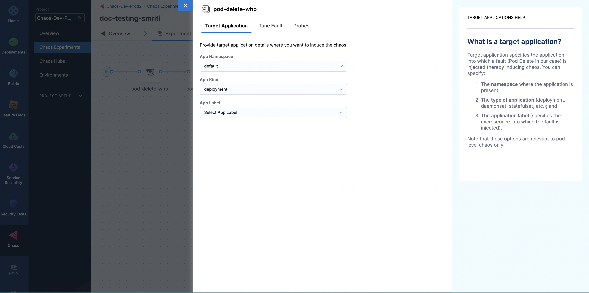

### Set Fault Weights

8. Click on '**Set fault weights**' on the screen.

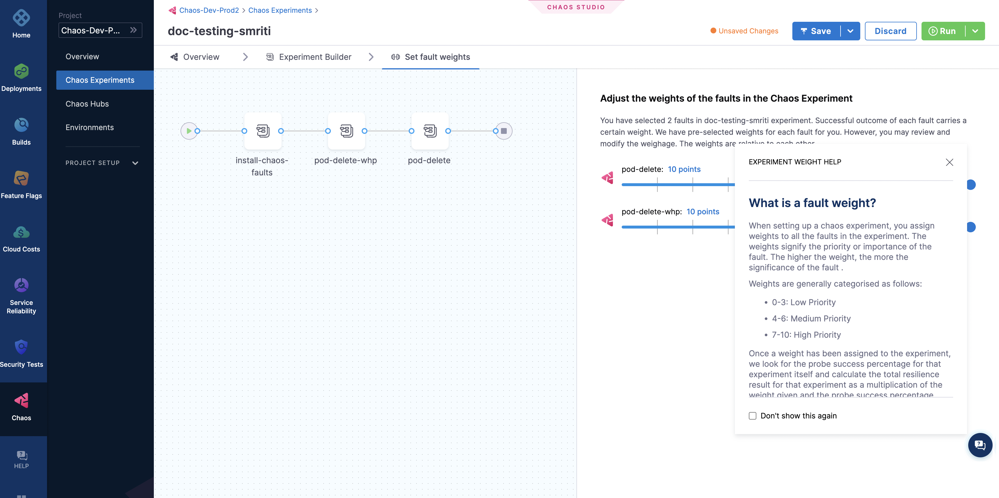

### Save the Experiment

9. On the top right corner of your screen, click on '**Save**'. This saves the experiment that you built.

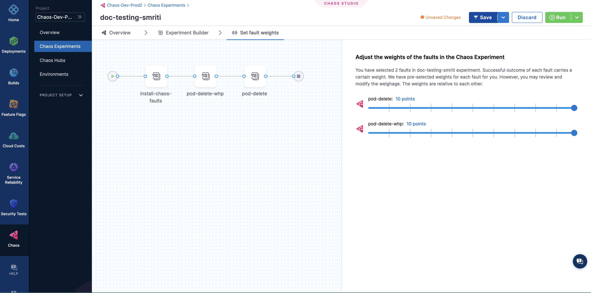

## 4. Run and analyze your chaos experiment

### Run the Experiment

Click on the '**Run**' button present at the top right corner, to run the experiment. This experiment runs for about 3 to 5 minutes during which it determines the **resilience score**.


### View Experiment Results

You can view the details of the experiment by clicking on '**Summary**'.

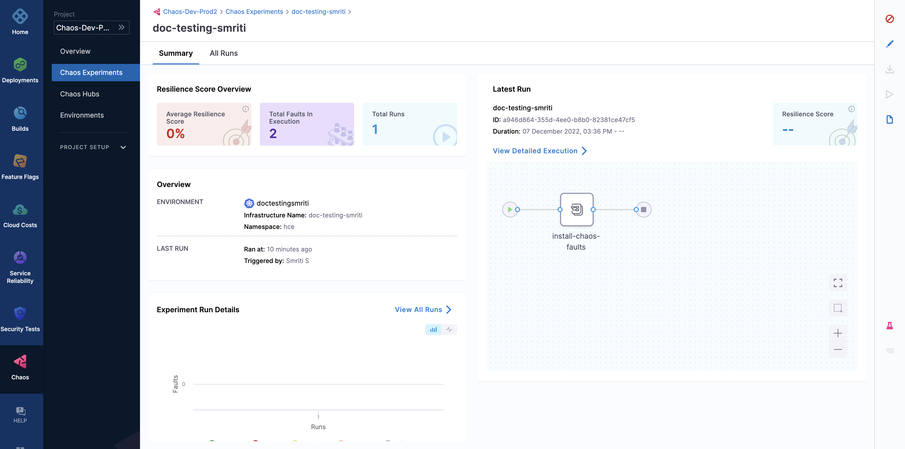

### View Chaos Results on Grafana Dashboard

#### You can see the results of injecting chaos into the target application on the Grafana dashboard.

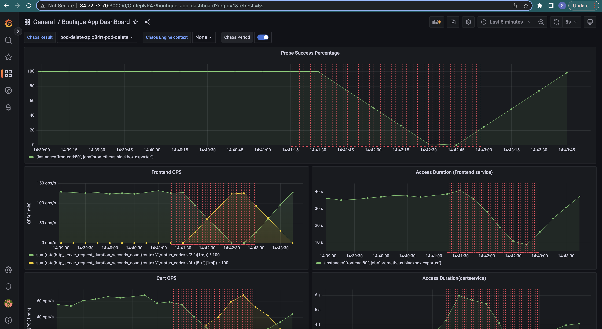
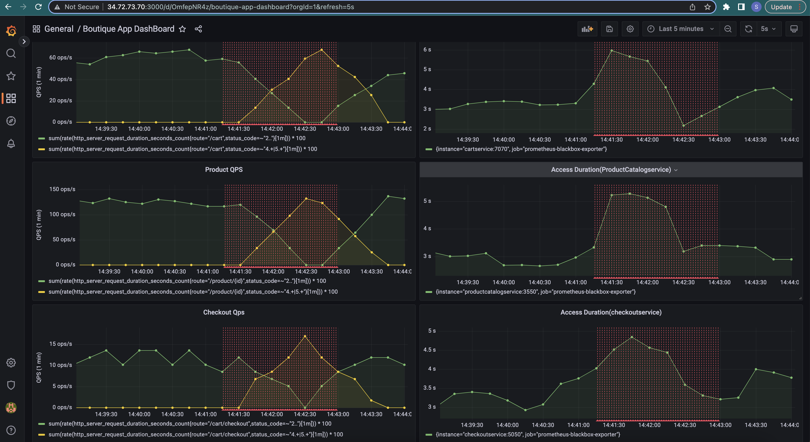


## Troubleshooting