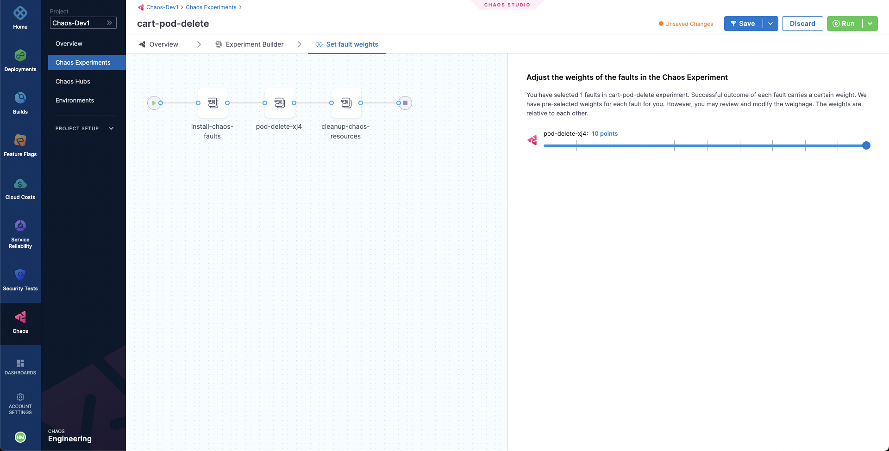

Welcome to this tutorial on creating Chaos Experiments from scratch. Here, you'll be constructing a chaos experiment from scratch in the Chaos Studio. Make sure you have completed the previous tutorial before starting.

## Constructing a Chaos Experiment from Scratch

In the previous tutorial we used the **Boutique cart delete** template to create our experiment. This time around, let us try to define the same experiment with minor changes from scratch. We will again be targeting the pods of the carts microservice with the Pod Delete fault. Right now, the cart page is healthy and accessible in the frontend, as seen at the `/cart` route.


To create the chaos experiment, go to **Chaos Experiments** in the sidebar menu and choose **New Experiment**. Then, add the experiment name and optionally a description and tags. Then, choose the target infrastructure, which we created previously. Choose **Next**. In the Experiment Builder, choose **Blank Canvas** and select **Start with blank canvas**.


Let us try to define our Pod Delete fault. Choose **Add**. From the **Enterprise Chaos Hub** select Pod Delete fault under the Kubernetes category.


Specify the target application namespace, type and label. We will be targeting the carts microservice and hence we will provide the appropriate `hce` namespace and the `app=cartservice` label which corresponds to the cart microservice. The application kind will be `deployment`. 


Then, choose the **Tune Fault** tab to configure the fault parameters. Here, we will define the fault execution duration to be 30 seconds, with an interval of 10 seconds, so that in every 10 seconds we will be deleting the cart deployment pods for a total of 30 second duration. Lastly we have specified the pod affected percentage to be 50% so that half of all the deployment pods and at minimum one pod will be deleted in each iteration of chaos.


Lastly, choose the **Probes** tab. Here, we have a default application **health-check** probe defined which validates the target application health before and after the fault injection to ensure that the application is unharmed due to the experiment. Let us add one more probe so that we can validate the carts microservice health. Select **Deploy new Probe**, ensure that the probe type is `HTTP Probe`, select **Continue** and then again select **Continue**. Now, we need to provide the HTTP probe URL so that the probe can make GET requests at that URL and check if the status code in response is 200 for the successful validation of the probe. Provide the URL `http://frontend/cart`, which is the URL for the cart page. Also, reduce the response timeout to 5 seconds. Then, select **Setup the Probe**.


When done, simply close the overlay modal. We have added the Pod Delete fault now.

In the last step, choose the **Set Fault Weight** tab. We will use the default weight of 10 for the fault.



## Observing Chaos Execution

When ready, start the experiment execution by selecting **Run** on the top right corner of the screen. You'll be able to observe the experiment added to the list of chaos experiments and it should be in a `Running` status. Choose **Current Execution** to get a detailed view.


Once the fault is running, we can check for the detailed view of the experiment. We can follow the logs of the experiment run as it gets executed. 


At the same time, we can also check for the status of the cart deployment pod. Upon executing the following command you will get a similar output. It is evident that the Pod Delete fault has caused the cart pod to be terminated and a new pod has recently replaced it, for whose container is yet to be created.

```
❯ k get pods -n hce

NAME                                           READY   STATUS    RESTARTS       AGE
adservice-68db567bb5-hd47j                     1/1     Running   0              5h41m
cartservice-6b8f46f64f-lkgs8                   0/1     Running   0              29s
chaos-exporter-765d6b6674-tkrpm                1/1     Running   0              5h41m
chaos-operator-ce-678b67c75-l68m5              1/1     Running   0              5h41m
checkoutservice-7545ff6849-rdl9f               1/1     Running   0              5h41m
currencyservice-5769b647d5-trx69               1/1     Running   0              5h41m
emailservice-55c84dcfdc-c9x9q                  1/1     Running   0              5h41m
frontend-74b7898dd9-x4bzr                      1/1     Running   0              5h41m
grafana-6f6fb469b7-bm9vh                       1/1     Running   0              5h41m
loadgenerator-5b875b84dd-pcjdr                 1/1     Running   0              5h41m
paymentservice-59d87f77bc-fkwjq                1/1     Running   0              5h41m
productcatalogservice-676d7d7dbc-nx75x         1/1     Running   0              5h41m
prometheus-blackbox-exporter-6d955c876-l7fdv   2/2     Running   0              5h41m
prometheus-deployment-779b88bf5d-zf8f9         1/1     Running   0              5h41m
recommendationservice-6fc8b4d9cf-4s96t         1/1     Running   0              5h41m
redis-cart-7cd9d8966d-mgbhx                    1/1     Running   0              5h41m
shippingservice-7b4945b5fc-cbmc9               1/1     Running   0              5h41m
subscriber-7774bd95d4-4rnwp                    1/1     Running   0              5h41m
workflow-controller-6d5d75dc7c-v9vqc           1/1     Running   0              5h41m
```

Consequently, if we try to access the frontend cart page, we get the following error which indicates that the application is now unreachable. This makes sense since the cart pod has been deleted and a new pod is yet to initialize, same as in the previous tutorial.


We can validate this behavior using the application metrics dashboard as well. The probe success percentage for website availability (200 response code) is now steeply decreasing along with the 99th percentile (green line) queries per second (QPS) and access duration for the application microservices. Also, the mean QPS (yellow line) is steeply increasing. This is because there's no pod available right now to service the query requests.


## Evaluating the Experiment Run

This time when the experiment execution concludes, we get a resiliency score of 50%. The Pod Delete fault has failed this time as well.


Before we analyze the experiment result, we can validate that the application is now again normally accessible, without any errors from the Grafana dashboard.


We can now check the check the chaos result, where it can be observed that the fault verdict is **Failed** and the Probe Success Percentage is 50%. This is because although the default probe execution in Edge mode validated the target application to be healthy before and after the chaos, the cart service URL HTTP probe has failed. The failure of this probe can be attributed to the unavailability of the cart pod due to the injection of the Pod Delete fault.  


We can also check the Chaos Results tab to get a summary of the experiment execution, where the fail step can be observed to be "Probe execution result didn't met the passing criteria", referring the the failure of HTTP probe that we had defined.


With that you have now defined a chaos experiment from scratch!
