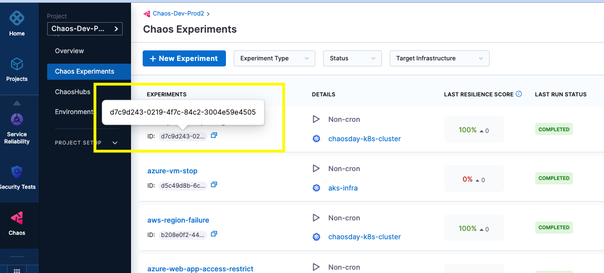

This tutorial explains how to create chaos experiments on Harness Chaos Engineering and the steps to run them on GitLab pipelines. Irrespective of where they are invoked from, Chaos experiments in Harness are created the same way in the chaos engineering module. See [this tutorial](https://developer.harness.io/tutorials/run-chaos-experiments/first-chaos-engineering) to get started with creating a new experiment. 

Following are the general steps to run chaos experiments in GitLab pipelines:

## Create Chaos Experiment

Create a chaos experiment in the Harness Chaos Module by following the tutorial [here](https://developer.harness.io/tutorials/run-chaos-experiments/first-chaos-engineering). Run this experiment from the module to verify that it is configured properly and the resilience probes are working as expected. The experiment ID and the resilience score resulting from this experiment run are going to be used while integrating this experiment with GitLab.



## Create launch script
Harness Chaos Engineering APIs are used to invoke or launch a chaos experiment from the pipeline. To simplify the creation of the API call with the required secure parameters and data, a [CLI tool](https://storage.googleapis.com/hce-api/hce-api-linux-amd64) is provided. Use this tool to create an appropriate API command which you can include in the pipeline script.

A sample launch script looks as follows.
```
#!/bin/bash

set -e

curl -sL https://storage.googleapis.com/hce-api/hce-api-linux-amd64 -o hce-api-saas

chmod +x hce-api-saas

output=$(./hce-api-saas generate --api launch-experiment --account-id=${ACCOUNT_ID} \
--project-id ${PROJECT_ID} --workflow-id ${WORKFLOW_ID} \
--api-key ${API_KEY} --file-name hce-api.sh | jq -r '.data.runChaosExperiment.notifyID')

echo ${output}

```

## Insert chaos experiments into .gitlab-ci.yaml
Include this launch script in GitLab pipeline as a stage or a step. In the `script:` section, include scripts for lauching, monotoring and for retrieving results. An example is shown below. The resilience score is the result of the experiment run, which may be used to decide if a rollback-job needs to be invoked.

```
#Insert a chaos stage where each chaos experiment is inserted as a launch script. 

chaos-job:      # This job runs in the deploy stage.
  stage: chaos  # It only runs when *both* jobs in the test stage complete successfully.
  environment: production
  variables:
    WORKFLOW_ID: "d7c9d243-0219-4f7c-84c2-3004e59e4505"
    EXPECTED_RESILIENCE_SCORE: 100
  before_script: 
    - apt-get update; apt-get -y install jq
  script:
    - echo "Launching Chaos Experiment.."; EXPERIMENT_NOTIFY_ID=$(sh scripts/launch-chaos.sh)
    - echo "Monitoring Chaos Experiment.."; sh scripts/monitor-chaos.sh ${EXPERIMENT_NOTIFY_ID}
    - echo "Deriving Resilience Score.."; ACTUAL_RESILIENCE_SCORE=$(sh scripts/verify-rr.sh ${EXPERIMENT_NOTIFY_ID} | tr -d '"')
    - echo "Obtained Resilience Score is ${ACTUAL_RESILIENCE_SCORE}" 
    - if [ ${ACTUAL_RESILIENCE_SCORE} -lt ${EXPECTED_RESILIENCE_SCORE} ]; then exit 1; fi

rollback-job:
  stage: rollback
  environment: production
  image: 
    name: bitnami/kubectl:latest
    entrypoint: ['']
  script: 
    - *prepare_kubecontext
    - echo "Attempting Rollback.."; sh scripts/rollback-deploy.sh  #write your own rollback logic here
  needs: ["chaos-job"]
  when: on_failure
  

```

## Retrive Resilience score
Retrive the resilience score through the Harness chaos API and take appropriate action in the pipeline, an example usage of the Harness Chaos API is shown below.

```
#!/bin/bash

set -e 

curl -sL https://storage.googleapis.com/hce-api/hce-api-linux-amd64 -o hce-api-saas

chmod +x hce-api-saas

resiliencyScore=$(./hce-api-saas generate --api validate-resilience-score  --account-id=${ACCOUNT_ID} \
--project-id ${PROJECT_ID} --notifyID=$1  \
--api-key ${API_KEY} --file-name hce-api.sh)

echo "${resiliencyScore}"

```


## Example end-to-end configuration

You can find [here](https://gitlab.com/ksatchit/hce-gitlab-integration-demo) a sample configuration of the chaos launch script, it's inclusion in GitLab YAML file. This is a sample for including one single chaos experiment, the same can be repeated for including multiple chaos experiments. 

