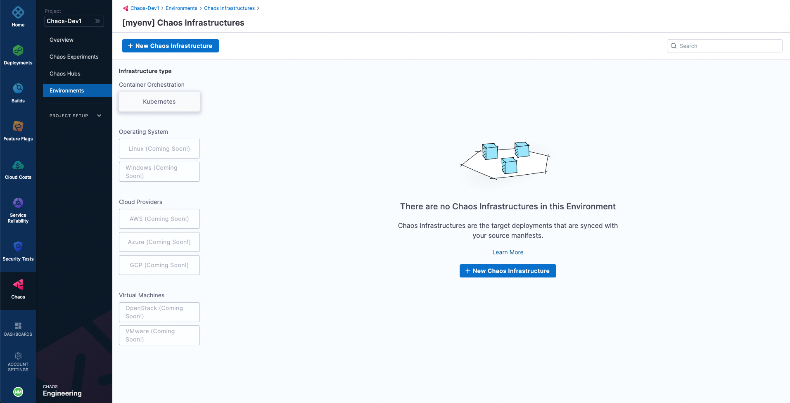
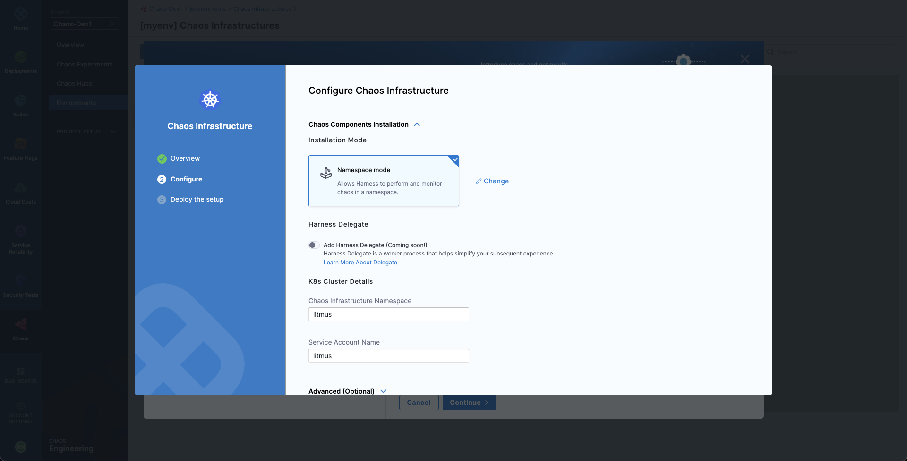
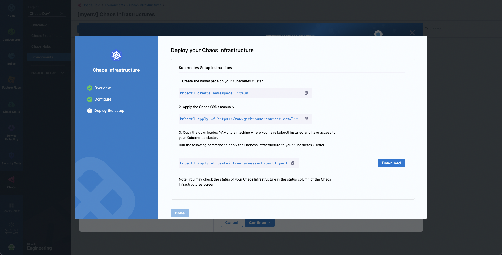
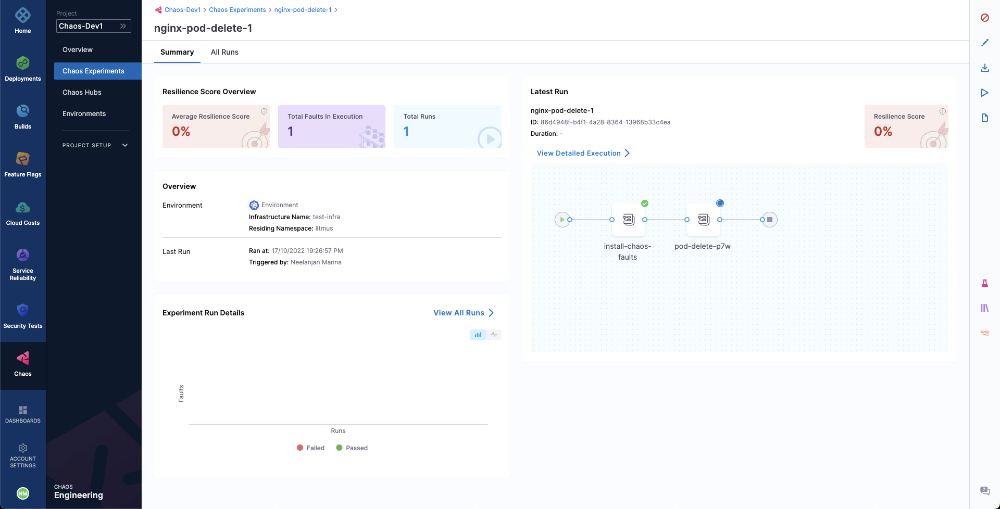
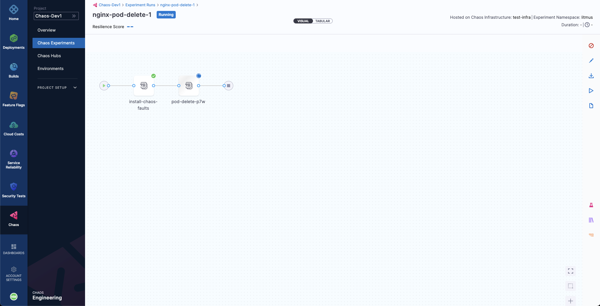
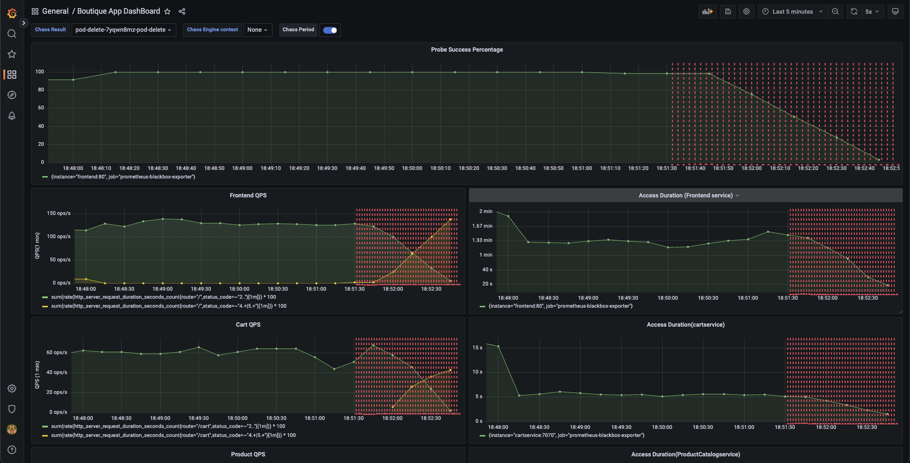
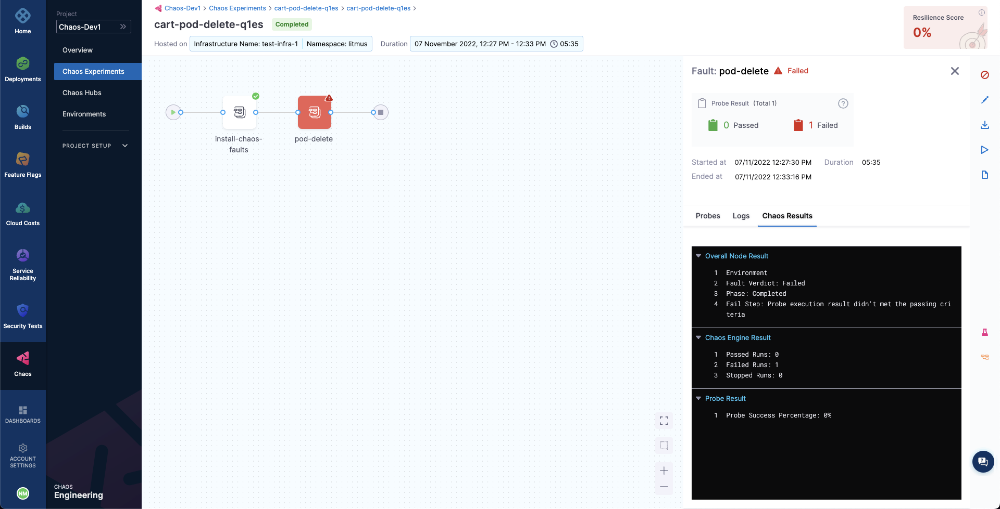

Welcome to Harness Chaos Engineering's first tutorial on running a chaos experiment. In this tutorial you'll be running a Chaos Experiment on Kubernetes for the first time!

## What is Chaos Engineering?
Cloud Native applications are, by definition, highly distributed, elastic, resistant to failure and loosely coupled. That's easy to say, and even diagram. But how do we validate that our applications will perform as expected under different failure conditions?
Enter Chaos Engineering!

Chaos Engineering is the discipline of experimenting on a software system in order to build confidence in the system's capability to withstand turbulent and unexpected conditions. Chaos Engineering is a great tool to help us find weaknesses and misconfiguration in our services. It is relevant for all types of systems (including the so called legacy applications and infrastructure), and particularly important for Cloud Native applications, which, due to their distributed and elastic nature, inherently carry multiple points of failure.

The standard chaos experimentation flow involves identifying the steady state of the system/application under test, hypothesizing around the impact a particular fault or failure would cause, injecting this fault in a controlled manner (with a pre-determined and often minimal "blast radius"), validating whether the hypothesis is proven and taking appropriate action in case if it is not, i.e., a weakness is found.


Harness Chaos Engineering (HCE) helps simplify the chaos engineering practices for your organization. To get started, create a new project or ask your administrator to add you to an existing project. Now, you can access the **Chaos** tab, where an overview of all the experiment runs can be observed.


## Add a Chaos Environment

Next, we will create a new environment such that the chaos infrastructures can be added as part of it. Go to **Environments** page, and choose a **New Environment**. Add environment name, and optionally a description and tags. Select the environment type, **Production** or **Non-Production**. Finally, click on **Create** to add the new environment.


## Add a Chaos Infrastructure

Once the environment is added, we can add chaos infrastructures to it. Here, we will add a Kubernetes infrastructure so that we can inject Kubernetes resource faults. Choose **New Chaos Infrastructure**.



Select **On New Infrastructures** and select **Continue**. Add a name to your chaos infrastructure and optionally a description and tags. Select **Next**.

After that, choose the mode of installation for Harness delegate. As a quick primer, Harness delegate is a remote agent for accessing your Kubernetes cluster resources and injecting faults into them as part of a chaos experiment. The **Cluster Wide** installation mode allows you to target resources across all the namespaces in your cluster while **Namespace Mode** installation restricts chaos injection to only the namespace in which the delegate will be installed. Choose **Namespace mode** installation mode. By default, the delegate will install in the **hce** namespace, but you can change it. Then, select **Done**.



Lastly, provided that you have access to your Kubernetes cluster via [kubectl](https://kubernetes.io/docs/reference/kubectl/), deploy your chaos infrastructure by executing the given commands, then downloading and applying the given manifest using your terminal. Once done, choose **Next**.



It will take a while for the delegate to setup in the k8s cluster. Head to the created environment and as soon as the delegate is ready, the connection status should get reflected as `CONNECTED`.


## Creating Demo Application and Observability Infrastructure

Now we are all ready to target our Kubernetes resources. In this quick start document, we will be executing one of the most popular and simplest fault, **Pod Delete**. It simply deletes the pods of a deployment, statefulset, daemonset, etc. to validate the resiliency of a microservice application. 

You can use your own application as a target, however, we will use the [Online Boutique](https://github.com/GoogleCloudPlatform/microservices-demo) microservices demo application as the target.

Before we setup our chaos experiment, let us install the target application. Run the following commands to setup the target application microservices and observability infrastructure, including, Grafana, Prometheus and a BlackBox exporter. Installation of the observability infrastructure is optional as it doesn't have any role in executing the experiment, however, it will provide us with a dashboard which will help us validate the health of the constituent application microservices in real time.
```bash
❯ kubectl apply -f https://raw.githubusercontent.com/chaosnative/harness-chaos-demo/main/boutique-app-manifests/manifest/app.yaml -n hce

❯ kubectl apply -f https://raw.githubusercontent.com/chaosnative/harness-chaos-demo/main/boutique-app-manifests/manifest/monitoring.yaml -n hce
```

We are deploying these resources in the existing `hce` namespace, since we had specified the Namespace mode of installation.

Eventually, we will have all the target application and observability infrastructure pods available in the `hce` namespace:
```
❯ kubectl get pods -n hce

NAME                                           READY   STATUS    RESTARTS        AGE
adservice-68db567bb5-hd47j                     1/1     Running   0               5m39s
cartservice-6b8f46f64f-6mrkv                   1/1     Running   0               5m39s
chaos-exporter-765d6b6674-tkrpm                1/1     Running   0               11m
chaos-operator-ce-678b67c75-l68m5              1/1     Running   0               11m
checkoutservice-7545ff6849-rdl9f               1/1     Running   0               5m40s
currencyservice-5769b647d5-trx69               1/1     Running   0               5m39s
emailservice-55c84dcfdc-c9x9q                  1/1     Running   0               5m40s
frontend-74b7898dd9-x4bzr                      1/1     Running   0               5m40s
grafana-6f6fb469b7-bm9vh                       1/1     Running   0               5m34s
loadgenerator-5b875b84dd-pcjdr                 1/1     Running   0               5m39s
paymentservice-59d87f77bc-fkwjq                1/1     Running   0               5m40s
productcatalogservice-676d7d7dbc-nx75x         1/1     Running   0               5m40s
prometheus-blackbox-exporter-6d955c876-l7fdv   2/2     Running   0               5m34s
prometheus-deployment-779b88bf5d-zf8f9         1/1     Running   0               5m34s
recommendationservice-6fc8b4d9cf-4s96t         1/1     Running   0               5m40s
redis-cart-7cd9d8966d-mgbhx                    1/1     Running   0               5m39s
shippingservice-7b4945b5fc-cbmc9               1/1     Running   0               5m39s
subscriber-7774bd95d4-4rnwp                    1/1     Running   0               11m
workflow-controller-6d5d75dc7c-v9vqc           1/1     Running   0               11m
```

You can list the services available in the `hce` namespace as following:
```
❯ kubectl get services -n hce

NAME                           TYPE           CLUSTER-IP       EXTERNAL-IP   PORT(S)          AGE
adservice                      ClusterIP      10.110.145.128   <none>        9555/TCP         9m48s
cartservice                    ClusterIP      10.103.73.107    <none>        7070/TCP         9m49s
chaos-exporter                 ClusterIP      10.103.163.182   <none>        8080/TCP         15m
checkoutservice                ClusterIP      10.105.52.42     <none>        5050/TCP         9m49s
currencyservice                ClusterIP      10.108.12.130    <none>        7000/TCP         9m49s
emailservice                   ClusterIP      10.106.79.95     <none>        5000/TCP         9m49s
frontend                       ClusterIP      10.98.222.239    <none>        80/TCP           9m49s
frontend-external              LoadBalancer   10.101.239.201   localhost     80:30963/TCP     9m49s
grafana                        LoadBalancer   10.96.206.174    localhost     3000:32659/TCP   9m43s
paymentservice                 ClusterIP      10.106.36.71     <none>        50051/TCP        9m49s
productcatalogservice          ClusterIP      10.97.78.9       <none>        3550/TCP         9m49s
prometheus-blackbox-exporter   ClusterIP      10.103.118.20    <none>        9115/TCP         9m43s
prometheus-k8s                 LoadBalancer   10.106.153.10    localhost     9090:32101/TCP   9m43s
recommendationservice          ClusterIP      10.106.227.47    <none>        8080/TCP         9m49s
redis-cart                     ClusterIP      10.103.184.94    <none>        6379/TCP         9m48s
shippingservice                ClusterIP      10.109.150.169   <none>        50051/TCP        9m48s
workflow-controller-metrics    ClusterIP      10.106.97.173    <none>        9090/TCP         15m
```

To access the target application frontend in your browser, use the `frontend-external` LoadBalancer service.


Similarly you can access the Grafana dashboard, login with the default credentials username `admin` and password `admin`, and browse the Online Boutique application dashboard. Currently, all the metrics are indicating normal application behavior.


## Constructing a Chaos Experiment

With our target application deployed, we can now create a chaos experiment. We will be targeting the pods of the carts microservice with the Pod Delete fault. Right now, the cart page is healthy and accessible in the frontend, as seen at the `/cart` route.


To create the chaos experiment, go to **Chaos Experiments** page and choose **New Experiment**. Then, add the experiment name and optionally a description and tags. Then, choose the target infrastructure, which we created previously. Choose **Next**. In the Experiment Builder, choose **Templates from Chaos Hubs** and select **Boutique cart delete**.

This will allow us to create our chaos experiment using a pre-defined template, which already has a pod-delete fault configured to target the Online Boutique application.

Select **Use this template** to continue.


You'll notice that we're currently in the **Chaos Studio**, which helps in constructing varied chaos experiments involving different kinds of chaos probes, faults and custom action steps. Since the template has already defined the pod-delete fault, let us inspect at its configuration.

Select the added pod-delete fault icon.


We are targeting the carts microservice and hence the appropriate `hce` application namespace and the `app=cartservice` application label has been provided here, which corresponds to the cart microservice. Also, application kind is `deployment`. It is worth noting that you can discover these entities from within the UI using the search dropdown menu for the respective inputs.

Then, choose the **Tune Fault** tab to view the fault parameters. Here, we the fault execution duration is defined to be 30 seconds with an interval of 10 seconds, so that in every 10 seconds the cart microservice pod(s) get deleted for a total of 30 seconds. The ramp time is empty and by default 0, which refers to the period to wait before and after chaos injection. Lastly, the pod affected percentage is also empty, and by default at least one pod of the cart deployment will be targeted.


Lastly, switch to the **Probes** tab. Here, we have a probe defined by the name of **http-cartservice-probe**, which will validate the availability of the `/cart` URL endpoint when the pod-delete fault will execute. It can be observed that the probe is of type HTTP Probe and it executes in a Continuous mode throughout the fault execution. Further, under probe details, the URL can be observed as `http://frontend/cart` and the response timeout is 15 milliseconds. Therefore, as part of the probe execution GET requests will be made to the specified URL and if no HTTP response is found within 15 milliseconds, the probe will be declared as failed. If all the probe executions pass, then the probe will be regarded as passed. The interval of probe evaluation, retries upon failure and other parameters, check its properties.


When done, simply close the overlay modal.

In the last step, choose the **Set Fault Weight** tab. Here, we can observe that the default weight for the fault is 10, which we can use for calculating the resiliency score for the experiment run.


## Observing Chaos Execution

When ready, start the experiment execution by selecting **Run** on the top right corner of the screen. You'll be able to observe the experiment added to the list of chaos experiments and it should be in a `Running` status. Choose **Current Execution** to get a detailed view.



Once the fault is running, we can check for the detailed view of the experiment. We can follow the logs of the experiment run as it gets executed. 



At the same time, we can also check for the status of the cart deployment pod. Upon executing the following command you will get a similar output. It is evident that the Pod Delete fault has caused the cart pod to be terminated and a new pod has recently replaced it, for whose container is yet to be created.

```
❯ kubectl get pods -n hce

NAME                                           READY   STATUS    RESTARTS       AGE
adservice-68db567bb5-hd47j                     1/1     Running   0              5h41m
cartservice-6b8f46f64f-lkgs8                   0/1     Running   0              29s
chaos-exporter-765d6b6674-tkrpm                1/1     Running   0              5h41m
chaos-operator-ce-678b67c75-l68m5              1/1     Running   0              5h41m
checkoutservice-7545ff6849-rdl9f               1/1     Running   0              5h41m
currencyservice-5769b647d5-trx69               1/1     Running   0              5h41m
emailservice-55c84dcfdc-c9x9q                  1/1     Running   0              5h41m
frontend-74b7898dd9-x4bzr                      1/1     Running   0              5h41m
grafana-6f6fb469b7-bm9vh                       1/1     Running   0              5h41m
loadgenerator-5b875b84dd-pcjdr                 1/1     Running   0              5h41m
paymentservice-59d87f77bc-fkwjq                1/1     Running   0              5h41m
productcatalogservice-676d7d7dbc-nx75x         1/1     Running   0              5h41m
prometheus-blackbox-exporter-6d955c876-l7fdv   2/2     Running   0              5h41m
prometheus-deployment-779b88bf5d-zf8f9         1/1     Running   0              5h41m
recommendationservice-6fc8b4d9cf-4s96t         1/1     Running   0              5h41m
redis-cart-7cd9d8966d-mgbhx                    1/1     Running   0              5h41m
shippingservice-7b4945b5fc-cbmc9               1/1     Running   0              5h41m
subscriber-7774bd95d4-4rnwp                    1/1     Running   0              5h41m
workflow-controller-6d5d75dc7c-v9vqc           1/1     Running   0              5h41m
```

Consequently, if we try to access the frontend cart page, we get the following error which indicates that the application is now unreachable. This makes sense since the cart pod has been deleted and a new pod is yet to initialize:


We can validate this behavior using the application metrics dashboard as well. The probe success percentage for website availability (200 response code) is now steeply decreasing along with the 99th percentile (green line) queries per second (QPS) and access duration for the application microservices. Also, the mean QPS (yellow line) is steeply increasing. This is because there's no pod available right now to service the query requests.



## Evaluating the Experiment Run

When the experiment execution concludes, we get a resiliency score of 0%. We can also observe that the Pod Delete fault step has failed.

Before we analyze the experiment result, we can validate that the application is now again normally accessible, without any errors. This can also be validated from the Grafana dashboard where we can observe the metrics to slowly normalize as the chaos duration is now over.


We can now check the check the chaos result, where it can be observed that the fault verdict is **Failed** and the Probe Success Percentage is 0%. This is because the http-cart-service probe has failed. The failure of this probe can be attributed to the unavailability of the cart pod and therefore the `/cart` endpoint, due to the injection of the Pod Delete fault.


We can also observe that the fail step says "Probe execution result didn't met the passing criteria", referring the the failure of HTTP probe that we had defined.



With that, we have successfully run our first chaos experiment! If you're wondering that how we can remediate our application so that it passes the experiment run and probe checks, it's as simple as bumping up the experiment pods to at least two, such that at least one deployment pod survives the Pod Delete fault and help the application stay afloat. Do try to run it on your own now!

Once you've explored to your heart's content, head over to the next tutorial where you'll learn how to create chaos experiments from scratch and execute it for the same target application.
