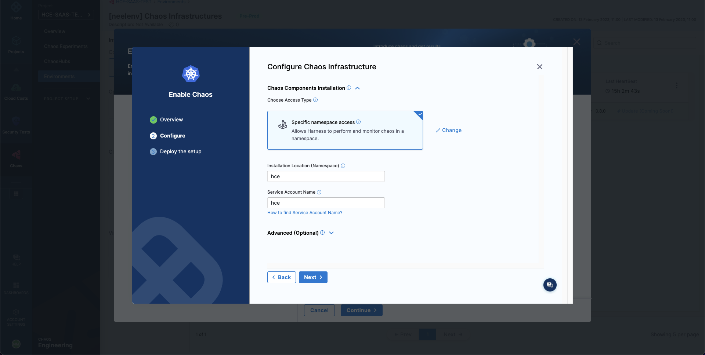
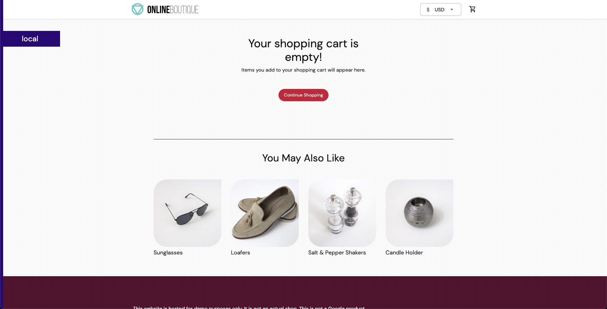

Welcome to Harness Chaos Engineering's **first tutorial** on running a **chaos experiment**. 

In this tutorial, you will utilize an already exisiting application or create a new one, and
1. Create environment, chaos infrastructure and enable chaos on the chaos infrastructure, 
2. Create a chaos experiment,
3. Run the chaos experiment on the application and observe the actions that take place to determine how resilient the application is, to unforeseen failures.   

[First Goal IMAGE](./static/chaos-exp-with-kube-cluster/first-goal.png)

## Prerequisites
1. Permissions to create a cluster (so that you can create the namespace, resources, etc.)
2. Invite/sign up to prod2/qa
3. ‘kubectl’ command-line tool
4. Access to create environment in the project
5. Access to create Chaos infrastructure

Let us get started!

## 1. Choose your target application
You can use an existing application of your choice or create a new boutique application.

### a. Choose an existing application

### b. Create a new boutique application
1. To create a new boutique application, create a new namespace to house your application. 
```
❯ kubectl create ns <namespace_name>
```

2. Execute the following commands to set up your boutique application inside the previously created namespace. 
```
❯ kubectl apply -f https://raw.githubusercontent.com/chaosnative/harness-chaos-demo/main/boutique-app-manifests/manifest/app.yaml -n <namespace_name>
```

```
deployment.apps/emailservice created
service/emailservice created
deployment.apps/checkoutservice created
service/checkoutservice created
deployment.apps/recommendationservice created
service/recommendationservice created
deployment.apps/frontend created
service/frontend created
service/frontend-external created
deployment.apps/paymentservice created
service/paymentservice created
deployment.apps/productcatalogservice created
service/productcatalogservice created
deployment.apps/cartservice created
service/cartservice created
deployment.apps/loadgenerator created
deployment.apps/currencyservice created
service/currencyservice created
deployment.apps/shippingservice created
service/shippingservice created
deployment.apps/redis-cart created
service/redis-cart created
deployment.apps/adservice created
service/adservice created
```

and

```
❯ kubectl apply -f https://raw.githubusercontent.com/chaosnative/harness-chaos-demo/main/boutique-app-manifests/manifest/monitoring.yaml -n <namespace_name>
```

```
serviceaccount/prometheus created
role.rbac.authorization.k8s.io/prometheus created
rolebinding.rbac.authorization.k8s.io/prometheus created
configmap/prometheus-alertrules created
configmap/prometheus-configmap created
deployment.apps/prometheus-deployment created
service/prometheus-k8s created
configmap/prometheus-blackbox-exporter created
deployment.apps/prometheus-blackbox-exporter created
service/prometheus-blackbox-exporter created
configmap/litmus-grafana-provisioner created
configmap/litmus-grafana-dashboards created
configmap/litmus-grafana-datasources created
deployment.apps/grafana created
service/grafana created
```

**Congratulations! You have created a fully functional boutique application with just two commands!**

3. Verify the services that were created inside this namespace.

```
❯ kubectl get svc -n <namespace_name>
```

```
NAME                           TYPE           CLUSTER-IP    EXTERNAL-IP     PORT(S)          AGE
adservice                      ClusterIP      10.8.23.48    <none>          9555/TCP         92s
cartservice                    ClusterIP      10.8.20.159   <none>          7070/TCP         103s
checkoutservice                ClusterIP      10.8.24.94    <none>          5050/TCP         118s
currencyservice                ClusterIP      10.8.25.254   <none>          7000/TCP         100s
emailservice                   ClusterIP      10.8.25.97    <none>          5000/TCP         2m
frontend                       ClusterIP      10.8.20.227   <none>          80/TCP           112s
frontend-external              LoadBalancer   10.8.23.231   35.222.109.9    80:31998/TCP     111s
grafana                        LoadBalancer   10.8.26.152   34.172.132.87   3000:31288/TCP   53s
paymentservice                 ClusterIP      10.8.29.181   <none>          50051/TCP        109s
productcatalogservice          ClusterIP      10.8.26.0     <none>          3550/TCP         106s
prometheus-blackbox-exporter   ClusterIP      10.8.27.165   <none>          9115/TCP         58s
prometheus-k8s                 LoadBalancer   10.8.21.255   34.135.243.43   9090:32030/TCP   61s
recommendationservice          ClusterIP      10.8.24.34    <none>          8080/TCP         115s
redis-cart                     ClusterIP      10.8.25.135   <none>          6379/TCP         94s
shippingservice                ClusterIP      10.8.28.118   <none>          50051/TCP        97s
```

## 2. Configure your chaos control plane

### a. Create an environment in the chaos center

1. Navigate to app.harness.io, and sign up or contact Harness support to receive an invite to a specific project which will be your playground. 

2. Go to ‘**Chaos**’, and select the project where you wish to run your first chaos experiment.


3. Click on ‘**New Environment**’ to create a new [chaos environment](https://developer.harness.io/docs/chaos-engineering/technical-reference/environments/).


4. Specify the name of the environment, and the type of environment (production or non-production environment). Click on ‘**Create**’. 

Specify Environment](./static/chaos-exp-with-kube-cluster/specify-env.png)

This creates a new chaos environment, and automatically lands you inside your chaos environment. Your next step is to create a new chaos infrastructure.

> **_Note:_** You can also use a previously created chaos infrastructure. (Explain more about this)

### Create a Chaos Infrastructure

1. A [chaos infrastructure](https://developer.harness.io/docs/chaos-engineering/technical-reference/chaos-infrastructures) is basically a Kubernetes infrastructure that provides the necessary resources to execute your chaos experiment.
To enable chaos on a new chaos infrastructure, click on ‘**Enable Chaos**’, and click on ‘**Continue**’.

Chaos Infrastructure](./static/chaos-exp-with-kube-cluster/chaos-infra.png)

2. Specify the ‘**Name**’ of the chaos infrastructure, and click on ‘**Next**’.

Chaos Infrastructure Name](./static/chaos-exp-with-kube-cluster/chaos-infra-name.png)

3. Specify other Parameters of the chaos infrastructure, such as the ‘**Installation mode**’, ‘**Chaos infrastructure namespace**’, and ‘**Service account name**’.

Chaos Infrastructure Specifications](./static/chaos-exp-with-kube-cluster/chaos-infra-specs.png)

4. Click on ‘**Next**’ to download the YAML file that contains information to create the chaos infrastructure with the options you previously chose. Download this YAML file, and copy the command. Click on ‘**Done**’.

Download YAML](./static/chaos-exp-with-kube-cluster/download-yaml.png)

5. To deploy the chaos infrastructure, execute the command you just copied on your terminal. Ensure you are in the folder where this YAML file is present or specify the location of the YAML file. This YAML file creates the necessary configuration and environment required to set up your application and chaos access pods.
```
❯ kubectl apply -f <file-name.yaml>
```

```
namespace/hce created
serviceaccount/hce created
deployment.apps/chaos-operator-ce created
deployment.apps/chaos-exporter created
service/chaos-exporter created
customresourcedefinition.apiextensions.k8s.io/clusterworkflowtemplates.argoproj.io created
customresourcedefinition.apiextensions.k8s.io/cronworkflows.argoproj.io created
customresourcedefinition.apiextensions.k8s.io/workflows.argoproj.io created
customresourcedefinition.apiextensions.k8s.io/workflowtemplates.argoproj.io created
customresourcedefinition.apiextensions.k8s.io/workflowtasksets.argoproj.io created
customresourcedefinition.apiextensions.k8s.io/workflowtaskresults.argoproj.io created
customresourcedefinition.apiextensions.k8s.io/chaosengines.litmuschaos.io created
customresourcedefinition.apiextensions.k8s.io/chaosexperiments.litmuschaos.io created
customresourcedefinition.apiextensions.k8s.io/chaosresults.litmuschaos.io created
configmap/workflow-controller-configmap created
service/workflow-controller-metrics created
deployment.apps/workflow-controller created
configmap/subscriber-config created
secret/subscriber-secret created
deployment.apps/subscriber created
serviceaccount/litmus-cluster-scope created
clusterrole.rbac.authorization.k8s.io/litmus-cluster-scope created
clusterrolebinding.rbac.authorization.k8s.io/litmus-cluster-scope created
serviceaccount/litmus-admin created
clusterrole.rbac.authorization.k8s.io/litmus-admin created
clusterrolebinding.rbac.authorization.k8s.io/litmus-admin created
serviceaccount/argo-chaos created
clusterrole.rbac.authorization.k8s.io/chaos-cluster-role created
clusterrolebinding.rbac.authorization.k8s.io/chaos-cluster-role-binding created
clusterrole.rbac.authorization.k8s.io/subscriber-cluster-role created
clusterrolebinding.rbac.authorization.k8s.io/subscriber-cluster-role-binding created
serviceaccount/argo created
clusterrole.rbac.authorization.k8s.io/argo-cluster-role created
clusterrolebinding.rbac.authorization.k8s.io/argo-binding created
```

Once all the resources are created, your chaos infrastructure shows **`Connected`**. This indicates that your cluster is successfully connected to your chaos infrastructure. This may take about 2 to 4 minutes to connect.

Enable Chaos](./static/chaos-exp-with-kube-cluster/enable-chaos.png)

**Congratulations! You just completed the first major step in running your own chaos experiment, which is creating and deploying a chaos infrastructure. The second and third prominent steps include creating your chaos experiment, and introducing chaos fault inside the application, respectively.**

## 3. Create your Chaos Experiment

### Create a New Experiment
1. To create a new chaos experiment and inject chaos, navigate to your chaos access center, and click on '**Chaos Experiments**'. Now click on ‘**New experiment**’.

New Experiment Infrastructure](./static/chaos-exp-with-kube-cluster/new-experiment.png)

2. Specify the parameters of the chaos experiment, such as a '**name**', and '**chaos infrastructure**' (that you have previously created).

Select Infrastructure](./static/chaos-exp-with-kube-cluster/select-infra.png)

### Apply the Chaos Infrastructure

3. Click on ‘**Apply**’ to apply the selected chaos infrastructure to that experiment, and click on ‘**Next**’.

Apply Infrastructure](./static/chaos-exp-with-kube-cluster/apply-infra.png)

4. Select the template for the experiment. To build an experiment, select '**Templates from ChaosHubs**'.

Select Template](./static/chaos-exp-with-kube-cluster/select-template.png)

5. Select the '**Boutique cart delete**’ option, and click on '**Use this template**'.

Use Template](./static/chaos-exp-with-kube-cluster/use-template.png)

6. Select the chaos fault that you wish to implement.

Select Fault](./static/chaos-exp-with-kube-cluster/select-fault.png)

7. Specify parameters in the ‘**Target application**’ field, such as ‘**Namespace**’, ‘**Kind**’, and ‘**Label**’.

Specify Parameters](./static/chaos-exp-with-kube-cluster/specify-parameters.png)

### Set Fault Weights

8. Click on '**Set fault weights**' on the screen.

Set Weights](./static/chaos-exp-with-kube-cluster/set-weights.png)

### Save the Experiment

9. On the top right corner of your screen, click on '**Save**'. This saves the experiment that you built.

Save Experiment](./static/chaos-exp-with-kube-cluster/save-experiment.png)

## 4. Run and analyze your chaos experiment

### Run the Experiment

Click on the '**Run**' button present at the top right corner, to run the experiment. This experiment runs for about 3 to 5 minutes during which it determines the **resilience score**.

Run Experiment](./static/chaos-exp-with-kube-cluster/run-experiment.png)

### View Experiment Results

You can view the details of the experiment by clicking on '**Summary**'.

Details of Experiment](./static/chaos-exp-with-kube-cluster/exp-details.png)

### View Chaos Results on Grafana Dashboard

#### You can see the results of injecting chaos into the target application on the Grafana dashboard.

After Chaos](./static/chaos-exp-with-kube-cluster/after-chaos.png)
After Chaos](./static/chaos-exp-with-kube-cluster/after-chaos-2.png)
After Chaos](./static/chaos-exp-with-kube-cluster/after-chaos-3.png)

### View Boutique and its Grafana Dashboards

Access the '**external-ip**' of the '**frontend-external**' service. In our case, it is http://35.222.109.9/. Don't forget to explore the boutique and add your favourite products into the cart, and checkout!

View Boutique](./static/chaos-exp-with-kube-cluster/view-boutique.png)

### Access Grafana Dashboard of the Boutique Application

Login to Grafana
You can login to Grafana by accessing the '**external-ip**' of **grafana**' service. In our case, it is http://34.172.132.87:3000. Specify the 'username' as 'admin', and 'password' as 'admin'.

Grafana Login](./static/chaos-exp-with-kube-cluster/grafana-login.png)

### View the Boutique Dashboard

You can click on '**Boutique App Dashboard**' to view the Grafana dashboard.

Boutique Dashboard](./static/chaos-exp-with-kube-cluster/dashboard.png)

### Visuals before Chaos is Injected

Below is the visualization before chaos is injected into the application. 

Results](./static/chaos-exp-with-kube-cluster/result.png)


The next step in this tutorial is to configure the chaos control plane, i.e, 
1. Create a chaos environment, a chaos infrastructure; and 
2. Deploy this infrastructure.

## Troubleshooting

# Access Harness Chaos Engineering

 To access HCE, log in to app.harness.io, and click the **Chaos** tab.

## Create a Project

Create a project or ask your administrator to add you to an existing project. 

To create a project, do the following:
1. In Harness, go to **Home** and click **Projects**.
2. Click **+Project**.
3. Enter a name for the project and select a color. The project ID, which is immutable for the life of the project, is generated automatically, and enables you to change the name of the project.
4. In **Organization**, select an organization. If you did not create an organization, select the default organization.
5. Optionally, add a description and tags, and then click **Save** and **Continue**.
6. If you are collaborating with other team members on your chaos experiment, in **Invite Collaborators**, type a member's name and select it.
7. Select a role for the member, and click **Add**.
8. Click **Save** and **Continue** to create the project.

If your administrator has added you to a project, you can go to the Chaos tab and select the project from the **Project** menu.


## Add the chaos infrastructure

Adding the target infrastructure resources enables Harness to access those resources. However, we must first create an environment to which to add those resources. 

To create an environment, go to **Environments** in the sidebar menu, and choose a **New Environment**. Add environment name, and optionally a description and tags. Select the environment type, **Production** or **Non-Production**. Finally, click on **Create** to add the new environment.


Once the environment is added, we can add different kinds of infrastructure to it. Here, we will add a Kubernetes infrastructure so that we can inject Kubernetes resource faults. Choose **New Chaos Infrastructure**.


Select **On New Infrastructures** and select **Continue**. Add a name to your chaos infrastructure and optionally a description and tags. Select **Next**.

After that, choose the mode of installation for Harness delegate. As a quick primer, Harness delegate is a remote agent for accessing your Kubernetes cluster resources and injecting faults into them as part of a chaos experiment. The **Cluster Wide** installation mode allows you to target resources across all the namespaces in your cluster while **Namespace Mode** installation restricts chaos injection to only the namespace in which the delegate will be installed. Choose **Namespace mode** installation mode. By default, the delegate will install in the **litmus** namespace, but you can change it. Then, select **Done**.



Lastly, provided that you have access to your Kubernetes cluster via [kubectl](https://kubernetes.io/docs/reference/kubectl/), deploy your chaos infrastructure by executing the given commands, then downloading and applying the given manifest using your terminal. Once done, choose **Next**.


It will take a while for the delegate to setup in the k8s cluster. Eventually all the pods in the `litmus` namespace should be in a running state, which you can optionally validate using the following command:
```bash
❯ kubectl get pods -n litmus
```

Otherwise, head to the created environment and as soon as the delegate is ready, the connection status should get reflected as `CONNECTED`.


## Creating Demo Application and Observability Infrastructure

Now we are all ready to target our Kubernetes resources. In this quick start document, we will be executing one of the most popular and simplest fault, **Pod Delete**. It simply deletes the pods of a deployment, statefulset, daemonset, etc. to validate the resiliency of a microservice application. 

You can use your own application as a target, however, we will use the [Online Boutique](https://github.com/GoogleCloudPlatform/microservices-demo) microservices demo application as the target.

Before we setup our chaos experiment, let us install the target application. Run the following commands to setup the target application microservices and observability infrastructure, including, Grafana, Prometheus and a BlackBox exporter. Installation of the observability infrastructure is optional as it doesn't have any role in executing the experiment, however, it will provide us with a dashboard which will help us validate the health of the constituent application microservices in real time.
```bash
❯ kubectl apply -f https://raw.githubusercontent.com/Adarshkumar14/boutique-app-monitoring/main/manifest/app.yaml -n litmus

❯ kubectl apply -f https://raw.githubusercontent.com/Adarshkumar14/boutique-app-monitoring/main/manifest/monitoring.yaml -n litmus
```

We are deploying these resources in the existing `litmus` namespace, since we had specified the Namespace mode of installation.

Eventually, we will have all the target application and observability infrastructure pods available in the `litmus` namespace:
```
❯ kubectl get pods -n litmus

NAME                                           READY   STATUS    RESTARTS        AGE
adservice-68db567bb5-hd47j                     1/1     Running   0               5m39s
cartservice-6b8f46f64f-6mrkv                   1/1     Running   0               5m39s
chaos-exporter-765d6b6674-tkrpm                1/1     Running   0               11m
chaos-operator-ce-678b67c75-l68m5              1/1     Running   0               11m
checkoutservice-7545ff6849-rdl9f               1/1     Running   0               5m40s
currencyservice-5769b647d5-trx69               1/1     Running   0               5m39s
emailservice-55c84dcfdc-c9x9q                  1/1     Running   0               5m40s
frontend-74b7898dd9-x4bzr                      1/1     Running   0               5m40s
grafana-6f6fb469b7-bm9vh                       1/1     Running   0               5m34s
loadgenerator-5b875b84dd-pcjdr                 1/1     Running   0               5m39s
paymentservice-59d87f77bc-fkwjq                1/1     Running   0               5m40s
productcatalogservice-676d7d7dbc-nx75x         1/1     Running   0               5m40s
prometheus-blackbox-exporter-6d955c876-l7fdv   2/2     Running   0               5m34s
prometheus-deployment-779b88bf5d-zf8f9         1/1     Running   0               5m34s
recommendationservice-6fc8b4d9cf-4s96t         1/1     Running   0               5m40s
redis-cart-7cd9d8966d-mgbhx                    1/1     Running   0               5m39s
shippingservice-7b4945b5fc-cbmc9               1/1     Running   0               5m39s
subscriber-7774bd95d4-4rnwp                    1/1     Running   0               11m
workflow-controller-6d5d75dc7c-v9vqc           1/1     Running   0               11m
```

You can list the services available in the `litmus` namespace as following:
```
❯ kubectl get services -n litmus

NAME                           TYPE           CLUSTER-IP       EXTERNAL-IP   PORT(S)          AGE
adservice                      ClusterIP      10.110.145.128   <none>        9555/TCP         9m48s
cartservice                    ClusterIP      10.103.73.107    <none>        7070/TCP         9m49s
chaos-exporter                 ClusterIP      10.103.163.182   <none>        8080/TCP         15m
checkoutservice                ClusterIP      10.105.52.42     <none>        5050/TCP         9m49s
currencyservice                ClusterIP      10.108.12.130    <none>        7000/TCP         9m49s
emailservice                   ClusterIP      10.106.79.95     <none>        5000/TCP         9m49s
frontend                       ClusterIP      10.98.222.239    <none>        80/TCP           9m49s
frontend-external              LoadBalancer   10.101.239.201   localhost     80:30963/TCP     9m49s
grafana                        LoadBalancer   10.96.206.174    localhost     3000:32659/TCP   9m43s
paymentservice                 ClusterIP      10.106.36.71     <none>        50051/TCP        9m49s
productcatalogservice          ClusterIP      10.97.78.9       <none>        3550/TCP         9m49s
prometheus-blackbox-exporter   ClusterIP      10.103.118.20    <none>        9115/TCP         9m43s
prometheus-k8s                 LoadBalancer   10.106.153.10    localhost     9090:32101/TCP   9m43s
recommendationservice          ClusterIP      10.106.227.47    <none>        8080/TCP         9m49s
redis-cart                     ClusterIP      10.103.184.94    <none>        6379/TCP         9m48s
shippingservice                ClusterIP      10.109.150.169   <none>        50051/TCP        9m48s
workflow-controller-metrics    ClusterIP      10.106.97.173    <none>        9090/TCP         15m
```

To access the target application frontend in your browser, use the `frontend-external` LoadBalancer service.


Similarly you can access the Grafana dashboard, login with the default credentials username `admin` and password `admin`, and browse the Online Boutique application dashboard. Currently, all the metrics are indicating normal application behavior.


## Constructing a Chaos Experiment

With our target application deployed, we can now create a chaos experiment. We will be targeting the pods of the carts microservice with the Pod Delete fault. Right now, the cart page is healthy and accessible in the frontend, as seen at the `/cart` route.



To create the chaos experiment, go to **Chaos Experiments** in the sidebar menu and choose **New Experiment**. Then, add the experiment name and optionally a description and tags. Then, choose the target infrastructure, which we created previously. Choose **Next**. In the Experiment Builder, choose **Blank Canvas** and select **Start with blank canvas**.

Chaos Studio./static/first-chaos/chaos-studio.png

The Chaos Studio helps you to construct varied chaos experiments involving different kinds of chaos probes, faults and custom action steps. Let us use it to define our Pod Delete fault. Choose **Add**. From the **Enterprise Chaos Hub** select Pod Delete fault under the Kubernetes category.

Pod Delete Fault ./static/first-chaos/pod-delete-fault.png

Specify the target application namespace, type and label. We will be targeting the carts microservice and hence we will provide the appropriate `litmus` namespace and the `app=cartservice` label which corresponds to the cart microservice. HCE helps you to search for these entities from within the studio.

Specify Target Application](./static/first-chaos/specify-target-application.png)

Then, choose the **Tune Fault** tab to configure the fault parameters. Here, we have defined the fault execution duration to be 30 seconds, with an interval of 10 seconds so that in every 10 seconds we will be deleting the nginx deployment pods. Lastly we have specified the pod affected percentage to be 50% so that half of all the deployment pods and at minimum one pod will be deleted in each iteration of chaos.

Tune Fault](./static/first-chaos/tune-fault.png)

Lastly, choose the **Probes** tab. Here, we have a default application health-check probe defined which validates the target application health before and after the fault injection to ensure that the application is unharmed due to the experiment. Let us add one more probe so that we can validate the carts microservice health. Select **Deploy new Probe**, ensure that the probe type is `HTTP Probe`, select **Continue** and then again select **Continue**. Now, we need to provide the HTTP probe URL so that Litmus can make GET requests at that URL and check if the status code in response is 200 for the successful validation of the probe. Provide the URL `http://cartservice.litmus.svc.cluster.local:7070`, which is the URL for the service that exposes the carts microservice. Also, reduce the response timeout to 5 seconds. Then, select **Setup the Probe**.

HTTP Probe](./static/first-chaos/http-probe.png)

When done, simply close the overlay modal. We have added the Pod Delete fault now.

In the last step, choose the **Set Fault Weight** tab. Here, we can observe that the default weight for the fault is 10, which we can use for calculating the resiliency score for the experiment run. 

Set Fault Weight](./static/first-chaos/set-fault-weight.png)

## Observing Chaos Execution and Evaluating the Run

When ready, start the experiment execution by selecting **Run** on the top right corner of the screen. You'll be able to observe the experiment added to the list of chaos experiments and it should be in a `Running` status. Choose **Current Execution** to get a detailed view.

Experiment Executing](./static/first-chaos/experiment-executing.png)

Once the fault is running, we can check for the detailed view of the experiment. We can follow the logs of the experiment run as it gets executed. 

Detailed Chaos Execution](./static/first-chaos/detailed-chaos-execution.png)

At the same time, we can also check for the status of the cart deployment pod. Upon executing the following command you will get a similar output. It is evident that the Pod Delete fault has caused the cart pod to be terminated and a new pod has recently replaced it, for whose container is yet to be created.

```bash
❯ k get pods -n litmus

NAME                                           READY   STATUS    RESTARTS       AGE
adservice-68db567bb5-hd47j                     1/1     Running   0              5h41m
cartservice-6b8f46f64f-lkgs8                   0/1     Running   0              29s
chaos-exporter-765d6b6674-tkrpm                1/1     Running   0              5h41m
chaos-operator-ce-678b67c75-l68m5              1/1     Running   0              5h41m
checkoutservice-7545ff6849-rdl9f               1/1     Running   0              5h41m
currencyservice-5769b647d5-trx69               1/1     Running   0              5h41m
emailservice-55c84dcfdc-c9x9q                  1/1     Running   0              5h41m
frontend-74b7898dd9-x4bzr                      1/1     Running   0              5h41m
grafana-6f6fb469b7-bm9vh                       1/1     Running   0              5h41m
loadgenerator-5b875b84dd-pcjdr                 1/1     Running   0              5h41m
paymentservice-59d87f77bc-fkwjq                1/1     Running   0              5h41m
productcatalogservice-676d7d7dbc-nx75x         1/1     Running   0              5h41m
prometheus-blackbox-exporter-6d955c876-l7fdv   2/2     Running   0              5h41m
prometheus-deployment-779b88bf5d-zf8f9         1/1     Running   0              5h41m
recommendationservice-6fc8b4d9cf-4s96t         1/1     Running   0              5h41m
redis-cart-7cd9d8966d-mgbhx                    1/1     Running   0              5h41m
shippingservice-7b4945b5fc-cbmc9               1/1     Running   0              5h41m
subscriber-7774bd95d4-4rnwp                    1/1     Running   0              5h41m
workflow-controller-6d5d75dc7c-v9vqc           1/1     Running   0              5h41m
```

Consequently, if we try to access the frontend cart page, we get the following error which indicates that the application is now unreachable. This makes sense since the cart pod has been deleted and a new pod is yet to initialize:
Webpage Unavailable](./static/first-chaos/webpage-unavailable.png)

We can validate this behavior using the application metrics dashboard as well. The probe success percentage for website availability (200 response code) is now steeply decreasing along with the 99th percentile (green line) queries per second (QPS) and access duration for the application microservices. Also, the mean QPS (yellow line) is steeply increasing. This is because there's no pod available right now to service the query requests.

Application Down Dashboard](./static/first-chaos/application-down-dashboard.png)

When the experiment execution concludes, we get a resiliency score of 50%. We can also observe that the Pod Delete fault step has failed.

Experiment Failed](./static/first-chaos/experiment-failed.png)

Before we analyze the experiment result, we can validate that the application is now again normally accessible, without any errors. This can also be validated from the Grafana dashboard where we can observe the metrics to slowly normalize as the chaos duration is now over.

App Metrics Normalizing](./static/first-chaos/app-metrics-normalizing.png)

We can now check the check the chaos result, where it can be observed that the fault verdict is **Failed** and the Probe Success Percentage is 50%. This is because although the default probe execution in Edge mode validated the target application to be healthy before and after the chaos, the cart service URL HTTP probe has failed. The failure of this probe can be attributed to the unavailability of the cart pod due to the injection of the Pod Delete fault.  

Experiment Result Failed](./static/first-chaos/experiment-result-failed.png)

We can also check the Chaos Results tab to get a summary of the experiment execution, where the fail step can be observed to be "Probe execution result didn't met the passing criteria", referring the the failure of HTTP probe that we had defined.

Result Fail Step](./static/first-chaos/result-fail-step.png)

With that, we have successfully run our first chaos experiment! If you're wondering that how we can remediate our application so that it passes the experiment run and probe checks, it's as simple as bumping up the experiment pods to at least two, such that at least one deployment pod survives the Pod Delete fault and help the application stay afloat. Do try to run it on your own now!
