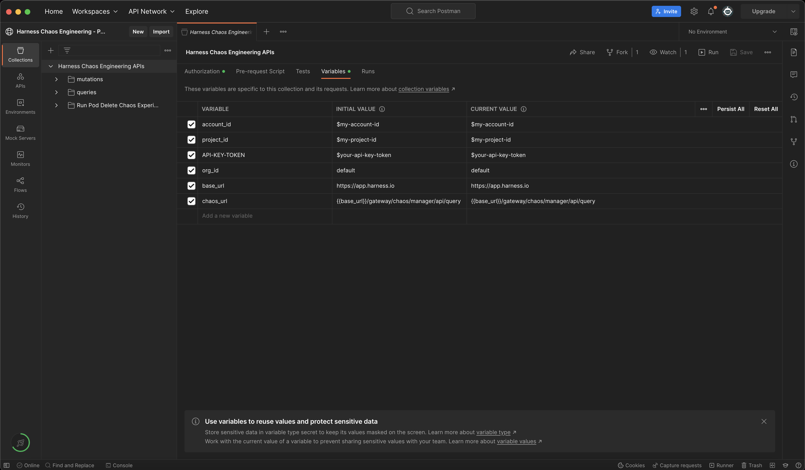
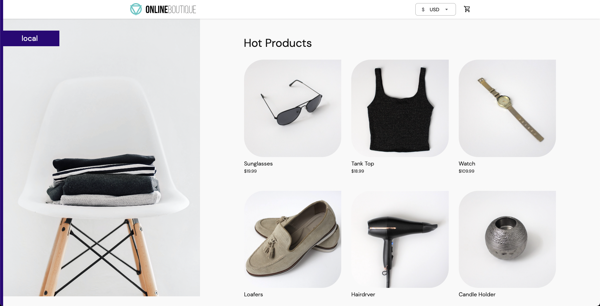
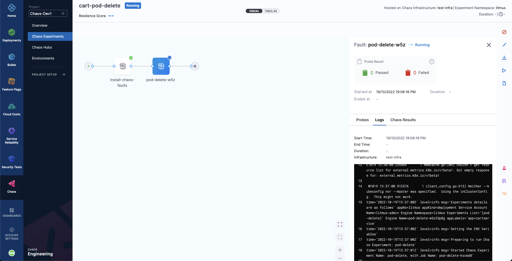
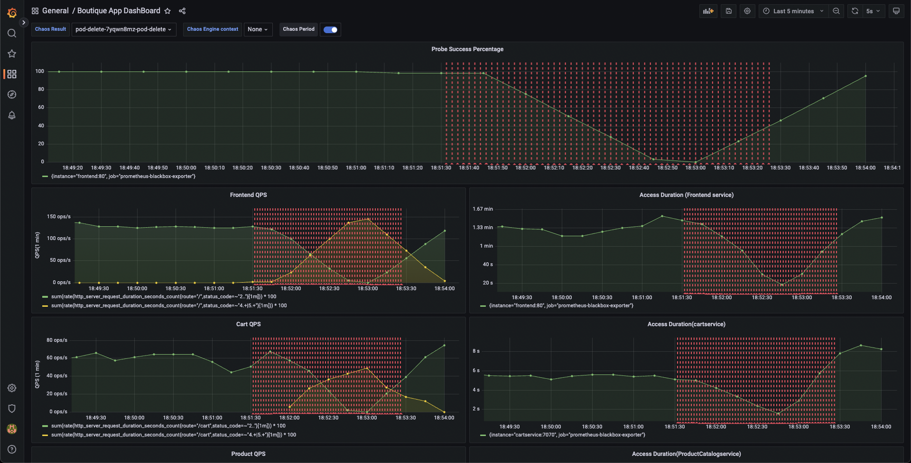

Welcome to Harness Chaos Engineering's tutorial on running a chaos experiment via Chaos APIs. In this tutorial you'll be running a Chaos Experiment on Kubernetes for the first time via Chaos APIs!
You can access the Harness API doc here https://apidocs.harness.io/ . We will make use of publicly available [Harness CE Postman collection](https://elements.getpostman.com/redirect?entityId=25469526-59b35825-6240-4b45-9974-6bb869741318&entityType=collection) to explain the Chaos APIs used in this tutorial!

## What is Chaos Engineering?
Cloud Native applications are, by definition, highly distributed, elastic, resistant to failure and loosely coupled. That's easy to say, and even diagram. But how do we validate that our applications will perform as expected under different failure conditions?
Enter Chaos Engineering!

Chaos Engineering is the discipline of experimenting on a software system in order to build confidence in the system's capability to withstand turbulent and unexpected conditions. Chaos Engineering is a great tool to help us find weaknesses and misconfiguration in our services. It is relevant for all types of systems (including the so called legacy applications and infrastructure), and particularly important for Cloud Native applications, which, due to their distributed and elastic nature, inherently carry multiple points of failure.

The standard chaos experimentation flow involves identifying the steady state of the system/application under test, hypothesizing around the impact a particular fault or failure would cause, injecting this fault in a controlled manner (with a pre-determined and often minimal "blast radius"), validating whether the hypothesis is proven and taking appropriate action in case if it is not, i.e., a weakness is found.


Harness Chaos Engineering (HCE) helps simplify the chaos engineering practices for your organization. To get started, create a new project or ask your administrator to add you to an existing project. Now, you can access the **Chaos** tab, where an overview of all the experiment runs can be observed.


## Prerequisites for running your first Chaos experiment via APIs

Listed below are the required inputs and how to access (or generate) them. We will refer these variables in the API requests explained in this tutorial -

1. **url**
This is the Harness CE server URL serving the Chaos API requests. You can find this URL in the Chaos API doc(`top right`).
For instance, https://app.harness.io/gateway/chaos/manager/api/query is the Harness CE server URL for production environment.
If you are using [Chaos postman collection](https://elements.getpostman.com/redirect?entityId=25469526-59b35825-6240-4b45-9974-6bb869741318&entityType=collection), this value will be pre-filled in 2 postman variables like below:
```
base_url - https://app.harness.io
chaos_url - {{base_url}}/gateway/chaos/manager/api/query
```

2. **account_id**
This is your Harness account Id. Please use the account where you would like to run Chaos experiments.

You can retrieve your account Id by following the below steps:
1. Go to `ACCOUNT SETTINGS` in [Harness](https://app.harness.io/).
2. Click on `Overview`.
3. Copy the value of `Account Id`.

3. **project_id**
This is your Harness project Id. Please use the project where you would like to run Chaos experiments.

You can retrieve your project Id by following the below steps:
1. Go to `Projects` in [Harness](https://app.harness.io/).
2. Select the project where you would like to run the Chaos experiments or create a new project.
3. Click on `Overview`.
4. Copy the value of `Id`.
5. Please make sure to copy the value of `Organization` as well, this will be the value of next required variable `org_id`.


4. **org_id**
This is your Harness organization Id. Please use the organization where you would like to run Chaos experiments.

You can retrieve your organization Id by following the below steps:
**See above step to retrieve project_id - you would have copied the value of org_id as well in that step, if not please follow the same steps again to retrieve organization Id**

5. **API-KEY-TOKEN**

You can use an existing Harness API key token of the same Harness account selected in above steps or you can create a new one by following the below steps:
1. Click on `MY PROFILE` in [Harness](https://app.harness.io/).
2. Go to `My API Keys` section and click on `+ API Key` button to create a new API Key.
3. Enter a `Name` for the API Key(optional Description/Tags) and click on `Save`.
4. Under the newly created API Key, click on `+ Token` button to generate a new token for this API Key.
5. Enter the `Name` and select the `Expiration`(time for which this token will be valid) and click on `Generate Token`.
6. Please make sure to copy the value of the token generated and store somewhere safe, you may not be able to copy this later.

## Variables In Harness CE Postman Collection
In order to work with Harness CE Postman Collection, please fork it under your own Postman account and update the required variables in order to work with Harness CE Postman Collection.


## Authorization Header For API Request
An authorization header with API-KEY-TOKEN value retrieved above is required to work with Chaos APIs i.e., 
```
x-api-key: $API-KEY-TOKEN
```


## Add a Chaos Infrastructure

Next, we can create/register a chaos infrastructure. Here, we will add a Kubernetes infrastructure so that we can inject Kubernetes resource faults. 

Add a name to your chaos infrastructure and optionally a description and tags.
After that, choose the mode of installation for Harness delegate. As a quick primer, Harness delegate is a remote agent for accessing your Kubernetes cluster resources and injecting faults into them as part of a chaos experiment. The **Cluster Wide** installation mode allows you to target resources across all the namespaces in your cluster while **Namespace Mode** installation restricts chaos injection to only the namespace in which the delegate will be installed.
In this tutorial, the delegate will be installed in the **hce** namespace with **Cluster Wide** mode, but you can change it.

A sample GraphQL Query and GraphQL Variables to register/create a Chaos Infrastructure -

GraphQL Query - `registerInfra`
```
mutation($identifiers: IdentifiersRequest!, $request: RegisterInfraRequest!) {
  registerInfra(identifiers: $identifiers, request: $request) {
    token
    infraID
    name
    manifest
  }
}
```

GraphQL Variables - `registerInfra`
```
{
  "identifiers": {
    "orgIdentifier": "{{org_id}}",
    "accountIdentifier": "{{account_id}}",
    "projectIdentifier": "{{project_id}}"
  },
  "request": {
    "name": "my-test-chaos-infra",
    "environmentID": "my-test-chaos-env",
    "description": "Test Chaos Environment",
    "platformName": "my-test-platform",
    "infraNamespace": "hce",
    "serviceAccount": "hce",
    "infraScope": "cluster",
    "infraNsExists": false,
    "infraSaExists": false,
    "installationType": "MANIFEST",
    "skipSsl": false
  }
}
```

Above values are pre-filled in Harness CE Postman Collection as shown in below screenshot:


A sample response - `registerInfra`
```
{
  "data": {
    "registerInfra": {
      "token": "abc123",
      "infraID": "abc123",
      "name": "abc123",
      "manifest": "abc123"
    }
  }
}
```
Please make sure to note down the value of field `token` and `infraID` from response, these values will be used in subsequent API calls.

Once above request is executed, retrieve the infrastructure manifest by forming URL as shown below:
```
$chaos_server_url/file/$token.yaml
``` 
where `$chaos_server_url` would be `https://app.harness.io/gateway/chaos/manager/api/`
and `$token` is the token value retrieved in response of `registerInfra` API call as shown in sample response above.
An example URL to retrieve infrastructure manifest could look like 
```
https://app.harness.io/gateway/chaos/manager/api/file/token-abc.yaml
```
, copy and save the yaml in a machine where kubectl is installed and has access to your k8s cluster in some file named `infra.yaml`.

Lastly, provided that you have access to your Kubernetes cluster via [kubectl](https://kubernetes.io/docs/reference/kubectl/), deploy your chaos infrastructure by executing the below commands -
```
kubectl apply -f infra.yaml
```

It will take a while for the delegate to setup in the k8s cluster. Meanwhile, if you want to check the status of your infra, please use the API `GetInfraDetails` as explained below.


## Check the status of your Chaos Infrastructure

You can make use of query `getInfraDetails` to retrieve the details of your newly registered infrastructure.

A sample GraphQL Query and GraphQL Variables to retrieve details of a Chaos Infrastructure -

GraphQL Query - `getInfraDetails`
```
query GetInfraDetails(
  $infraID: String!,
  $identifiers: IdentifiersRequest!
) {
  getInfraDetails(
    infraID: $infraID,
    identifiers: $identifiers
  ) {
    infraID
    name
    description
    tags
    environmentID
    platformName
    isActive
    isInfraConfirmed
    isRemoved
    updatedAt
    createdAt
    noOfSchedules
    noOfWorkflows
    token
    infraNamespace
    serviceAccount
    infraScope
    infraNsExists
    infraSaExists
    installationType
    k8sConnectorID
    lastWorkflowTimestamp
    startTime
    version
    createdBy {
      userID
      username
      email
    }
    updatedBy {
      userID
      username
      email
    }
  }
}
```

GraphQL Variables - `getInfraDetails`
```
{
  "identifiers": {
    "orgIdentifier": "{{org_id}}",
    "accountIdentifier": "{{account_id}}",
    "projectIdentifier": "{{project_id}}"
  },
  "infraID": "{{your-infra-ID}}"
}
```
**NOTE:** Please make sure to update the value of field `infraID` retrieved during `registerInfra` API call.

A sample response - `getInfraDetails`
```
{
  "data": {
    "getInfraDetails": {
      "infraID": "4",
      "name": "xyz789",
      "description": "xyz789",
      "tags": ["xyz789"],
      "environmentID": "xyz789",
      "platformName": "xyz789",
      "isActive": true,
      "isInfraConfirmed": true,
      "isRemoved": true,
      "updatedAt": "xyz789",
      "createdAt": "xyz789",
      "noOfSchedules": 123,
      "noOfWorkflows": 123,
      "token": "abc123",
      "infraNamespace": "xyz789",
      "serviceAccount": "abc123",
      "infraScope": "xyz789",
      "infraNsExists": false,
      "infraSaExists": false,
      "installationType": "CONNECTOR",
      "k8sConnectorID": "xyz789",
      "lastWorkflowTimestamp": "xyz789",
      "startTime": "abc123",
      "version": "abc123",
      "createdBy": UserDetails,
      "updatedBy": UserDetails
    }
  }
}
```
Please make sure to check the value of field `isActive`, it should be `true` i.e., the infrastructure should be in `active` state prior to moving forward.

Above values are pre-filled in Harness CE Postman Collection as shown in below screenshot:

In order to run this API using Harness CE Postman Collection, you just need to update the value of variable `infraID` retrieved during `registerInfra` API call.

## Creating Demo Application and Observability Infrastructure

Now we are all ready to target our Kubernetes resources. In this quick start document, we will be executing one of the most popular and simplest fault, **Pod Delete**. It simply deletes the pods of a deployment, statefulset, daemonset, etc. to validate the resiliency of a microservice application. 

You can use your own application as a target, however, we will use the [Online Boutique](https://github.com/GoogleCloudPlatform/microservices-demo) microservices demo application as the target.

Before we setup our chaos experiment, let us install the target application. Run the following commands to setup the target application microservices and observability infrastructure, including, Grafana, Prometheus and a BlackBox exporter. Installation of the observability infrastructure is optional as it doesn't have any role in executing the experiment, however, it will provide us with a dashboard which will help us validate the health of the constituent application microservices in real time.
```bash
❯ kubectl apply -f https://raw.githubusercontent.com/chaosnative/harness-chaos-demo/main/boutique-app-manifests/manifest/app.yaml -n hce

❯ kubectl apply -f https://raw.githubusercontent.com/chaosnative/harness-chaos-demo/main/boutique-app-manifests/manifest/monitoring.yaml -n hce
```

We are deploying these resources in the existing `hce` namespace.

Eventually, we will have all the target application and observability infrastructure pods available in the `hce` namespace:
```
❯ kubectl get pods -n hce

NAME                                           READY   STATUS    RESTARTS        AGE
adservice-68db567bb5-hd47j                     1/1     Running   0               5m39s
cartservice-6b8f46f64f-6mrkv                   1/1     Running   0               5m39s
chaos-exporter-765d6b6674-tkrpm                1/1     Running   0               11m
chaos-operator-ce-678b67c75-l68m5              1/1     Running   0               11m
checkoutservice-7545ff6849-rdl9f               1/1     Running   0               5m40s
currencyservice-5769b647d5-trx69               1/1     Running   0               5m39s
emailservice-55c84dcfdc-c9x9q                  1/1     Running   0               5m40s
frontend-74b7898dd9-x4bzr                      1/1     Running   0               5m40s
grafana-6f6fb469b7-bm9vh                       1/1     Running   0               5m34s
loadgenerator-5b875b84dd-pcjdr                 1/1     Running   0               5m39s
paymentservice-59d87f77bc-fkwjq                1/1     Running   0               5m40s
productcatalogservice-676d7d7dbc-nx75x         1/1     Running   0               5m40s
prometheus-blackbox-exporter-6d955c876-l7fdv   2/2     Running   0               5m34s
prometheus-deployment-779b88bf5d-zf8f9         1/1     Running   0               5m34s
recommendationservice-6fc8b4d9cf-4s96t         1/1     Running   0               5m40s
redis-cart-7cd9d8966d-mgbhx                    1/1     Running   0               5m39s
shippingservice-7b4945b5fc-cbmc9               1/1     Running   0               5m39s
subscriber-7774bd95d4-4rnwp                    1/1     Running   0               11m
workflow-controller-6d5d75dc7c-v9vqc           1/1     Running   0               11m
```

You can list the services available in the `hce` namespace as following:
```
❯ kubectl get services -n hce

NAME                           TYPE           CLUSTER-IP       EXTERNAL-IP   PORT(S)          AGE
adservice                      ClusterIP      10.110.145.128   <none>        9555/TCP         9m48s
cartservice                    ClusterIP      10.103.73.107    <none>        7070/TCP         9m49s
chaos-exporter                 ClusterIP      10.103.163.182   <none>        8080/TCP         15m
checkoutservice                ClusterIP      10.105.52.42     <none>        5050/TCP         9m49s
currencyservice                ClusterIP      10.108.12.130    <none>        7000/TCP         9m49s
emailservice                   ClusterIP      10.106.79.95     <none>        5000/TCP         9m49s
frontend                       ClusterIP      10.98.222.239    <none>        80/TCP           9m49s
frontend-external              LoadBalancer   10.101.239.201   localhost     80:30963/TCP     9m49s
grafana                        LoadBalancer   10.96.206.174    localhost     3000:32659/TCP   9m43s
paymentservice                 ClusterIP      10.106.36.71     <none>        50051/TCP        9m49s
productcatalogservice          ClusterIP      10.97.78.9       <none>        3550/TCP         9m49s
prometheus-blackbox-exporter   ClusterIP      10.103.118.20    <none>        9115/TCP         9m43s
prometheus-k8s                 LoadBalancer   10.106.153.10    localhost     9090:32101/TCP   9m43s
recommendationservice          ClusterIP      10.106.227.47    <none>        8080/TCP         9m49s
redis-cart                     ClusterIP      10.103.184.94    <none>        6379/TCP         9m48s
shippingservice                ClusterIP      10.109.150.169   <none>        50051/TCP        9m48s
workflow-controller-metrics    ClusterIP      10.106.97.173    <none>        9090/TCP         15m
```

To access the target application frontend in your browser, use the `frontend-external` LoadBalancer service.



Similarly you can access the Grafana dashboard, login with the default credentials username `admin` and password `admin`, and browse the Online Boutique application dashboard. Currently, all the metrics are indicating normal application behavior.


## Constructing a Chaos Experiment

With our target application deployed, we can now create a chaos experiment. We will be targeting the pods of the carts microservice with the Pod Delete fault. Right now, the cart page is healthy and accessible in the frontend, as seen at the `/cart` route.


To create the chaos experiment, Add the experiment name and optionally a description and tags. Then, Add the target infrastructure id, which we created previously.

This will allow us to create our chaos experiment with a pod-delete fault configured to target the Online Boutique application.

We will make use of `createChaosWorkFlow` API to create the above chaos experiment!

GraphQL Query - `createChaosWorkFlow`
```
mutation CreateChaosWorkFlow(
  $request: ChaosWorkFlowRequest!
  $identifiers: IdentifiersRequest!
) {
  createChaosWorkFlow(request: $request, identifiers: $identifiers) {
    workflowID
    cronSyntax
    workflowName
    workflowDescription
    isCustomWorkflow
    tags
  }
}
```

GraphQL Variables - `createChaosWorkFlow`
```
{
   "identifiers": {
    "orgIdentifier": "{{org_id}}",	
    "accountIdentifier": "{{account_id}}",
    "projectIdentifier": "{{project_id}}"
  },
  "request": {
    "workflowManifest": "$your-new-workflow-manifest",
    "cronSyntax": "",
    "workflowName": "my-pod-delete-experiment",
    "workflowDescription": "This is a cartservice pod delete experiment",
    "weightages": [
      {
        "experimentName": "pod-delete-ji5",
        "weightage": 10
      }
    ],
    "isCustomWorkflow": true,
    "infraID": "{{your-infra-id-from-registerInfra-call}}",
    "tags":["test", "workflow", "gke"]
  }
}
```
**NOTE:** In order to run this API using Harness CE Postman Collection, you just need to update the value of variable `infraID` retrieved during `registerInfra` API call.
The value for `workflowManifest` field is pre-filled in the Harness CE postman collection, user does not need to update in case they want to target the `boutique` application mentioned in this tutorial.

A sample workflow manifest looks like below:
```
{
    "kind": "Workflow",
    "apiVersion": "argoproj.io/v1alpha1",
    "metadata": {
        "name": "my-pod-delete-experiment",
        "namespace": "hce",
        "creationTimestamp": null,
        "labels": {
            "infra_id": "e640346b-bff5-40db-a828-68b44e06e2d1",
            "revision_id": "f82e8c99-8efd-4289-a324-eadfd9667574",
            "workflow_id": "80557c8b-531c-49d2-a39e-9f72c4674c2c",
            "workflows.argoproj.io/controller-instanceid": "e640346b-bff5-40db-a828-68b44e06e2d1"
        }
    },
    "spec": {
        "templates": [
            {
                "name": "test-0-7-x-exp",
                "inputs": {},
                "outputs": {},
                "metadata": {},
                "steps": [
                    [
                        {
                            "name": "install-chaos-faults",
                            "template": "install-chaos-faults",
                            "arguments": {}
                        }
                    ],
                    [
                        {
                            "name": "pod-delete-ji5",
                            "template": "pod-delete-ji5",
                            "arguments": {}
                        }
                    ],
                    [
                        {
                            "name": "cleanup-chaos-resources",
                            "template": "cleanup-chaos-resources",
                            "arguments": {}
                        }
                    ]
                ]
            },
            {
                "name": "install-chaos-faults",
                "inputs": {
                    "artifacts": [
                        {
                            "name": "pod-delete-ji5",
                            "path": "/tmp/pod-delete-ji5.yaml",
                            "raw": {
                                "data": "apiVersion: litmuschaos.io/v1alpha1\ndescription:\n  message: |\n    Deletes a pod belonging to a deployment/statefulset/daemonset\nkind: ChaosExperiment\nmetadata:\n  name: pod-delete\n  labels:\n    name: pod-delete\n    app.kubernetes.io/part-of: litmus\n    app.kubernetes.io/component: chaosexperiment\n    app.kubernetes.io/version: ci\nspec:\n  definition:\n    scope: Namespaced\n    permissions:\n      - apiGroups:\n          - \"\"\n        resources:\n          - pods\n        verbs:\n          - create\n          - delete\n          - get\n          - list\n          - patch\n          - update\n          - deletecollection\n      - apiGroups:\n          - \"\"\n        resources:\n          - events\n        verbs:\n          - create\n          - get\n          - list\n          - patch\n          - update\n      - apiGroups:\n          - \"\"\n        resources:\n          - configmaps\n        verbs:\n          - get\n          - list\n      - apiGroups:\n          - \"\"\n        resources:\n          - pods/log\n        verbs:\n          - get\n          - list\n          - watch\n      - apiGroups:\n          - \"\"\n        resources:\n          - pods/exec\n        verbs:\n          - get\n          - list\n          - create\n      - apiGroups:\n          - apps\n        resources:\n          - deployments\n          - statefulsets\n          - replicasets\n          - daemonsets\n        verbs:\n          - list\n          - get\n      - apiGroups:\n          - apps.openshift.io\n        resources:\n          - deploymentconfigs\n        verbs:\n          - list\n          - get\n      - apiGroups:\n          - \"\"\n        resources:\n          - replicationcontrollers\n        verbs:\n          - get\n          - list\n      - apiGroups:\n          - argoproj.io\n        resources:\n          - rollouts\n        verbs:\n          - list\n          - get\n      - apiGroups:\n          - batch\n        resources:\n          - jobs\n        verbs:\n          - create\n          - list\n          - get\n          - delete\n          - deletecollection\n      - apiGroups:\n          - litmuschaos.io\n        resources:\n          - chaosengines\n          - chaosexperiments\n          - chaosresults\n        verbs:\n          - create\n          - list\n          - get\n          - patch\n          - update\n          - delete\n    image: chaosnative/go-runner:3.0.0-saas\n    imagePullPolicy: Always\n    args:\n      - -c\n      - ./experiments -name pod-delete\n    command:\n      - /bin/bash\n    env:\n      - name: TOTAL_CHAOS_DURATION\n        value: \"15\"\n      - name: RAMP_TIME\n        value: \"\"\n      - name: FORCE\n        value: \"true\"\n      - name: CHAOS_INTERVAL\n        value: \"5\"\n      - name: PODS_AFFECTED_PERC\n        value: \"\"\n      - name: TARGET_CONTAINER\n        value: \"\"\n      - name: TARGET_PODS\n        value: \"\"\n      - name: DEFAULT_HEALTH_CHECK\n        value: \"false\"\n      - name: NODE_LABEL\n        value: \"\"\n      - name: SEQUENCE\n        value: parallel\n    labels:\n      name: pod-delete\n      app.kubernetes.io/part-of: litmus\n      app.kubernetes.io/component: experiment-job\n      app.kubernetes.io/version: ci\n"
                            }
                        }
                    ]
                },
                "outputs": {},
                "metadata": {},
                "container": {
                    "name": "",
                    "image": "chaosnative/k8s:2.11.0",
                    "command": [
                        "sh",
                        "-c"
                    ],
                    "args": [
                        "kubectl apply -f /tmp/ -n {{workflow.parameters.adminModeNamespace}} && sleep 30"
                    ],
                    "resources": {}
                }
            },
            {
                "name": "cleanup-chaos-resources",
                "inputs": {},
                "outputs": {},
                "metadata": {},
                "container": {
                    "name": "",
                    "image": "chaosnative/k8s:2.11.0",
                    "command": [
                        "sh",
                        "-c"
                    ],
                    "args": [
                        "kubectl delete chaosengine -l workflow_run_id={{workflow.uid}} -n {{workflow.parameters.adminModeNamespace}}"
                    ],
                    "resources": {}
                }
            },
            {
                "name": "pod-delete-ji5",
                "inputs": {
                    "artifacts": [
                        {
                            "name": "pod-delete-ji5",
                            "path": "/tmp/chaosengine-pod-delete-ji5.yaml",
                            "raw": {
                                "data": "apiVersion: litmuschaos.io\/v1alpha1\r\nkind: ChaosEngine\r\nmetadata:\r\n  namespace: \"{{workflow.parameters.adminModeNamespace}}\"\r\n  generateName: pod-delete-ji5\r\n  labels:\r\n    workflow_run_id: \"{{ workflow.uid }}\"\r\n    workflow_name: my-cart-pod-delete-experiment\r\nspec:\r\n  appinfo:\r\n    appns: hce\r\n    applabel: app=cartservice\r\n    appkind: deployment\r\n  engineState: active\r\n  chaosServiceAccount: litmus-admin\r\n  experiments:\r\n    - name: pod-delete\r\n      spec:\r\n        components:\r\n          env:\r\n            - name: TOTAL_CHAOS_DURATION\r\n              value: \"30\"\r\n            - name: CHAOS_INTERVAL\r\n              value: \"10\"\r\n            - name: FORCE\r\n              value: \"false\"\r\n            - name: PODS_AFFECTED_PERC\r\n              value: \"\"\r\n        probe:\r\n          - name: http-cartservice-probe\r\n            type: httpProbe\r\n            mode: Continuous\r\n            runProperties:\r\n              probeTimeout: 10\r\n              retry: 1\r\n              interval: 1\r\n              stopOnFailure: false\r\n            httpProbe\/inputs:\r\n              url: http:\/\/frontend\/cart\r\n              method:\r\n                get:\r\n                  criteria: ==\r\n                  responseCode: \"200\"\r\n                  responseTimeout: 15\r\n"
                            }
                        }
                    ]
                },
                "outputs": {},
                "metadata": {
                    "labels": {
                        "weight": "10"
                    }
                },
                "container": {
                    "name": "",
                    "image": "chaosnative/litmus-checker:2.11.0",
                    "args": [
                        "-file=/tmp/chaosengine-pod-delete-ji5.yaml",
                        "-saveName=/tmp/engine-name"
                    ],
                    "resources": {}
                }
            }
        ],
        "entrypoint": "test-0-7-x-exp",
        "arguments": {
            "parameters": [
                {
                    "name": "adminModeNamespace",
                    "value": "hce"
                }
            ]
        },
        "serviceAccountName": "argo-chaos",
        "podGC": {
            "strategy": "OnWorkflowCompletion"
        },
        "securityContext": {
            "runAsUser": 1000,
            "runAsNonRoot": true
        }
    },
    "status": {
        "startedAt": null,
        "finishedAt": null
    }
}
```
**NOTE:** If you want to use your own workflow manifest rather than using the default one present in Postman collection, you should escape the JSON manifest prior to providing it as a value for variable field `workflowManifest`.

A sample response - `createChaosWorkFlow`
```
{
  "data": {
    "createChaosWorkFlow": {
      "workflowID": "xyz789",
      "identifiers": Identifiers,
      "cronSyntax": "abc123",
      "workflowName": "abc123",
      "workflowDescription": "xyz789",
      "isCustomWorkflow": false,
      "tags": ["abc123"]
    }
  }
}
```
**NOTE:** Please note down the value of `workflowID`, it will be used in subsequent API calls.

Now, Let us inspect the configuration that can be configured while creating a chaos workflow -

We are targeting the carts microservice and hence the appropriate `hce` application namespace and the `app=cartservice` application label has been provided here, which corresponds to the cart microservice. Also, application kind is `deployment`.
```
spec:
  appinfo:
    appns: hce
    applabel: app=cartservice
    appkind: deployment
```

Then, let us take a look at the fault parameters. Here, the fault execution duration is defined to be 30 seconds with an interval of 10 seconds, so that in every 10 seconds the cart microservice pod(s) get deleted for a total of 30 seconds. The ramp time is empty and by default 0, which refers to the period to wait before and after chaos injection. Lastly, the pod affected percentage is also empty, and by default at least one pod of the cart deployment will be targeted.
```
  experiments:
    - name: pod-delete
      spec:
        components:
          env:
            - name: TOTAL_CHAOS_DURATION
              value: "30"
            - name: CHAOS_INTERVAL
              value: "10"
            - name: FORCE
              value: "false"
            - name: PODS_AFFECTED_PERC
              value: ""
```

Lastly, let us take a look at **Probes** config. Here, we have a probe defined by the name of **http-cartservice-probe**, which will validate the availability of the `/cart` URL endpoint when the pod-delete fault will execute. It can be observed that the probe is of type HTTP Probe and it executes in a Continuous mode throughout the fault execution. Further, under probe details, the URL can be observed as `http://frontend/cart` and the response timeout is 15 milliseconds. Therefore, as part of the probe execution GET requests will be made to the specified URL and if no HTTP response is found within 15 milliseconds, the probe will be declared as failed. If all the probe executions pass, then the probe will be regarded as passed. The interval of probe evaluation, retries upon failure and other parameters, check its properties.
```
probe:
  - name: http-cartservice-probe
    type: httpProbe
    mode: Continuous
    runProperties:
      probeTimeout: 10
      retry: 1
      interval: 1
      stopOnFailure: false
    httpProbe/inputs:
      url: http://frontend/cart
      method:
        get:
          criteria: ==
          responseCode: "200"
      responseTimeout: 15
```

At last, take a look at **Fault Weight**. In above sample workflow manifest, we can observe that the default weight for the fault is 10, which we can use for calculating the resiliency score for the experiment run.

## Run a Chaos Experiment

Next, you can make use of `RunChaosExperiment` API to run a chaos experiment constructed/created using `CreateChaosWorkFlow` API.

GraphQL Query - `RunChaosExperiment`
```
mutation RunChaosExperiment(
  $workflowID: String!,
  $identifiers: IdentifiersRequest!
) {
  runChaosExperiment(
    workflowID: $workflowID,
    identifiers: $identifiers
  ) {
    notifyID
  }
}
```

GraphQL Variables - `RunChaosExperiment`
```
{
  "workflowID": "{{workflow-id-from-createChaosWorkflow-call}}",
  "identifiers": {
    "orgIdentifier": "{{org_id}}", 
    "accountIdentifier": "{{account_id}}",
    "projectIdentifier": "{{project_id}}"
  }
}
```
**NOTE:** The value of `workflowID` needs to be updated which was retrieved in `CreateChaosWorkFlow` API call.

A sample response - `RunChaosExperiment`
```
{
  "data": {
    "runChaosExperiment": {
      "notifyID": "abc123"
    }
  }
}
```
**NOTE:** Please note down the value of field `notifyID`.

## Observing Chaos Execution using UI

Now, You'll be able to observe the experiment added to the list of chaos experiments and it should be in a `Running` status. Choose **Current Execution** to get a detailed view.


Once the fault is running, we can check for the detailed view of the experiment. We can follow the logs of the experiment run as it gets executed. 



At the same time, we can also check for the status of the cart deployment pod. Upon executing the following command you will get a similar output. It is evident that the Pod Delete fault has caused the cart pod to be terminated and a new pod has recently replaced it, for whose container is yet to be created.

```
❯ kubectl get pods -n hce

NAME                                           READY   STATUS    RESTARTS       AGE
adservice-68db567bb5-hd47j                     1/1     Running   0              5h41m
cartservice-6b8f46f64f-lkgs8                   0/1     Running   0              29s
chaos-exporter-765d6b6674-tkrpm                1/1     Running   0              5h41m
chaos-operator-ce-678b67c75-l68m5              1/1     Running   0              5h41m
checkoutservice-7545ff6849-rdl9f               1/1     Running   0              5h41m
currencyservice-5769b647d5-trx69               1/1     Running   0              5h41m
emailservice-55c84dcfdc-c9x9q                  1/1     Running   0              5h41m
frontend-74b7898dd9-x4bzr                      1/1     Running   0              5h41m
grafana-6f6fb469b7-bm9vh                       1/1     Running   0              5h41m
loadgenerator-5b875b84dd-pcjdr                 1/1     Running   0              5h41m
paymentservice-59d87f77bc-fkwjq                1/1     Running   0              5h41m
productcatalogservice-676d7d7dbc-nx75x         1/1     Running   0              5h41m
prometheus-blackbox-exporter-6d955c876-l7fdv   2/2     Running   0              5h41m
prometheus-deployment-779b88bf5d-zf8f9         1/1     Running   0              5h41m
recommendationservice-6fc8b4d9cf-4s96t         1/1     Running   0              5h41m
redis-cart-7cd9d8966d-mgbhx                    1/1     Running   0              5h41m
shippingservice-7b4945b5fc-cbmc9               1/1     Running   0              5h41m
subscriber-7774bd95d4-4rnwp                    1/1     Running   0              5h41m
workflow-controller-6d5d75dc7c-v9vqc           1/1     Running   0              5h41m
```

Consequently, if we try to access the frontend cart page, we get the following error which indicates that the application is now unreachable. This makes sense since the cart pod has been deleted and a new pod is yet to initialize:


We can validate this behavior using the application metrics dashboard as well. The probe success percentage for website availability (200 response code) is now steeply decreasing along with the 99th percentile (green line) queries per second (QPS) and access duration for the application microservices. Also, the mean QPS (yellow line) is steeply increasing. This is because there's no pod available right now to service the query requests.


## Observing Chaos Execution using API

Alternatively, you can use `ListWorkflowRun` API to observe the current status of your experiment.

GraphQL Query - `ListWorkflowRun`
```
query ListWorkflowRun(
  $identifiers: IdentifiersRequest!,
  $request: ListWorkflowRunRequest!
) {
  listWorkflowRun(
    identifiers: $identifiers,
    request: $request
  ) {
    totalNoOfWorkflowRuns
    workflowRuns {
      identifiers {
          orgIdentifier
          projectIdentifier
          accountIdentifier
      }
      workflowRunID
      workflowID
      weightages {
        experimentName
        weightage
      }
      updatedAt
      createdAt
      infra {
        infraID
        infraNamespace
        infraScope
        isActive
        isInfraConfirmed
      }
      workflowName
      workflowManifest
      phase
      resiliencyScore
      experimentsPassed
      experimentsFailed
      experimentsAwaited
      experimentsStopped
      experimentsNa
      totalExperiments
      executionData
      isRemoved
      updatedBy {
        userID
        username
      }
      createdBy {
        username
        userID
      }
    }
  }
}
```

GraphQL Variables - `ListWorkflowRun`
```
{
  "identifiers": {
    "orgIdentifier": "{{org_id}}", 
    "accountIdentifier": "{{account_id}}",
    "projectIdentifier": "{{project_id}}"
  },
  "request": {
      "notifyIDs": ["{{comma-separated-notifyIDs-from-runChaosExperiment-api-call}}"]
  }
}
```
**NOTE:** The value for field `notifyIDs` was retrieved earlier in `RunChaosExperiment` API call.

A sample response - `ListWorkflowRun`
```
{
  "data": {
    "listWorkflowRun": {
      "totalNoOfWorkflowRuns": 987,
      "workflowRuns": [WorkflowRun]
    }
  }
}
```
All the workflow runs would be listed under field `workflowRuns` with all the required details and current status.
For instance, a field named `phase` would tell if a particular workflow is still `running/completed`.

## Evaluating the Experiment Run

When the experiment execution concludes, we get a resiliency score of 0%. We can also observe that the Pod Delete fault step has failed.

Before we analyze the experiment result, we can validate that the application is now again normally accessible, without any errors. This can also be validated from the Grafana dashboard where we can observe the metrics to slowly normalize as the chaos duration is now over.



We can now check the check the chaos result, where it can be observed that the fault verdict is **Failed** and the Probe Success Percentage is 0%. This is because the http-cart-service probe has failed. The failure of this probe can be attributed to the unavailability of the cart pod and therefore the `/cart` endpoint, due to the injection of the Pod Delete fault.


We can also observe that the fail step says "Probe execution result didn't met the passing criteria", referring the failure of HTTP probe that we had defined.


With that, we have successfully run our first chaos experiment! If you're wondering that how we can remediate our application so that it passes the experiment run and probe checks, it's as simple as bumping up the experiment pods to at least two, such that at least one deployment pod survives the Pod Delete fault and help the application stay afloat.

In order to rerun the above pod delete experiment after bumping up the experiment pods to at least two, you can just re-trigger [RunChaosExperiment](#run-a-chaos-experiment) with the existing `workflow Id` and then use [ListWorkflowRun](#observing-chaos-execution-using-api) to observe the experiment.

Do try to run it on your own now!
