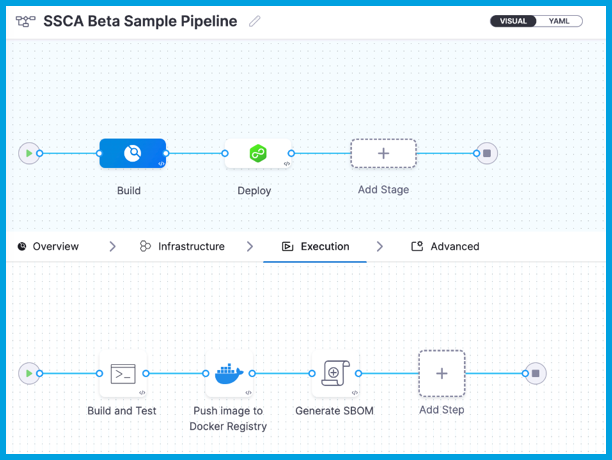
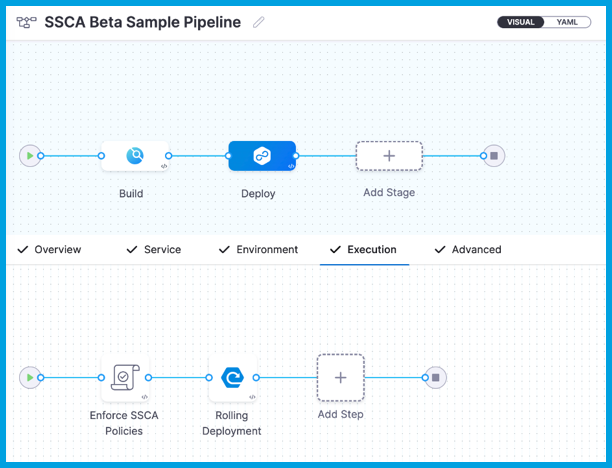
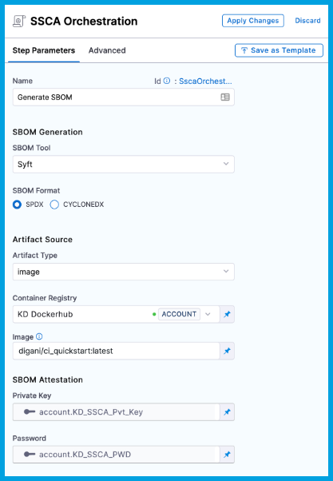
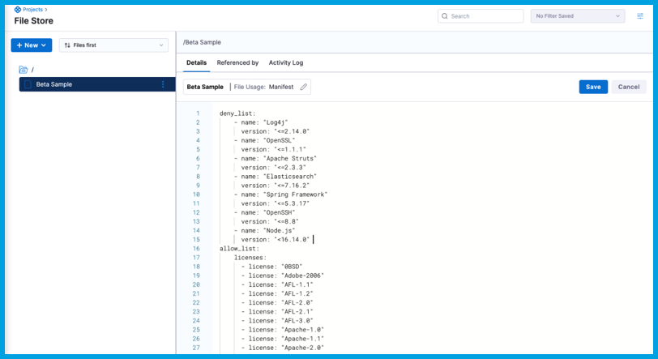
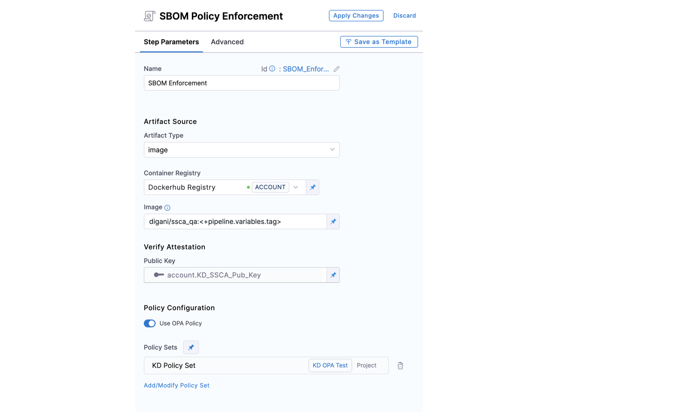
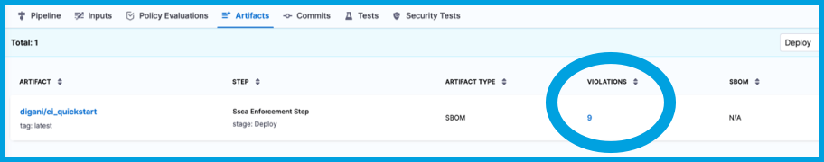

```mdx-code-block
import Tabs from '@theme/Tabs';
import TabItem from '@theme/TabItem';
```

You can use the Harness SSCA steps in Harness CI/CD pipelines to generate SBOM and enforce software supply chain security policies.

To generate SBOM in Harness, you need a pipeline with a [CI (build) stage](/docs/continuous-integration/use-ci/prep-ci-pipeline-components), a [CD (deploy) stage](/docs/continuous-delivery/get-started/key-concepts#stage), or both. For example, the pipeline created in this tutorial has a **Build** stage with three steps and a **Deploy** stage with two steps.

```mdx-code-block
<Tabs>
  <TabItem value="build" label="Build stage" default>
```

The **Build** stage in this tutorial pipeline has the following three steps:

* **Run** step: Build and test an artifact (image).
* **Build and Push an image to Docker Registry** step: Build and push the image to a Docker registry.
* **SSCA Orchestration** step: Generate the SBOM.

<!--  -->

<docimage path={require('./static/sbom-build-stage.png')} />

```mdx-code-block
  </TabItem>
  <TabItem value="deploy" label="Deploy stage">
```

The **Deploy** stage in this tutorial pipeline has the following two steps:

* **SSCA Enforcement** step: Enforce SSCA policies.
* **Rolling deployment** step: Based on the results of the policy evaluation, deploy the image.

<!--  -->

<docimage path={require('./static/sbom-deploy-stage.png')} />

```mdx-code-block
  </TabItem>
</Tabs>
```

This tutorial explains how to configure the **SSCA Orchestration** and **SSCA Enforcement** steps, which generate an SBOM and enforce SSCA policies, respectively.

## Generate a key pair

Keys are used to sign and verify attestations.

1. Generate a public and private key pair. For example, you can use [Cosign](https://docs.sigstore.dev/key_management/signing_with_self-managed_keys/) to generate key pairs.
2. Create two [Harness file secrets](/docs/platform/secrets/add-file-secrets), one for the private key file and one for the public key file.
3. Create a [Harness text secret](/docs/platform/Secrets/add-use-text-secrets) to store the password for the private key.

The SSCA steps in your Harness pipelines use the private key to sign attestations and the public key to verify the authenticity of the attestations.

## Generate an SBOM

The **SSCA Orchestration** step does the following:

* Generates an SBOM in the specified format.
* Generates and signs an attestation using the provided private key and password.
* Stores the SBOM in Harness and uploads the `.att` file to your container registry alongside the image.

1. Add the **SSCA Orchestration** step to either the **Build** or **Deploy** stage.
   * In a **Build** stage, add the **SSCA Orchestration** step after the artifact (image) has been pushed to an artifact repository.
   * In a **Deploy** stage, add the **SSCA Orchestration** step before the deployment step.
2. Enter a **Name** for the step.
3. Select the **SBOM Tool** to use to generate the SBOM, such as **Syft**.
4. For **SBOM Format**, select either **SPDX** or **CycloneDX**.
5. Select **Image** as the **Artifact Type**.
6. For **Container Registry**, select the [Docker Registry connector](/docs/platform/Connectors/Cloud-providers/ref-cloud-providers/docker-registry-connector-settings-reference) that is configured for the Docker-compliant container registry where your artifact is stored, such as Docker Hub, Amazon ECR, or GCR.

   If you're using Docker-compliant ECR or GCR repositories, you must configure your Docker Registry connector as a valid [artifact source](/docs/continuous-delivery/x-platform-cd-features/services/artifact-sources).
      * For ECR, refer to [Use Docker Registry for ECR](/docs/continuous-delivery/x-platform-cd-features/services/artifact-sources#amazon-elastic-container-registry-ecr).
      * For GCR, refer to [Use Docker Registry for GCR](/docs/continuous-delivery/x-platform-cd-features/services/artifact-sources#google-container-registry-gcr).

7. For **Image**, enter the repo path (in your container registry) and tag for the image for which you're generating an SBOM, such as `my-docker-repo/my-artifact:latest`.

   For Docker-compliant ECR or GRC repositories, provide the full URI for the image, such as `1234567890.dkr.ecr.REGION.amazonaws.com/IMAGE_NAME:TAG`

8. For **Private Key**, select the [Harness file secret](/docs/platform/secrets/add-file-secrets) containing the private key to use to sign the attestation.
9. For **Password**, select the [Harness text secret](/docs/platform/Secrets/add-use-text-secrets) containing the password for the private key.

<!--  -->

<docimage path={require('./static/sbom-ssca-orch-step.png')} />

## Create policies

You must [create SSCA policies](/docs/software-supply-chain-assurance/ssca-policies/create-ssca-policies) that you want Harness SSCA to enforce. Create SSCA policy files in the Harness File Store.

1. In your Harness Project, go to **File Store** under **Project Setup**. You can also create policies at the Account and Org scopes.
2. Select **New**, and then select **New File**.
3. Enter a **Name**, and then select **Manifest** for **File Usage**.
4. Enter the [policy definitions](/docs/software-supply-chain-assurance/ssca-policies/define-ssca-policies) in the text editor, and then select **Save**.

<!--  -->

<docimage path={require('./static/ssca-policy-file-store.png')} />

## Enforce policies

The **SSCA Enforcement** step does the following:

* Verifies the authenticity of the attestation.
* Applies policies defined in the specified policy file.
* Records policy violations and shows them on the **Artifacts** tab on the **Execution details** page.

1. Add the **SSCA Enforcement** step to either the **Build** or **Deploy** stage.

   * In a **Build** stage, add the **SSCA Enforcement** step after the artifact (image) has been pushed to an artifact repository.
   * In a **Deploy** stage, add the **SSCA Enforcement** step before the deployment step.

2. Enter a **Name** for the step.
3. Select **Image** as the **Artifact Type**.
4. For **Container Registry**, select the [Docker Registry connector](/docs/platform/Connectors/Cloud-providers/ref-cloud-providers/docker-registry-connector-settings-reference) that is configured for the Docker-compliant container registry where your artifact is stored, such as Docker Hub, Amazon ECR, or GCR.

   If you're using Docker-compliant ECR or GCR repositories, you must configure your Docker Registry connector as a valid [artifact source](/docs/continuous-delivery/x-platform-cd-features/services/artifact-sources).
      * For ECR, refer to [Use Docker Registry for ECR](/docs/continuous-delivery/x-platform-cd-features/services/artifact-sources#amazon-elastic-container-registry-ecr).
      * For GCR, refer to [Use Docker Registry for GCR](/docs/continuous-delivery/x-platform-cd-features/services/artifact-sources#google-container-registry-gcr).

5. For **Image**, enter the repo path (in your container registry) and tag for the relevant image, such as `my-docker-repo/my-artifact:latest`.

   For Docker-compliant ECR or GRC repositories, provide the full URI for the image, such as `1234567890.dkr.ecr.REGION.amazonaws.com/IMAGE_NAME:TAG`

6. For **Public Key**, select the [Harness file secret](/docs/platform/secrets/add-file-secrets) containing the public key to use to verify the authenticity of the attestation.
7. For **File Path**, provide the path to your [SSCA policy file](#create-policies).

<!--  -->

<docimage path={require('./static/policy-ssca-enforce-step.png')} />

## View attestations and violations

When the pipeline runs, the SBOM is generated and the attestation is signed. The signed attestation is stored, as an `.att` file, in the artifact repository along with the image.

<!--  -->

<docimage path={require('./static/view-result-att-in-docker-hub.png')} />

When viewing the **Execution details** page in Harness, you can view and download the SBOM from **SBOM** column on the **Artifacts** tab.

<!--  -->

<docimage path={require('./static/view-result-sbom-artifact.png')} />

:::tip

If your pipeline has multiple stages, the **Artifacts** tab is filtered by stage. Use the dropdown menu to select the relevant stage.

:::

You can see the number of policy violations in the **Violations** column on the **Artifacts** tab.

<!--  -->

<docimage path={require('./static/view-result-policy-violations.png')} />

Select the number to inspect the details of the violations.

<!--  -->

<docimage path={require('./static/view-result-policy-violations-detail.png')} />
