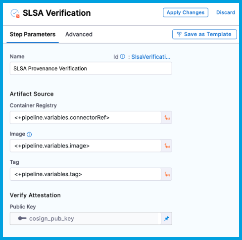
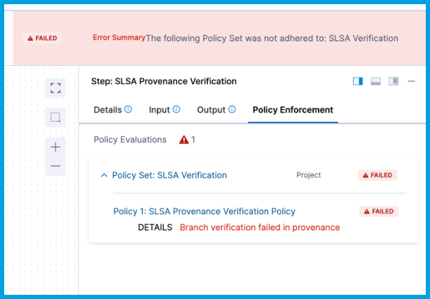

You can use the Harness SSCA steps in Harness CI/CD pipelines to generate and verify [SLSA Provenance](https://slsa.dev/spec/v1.0/provenance).

To complete this tutorial, you need a pipeline with a [CI (build) stage](/docs/continuous-integration/use-ci/prep-ci-pipeline-components) and [CD (deploy) stage](/docs/continuous-delivery/get-started/key-concepts#stage). For example, the pipeline created in this tutorial has a **Build** stage with one step and a **Deploy** stage with two steps.

* **Build** stage:
  * **Build and Push an image to Docker Registry** step: Build and push an image to a Docker registry.
  * SLSA generation is enabled in the stage settings.
* **Deploy** stage:
  * **SLSA Verification** step: Verify the SLSA Provenance.
  * **Rolling deployment** step: Deploy the image.

<!--  -->

<docimage path={require('./static/slsa-pipeline-example.png')} />

This tutorial explains how to enable SLSA Provenance generation and configure an **SLSA Verification** step.

## Generate a key pair

Keys are used to sign and verify provenance.

1. Generate a public and private key pair. For example, you can use [Cosign](https://docs.sigstore.dev/key_management/signing_with_self-managed_keys/) to generate key pairs.
2. Create two [Harness file secrets](/docs/platform/secrets/add-file-secrets), one for the private key file and one for the public key file.
3. Create a [Harness text secret](/docs/platform/Secrets/add-use-text-secrets) to store the password for the private key.

When your pipeline runs, the private key is used to sign the SLSA Provenance, and the public key is used to verify the provenance.

## Generate SLSA Provenance

When you run a pipeline with SLSA generation enabled, Harness SSCA:

* Generates an SLSA Provenance for the image created in the **Build** stage.
* Generates and signs an attestation using the provided key and password.
* Stores the SLSA Provenance in Harness and uploads the `.att` file to your container registry alongside the image.

Enable SLSA Provenance generation in the **Build** stage settings.

1. In your Harness pipeline, select the **Build** stage, and then select the **Overview** tab.
2. Under **SLSA Provenance**, enable **Generate SLSA Provenance**.
3. For **Private Key**, select the [Harness file secret](/docs/platform/secrets/add-file-secrets) containing the private key file to use to sign the attestation.
4. For **Password**, select the [Harness text secret](/docs/platform/Secrets/add-use-text-secrets) containing the password for the private key.

<!--  -->

<docimage path={require('./static/slsa-build-stage-settings.png')} />

## Create policies

You must create a set of OPA policies that you want Harness SSCA to use for SLSA Provenance verification. You can create a dedicated SLSA Provenance verification policy set or use existing policy sets that you've already created. For more information about creating policies in Harness, go to the [Harness Policy As Code overview](/docs/platform/Governance/Policy-as-code/harness-governance-overview).

:::info

OPA polices used for SLSA Provenance verification are different from [SSCA policies](/docs/software-supply-chain-assurance/ssca-policies/create-ssca-policies) used for SSCA policy enforcement.

:::

1. In your Harness Project, go to **Policies** under **Project Setup**. You can also create policies at the Account and Org scopes.
2. Select **Policies**, and then [create policies](/docs/platform/Governance/Policy-as-code/harness-governance-quickstart#create-the-policy) for the individual rules that you want to enforce.

   You can select from the policy library or write your own policies. This tutorial enforces the following policies:

   ```
   package slsa

   # Build repo must be 'https://github.com/abc/abc-sample'. SLSA verification fails if a different repo is detected.
   deny[msg]{
     input[0].outcome.stepArtifacts.provenanceArtifacts[0].predicate.buildDefinition.externalParameters.codeMetadata.repositoryURL != "https://github.com/abc/abc-sample"
     msg := "Repository verification failed in Provenance"  
   }

   # Build branch must be 'main'. SLSA verification fails if a different branch is detected.
   deny[msg]{
     input[0].outcome.stepArtifacts.provenanceArtifacts[0].predicate.buildDefinition.externalParameters.codeMetadata.branch != "main"
     msg := "Branch verification failed in provenance"  
   }
   ```

   For more examples, go to [Policy samples](/docs/platform/Governance/Policy-as-code/sample-policy-use-case).

3. [Create policy sets](/docs/platform/Governance/Policy-as-code/harness-governance-quickstart#step-3-create-a-policy-set) to group related policies. You must have at least one policy set.

## Verify provenance

The **SLSA Verification** step does the following:

* Verifies the authenticity of the attestation.
* Verifies the provenance data by applying the specified policy set.
* Records the policy evaluation results in the step's logs.
* Reports the overall pass/fail for SLSA verification on the **Artifacts** tab.

1. Add the **SLSA Verification** step to your **Deploy** stage. This is a container step that must be inside a [container group](/docs/continuous-delivery/x-platform-cd-features/cd-steps/containerized-steps/containerized-step-groups).
2. Enter a **Name** for the step.
3. For **Container Registry**, select the [Docker Registry connector](/docs/platform/Connectors/Cloud-providers/ref-cloud-providers/docker-registry-connector-settings-reference) that is configured for the Docker-compliant container registry where the artifact is stored, such as Docker Hub, Amazon ECR, or GCR.

   If you're using Docker-compliant ECR or GCR repositories, you must configure your Docker Registry connector as a valid [artifact source](/docs/continuous-delivery/x-platform-cd-features/services/artifact-sources).

   * For ECR, refer to [Use Docker Registry for ECR](/docs/continuous-delivery/x-platform-cd-features/services/artifact-sources#amazon-elastic-container-registry-ecr).
   * For GCR, refer to [Use Docker Registry for GCR](/docs/continuous-delivery/x-platform-cd-features/services/artifact-sources#google-container-registry-gcr).

4. For **Image**, enter the repo path (in your container registry) for the image that you want to verify, such as `my-docker-repo/my-artifact`.

   For Docker-compliant ECR or GRC repositories, provide the full URI for the image, such as `1234567890.dkr.ecr.REGION.amazonaws.com/IMAGE_NAME:TAG`

5. For **Tag**, enter the tag for the image, such as `latest`.

6. For **Public Key**, select the [Harness file secret](/docs/platform/secrets/add-file-secrets) containing the public key to use to verify the authenticity of the attestation.

   <!--  -->

   <docimage path={require('./static/slsa-verify-step-basic.png')} />

7. On the **Advanced** tab for the **SLSA Verification** step, expand the **Policy Enforcement** section, and then add your SLSA Provenance verification OPA policies.

   <!--  -->

   <docimage path={require('./static/slsa-verify-step-adv.png')} />

## View attestations and violations

When the pipeline runs, the SLSA Provenance is generated and the attestation is signed. The signed attestation is stored, as an `.att` file, in the artifact repository along with the image.

<!--  -->

<docimage path={require('./static/view-result-att-in-docker-hub.png')} />

When viewing the **Execution details** page in Harness, you can view and download the SLSA Provenance from **Artifact Type** column on the **Artifacts** tab.

<!--  -->

<docimage path={require('./static/view-result-slsa-artifact.png')} />

:::tip

If your pipeline has multiple stages, the **Artifacts** tab is filtered by stage. Use the dropdown menu to select the relevant stage.

:::

In the **SLSA Verification** column on the **Artifacts** tab, you can see if the verification passed or failed.

<!--  -->

<docimage path={require('./static/view-result-slsa-verify-pass-fail.png')} />

To inspect which policies failed, select the **Pipeline** tab, select the **SLSA Verification** step, and then select the **Policy Enforcement** tab.

<!--  -->

<docimage path={require('./static/view-result-slsa-policy-violations.png')} />
