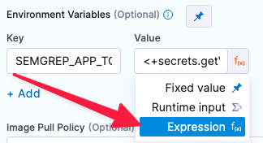

```mdx-code-block
import Tabs from '@theme/Tabs';
import TabItem from '@theme/TabItem';
```

# Create a build-scan-push pipeline (STO only)

<ctabanner
  buttonText="Learn More"
  title="Continue your learning journey."
  tagline="Take a Security Testing Orchestration certification today!"
  link="/certifications/sto"
  closable={true}
  target="_self"
/>

In this tutorial, you'll create an end-to-end pipeline that builds an image and pushes it to a container _only_ if the codebase and image contain no critical vulnerabilties. This tutorial combines the pipelines from the [SAST code scans using Semgrep](/tutorials/security-tests/sast-scan-semgrep) and [Container image scans with Aqua Trivy](/tutorials/security-tests/container-scan-aqua-trivy) tutorials into one end-to-end workflow:

- First, a Run step scans the codebase and a Semgrep step ingests the results (ingestion-only workflow). 

- If the code has no critical vulnerabilities, another Run steps builds the image. 

- An Aqua Trivy step scans the image and ingests the results (orchestrated scan). 

- If the image has no critical vulnerabilities, it pushes the image to Docker Hub. (Optional) 


## Important notes

- This tutorial has the following prerequisites:

  - A Harness account and STO module license.
  - You must have a [Security Testing Developer or SecOps role](/docs/security-testing-orchestration/get-started/onboarding-guide/#create-an-sto-pipeline) assigned.
  - A basic understanding of key STO concepts and good practices is recommended. Here are some good resources: 
    - [Your first STO pipeline](/tutorials/security-tests/your-first-sto-pipeline)
    - [Key Concepts in STO](/docs/category/key-concepts-in-sto)
  - Git requirements — This tutorial assumes you have the following:
    - A GitHub account and access token. 
    - A [GitHub connector](/docs/platform/connectors/code-repositories/ref-source-repo-provider/git-hub-connector-settings-reference) to your Git repository and an access token. The connector should specify your account (`http://github.com/my-account`) but not a specific repository (`http://github.com/my-account/my-repository`). 
    - Your GitHub account should include a repository with a Dockerfile for creating an image.
    
      This tutorial uses the [dvpwa repository](https://github.com/williamwissemann/dvpwa) as an example. The simplest setup is to fork this repository into your GitHub account. 

  - Docker requirements — The last step in this pipeline pushes the built image to your image registry. To do this step, you must have the following:
      - A GitHub account and access token. 
      - A [Docker connector](/docs/platform/connectors/cloud-providers/ref-cloud-providers/docker-registry-connector-settings-reference/) is required to push the image. 
  - Your GitHub and Docker Hub access tokens must be stored as [Harness secrets](/docs/platform/secrets/add-use-text-secrets).


## Set up your pipeline

Do the following:

1. Select **Security Testing Orchestration** (left menu, top) > **Pipelines** > **Create a Pipeline**. Enter a name and click **Start**. 

2. In the new pipeline, select **Add stage** > **Security Tests**. 

3. Set up your stage as follows:

   1. Enter a **Stage Name**.
   
   2. Disable **Clone Codebase**. You will add a Run step to download the codebase later.

4. In the Pipeline Editor, go to **Overview** and add the following shared path:

   - `/shared/customer-artifacts` You'll use this shared folder to store the code repo so that all steps can access it. 

5. Expand **Overview** > **Advanced** and add the following stage variables. 

   You'll be specifying runtime inputs for some of these variables. This enables you to specify the code repo, branch, image label, and image tag, and other variables at runtime. 

   - `GITHUB_USERNAME` — Select **Secret** as the type and enter your GitHub login name.

   - `GITHUB_PAT` — Select **Secret** as the type and then select the Harness secret for your GitHub access token. 

   - `GITHUB_REPO` — Select **String** for the type and **Runtime Input** for the value (click the "tack button" to the right of the value field).

   - `GITHUB_BRANCH` — Select **String** and **Runtime Input**. 

   - `DOCKERHUB_USERNAME` — Select **String** as the type and enter your DockerHub login name.

   - `DOCKERHUB_PAT` — Select **Secret** as the type and then select the Harness secret for your Docker Hub access token. 

   - `DOCKER_IMAGE_LABEL` — Select **String** and **Runtime Input**. 

   - `DOCKER_IMAGE_TAG` — Select **String** and **Runtime Input**. 


6. In the Pipeline Editor, go to **Infrastructure** and select **Cloud**, **Linux**, and **AMD64** for the infrastructure, OS, and architecture.  
   
   You can also use a [Kubernetes](/docs/category/set-up-kubernetes-cluster-build-infrastructures) or [Docker](/docs/continuous-integration/use-ci/set-up-build-infrastructure/define-a-docker-build-infrastructure) infrastructure, but these require additional work to set up.   

## Add the codebase scan step

Now you will add a step that runs a scan using the local Semgrep container image maintained by Harness. 


```mdx-code-block
<Tabs>
  <TabItem value="Visual" label="Visual" default>
```

1. Go to **Execution** and add a **Run** step. 

2. Configure the step as follows:

   1. Name = **run_semgrep_scan**

   2. Command = 
   
      ```shell

      # install git
      apk add git
      git --version
 
      #  clone repo, cd to local clone, check out branch
      cd /shared/customer_artifacts
      git clone https://github.com/<+stage.variables.GITHUB_USERNAME>/<+stage.variables.GITHUB_REPO>
      cd /shared/customer_artifacts/<+stage.variables.GITHUB_REPO>
      git checkout <+stage.variables.GITHUB_BRANCH>

      # run semgrep scan, save results to SARIF file
      semgrep --sarif --config auto -o /harness/results.sarif /shared/customer_artifacts

      ```

   3. Open **Optional Configuration** and set the following options:

      1. Container Registry — When prompted, select **Account** and then [**`Harness Docker Connector`**](/docs/platform/connectors/artifact-repositories/connect-to-harness-container-image-registry-using-docker-connector). The step uses this connector to download the scanner image. 

      2. Image = **returntocorp/semgrep**
      
      3. Add the following environment variable:
         
         - Key : `SEMGREP_APP_TOKEN`
         - Value : Click the type selector (right), set the value type to **Expression**, and enter the value `<+secrets.getValue("YOUR_SEMGREP_TOKEN_SECRET")>`. 

           


```mdx-code-block
  </TabItem>
  <TabItem value="YAML" label="YAML">
```

Add a `Run` step to your `SecurityTests` stage and configure it as follows:

 *  `type:` [`Run`](/docs/continuous-integration/use-ci/run-ci-scripts/run-step-settings)
   *  `name:` A name for the step.
   *  `identifier:` A unique step ID.
   *  `spec :`
      -  `connectorRef : account.HarnessImage` 
      
          This is a connector to the [Harness image registry](/docs/platform/connectors/artifact-repositories/connect-to-harness-container-image-registry-using-docker-connector). The step uses this connector to download the scanner image. 

      -  `image : returntocorp/semgrep`
      -  `shell : Sh`
      -  `command : |- `   
         ```shell

         # install git
         apk add git
         git --version
   
         #  clone repo, cd to local clone, check out branch
         cd /shared/customer_artifacts
         git clone https://github.com/<+stage.variables.GITHUB_USERNAME>/<+stage.variables.GITHUB_REPO>
         cd /shared/customer_artifacts/<+stage.variables.GITHUB_REPO>
         git checkout <+stage.variables.GITHUB_BRANCH>

         # run semgrep scan, save results to SARIF file
         semgrep --sarif --config auto -o /harness/results.sarif /shared/customer_artifacts

         ```

      -  `envVariables:`
         -  `SEMGREP_APP_TOKEN: <+secrets.getValue("YOUR_SEMGREP_TOKEN_SECRET")>`
      -  `resources:`
         -  `limits: `
             -  `memory: 4096Mi`

             You might want to reserve more memory to [speed up the scan](/docs/security-testing-orchestration/use-sto/set-up-sto-pipelines/optimize-sto-pipelines). This setting applies to Kubernetes and Docker infrastructures only. 


Here's an example:

```yaml

- step:
   type: Run
   name: run-semgrep-scan
   identifier: Run_1
   spec:
      connectorRef: account.harnessImage
      image: returntocorp/semgrep
      shell: Sh
      command: |-
         # install git
         apk add git
         git --version

         # clone repo into shared folder, cd to local clone, check out branch
         cd /shared/customer_artifacts
         git clone https://github.com/<+stage.variables.GITHUB_USERNAME>/<+stage.variables.GITHUB_REPO>
         cd /shared/customer_artifacts/<+stage.variables.GITHUB_REPO>
         git checkout <+stage.variables.GITHUB_BRANCH>

         # run semgrep scan, save results to SARIF file
         semgrep --sarif --config auto -o /harness/results.sarif /shared/customer_artifacts

         # cat /harness/results.sarif
      envVariables:
         SEMGREP_APP_TOKEN: <+secrets.getValue("semgrepkey")>

```

```mdx-code-block
  </TabItem>
</Tabs>
```

## Add the Semgrep ingest step

Now that you've added a step to run the scan, it's a simple matter to ingest it into your pipeline. Harness provides a set of customized steps for popular scanners such as Semgrep. 

   ```mdx-code-block
<Tabs>
  <TabItem value="Visual" label="Visual" default>
```

1. In **Execution**, add a **Semgrep** step after your **Run** step.

2. Configure the step as follows:

   1. Name = `ingest_semgrep_data`

   2. Type = **Repository**

   3. Under Target:

      1. Name = Select **Runtime Input** as the value type.

      2. Variant = Select **Runtime Input** as the value type.

   4. Ingestion File = `/harness/results.sarif` 

   5. [Fail on Severity](/docs/security-testing-orchestration/get-started/key-concepts/fail-pipelines-by-severity) = **Critical**

```mdx-code-block
  </TabItem>
  <TabItem value="YAML" label="YAML">
```

Add a step after the `Run` step and configure it as follows:

*  `type:` [`Semgrep`](/docs/security-testing-orchestration/sto-techref-category/semgrep-scanner-reference)
   *  `name:` A name for the step.
   *  `identifier:` A unique step ID.
   *  `spec :`
      -  `mode :` [`ingestion`](/docs/security-testing-orchestration/use-sto/orchestrate-and-ingest/ingest-scan-results-into-an-sto-pipeline) 
      -  `config: default`
         - `target : ` 
            - `name : <+stage.variables.GITHUB_REPO>` 
            - `type : repository`
            - `variant : <+stage.variables.GITHUB_BRANCH>` 
                When scanning a repository, you will generally use the repository name and branch for the [target name and variant](/docs/security-testing-orchestration/get-started/key-concepts/targets-and-baselines).
         - `advanced : ` 
            - `log :` 
              - `level : info`
              - [`fail_on_severity`](/docs/security-testing-orchestration/get-started/key-concepts/fail-pipelines-by-severity) ` : critical`
         - `ingestion : ` 
            - `file : /harness/ingest/results.sarif` 


Here's a YAML example:

```yaml

              - step:
                  type: Semgrep
                  name: ingest_semgrep_data
                  identifier: ingest_semgrep_data
                  spec:
                    mode: ingestion
                    config: default
                    target:
                      name: <+stage.variables.GITHUB_REPO>
                      type: repository
                      variant: <+stage.variables.GITHUB_BRANCH>
                    advanced:
                      log:
                        level: debug
                      fail_on_severity: critical
                    ingestion:
                      file: /harness/results.sarif


```

```mdx-code-block
  </TabItem>
</Tabs>
```


## Add the image build step

Assuming that the Semgrep scanner detected no critical vulnerabilities, the next step is to build a local image using the `Dockerfile` in your codebase.

```mdx-code-block
<Tabs>
  <TabItem value="Visual" label="Visual" default>
```

1. Add a **Run** step after the Semgrep ingest step. 

2. Configure the step as follows:

   1. Name = **build_local_image**

   2. Command = 

        ``` bash

        # wait until the dind service is available
        while ! docker ps ;do
        echo "Docker not available yet"
        done
        echo "Docker service is ready"
        docker ps

        # cd to the repo and build/tag the local image
        cd /shared/customer_artifacts/<+stage.variables.GITHUB_REPO>
        docker login \
               --username="<+stage.variables.DOCKERHUB_USERNAME>" \
               --password="<+stage.variables.DOCKERHUB_PAT>" \
        docker build -t <+stage.variables.DOCKER_IMAGE_LABEL> . \
        docker tag \
             <+stage.variables.DOCKER_IMAGE_LABEL> \
             <+stage.variables.DOCKERHUB_USERNAME>/<+stage.variables.DOCKER_IMAGE_LABEL>:<+stage.variables.DOCKER_IMAGE_TAG>

        ```

   3. Open **Optional Configuration** and set the following options:

      1. Container Registry — When prompted, select **Account** and then your Docker Hub connector. 

      2. Image = **docker**
      

```mdx-code-block
  </TabItem>
  <TabItem value="YAML" label="YAML">
```

Add a `Run` step after the Bandit scan step and configure it as follows:

 *  `type:` [`Run`](/docs/continuous-integration/use-ci/run-ci-scripts/run-step-settings)
   *  `name:` A name for the step.
   *  `identifier:` A unique step ID.
   *  `spec :`
      -  `connectorRef : YOUR_DOCKERHUB_CONNECTOR`  
      -  `image : returntocorp/semgrep`
      -  `shell : Sh`
      -  `command : |- `   
         ```shell

            # install git
            apk add git
            git --version
      
            #  clone repo, cd to local clone, check out branch
            cd /shared/customer_artifacts
            git clone https://github.com/<+stage.variables.GITHUB_USERNAME>/<+stage.variables.GITHUB_REPO>
            cd /shared/customer_artifacts/<+stage.variables.GITHUB_REPO>
            git checkout <+stage.variables.GITHUB_BRANCH>

            # run semgrep scan, save results to SARIF file
            semgrep --sarif --config auto -o /harness/results.sarif /shared/customer_artifacts

         ```

      -  `envVariables:`
         -  `SEMGREP_APP_TOKEN: <+secrets.getValue("YOUR_SEMGREP_TOKEN_SECRET")>`


Here's an example:

```yaml
              - step:
                  type: Run
                  name: build_local_image
                  identifier: build_local_image
                  spec:
                    connectorRef: dbothwelldocker
                    image: docker
                    shell: Sh
                    command: |-
                      # wait until the dind service is available
                      while ! docker ps ;do
                        echo "Docker not available yet"
                      done
                      echo "Docker service is ready"


                      # build and tag the local image
                      cd /shared/customer_artifacts/<+stage.variables.GITHUB_REPO>
                      docker login --username="<+stage.variables.DOCKERHUB_USERNAME>" --password="<+stage.variables.DOCKERHUB_PAT>" 
                      docker build -t <+stage.variables.DOCKER_IMAGE_LABEL> .
                      docker tag <+stage.variables.DOCKER_IMAGE_LABEL> <+stage.variables.DOCKERHUB_USERNAME>/<+stage.variables.DOCKER_IMAGE_LABEL>:<+stage.variables.DOCKER_IMAGE_TAG>

                      docker image ls
                    privileged: true
                    resources:
                      limits:
                        memory: 4096M

```

```mdx-code-block
  </TabItem>
</Tabs>
```

## Add the Aqua-Trivy scan/ingest step

```mdx-code-block
<Tabs>
  <TabItem value="Visual" label="Visual" default>
```

Add an **Aqua Trivy** step to your pipeline after the DinD background step and configure it as follows:

   1. Scan Mode = [**Orchestration**](/docs/security-testing-orchestration/use-sto/orchestrate-and-ingest/sto-workflows-overview) In orchestrated mode, the step runs the scan and ingests the results in one step.

   2. Target name — Click the "tack" button on the right side of the input field and select **Expression**. Then enter the following expression: `<+stage.variables.DOCKERHUB_USERNAME>/<+stage.variables.DOCKER_IMAGE_LABEL>`

   3. Target variant — Select **Expression** for the value type, then enter the following expression: `<+stage.variables.DOCKER_IMAGE_TAG>`

   4. [Container image Type](/docs/security-testing-orchestration/sto-techref-category/aqua-trivy-scanner-reference#type-1) = **Local Image**

   5. Container image name — Select **Expression** for the value type, then enter the following expression: `<+stage.variables.DOCKERHUB_USERNAME>/<+stage.variables.DOCKER_IMAGE_LABEL>`

   6. Container image tag — Select **Expression** for the value type, then enter the following expression: `<+stage.variables.DOCKER_IMAGE_TAG>`

   7. [Fail on Severity](/docs/security-testing-orchestration/sto-techref-category/aqua-trivy-scanner-reference#fail-on-severity) = **Critical**

```mdx-code-block
  </TabItem>
  <TabItem value="YAML" label="YAML">
```

Add an **Aqua Trivy** step to your pipeline after the DinD background step and configure it as follows:


 *  `type:` [`AquaTrivy`](/docs/security-testing-orchestration/sto-techref-category/aqua-trivy-scanner-reference#security-step-settings-for-aqua-trivy-scans-in-sto-legacy)
   *  `name:` A name for the step.
   *  `identifier:` A unique step ID.
   *  `spec :`
      -  `mode :` [`orchestration`](/docs/security-testing-orchestration/use-sto/orchestrate-and-ingest/sto-workflows-overview) In orchestrated mode, the step runs the scan and ingests the results in one step. 
      -  `config: default`
      - `target : ` 
          - `name : <+stage.variables.DOCKERHUB_USERNAME>/<+stage.variables.DOCKER_IMAGE_LABEL>` 
          - `type : container`
          - `variant : <+stage.variables.DOCKER_IMAGE_TAG>` When scanning an image, you generally use the image label and tag for the [target name and variant](/docs/security-testing-orchestration/get-started/key-concepts/targets-and-baselines) .
        - `advanced : ` 
          - `log :` 
            - `level : info`
            - [`fail_on_severity`](/docs/security-testing-orchestration/sto-techref-category/aqua-trivy-scanner-reference#fail-on-severity) `: critical`
        - `privileged: true`
        - `image:`
            - [`type`](/docs/security-testing-orchestration/sto-techref-category/aqua-trivy-scanner-reference#type-1) `: local_image`
            - `name: <+stage.variables.DOCKERHUB_USERNAME>/<+stage.variables.DOCKER_IMAGE_LABEL>` 
            - `tag: <+stage.variables.DOCKER_IMAGE_TAG>`


Here's an example:

```yaml

- step:
   type: AquaTrivy
   name: run_trivy_scan
   identifier: AquaTrivy_1
   spec:
      mode: orchestration
      config: default
      target:
         name: <+stage.variables.DOCKERHUB_USERNAME>/<+stage.variables.DOCKER_IMAGE_LABEL>
         type: container
         variant: <+stage.variables.DOCKER_IMAGE_TAG>
      advanced:
         log:
         level: info
         fail_on_severity: critical
      privileged: true
      image:
         type: local_image
         name: <+stage.variables.DOCKERHUB_USERNAME>/<+stage.variables.DOCKER_IMAGE_LABEL>
         tag: <+stage.variables.DOCKER_IMAGE_TAG>

```

```mdx-code-block
  </TabItem>
</Tabs>
```

## Add the image push step

Assuming that the Aqua Trivy scanner detected no critical vulnerabilities, you can now push your new image to Docker Hub.

```mdx-code-block
<Tabs>
  <TabItem value="Visual" label="Visual" default>
```

1. Add a **Run** step after the Aqua Trivy scan/ingest step. 

2. Configure the step as follows:

   1. Name = **push_image**

   2. Command = 

        ``` bash

        # if the image passed the scan,
        # push it to the image repository
        docker login --username="<+stage.variables.DOCKERHUB_USERNAME>" --password="<+stage.variables.DOCKERHUB_PAT>" 
        docker push <+stage.variables.DOCKERHUB_USERNAME>/<+stage.variables.DOCKER_IMAGE_LABEL>:<+stage.variables.DOCKER_IMAGE_TAG>

        ```

   3. Open **Optional Configuration** and set the following options:

      1. Container Registry — Select your Docker Hub connector. 

      2. Image = **docker**
      

```mdx-code-block
  </TabItem>
  <TabItem value="YAML" label="YAML">
```

Add a `Run` step after the Bandit scan step and configure it as follows:

 *  `type:` [`Run`](/docs/continuous-integration/use-ci/run-ci-scripts/run-step-settings)
   *  `name:` A name for the step.
   *  `identifier:` A unique step ID.
   *  `spec :`
      -  `connectorRef : MY_DOCKERHUB_CONNECTOR`
      -  `image : docker`
      -  `shell : Sh`
      -  `command : |- `   
        
         ``` bash

         # if the image passed the scan,
         # push it to the image repository
         docker login --username="<+stage.variables.DOCKERHUB_USERNAME>" --password="<+stage.variables.DOCKERHUB_PAT>" 
         docker push <+stage.variables.DOCKERHUB_USERNAME>/<+stage.variables.DOCKER_IMAGE_LABEL>:<+stage.variables.DOCKER_IMAGE_TAG>

         ```


Here's an example:

```yaml
 
- step:
   type: Run
   name: push_image
   identifier: push_image
   spec:
      connectorRef: dbothwelldocker
      image: docker
      shell: Sh
      command: |-
         # if the image passed the scan,
         # push it to the image repository
         docker login --username="<+stage.variables.DOCKERHUB_USERNAME>" --password="<+stage.variables.DOCKERHUB_PAT>" 
         docker push <+stage.variables.DOCKERHUB_USERNAME>/<+stage.variables.DOCKER_IMAGE_LABEL>:<+stage.variables.DOCKER_IMAGE_TAG>

```

```mdx-code-block
  </TabItem>
</Tabs>
```


## YAML pipeline example

```yaml

pipeline:
  projectIdentifier: STO
  orgIdentifier: default
  tags: {}
  stages:
    - stage:
        name: scan_codebase
        identifier: scan_codebase
        type: SecurityTests
        spec:
          cloneCodebase: false
          execution:
            steps:
              - step:
                  type: Background
                  name: dind_bg_svc
                  identifier: dind_bg_svc
                  spec:
                    connectorRef: dbothwelldocker
                    image: docker:dind
                    shell: Sh
                    privileged: true
                    entrypoint:
                      - dockerd
              - step:
                  type: Run
                  name: run-semgrep-scan
                  identifier: Run_1
                  spec:
                    connectorRef: account.harnessImage
                    image: returntocorp/semgrep
                    shell: Sh
                    command: |-
                      # install git, clone the code repo, and cd to the local clone
                      apk add git
                      git --version
                      cd /shared/customer_artifacts
                      git clone https://github.com/<+stage.variables.GITHUB_USERNAME>/<+stage.variables.GITHUB_REPO>
                      cd /shared/customer_artifacts/<+stage.variables.GITHUB_REPO>
                      echo "contents of current folder"
                      pwd
                      ls -l 

                      git checkout <+stage.variables.GITHUB_BRANCH>

                      semgrep --sarif --config auto -o /harness/results.sarif /shared/customer_artifacts

                      # cat /harness/results.sarif
                    envVariables:
                      SEMGREP_APP_TOKEN: <+secrets.getValue("semgrepkey")>
                    resources:
                      limits:
                        memory: 4096M
              - step:
                  type: Semgrep
                  name: ingest-semgrep-sarif
                  identifier: Semgrep_1
                  spec:
                    mode: ingestion
                    config: default
                    target:
                      name: <+stage.variables.GITHUB_REPO>
                      type: repository
                      variant: <+stage.variables.GITHUB_BRANCH>
                    advanced:
                      log:
                        level: info
                      fail_on_severity: none
                    ingestion:
                      file: /harness/results.sarif
              - step:
                  type: Run
                  name: build_local_image
                  identifier: build_local_image
                  spec:
                    connectorRef: dbothwelldocker
                    image: docker
                    shell: Sh
                    command: |-
                      # wait until the dind service is available
                      while ! docker ps ;do
                        echo "Docker not available yet"
                      done
                      echo "Docker service is ready"
                      docker ps

                      # install git, clone the code repo, and cd to the local clone
                      # apk add git
                      # git --version
                      # git clone https://github.com/<+stage.variables.GITHUB_USERNAME>/<+stage.variables.GITHUB_REPO>

                      cd /shared/customer_artifacts/<+stage.variables.GITHUB_REPO>
                      pwd 
                      ls -l

                      # build and tag the local image
                      docker login --username="<+stage.variables.DOCKERHUB_USERNAME>" --password="<+stage.variables.DOCKERHUB_PAT>" 
                      docker build -t <+stage.variables.DOCKER_IMAGE_LABEL> .
                      docker tag <+stage.variables.DOCKER_IMAGE_LABEL> <+stage.variables.DOCKERHUB_USERNAME>/<+stage.variables.DOCKER_IMAGE_LABEL>:<+stage.variables.DOCKER_IMAGE_TAG>

                      docker image ls
                    privileged: true
                    resources:
                      limits:
                        memory: 4096M
              - step:
                  type: AquaTrivy
                  name: run_trivy_scan
                  identifier: AquaTrivy_1
                  spec:
                    mode: orchestration
                    config: default
                    target:
                      name: <+stage.variables.DOCKERHUB_USERNAME>/<+stage.variables.DOCKER_IMAGE_LABEL>
                      type: container
                      variant: <+stage.variables.DOCKER_IMAGE_TAG>
                    advanced:
                      log:
                        level: info
                      fail_on_severity: critical
                    privileged: true
                    image:
                      type: local_image
                      name: <+stage.variables.DOCKERHUB_USERNAME>/<+stage.variables.DOCKER_IMAGE_LABEL>
                      tag: <+stage.variables.DOCKER_IMAGE_TAG>
                    sbom:
                      format: spdx-json
              - step:
                  type: Run
                  name: push_image
                  identifier: push_image
                  spec:
                    connectorRef: dbothwelldocker
                    image: docker
                    shell: Sh
                    command: |-
                      # if the image passed the scan,
                      # push it to the image repository
                      docker login --username="<+stage.variables.DOCKERHUB_USERNAME>" --password="<+stage.variables.DOCKERHUB_PAT>" 
                      docker push <+stage.variables.DOCKERHUB_USERNAME>/<+stage.variables.DOCKER_IMAGE_LABEL>:<+stage.variables.DOCKER_IMAGE_TAG>
                    privileged: true
          sharedPaths:
            - /var/run
            - /shared/customer_artifacts
          caching:
            enabled: false
            paths: []
          slsa_provenance:
            enabled: false
          platform:
            os: Linux
            arch: Amd64
          runtime:
            type: Cloud
            spec: {}
        variables:
          - name: GITHUB_USERNAME
            type: String
            description: ""
            value: my-github-username
          - name: GITHUB_PAT
            type: Secret
            description: ""
            value: mygithubaccesstokensecret
          - name: GITHUB_REPO
            type: String
            description: ""
            value: <+input>
          - name: GITHUB_BRANCH
            type: String
            description: ""
            required: false
            value: <+input>
          - name: DOCKERHUB_USERNAME
            type: String
            description: ""
            value: dbothwell
          - name: DOCKERHUB_PAT
            type: Secret
            description: ""
            value: mydockerhubaccesstokensecret
          - name: DOCKER_IMAGE_LABEL
            type: String
            description: ""
            value: <+input>
          - name: DOCKER_IMAGE_TAG
            type: String
            description: ""
            required: false
            value: <+input>
        description: ""
        timeout: 10m
  notificationRules:
    - name: pipeline-failed
      identifier: pipelinefailed
      pipelineEvents:
        - type: StageFailed
          forStages:
            - scan_codebase
      notificationMethod:
        type: Email
        spec:
          userGroups: []
          recipients:
            - devsecops@myorg.org
      enabled: true
  identifier: v3_sbsp_tutorial
  name: v3_sbsp_tutorial


```


