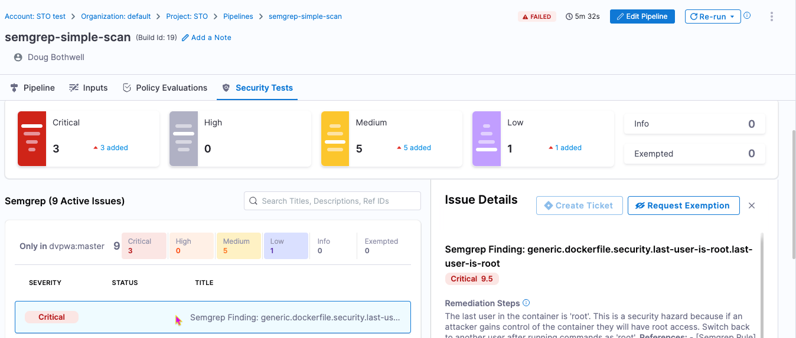

# SAST code scans using Semgrep

<ctabanner
  buttonText="Learn More"
  title="Continue your learning journey."
  tagline="Take a Security Testing Orchestration certification today!"
  link="/certifications/sto"
  closable={true}
  target="_self"
/>


This tutorial shows you how to scan a web app using [Nikto](https://cirt.net/Nikto2), an open-source scanner that runs tests against web servers to detect dangerous files/programs, outdated server versions, and problems with specific server releases. 

In this tutorial, you'll set up a simple pipeline with a [Nikto step](/docs/security-testing-orchestration/sto-techref-category/nikto-scanner-reference) that scans the app and ingests the results into STO. 

:::important important notes

- This tutorial has the following prerequisites:

  - A Harness account and STO module license.
  - A basic understanding of key STO concepts and good practices. 
  - A working instance of the web app you want to scan. Your app must be accessible from your Harness pipeline.
  - Docker requirements:
      - A Docker Hub account and access token. 
      - A [Docker connector](/docs/platform/connectors/cloud-providers/ref-cloud-providers/docker-registry-connector-settings-reference/) is required to push the image. 
      - Your Docker Hub access token must be stored as a [Harness secrets](/docs/platform/secrets/add-use-text-secrets).

:::


### Set up your pipeline

Do the following:

1. Select **Security Testing Orchestration** (left menu, top) > **Pipelines** > **Create a Pipeline**. Enter a name and click **Start**. 

2. In the new pipeline, select **Add stage** > **Security Tests**. 

3. Set up your stage as follows:

   1. Enter a **Stage Name**.
   
   2. Unselect **Clone Codebase**.

3. Go to **Infrastructure** and select **Cloud**, **Linux**, and **AMD64** or **ARM64** for the infrastructure, OS, and architecture.  
   
   You can also use a Kubernetes or Docker build infrastructure, but these require additional work to set up. For more information, go to [Set up a build infrastructure for STO](/docs/security-testing-orchestration/get-started/onboarding-guide#set-up-a-build-infrastructure-for-sto).
 
<!-- 
### Set up your web app

If you already have a running instance of the app you want to scan, you can skip this step and proceed to [Add the Nikto scan/ingest step](#add-the-nikto-scaningest-step). 

```mdx-code-block
import Tabs from '@theme/Tabs';
import TabItem from '@theme/TabItem';
```

```mdx-code-block
<Tabs>
  <TabItem value="Visual" label="Visual" default>
```

In this step, you'll pull and run a local instance of a [Webgoat 8.0](https://hub.docker.com/r/webgoat/webgoat-8.0) a deliberately insecure application that's useful for testing vulnerabilities. 

1. Go to **Execution** and add a **Background** step. 

2. Configure the step as follows:

   1. Name = **webgoat_bg_service**

   2. Command = 

      ```bash
      
        # wait until the dind service is available
        while ! docker ps ;do
            echo "Docker not available yet"
        done
        echo "Docker service is ready"
        docker ps

        # https://hub.docker.com/r/webgoat/webgoat-8.0
        docker pull webgoat/webgoat-8.0
        docker run -p 8080:8080 -t webgoat/webgoat-8.0
      
      ```  

   3. Open **Optional Configuration** and set the following options:

      1. Container Registry — Select your Docker Hub connector. The step uses this connector to download the scanner image. 

      2. Image = **docker**
      
      3. Add the following environment variable:

      2. Limit Memory = **4096Mi** 
      
         You might want to reserve more memory to [speed up the scan](/docs/security-testing-orchestration/use-sto/set-up-sto-pipelines/optimize-sto-pipelines). This setting applies to Kubernetes and Docker infrastructures only. 

```mdx-code-block
  </TabItem>
  <TabItem value="YAML" label="YAML">
```

Add a `Run` step to your `SecurityTests` stage and configure it as follows:

 *  `type:` [`Run`](/docs/continuous-integration/use-ci/run-ci-scripts/run-step-settings)
   *  `name:` A name for the step.
   *  `identifier:` A unique step ID.
   *  `spec :`
      -  `connectorRef : account.HarnessImage` 
      
          This is a connector to the [Harness image registry](/docs/platform/connectors/artifact-repositories/connect-to-harness-container-image-registry-using-docker-connector). The step uses this connector to download the scanner image. 

      -  `image : returntocorp/semgrep`
      -  `shell : Sh`
      -  `command: semgrep /harness --sarif --config auto -o /harness/results.sarif`
         
         This command runs a [Semgrep scan](https://semgrep.dev/docs/cli-reference/#semgrep-scan-command-options) on your code repo and outputs the results to a [SARIF](/docs/security-testing-orchestration/use-sto/orchestrate-and-ingest/ingest-sarif-data) file in the pipeline workspace. 

      -  `envVariables:`
         -  `SEMGREP_APP_TOKEN: <+secrets.getValue("YOUR_SEMGREP_TOKEN_SECRET")>`
      -  `resources:`
         -  `limits: `
             -  `memory: 4096Mi`

             You might want to reserve more memory to [speed up the scan](/docs/security-testing-orchestration/use-sto/set-up-sto-pipelines/optimize-sto-pipelines). This setting applies to Kubernetes and Docker infrastructures only. 


Here's an example:

```yaml
              - step:
                  type: Run
                  name: run_semgrep_scan
                  identifier: run_semgrep_scan
                  spec:
                    connectorRef: account.harnessImage
                    image: returntocorp/semgrep
                    shell: Sh
                    command: semgrep /harness --sarif --config auto -o /harness/results.sarif
                    envVariables:
                      SEMGREP_APP_TOKEN: <+secrets.getValue("YOUR_SEMGREP_TOKEN_SECRET")>
                    resources:
                      limits:
                        memory: 4096Mi
```

```mdx-code-block
  </TabItem>
</Tabs>
```
-->

### Add the Nikto scan/ingest step

Now that you've added a step to run the scan, it's a simple matter to ingest it into your pipeline. Harness provides a set of customized steps for popular scanners such as Semgrep. 

   ```mdx-code-block
<Tabs>
  <TabItem value="Visual" label="Visual" default>
```

1. In **Execution**, add a **Nikto** step.

2. Configure the step as follows:

   1. Name = `scan_my_web_app`

   3. Set the following fields based on the web app you want to scan. For example, suppose you're scanning version 8.1.2 of `https://myorg.org:9090/welcome`. You could then set the fields like this:

      1. Target Name = `myorg.org/welcome`

      2. Target Variant = `8.1.2`

      3. Instance Domain = `myorg.org`

      3. Instance Protocol = `https`
      
      4. Instance Port = `9090`

      5. Instance Path = `/welcome`

   4. For Instance Protocol, select **http** or **https**. 

```mdx-code-block
  </TabItem>
  <TabItem value="YAML" label="YAML">
```

Add a **Nikto** step and set the following fields based on the web app you want to scan. For example, suppose you're scanning version 8.1.2 of `https://myorg.org:9090/welcome`. You could then set the fields like this:

*  `type:` [`Semgrep`](/docs/security-testing-orchestration/sto-techref-category/semgrep-scanner-reference)
   *  `name:` A name for the step.
   *  `identifier:` A unique step ID.
   *  `spec :`
      -  `mode :` [`ingestion`](/docs/security-testing-orchestration/use-sto/orchestrate-and-ingest/ingest-scan-results-into-an-sto-pipeline) 
      -  `config: default`
         - `target : ` 
            - `name : <+input>` 
            - `type : repository`
            - `variant : <+input>` You will specify the [target name and variant](/docs/security-testing-orchestration/get-started/key-concepts/targets-and-baselines) when you run the pipeline. 
                When scanning a repository, you will generally use the repository name and branch for these fields.
         - `advanced : ` 
            - `log :` 
              - `level : info`
              - [`fail_on_severity`](/docs/security-testing-orchestration/get-started/key-concepts/fail-pipelines-by-severity) ` : critical`
         - `ingestion : ` 
            - `file : /harness/ingest/results.sarif` 


Here's a YAML example:

```yaml

              - step:
                  type: Nikto
                  name: scan_webgoat_app
                  identifier: scan_webgoat_app
                  spec:
                    mode: orchestration
                    config: default
                    target:
                      name: myorg.org/welcom
                      type: instance
                      variant: 8.1.2
                    advanced:
                      log:
                        level: info
                    instance:
                      domain: myorg.org
                      protocol: http
                      port: 9090
                      path: /welcome

```

```mdx-code-block
  </TabItem>
</Tabs>
```


### Run the pipeline and check your results

1. In the Pipeline Studio, select **Run** (top right).

2. When prompted, enter your runtime inputs.

   - Under **Codebase**, enter the repository and branch to scan.

   - Under **Stage: <_stage_name_>**, enter the [target name and variant](/docs/security-testing-orchestration/get-started/key-concepts/targets-and-baselines) you want to use. 

    If you're scanning the [example repository](https://github.com/williamwissemann/dvpwa) mentioned above, enter `dvpwa` for the repository and target, and `master` for the branch and variant.
   
     - In most cases, you want to use the repository for the target and the branch for the variant. 

     - When you scan a codebase for the first time, the standard practice is to scan the root branch. This is usually the `main` or `master` branch. 

3. Run the pipeline and then wait for the execution to finish.

   If you used the [example repository](https://github.com/williamwissemann/dvpwa) mentioned above, you'll see that the pipeline failed for an entirely expected reason: the Semgrep step is [configured to fail the pipeline](/docs/security-testing-orchestration/get-started/key-concepts/fail-pipelines-by-severity) if the scan detected any critical vulnerabilities. The final log entry for the Semgrep step reads: `Exited with message: fail_on_severity is set to critical and that threshold was reached.`

   

3. Select **Security Tests** and examine any issues detected by your scan.

   

### Specify the baseline

:::tip

It is [good practice](/docs/security-testing-orchestration/get-started/key-concepts/targets-and-baselines#why-you-should-define-a-baseline-for-every-sto-target) to specify a baseline for every target. Defining a baseline makes it easy for developers to drill down into “shift-left” issues in downstream variants and security personnel to drill down into “shift-right” issues in the baseline.

:::

1. Select **Test Targets** (left menu).

2. Select the baseline you want for your target. 


### YAML pipeline example

```yaml

pipeline:
  name: semgrep-simple-scan
  identifier: semgrepsimplescan
  projectIdentifier: MY_PROJECT
  orgIdentifier: MY_HARNESS_ORG
  tags: {}
  stages:
    - stage:
        name: semgrep_tutorial_test_stage
        identifier: semgrep_tutorial_test_stage
        description: ""
        type: SecurityTests
        spec:
          cloneCodebase: true
          platform:
            os: Linux
            arch: Arm64
          runtime:
            type: Cloud
            spec: {}
          execution:
            steps:
              - step:
                  type: Run
                  name: run_semgrep_scan
                  identifier: run_semgrep_scan
                  spec:
                    connectorRef: account.harnessImage
                    image: returntocorp/semgrep
                    shell: Sh
                    command: semgrep /harness --sarif --config auto -o /harness/results.sarif
                    envVariables:
                      SEMGREP_APP_TOKEN: <+secrets.getValue("YOUR_SEMGREP_TOKEN_SECRET")>
              - step:
                  type: Semgrep
                  name: ingest_semgrep_data
                  identifier: ingest_semgrep_data
                  spec:
                    mode: ingestion
                    config: default
                    target:
                      name: <+input>
                      type: repository
                      variant: <+input>
                    advanced:
                      log:
                        level: info
                      fail_on_severity: critical
                    ingestion:
                      file: /harness/results.sarif
  properties:
    ci:
      codebase:
        connectorRef: MY_GIT_CONNECTOR
        repoName: <+input>
        build: <+input>


```