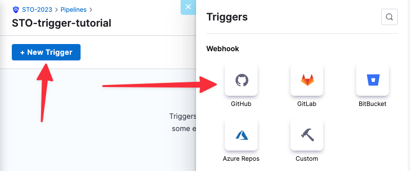
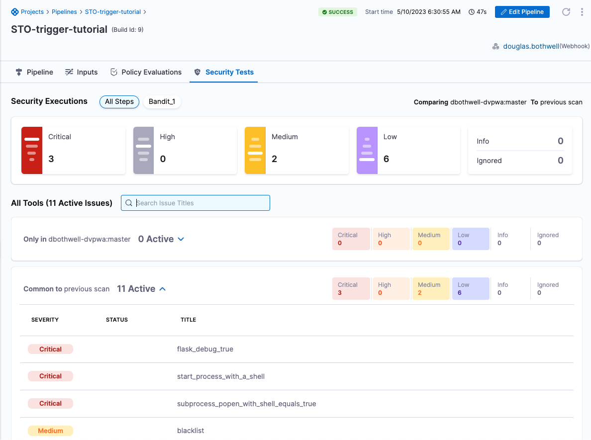

```mdx-code-block
import create_pipeline from './static/trigger-tutorial-00-create-pipeline.png'
import add_sto_stage from './static/trigger-tutorial-01-create-sto-stage.png'
```

This tutorial shows how you can set up a STO pipeline that runs a build and scans a code repository automatically in response to a Git event. You'll do the following:

* Add a webhook to the code repo that sends Git-event notifications to the Harness pipeline.
* Add a [Git trigger](/docs/platform/triggers/triggering-pipelines/) to the pipeline that responds to these notifications. 

:::info

This tutorial uses a [Python repository in Gitlab](https://gitlab.com/gitsequence090/TestPythonSAST) and [Bandit](https://github.com/PyCQA/bandit), an open-source tool designed to find common security issues in Python code.

You can use this workflow for other types of GitLab repositories. However, the specific scanner and setup for your scan step might be different. 

:::

## Before you begin

To do this tutorial, you need the following:

* A [GitLab](https://gitlab.com/) account. 
  * An SSH key to enable pushing updates to your repositories. For more information, go to [Use SSH keys to communicate with GitLab](https://docs.gitlab.com/ee/user/ssh.html) in the Gitlab documentation.
  * A Personal Access Token to enable pushing API requests. For information about the scopes to enable for your token, go to [GitLab connector settings reference](/docs/platform/connectors/code-repositories/ref-source-repo-provider/git-lab-connector-settings-reference/#passwordpersonal-access-token).
* A Harness [code repository connector](/docs/category/code-repositories) to your Git service.
* A Harness [Docker connector](/docs/platform/Connectors/Cloud-providers/ref-cloud-providers/docker-registry-connector-settings-reference)

## Set up the STO pipeline

1. In the Harness UI, click **Security Tests**, then **Pipelines**, then **Create a Pipeline**. 

   ```mdx-code-block
    
    ```

2. Enter a pipeline name and click **Start**. 

3. In the visual editor, add a **Security Tests** stage. 

    ```mdx-code-block
    
    ```

4. In **About your Stage**, do the following:

   1. Enter a name.

   2. In **Configure Codebase**, select your codebase connector and enter the repository that you want to scan.  
      
     

   3. Click **Set up Stage**. 


4. In **Infrastructure**, specify your build infrastructure. STO supports Cloud (Linux AMD64) and Kubernetes infrastructures.

5. In **Execution**, click **Add Step** and select **Bandit**. 

6. In **Configure Bandit**, specify the following:

   1. Scan Mode = **Orchestration**

   2. Target name  = ***your-name*-dvpwa**

   3. Target variaent = **<+codebase.branch>**

7. Click **Apply Changes** to return to the pipeline, 

8. Click **Run** (top right). In **Run Pipeline**, select **Git Branch** for the build type and **master** for the branch name. Then click **Run Pipeline** to ensure that the pipeline runs successfully as configured. 

## Add a trigger to your pipeline

Add a trigger to your pipeline that that listens for incoming requests on a webhook.

1. In the rop right of the visual editor, click **Triggers**. 

2. Click **New Trigger** and select the webhook for your Git service provider. 

   
   

3. In **Configuration**, specify the webhook as follows. This is a typical setup, where any event related to a merge request triggers a pipeline build. 

   1. Connector = The connector to your Git service provider.

   2. Repository Name = The repository you want to scan. 

   3. Event = **Merge Request**. 

   4. Select **Any Actions**. 

     

     
4. In **Conditions**, set the conditions for running the pipeline. The typical setup is to trigger a build based on the main or master branch of the repo.

   

5. In **Pipeline Input**, select **Git Branch** for the build type and enter **<+trigger.branch>** for the branch name. Then click **Create Trigger**. 

   

   The new trigger now appears in the Triggers table. Note that this table includes a **Webhook** column with a link.

6. Click the **Webhook** link to copy the webhook URL for this trigger to the clipboard. You will now add this webhook to your Git service. 

   


## Add the trigger webhook to your Git service

The steps to do this differ depending on the service you're using. These steps assume you're using GitLab.

1. Go to your GitLab project and choode **Settings** > **Webhooks** in the left menu. 

2. Enter the webhook URL and your GitLab personal access token. 

3. Select the **Merge request event** as the event type to trigger the webhook. 

4. Click **Add webhook** at the bottom of the page. 

## Create a Merge Request in GitLab

To verify that your trigger is working correctly, do the following:

1. Open a browser page and point it to the **Execution History** page for your Harness pipeline. 

2. Go to your GitLab repo, then create and approve a merge request. 

With the integration in place, the following events occur when you create a merge request in your GitLab repository:

  1. GitLab sends a request to the Harness webhook.
  
  2. The Harness pipeline starts a new build automatically, using information from the incoming request.  

  3. When the build finishes, you can see the scan results in the **Security Tests** tab. 

<figure>


<figcaption>Harness pipeline build launched from trigger</figcaption>
</figure>


<figure>



<figcaption>Scan results</figcaption>
</figure>