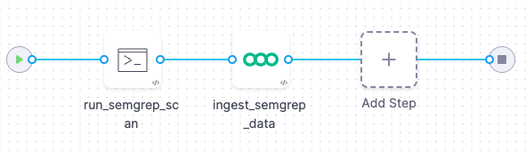
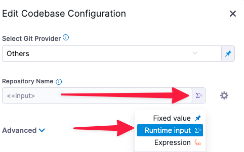
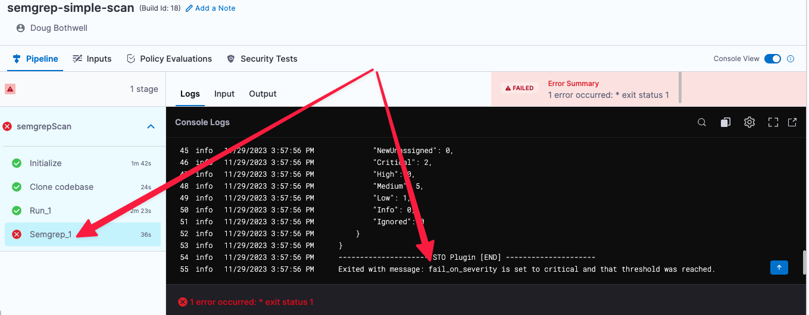
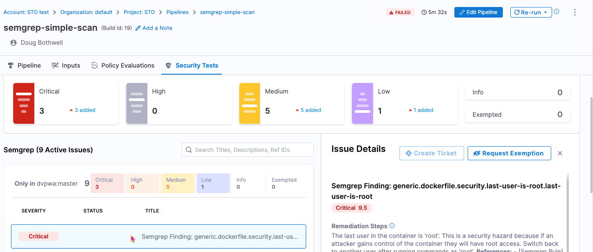
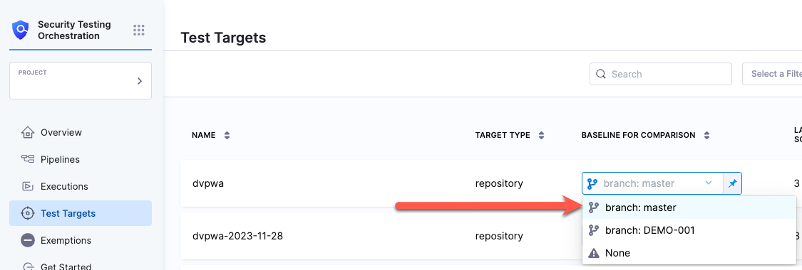

This tutorial shows you how to scan your codebases using [Semgrep](https://semgrep.dev), a popular code-scanning tool. Semgrep supports a [wide variety of languages](https://semgrep.dev/docs/supported-languages/) and includes a [free version](https://semgrep.dev/pricing/) for individuals who want to scan files locally. 

In this tutorial, you'll set up a simple [ingestion-only workflow](/docs/security-testing-orchestration/use-sto/orchestrate-and-ingest/ingest-scan-results-into-an-sto-pipeline) with two steps. The first step runs the scan; the second step ingests the results.



:::important important notes

- This tutorial uses the free version of Semgrep to run simple SAST scans. More advanced workflows are possible but are outside the scope of this tutorial.

- Semgrep scans use an agent that [uploads data to the Semgrep cloud](https://semgrep.dev/docs/metrics/) by default. Semgrep uses this data to improve the user experience. Therefore this tutorial is not suitable for air-gapped environments. 

- This tutorial has the following prerequisites:

  - A Harness account and STO module license.
  - A basic understanding of key STO concepts and good practices. Here are some good resources: 
    - [Codebase scans with Bandit tutorial](/tutorials/security-tests/sast-scan-bandit)
    - [Key Concepts in STO](/docs/category/key-concepts-in-sto)
  - A [code repo connector](/docs/continuous-integration/use-ci/codebase-configuration/create-and-configure-a-codebase/#code-repo-connectors) and an access token to your Git provider account.  
  - A Semgrep account login and access token. For specific instructions, go to [Getting started from the CLI](https://github.com/semgrep/semgrep#option-2-getting-started-from-the-cli) in the README on GitHub. 
  - Your Git and Semgrep access tokens must be stored as [Harness secrets](/docs/platform/secrets/add-use-text-secrets)


:::

### Set up your codebase

To do this tutorial, you need a codebase connector to your Git repository and an access token. A connector can specify a Git account (https://github.com/my-account) or a specific repository (https://github.com/my-account). 

This tutorial uses the [dvpwa repository](https://github.com/williamwissemann/dvpwa) as an example. The simplest setup is to fork this repository into your Git account and scan the fork. However, you can run your scans on any codebase that uses a language supported by Semgrep.  

### Set up your pipeline

Do the following:

1. Select **Security Testing Orchestration** (left menu, top) > **Pipelines** > **Create a Pipeline**. Enter a name and click **Start**. 

2. In the new pipeline, select **Add stage** > **Security Tests**. 

3. Set up your stage as follows:

   1. Enter a **Stage Name**.
   
   2. In **Select Git Provider**, select the connector to your Git provider account.
   
   3. In **Repository Name**, click the value type select (tack button) and select **Runtime Input**.

3. Go to **Infrastructure** and select **Cloud**, **Linux**, and **AMD64** or **ARM64** for the infrastructure, OS, and architecture.  
   
   You can also use a [Kubernetes](/docs/category/set-up-kubernetes-cluster-build-infrastructures) or [Docker](/docs/continuous-integration/use-ci/set-up-build-infrastructure/define-a-docker-build-infrastructure) infrastructure, but these require additional work to set up.   

<!-- 
4. Set up your codebase:

   1. Select **Codebase** (right menu).

   2. Select your codebase connector.

   3. Select **Runtime Input** as the value type for the repository name. You will specify the repo when you run the pipeline. 

        

-->

### Add the scan step

Now you will add a step that runs a scan using the local Semgrep container image maintained by Harness. 

1. Go to **Execution** and add a **Run** step. 

2. Configure the step as follows:

   1. Name = **run_semgrep_scan**


   2. Command = `semgrep /harness --sarif --config auto -o /harness/results.sarif`

      This command runs a [Semgrep scan](https://semgrep.dev/docs/cli-reference/#semgrep-scan-command-options) on your code repo and outputs the results to a [SARIF](/docs/security-testing-orchestration/use-sto/orchestrate-and-ingest/ingest-sarif-data) file.  

   3. Open **Optional Configuration** and set the following options:

      1. Container Registry — When prompted, select **Account** and then **Harness Docker Connector**. 

      2. Image = **returntocorp/semgrep**
      
      3. Add the following environment variable:
         
         - Key : `SEMGREP_APP_TOKEN`
         - Value : Click the type selector (right), set the value type to **Expression**, and enter the value `<+secrets.getValue("YOUR_SEMGREP_TOKEN_SECRET")>`. 

           

      2. Limit Memory = **4096Mi** (_Kubernetes or Docker infrastructures only_)


### Add the Semgrep (ingest) step

Now that you've added a step to run the scan, it's a simple matter to ingest it into your pipeline. Harness provides a set of customized steps for popular scanners such as Semgrep. 

1. In **Execution**, add a **Semgrep** step after your **Run** step.

2. Configure the step as follows:

   1. Name = `ingest_semgrep_data`

   2. Type = **Repository**

   3. Under Target:

      1. Name = Select **Runtime Input** as the value type.

      2. Variant = Select **Runtime Input** as the value type.

   4. Ingestion File = `/harness/results.sarif`

   5. Fail on Severity = **Critical**


### Run the pipeline and check your results

1. In the Pipeline Studio, select **Run** (top right).

2. When prompted, enter your runtime inputs.

   - Under **Codebase**, enter the repository and branch to scan.

   - Under **Stage: <_stage_name_>**, enter the [target name] and [variant] you want to use. In most cases, you want to use the repository for the target and the branch for the variant. 

   If you're scanning the codebase for the first time, enter the root branch of your repo. This is usually the `main` or `master` branch. 

   If you're scanning the [example repository](https://github.com/williamwissemann/dvpwa) mentioned above, enter `dvpwa` for the repository and target, and `master` for the branch and variant. 

3. Run the pipeline and then wait for the execution to finish.

   If you used the [example repository](https://github.com/williamwissemann/dvpwa) mentioned above, you'll see that the pipeline failed for an entirely expected reason: the Semgrep step is [configured to fail the pipeline](/docs/security-testing-orchestration/get-started/key-concepts/fail-pipelines-by-severity) if the scan detected any critical vulnerabilities. The final log entry for the Semgrep step reads: `Exited with message: fail_on_severity is set to critical and that threshold was reached.`

   

3. Select **Security Tests** and examine any issues detected by your scan.

   

### Specify the baseline

:::tip

It is [good practice](/docs/security-testing-orchestration/get-started/key-concepts/targets-and-baselines#why-you-should-define-a-baseline-for-every-sto-target) to specify a baseline for every target. Defining a baseline makes it easy for developers to drill down into “shift-left” issues in downstream variants and security personnel to drill down into “shift-right” issues in the baseline.

:::

1. Select **Test Targets** (left menu).

2. Select the baseline you want for your target. 




### YAML pipeline example

```yaml

pipeline:
  name: semgrep-simple-scan
  identifier: semgrepsimplescan
  projectIdentifier: MY_PROJECT
  orgIdentifier: MY_HARNESS_ORG
  tags: {}
  stages:
    - stage:
        name: semgrep_tutorial_test_stage
        identifier: semgrep_tutorial_test_stage
        description: ""
        type: SecurityTests
        spec:
          cloneCodebase: true
          platform:
            os: Linux
            arch: Arm64
          runtime:
            type: Cloud
            spec: {}
          execution:
            steps:
              - step:
                  type: Run
                  name: run_semgrep_scan
                  identifier: run_semgrep_scan
                  spec:
                    connectorRef: account.harnessImage
                    image: returntocorp/semgrep
                    shell: Sh
                    command: semgrep /harness --sarif --config auto -o /harness/results.sarif
                    envVariables:
                      SEMGREP_APP_TOKEN: <+secrets.getValue("MY_SEMGREP_KEY")>
              - step:
                  type: Semgrep
                  name: ingest_semgrep_data
                  identifier: ingest_semgrep_data
                  spec:
                    mode: ingestion
                    config: default
                    target:
                      name: <+input>
                      type: repository
                      variant: <+input>
                    advanced:
                      log:
                        level: info
                      fail_on_severity: critical
                    ingestion:
                      file: /harness/results.sarif
  properties:
    ci:
      codebase:
        connectorRef: MY_GIT_CONNECTOR
        repoName: <+input>
        build: <+input>


```