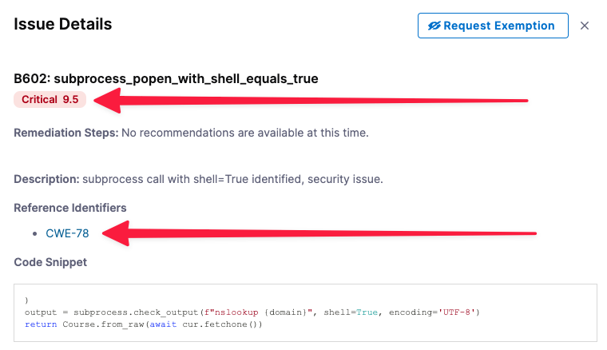

This tutorial shows you how to use the Harness Security Testing Orchestration (STO) module to perform code security scanning in a Harness pipeline. You'll set up a pipeline with one scanner, run scans, analyze the results, and learn the key features of STO.

This tutorial covers standalone or "audit-only" workflows that don't require any other Harness components. In the  [Create an integrated STO/CI pipeline](./cicd-integrated-pipeline.md) tutorial, you'll learn how to integrate STO into Harness CI and CD workflows and protect your repos, containers, and artifacts from vulnerabilities automatically.

## Objectives

You'll learn how to:

1. Run the Pipeline and analyze the security issues found by the scanner.
2. Select a baseline for your test targets and use the baseline to identify  issues in a development branch only vs. issues also found in the baseline branch.
3. View issue details in the Harness UI and use these details to pinpoint and resolve issues in your code.

## Before you begin

You must perform all the required steps in [Set Up Harness for STO](/docs/security-testing-orchestration/get-started/onboarding-guide). This topic describes how to do the following:

1. Add the necessary user roles for your developers and security personnel.
2. Set up your build infrastructure.
3. Create connectors to your Git and Docker Hub repos.
4. Create a pipeline with a Bandit step that scans a Python repository with known vulnerabilities.

You will use a clone of this pipeline in these tutorials.

<!-- 
<details open><summary> Review: ingestion workflows</summary>

```mdx-code-block
import StoSupportedMethods from '/docs/security-testing-orchestration/sto-techref-category/shared/_sto-supported-methods.md';
```

<StoSupportedMethods />

</details>

-->

<details open><summary> Review: what's supported in Harness STO</summary>

Go to [What's supported in Harness STO](/docs/security-testing-orchestration/whats-supported) for information about all supported STO features, infrastructures, and third-party scanners. 

</details>

### Stand-alone STO workflows

You're a developer, working in various development branches and merging your code updates. You want to make sure you don't introduce any new vulnerabilities when you merge your code into a target branch. Using STO, you can scan your repo automatically and then use the results to pinpoint and fix your vulnerabilties before you do any merge.

This Pipeline has only one scanner but you can easily add more later. For the list of supported scanners, see [Security step settings reference](/docs/security-testing-orchestration/sto-techref-category/security-step-settings-reference).

## Clone your STO base pipeline

1. Go to the project with the [base STO pipeline](/docs/security-testing-orchestration/get-started/onboarding-guide/#create-an-sto-pipeline) project.
2. Click the top-right menu, choose **Clone**, and save the new pipeline as **STO Tutorial 1**.

   

## Scan step configuration


```mdx-code-block
import set_up_harness_26 from './static/configure-bandit-step.png'
```

Let's look at the Bandit step to see how it's configured.

1. In your new pipeline, go to **securityTestStage** and open the **banditScan** step.

	```mdx-code-block
	
	```

2. Let's review the user-configured settings.

	<table>
		<tr>
			<th>Setting</th>
			<th>Value</th>
			<th>Description</th>
		</tr>
		<tr>
			<td>Scan Mode</td>
			<td>Orchestration</td>
			<td>Indicates that this is an <a href="/docs/security-testing-orchestration/sto-techref-category/security-step-settings-reference#data-ingestion-methods">orchestrated scan</a> as opposed to a ingestion-only or data-upload scan. </td>
		</tr>
		<tr>
			<td>Target Name</td>
			<td><code>dvpwa</code></td>
			<td>Every STO scan has a <a href="/docs/security-testing-orchestration/get-started/key-concepts/targets-and-baselines">target name</a>, which is a user-defined label for the code repository, container, application, or configuration to scan. </td>
		</tr>
		<tr>
			<td>Target Variant</td>
			<td><code>&lt;+codebase.branch&gt;</code></td>
			<td>Every STO scan has a specified <a href="/docs/security-testing-orchestration/get-started/key-concepts/targets-and-baselines">variant</a> that specifies the branch, tag, or other target variant to scan.  </td>
		</tr>
	</table>

<details open><summary> Key concept: scanner templates</summary>

The Step library includes a Security step for setting up scanners: open the step and configure the scan as a set of key/value pairs under Settings.

The Step Library also includes <a href="/docs/security-testing-orchestration/sto-techref-category/security-step-settings-reference#security-steps-and-scanner-templates">scanner templates</a> for popular scanners such as Bandit, OWASP, Snyk, Grype, and SonarQube. These steps have preconfigured options that greatly simplify the process of setting up a scanner. 

In the Bandit scanner template, for example, the **Scan Configuration** and **Target Type** fields are read-only because each option supports one option only. If a scanner supports multiple target types, such as repositories and container images, **Target Type** is editable and the menu is pre-populated with the supported target types. 

</details>

## Viewing security test results

<details open><summary> Key concept: scan targets</summary>
Every instance of a scanner has a specific <i>target</i>, which is the object it is set up to scan. It might be a repo, a container, or an instance. This pipeline uses <a href="https://bandit.readthedocs.io/en/latest/">Bandit</a> to scan the target repository <a href="https://github.com/williamwissemann/dvpwa">https://github.com/williamwissemann/dvpwa</a> (specified in the <a  href="/docs/continuous-integration/use-ci/codebase-configuration/create-and-configure-a-codebase/">Codebase</a> for this pipeline).

</details>

Now that you've set up the pipeline, you can run a scan and view the detected issues.

1. Click **Save**, and then click **Run**.
2. Select **Git Branch**, enter **master** for the branch name, and then click **Run Pipeline**.
3. When the pipeline finishes, click the **Security Tests** tab to see the dashboard.

The **Security Tests** tab shows the issues that the scanner found in the test target, categorized by severity. The scanner found two issues, one critical and one medium, in the master branch.


## Set the baseline

<details open><summary> Key concept: baselines</summary> 

A _target baseline_ identifies the "prod" variant of the target, such as the main branch or the latest tag. Defining a baseline makes it easy to identify “shift-right” issues in production targets and “shift-left” issues in downstream variants.

Note the following:

- Harness strongly recommends that you <a href="/docs/security-testing-orchestration/use-sto/set-up-sto-pipelines/set-up-baselines">specify a baseline for every target</a>. 

- You can specify target baselines using regular expressions as well as fixed strings. Regular expressions are useful when the "prod" variant updates with each new release. 

</details>
  
As a developer, you want to ensure that your merge or update doesn't introduce any new issues. To do this, you create a baseline for your test target and compare your scans against the baseline.

1. Click **Security Tests** (left menu), then **Test Targets** (second-from-left menu).
2. For the **dvpwa** target, click **Baseline for Comparison** and select **branch :** **master** in the pulldown menu.
 
  


## Compare baseline vs. downstream issues 

Suppose you're developing a new feature. You're working in a branch DEMO-001 that's downstream from the master branch. As a developer, you want to fix any "shift-left" issues in your downstream branch BEFORE you merge into the baseline. 

First, you want to see if your branch has any security issues that aren't in master.

* Run your pipeline again with **DEMO-001** as the branch name.
* When the pipeline finishes, go to the **Security** **Tests** tab.

Your branch has 5 security issues: 2 critical, 2 medium, 1 low. Note that 3 of these issues are in the DEMO-001 branch only and 2 are common to both DEMO-001 and master.


 

## Fixing vulnerabilities

<details open><summary>Key Concept: Issues and occurrences</summary>  
When Harness processes the security issues identified in a scan, it deduplicates the results. <i>Deduplication</i> is the aggregation of multiple occurrences with the same root cause into one issue. 

Note the following as you troubleshoot and fix your security issues: 

- Each security issue you see in the **Security Tests** page is unique and requires its own resolution.
- A single issue might have multiple occurrences throughout the target. To fix an issue, you must fix all occurrences of that issue.

</details>

The Issue Details pane has useful information for troubleshooting your security vulnerabilities. 

1. Expand the **Common to dvpwa:master** list (bottom left) and select the critical issue **sB602: subprocess_popen_with_shell_equals_true**. The Issue Details pane opens.

  

	+ The severity score **9.5** is based on the [NIST Common Vulnerability Scoring System](https://nvd.nist.gov/vuln-metrics/cvss) (CVSS) version 3.0:
		- None 0.0
		- Low 0.1 - 3.9
		- Medium 4.0 - 6.9
		- High 7.0 - 8.9
		- Critical 9.0 - 10.0
	+ The **Occurrences List** shows all occurrences of this specific issue in the test target.

2. Select the Reference Identifier link ([CWE-78](https://cwe.mitre.org/data/definitions/78.html)).

   **Issue Details** includes specific information about each vulnerability. In this case, you can view detailed information about the issue in the Common Weakness Enumeration database, a community-developed list of software and hardware weakness types. 

3. Examine the **Occurrences** list for this issue. (You might need to scroll down in the pane.) Here you can find additional details about each individual occurrence of the issue. Note that, to eliminate this vulnerability from the repo, you can need to fix multiple occurrences in multiple files:
	
   

<details open><summary>Key Concept: Issues details are derived from the external scanner</summary>  

Many of the details you see for each issue are derived from the external scanner. These details can differ, depending on the scan tool you're using. In this tutorial we're using Bandit, which is a free, open-source scan tool. In general, paid scanners provide more extensive details (such as remediation steps) than free ones.

Here's an example of a container image vulnerability detected by a paid version of Snyk:


</details>

### New feature: AI-enhanced remediation 

Harness AIDA&#174 uses state-of-the-art AI technology to streamline the process of triaging and fixing security vulnerabilities. Harness AIDA is based on large, well-trained language models. It learns continuously based on feedback and the latest public knowledge. Optionally, you can regenerate advice with additional context and thereby optimize your results. 

Harness AIDA is currently in beta. For more information, go to [Fix issues using AI-enhanced remediation steps](/docs/security-testing-orchestration/use-sto/view-and-troubleshoot-vulnerabilities/ai-based-remediations).


## Congratulations!

In this tutorial you've learned how to set up a scanner, create a baseline, analyze scan results, and use the data collected by STO to pinpoint and fix vulnerabilities *before* you merge your code updates.

Proceed to [Tutorial 2](./cicd-integrated-pipeline.md) to learn how you can use STO to protect repos, images, and artifacts from vulnerabilities automatically.