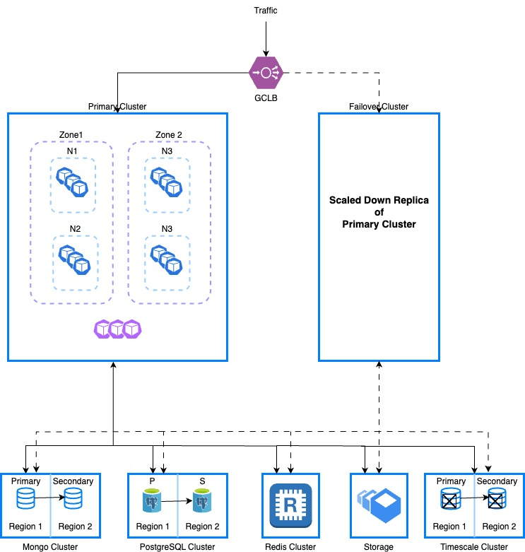

import Tabs from '@theme/Tabs';
import TabItem from '@theme/TabItem';

This tutorial shows you how to set up a disaster recovery (DR) cluster with external data storage and covers best practices for DR setup in Harness Self-Managed Enterprise Edition.

Harness recommends that you create a multi-node cluster spread across different availability zones of a data center for better node failure tolerance. 



## Prerequisites

The following prerequisites are needed.

Each provisioned cluster should have:

- Enough resources allocated for both a primary & a DR cluster to support the installation of Harness Helm charts.

- Access to persistent storage.

External data storage must support:

- Replication of data.

- Primary database must be reachable by both the primary and a DR cluster.

- SSL support between primary and secondary database nodes.

## Set up an external database

<Tabs>
  <TabItem value="mongo" label="MongoDB" default>

To set up an external MongoDB, do the following:

1. Deploy a replica set. For more information, go to [Deploy a Replica Set](https://www.mongodb.com/docs/manual/tutorial/deploy-replica-set/) in the MongoDB documentation.

2. Get the MongoDB credentials by accessing the **MongoDB Cloud → Database** Access section.

3. Encode the credentials using command below. 

   ```
   echo -n 'YOUR_MONGODB_USERNAME' | base64
   echo -n 'YOUR_MONGODB_PASSWORD' | base64
   ```

4. Create a `mongo-secret.yaml` file.

5. Paste the encoded credentials in your `mongo-secret.yaml` file.

   ```yaml
   apiVersion: v1
   kind: Secret
   metadata:
     name: mongo-secret
   type: Opaque
   data:
     keyone: <YOUR_BASE64_ENCODED_USERNAME>
     keytwo: <YOUR_BASE64_ENCODED_PASSWORD>
   ```

6. Apply your `mongo-secret.yaml` file.

   ```
   kubectl apply -f mongo-secret.yaml -n <namespace>
   ```

7. Add the following external MongoDB-specific changes in your override file.

   ```yaml
   global:  
     database:
       mongo:
         # -- set this to false if you want to use external mongo
         installed: false
         # --  provide default values if mongo.installed is set to false
         # --  generates mongo uri protocol://hosts?extraArgs
         protocol: mongodb+srv
         hosts:
         #mongo host names from atlas mongo cloud
         - smp-xx-yy-0-zzz.u2poo.mongodb.net
         secretName: mongo-secret
         userKey: user
         passwordKey: password
         extraArgs: ""
   platform:
     access-control:
       mongoSSL:
           enabled: true
       mongoHosts:
       - smp-xx-yy-0-shard-00-00-zzz.xyz1.mongodb.net:27017
       - smp-xx-yy-0-shard-00-00-zzz.xyz2.mongodb.net:27017
       - smp-xx-yy-0-shard-00-00-zzz.xyz3.mongodb.net:27017
       - smp-xx-yy-0-shard-00-00-zzz.xyz4.mongodb.net:27017
   ```

</TabItem>
  <TabItem value="postgres" label="Postgres">

To set up an external Postgres database using Google CloudSQL, do the following:

1. Sign in to your Google console.

2. Select the project where you want to create your CloudSQL database.

3. Create a Postgres with CloudSQL instance.

4. Specify the following details.

   a. Enter your instance name and password. Save this password to use as a secret when you deploy the SMP cluster.

   b. Select Postgres version 14.

   c. Select production for the deployment environment. This ensures HA/DR for Postgres.

   d. Enable automated backups.

5. Select your database instance to go the Details page.

6. Select the **Backup** tab.

7. Configure the backup window and retention settings as per your requirements.

8. Select **Save**.

#### Set up read replica for replication

To set up read replica for replication, do the following:

1. In the navigation menu, go back to **SQL**.

2. Select your PostgreSQL instance.

3. Select the **Replicas** tab.

4. Select **Create read replica**.

5. Choose a different region to ensure high availability.

6. Configure other settings as required, and then select **Create**.

#### Configure failover

To configure failover, do the following:

1. After you create your replica, select it to go to its Details page.

2. Select the **Replication** tab.

3. Set up automatic promotion to a master instance in case the primary instance fails.

4. Select **Save**.

#### Configure cross-region replication

To configure cross-region replication, do the following:

- Repeat the steps in [Set up read replica for replication](#set-up-read-replica-for-replication), but choose another region to add another layer of redundancy.

#### Configure routing policies

Configure DNS or load balancer to redirect traffic automatically to the standby system in a different region in case of a disaster. Make sure the CloudSQL instance is paired with the Harness Self-Managed Enterprise Edition cluster using a private pairing.

Select the NAT of the Harness Self-Managed Enterprise Edition cluster here. This will create a VPC with the Harness Self-Managed Enterprise Edition cluster and allow Harness services running inside cluster to have access to CloudSQL.

#### Create a secret

To create a secret, do the following:

1. Get the Postgres database username and password for the Postgres cluster you set up in step 4 of [Configure an external Postgres instance using Google CloudSQL](#configure-an-external-postgres-instance-using-google-cloudsql).

3. Run the following command to encode the credentials.

   ```
   echo -n 'YOUR_POSTGRES_USERNAME' | base64
   echo -n 'YOUR_POSTGRES_PASSWORD' | base64
   ```

4. Create a `postgres-secret.yaml` file.

   ```yaml
   apiVersion: v1
   kind: Secret
   metadata:
     name: postgres-secret
   type: Opaque
   data:
     user: <YOUR_BASE64_ENCODED_USERNAME>
     password: <YOUR_BASE64_ENCODED_PASSWORD>
   ```

5. Apply your `postgres-secret.yaml` file.

   ```
   kubectl apply -f postgres-secret.yaml -n <namespace>
   ```

6. Add the following external Postgres-specific changes in your override file.

   ```yaml
   global:
     database:
       postgres:
         ## - set this to false if you want to use external postgres cluster
         installed: false
         ## - protocol to use for connection
         protocol: postgres
         ## - host array for external
         hosts:
           - postgres:5432
         ## - secret name containing external values
         secretName: ""
         ## - key within secret containing username
         userKey: ""
         ## - key within secret containing password
         passwordKey: ""
         ## - extra arguments set to connection string
         extraArgs: ""
   ```

</TabItem>
  <TabItem value="redis" label="Redis">

To set up an external Redis database, do the following:

1. Set up your Google Cloud environment.

   a. Sign in to the GCP Console and select or create your project.

   b. Ensure you have the required quotas for Compute Engine instances and storage in your desired regions.

2. Deploy Redis Enterprise in the primary region.

   a. Navigate to the GCP Marketplace and search for Redis Enterprise Cloud.

   b. Follow the instructions to deploy Redis Enterprise to your primary region.

   c. Access the Redis Enterprise admin console to manage and configure your cluster.

3. Deploy Redis Enterprise in the secondary region. Repeat the process in step 2 above to deploy another Redis Enterprise cluster in your secondary region.

4. Set up cross-region networking.

   a. Ensure both Redis Enterprise deployments can communicate.

   b. Use VPC network peering to enable communication between the VPCs of the two regions.

5. Configure your Redis database to be an active-active Conflict-Free Replicated Database (CRDB).

   a. In Redis Enterprise, you can use a CRDB setup for geo-distributed DR capabilities. From the Redis Enterprise admin console in the primary region, create a new CRDB.

   b. Add your primary and secondary clusters to the CRDB configuration.

   c. Configure other CRDB settings per your requirements, such as conflict resolution.

6. Configure the applications to connect to the CRDB. Ensure that your applications can handle any conflicts or issues that might arise from the active-active configuration.

7. Add the following external Redis-specific changes in your override file.

   ```yaml
   global:
     database:
       redis:
         installed: false
         hosts:
         - <YOUR_INTERNAL_ENDPOINT_WITH_PORT>
         secretName: ""
         userKey: ""
         passwordKey: ""
   ```

</TabItem>
  <TabItem value="timescale" label="TimescaleDB">

To set up an external Timescale database, do the following:

1. Create an account at [Managed Service for TimescaleDB](https://portal.managed.timescale.com/login).

2. Set up VPC peering with the cloud provider.

   a. Go to VPC in Timescale cloud and create a new VPC connection. Make sure the IP CIDr range doesn't conflict with the cloud-provider’s VPC range.
   b. Go to the cloud provider and initiate VPC peering by providing the project ID and VPC network.

3. Go to Timescale Services and create a service in the same region. 

   a. Select Timescale version 14.
   b. Set other configurations as per your requirements.
   c. Under Allowed IP addresses, set the IPv4 service range and Cluster Pod IPv4 range so traffic from the cluster is able to connect to TimescaleDB.

:::info note
TimescaleDB cloud only supports SSL. For more information, go to [Timescale security](https://docs.timescale.com/use-timescale/latest/security/overview/#networking-security) in the Timescale documentation.

:::

4. Create two databases, `harness` and `harnessti`.

5. Create two secrets, `tsdb-secret` containing the username and password, and `tsdb-cert`, containing the certificate.

   ```yaml
   apiVersion: v1
   kind: Secret
   metadata:
     name: tsdb-secret
   type: Opaque
   data:
     username: YOUR_USERNAME
     password: YOUR_PASSWORD
   ```

   ```yaml
   apiVersion: v1
   kind: Secret
   metadata:
     name: tsdb-cert
   type: Opaque
   data:
     cert: <YOUR_BASE64_ENCODED_CERT>
   ```

7. Add the following external Timescale-specific changes in your override file.

   ```yaml
   global:
     database:
       timescaledb:
         installed: false
         # --  provide default values if mongo.installed is set to false
         hosts:
           - hostname.timescale-cloud.a.com:27597
         secretName: "tsdb-secret"
         userKey: "username"
         passwordKey: "password"
         certName: "tsdb-cert"
         certKey: "cert"
   ```

</TabItem>
</Tabs>

## Set up the DR cluster

To use the Harness Self-Managed Enterprise Edition Helm chart with DR configuration, the following requirements must be met:

- Set the DR variable to `true` in the `override.yaml` file before you deploy to the cluster to the DR cluster.

   ```yaml
   global:
         dr:
           createCluster: true
   ```

- Use the command below to create the DR cluster.

   ```
   helm install <releaseName> harness/ -n <namespace> -f override.yaml
   ```

## Switch to the DR cluster

To ensure business continuity for any unplanned primary cluster failure, you can switch to DR cluster.

To switch to the DR cluster, do the following:

:::danger Disable ingress/load balancer
Before activating the DR cluster, ensure that you disable the ingress/load balancer to prevent concurrent writes to the datastore.

:::

After traffic to the Harness primary cluster is cut-off, you can take it down before starting the DR cluster.

1. Run the following Helm command to uninstall.

   ```
   helm uninstall <release name> -n <namespace>
   ```

2. Update the following flags in the `override.yaml` file before you upgrade the DR cluster.

   ```yaml
   global:  
         dr:
           activateCluster: true
           runConfigChecks: true
   ```

3. Run the Helm upgrade command to connect to the DR cluster.

   ```
   helm upgrade <release name> harness/ -f override.yaml
   ```

4. Make sure the DR cluster is in a healthy state and all pods are running before you route traffic to it.
