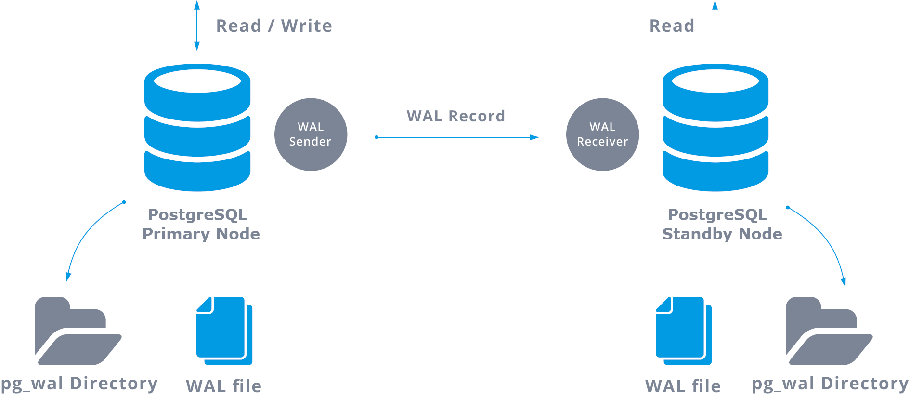
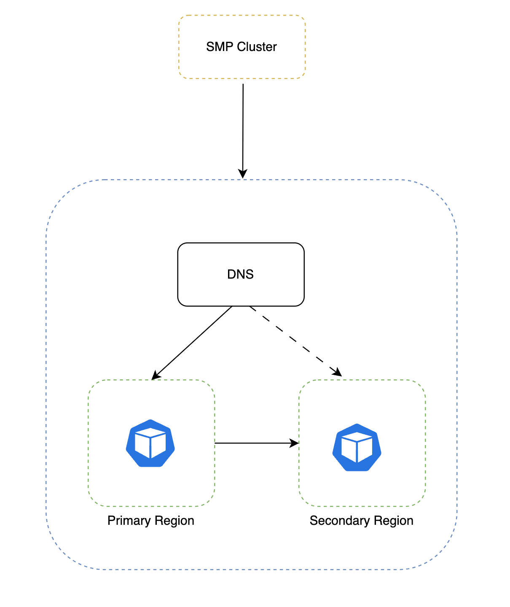

Self-Managed Enterprise Edition requires you to install a database by default. You can optionally use an external self-managed database with your Self-Managed Enterprise Edition installation. This enables you to separate your data from node execution. To use an external PostgreSQL database with your Harness Self-Managed Enterprise Edition installation, you must ensure that your hardware, software, and network meet the minimum requirements for installation and configuration. This tutorial describes how to deploy PostgreSQL with VMs and replication.

The controller-worker replication setup described in this tutorial ensures data redundancy and fault tolerance, providing a robust and reliable environment to manage your PostgreSQL database.

## Limitations

PostgreSQL VMs offer many advantages, but there are a few limitations to consider:

- Resource overhead: Running a VM incurs resource overhead, such as CPU and memory usage, which may impact the performance of the PostgreSQL database.

- Hardware dependency: VM performance is influenced by the underlying hardware. Ensure that the host system provides sufficient resources for the VM to function optimally.

- Complexity: Setting up and managing a VM requires knowledge and expertise in virtualization technologies.

- Maintenance overhead: VMs require regular maintenance, including updates, backups, and monitoring, which adds overhead compared to a native PostgreSQL installation.

## Hardware requirements

Harness recommends a PostgreSQL three-member replica set configuration with the following minimum hardware:

- Three nodes
- Four CPU (3*4 = 12 CPU)
- 24GB RAM (3*16 = 48GB RAM)
- 300GB SSD data storage, depending on your requirements

## Software requirements

External database setup requires the following software:

- Supported OS (Postgres supports most platforms, including Linux, MacOS, Windows, FreeBSD, OpenBSD, NetBSD, AIX, HP/UX, and Solaris)

    For details, go to [PostgreSQL supported platforms](https://www.postgresql.org/docs/current/supported-platforms.html) in the PostgreSQL documentation.

- PostgreSQL supported version 14

## Network requirements

Ensure the following:

- Set allowlisting of VMs so each VM can send traffic. Add the source using PostgreSQL, for example, the Kubernetes cluster service range to your allowlist.

- Reserve internal and external static addresses for each VM.

- Add port 5432 to the NAT firewall settings allowlist on the application cluster so it can connect to the PostgreSQL instance. PostgreSQL uses 5432 as the default communication port. This enables communication between Harness services running in a Self-Managed Enterprise Edition cluster and a self-managed PostgreSQL cluster.

## Architecture



PostgreSQL streaming replication, the most common PostgreSQL replication, replicates the changes on a byte-by-byte level, creating an identical copy of the database in another server. It is based on the log shipping method. The write-ahead log (WAL) records are moved directly moved from one database server to be applied to another server.

You can perform WAL transfers in two ways:

- Transfer WAL records one file (WAL segment) at a time (file-based log shipping)

- Transfer WAL records on the fly (record based log shipping), between a primary server and one or more standby servers, without waiting for a full WAL file

When you configure streaming replication, you have the option to enable WAL archiving. WAL archiving is not required, but it is extremely important for robust replication setup. Robust replication setup avoid prevents the main server from recycling old WAL files that have not been applied to the standby server. If this occurs, you must recreate the replica.

### High availability

To create a highly-available setup, there will be a DNS record that always points to the primary node of your PostgreSQL replication setup. You can use service discovery with a third-party tool (etcd/Consul/Zookeeper) to track your current primary node's IP address and health status.

You can update the DNS record dynamically using a script or use the service discovery tool's built-in functionality.



## Set up PostgreSQL VMs

:::caution
If you installed PostgreSQL through a method other than the apt package manager maintained by Debian or Ubuntu archive, you may receive errors when following these instructions. Harness recommends that you uninstall existing PostgreSQL installations before you continue.
:::

To set up a PostgreSQL VM, do the following:

1. Connect to the VM and make sure you are running as root to prevent permission issues.

   ```
   sudo su -
   ```

2. Change to the home directory.

   ```
   cd /home
   ```

3. Add the PostgreSQL third-party repository to get the latest PostgreSQL packages.

   ```
   sudo sh -c 'echo "deb Index of /pub/repos/apt/  $(lsb_release -cs)-pgdg main" > /etc/apt/sources.list.d/pgdg.list'
   ```

4. Add the PostgreSQL third-party repository.

    ```
    wget --quiet -O - https://www.postgresql.org/media/keys/ACCC4CF8.asc | sudo apt-key add -
    ```

5. Update your local repository list.

   ```
   sudo apt-get update
   ```

6. Install PostgreSQL.

   ```
   apt-get install postgresql-14
   ```

## Configure replication

When you configure your replication, you will make some updates to controllers and replicas and other updates to only controllers or only replicas.

To configure replication, do the following:

1. Run the following on one of your replicas.

   ```
   sudo su - postgres
   ssh-keygen -t rsa

   // enter three times and generate a key
   // copy the public key in /var/lib/postgresql/.ssh/id_rsa.pub
   ```

2. Copy the key to the other replicas in the same directory `/var/lib/postgresql/.ssh/`.

3. Run the following on your controller.

   ```
   sudo su - postgres
   mkdir .ssh
   cd .ssh
   vi authorization_key

   // paste the public key, enter and paste it again and save, the second key should end with postgres@externalIP
   ```

4. Make the following change to the `pg_hba.conf` file in `/etc/postgresql/14/main/pg_hba.conf` for your controller and replicas. This allows PostgreSQL to accept traffic from other networks and adds them to the allowlist.

   ```
   #host   all             all             127.0.0.1/32           md5
   host    all             all             0.0.0.0/0              md5
   ```

   This example allows everything to the PostgreSQL instance. Harness recommends that you configure your firewall rules to allow only certain IPs to use port 5432.

5. (Optional) Make the following changes to set your allowlist at the database-level.

   ```
   #host    all             all             127.0.0.1/32            md5 <— changes
    host    all             all             <ip range1>             md5 <— changes
    host    all             all             <ip range2>             md5 <— changes
    host    all             all             <replica ip range>      md5 <— changes
    host    all             all             <controller ip range>   md5 <— changes
   ```

6. Change your directory to edit the `postgresql.conf` configuration file.

   ```
   cd /etc/postgresql/14/main/
   ```

7. Set `max_wal_senders` to the number of replicas. Set `max_replication_slots` to the number of replicas plus two. Edit or add the following settings.

   ```
   listen_addresses = '*'
   wal_level = replica
   archive_command = 'test ! -f /var/lib/postgresql/14/main/archive/%f && cp %p /var/lib/postgresql/14/main/archive/%f'
   archive_mode = on
   max_wal_senders = 2
   max_replication_slots = 4
   ```

8. In your controller only, make sure you are running as Postgres.

   ```
   sudo su - postgres
   ```

9. Create an archive directory in `/var/lib/postgresql/14/main`.

   ```
   cd /var/lib/postgresql/14/main
   mkdir archive
   ```

10. Add the following line to the bottom of your pg_hba.conf file.

    ```
    host  replication reptest <External IP of Replica>/32  md5
    ```

11. Create a new user, `reptest`.

    ```
    psql
    CREATE ROLE reptest WITH REPLICATION PASSWORD 'testpassword' LOGIN;
    ```

    ```
    sudo su - postgres
    run psql
    ```

12. Create the first replication slot at the psql slot. You can use any name. This example uses `replica_1_slot`.

    ```
    SELECT * FROM pg_create_physical_replication_slot('replica_1_slot');
    ```

   Repeat this step for each replica.

13. Restart PostgreSQL.

    ```
    sudo su -
    service postgresql restart 
    ```

### Initiate replication

After you've completed the above steps, you can initiate your replication. Follow the steps below for your replicas only.

To initiate replication, do the following:

1. Stop the PostgreSQL service.

   ```
   sudo su -
   service postgresql stop
   ```

2. Copy the existing data and create a backup.

   ```
   sudo su - postgres
   cd /var/lib/postgresql/14
   mv main main.org
   mkdir main
   ```

3. Restore from the base backup, using the IP address of the primary database and the replication username.

   ```
   pg_basebackup -h <primary> -p 5432 -U reptest -D /var/lib/postgresql/14/main/ -Fp -Xs -R
   ```

4. Create a `standby.signal` file in your data directory.

   ```
   touch /var/lib/postgresql/14/main/standby.signal
   chmod -R 0700 /var/lib/postgresql/14/main
   ```

   When PostgreSQL finds a `standby.signal` file in its data directory, it starts in recovery mode and streams the WAL through the replication protocol.

5. Restart PostgreSQL in your replicas.

   ```
   sudo su -
   service postgresql restart
   ```

6. Run the following to check the logs and verify that the replica works. 

   ```
   tail -f /var/log/postgresql/postgresql-14-main.log
   ```

   The output should be similar to the following.

   ```
   LOG:  entering standby mode
   LOG:  redo starts at 0/3000138
   LOG:  database system is ready to accept read only connections
   LOG:  started streaming WAL from primary at 0/4000000 on timeline 1
   ```

7. Add entries to your primary instance to verify your replica is synchronized with the primary database and prepared to stream.

## Configure Helm charts

Follow the steps below to set up a Harness Self-Managed Enterprise Edition cluster with an external PostgreSQL database.

1. Run the following command using the PostgreSQL database name and password for your PostgreSQL to encode the credentials.

   ```zsh, bash
   echo -n 'YOUR_POSTGRES-USERNAME' | base64
   echo -n 'YOUR_POSTGRES_PASSWORD' | base64
   ```
2. Create a `postgres-secret.yaml` file.

   ```yaml
   apiVersion: v1
   kind: Secret
   metadata:
     name: postgres-secret
   type: Opaque
   data:
     user: BASE64_ENCODED_USERNAME
     password: BASE64_ENCODED_PASSWORD
   ```

3. Run the following command to create a `postgres-secret` in your Harness Self-Managed Enterprise Edition cluster.
   
   ```
   kubectl apply -f postgres-secret.yaml -n <namespace>
   ```

4. Update your `override-prod.yaml` file with the following fields.

   ```yaml
   global:
      database:
         postgres:
         ## - Set this to false to use an external postgres cluster
         installed: false
         ## - set the protocol for postgres
         protocol: postgres
         ## - host array for external
   hosts:
      - postgres:5432
        ## - provide the secret name to reference postgres username and password
        secretName: "postgres-secret"
        ## - provide the userKey within secret containing username
        userKey: "user"
        ## - provide the passwordKey to reference postgres password
        passwordKey: "password"
        ## - set additional arguments to connection string
        extraArgs: ""
   ```

5. Run Helm install.

   ```
    helm install <release-name> harness/harness-prod -n <namespace> -f override-prod.yaml
   ```

## Backup and restore

Most cloud providers support data backup and restore strategies. For self-managed PostgreSQL clusters, you can use PostgreSQL dump and restore.

```
pg_dump -h <source_host> -U <source_username> -d <source_database> > /data/dump.sql
```
```
psql -h <destination_host> -U <destination_username> -d <destination_database> < /data/dump.sql
```

You can also use storage backup or cluster backup with tools like Velero or similar third-party solutions for periodic cluster backup. Third-party solutions, including WAL-E, enable you to configure continuous PostgreSQL archiving.

## FAQs

### Can I migrate an existing PostgreSQL database to a VM?
Yes, you can migrate an existing PostgreSQL database to a VM by performing a backup of the database on the source system and restoring it on the VM.

### Can I take snapshots of the PostgreSQL VM for backups?
Yes, most virtualization platforms support snapshotting, which allows you to take point-in-time snapshots of the VM, including the PostgreSQL data.

### What are the security considerations for a PostgreSQL VM?
Ensure that the VM and the PostgreSQL installation are properly secured by applying security updates, using strong passwords, restricting network access, and implementing encryption where necessary.

### Can I resize the resources allocated to the VM later?
Yes, VMs allow you to dynamically adjust the allocated resources, such as CPU, memory, and disk space, based on your requirements.

### Can I migrate the PostgreSQL VM to another host?
Yes, you can migrate VMs from one host to another using migration tools provided by the virtualization platform.
