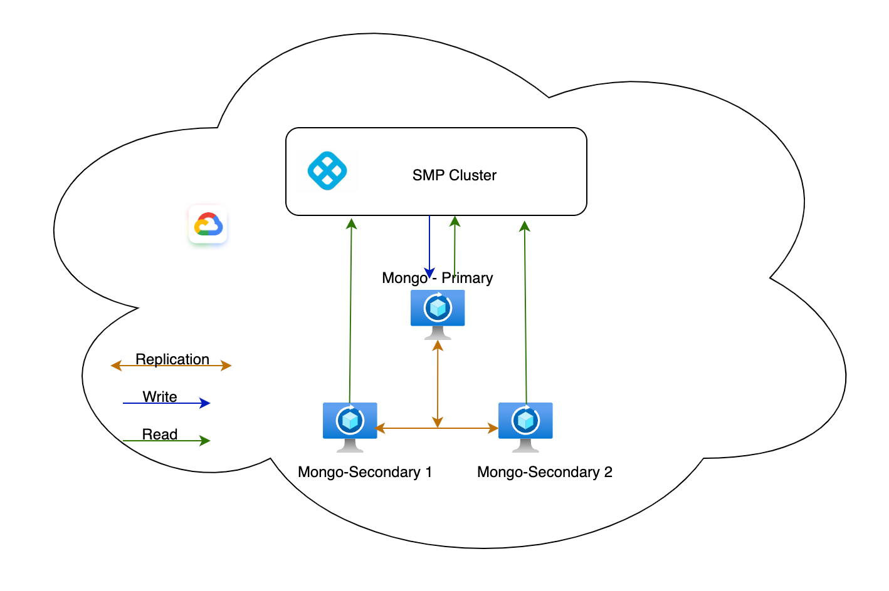

Self-Managed Enterprise Edition requires you to install a database by default. You can optionally use an external self-managed database with your Self-Managed Enterprise Edition installation. This enables you to separate your data from node execution. To use an external self-managed MongoDB with your Harness Self-Managed Enterprise Edition installation, you must ensure that your hardware, software, and network meet the minimum requirements for installation and configuration. This tutorial describes how to deploy MongoDB with VMs and replication.

## Limitations

MongoDB VMs offer many advantages, but there are a few limitations to consider:

- Resource overhead: Running a VM incurs resource overhead, such as CPU and memory usage, which may impact the performance of the MongoDB database.

- Hardware dependency: VM performance is influenced by the underlying hardware. Ensure that the host system provides sufficient resources for the VM to function optimally.

- Complexity: Setting up and managing a VM requires knowledge and expertise in virtualization technologies.

- Maintenance overhead: VMs require regular maintenance, including updates, backups, and monitoring, which adds overhead compared to a native MongoDB installation.

## Hardware requirements

Harness recommends a MongoDB three member replica set configuration with the following minimum hardware:

- Three nodes
- Four CPU (3*4 = 12 CPU)
- 8GB RAM (3*8 = 24GB RAM)
- 300GB SSD data storage, depending on your requirements

## Software requirements

External database setup requires the following software:

- Supported OS: Ubuntu 20.04

## Network requirements

Ensure the following:

- Set allowlisting of VMs so each VM can send traffic. Add the source using MongoDB, for example, the Kubernetes cluster service range to your allowlist.

- Reserve internal and external static addresses for each VM.

## Architecture



## Set up MongoDB VMs

To set up a MongoDB VM, do the following:

1. Connect to the VM and make sure you are running as root to prevent permission issues.

   ```
   sudo su -
   ```


2. Create your VM terminal, connect to the terminal, and log in as root.

3. Run the following to update packages.

   ```
   apt update
   ```

4. Import the public key used by the package management system.

   ```
   apt-get install gnupg curl
   ```

5. Add the Mongo third party repository.

   Debian:

   ```
   echo "deb [arch=amd64] https://repo.mongodb.org/apt/debian $(lsb_release -cs)/mongodb-org/4.4 multiverse" | sudo tee /etc/apt/sources.list.d/mongodb-org-4.4.list
   ```

   Ubuntu 21.10 and later:

   ```
   echo "deb [arch=amd64] https://repo.mongodb.org/apt/ubuntu $(lsb_release -cs)/mongodb-org/4.4 multiverse" | sudo tee /etc/apt/sources.list.d/mongodb-org-4.4.list
   ```
   
6. Run the following command to issue a MongoDB public GPG key.

   ```
   sudo apt-key adv --keyserver hkp://keyserver.ubuntu.com:80 --recv 656408E390CFB1F5
   ```

7. Run the following to update the key.

   ```
   apt-get update
   ```

8. Run the following to install MongoDB.

   ```
   apt-get install -y mongodb-org=4.4.19 mongodb-org-server=4.4.19 mongodb-org-shell=4.4.19 mongodb-org-mongos=4.4.19 mongodb-org-tools=4.4.19
   ```

9. Run the following to start MongoDB.

   ```
   systemctl start mongod
   ```

10. Verify that MongoDB started successfully.

   ```
   systemctl status mongod
   ```

11. Stop the MongoDB instance.

    ```
    service mongod stop
    ```

12. Modify the `mongod.conf` configuration file.

    ```
    vi /etc/mongod.conf
    ```

13. Locate the replication section, and uncomment the `replSetName` and `bindIp` lines. Configure them as follows:

    ```
    replication:
      replSetName: rs0
    
    # ...
    net:
      port: 27017
      bindIp: 0.0.0.0 
    
    security:
      authorization: enabled
      keyFile: /etc/keyFile
    ```

14. Complete the steps above for all three VMs.

15. Log in to one VM and run following commands.

    ```
    touch /etc/keyFile
    cd /etc
    openssl rand -base64 741 > keyFile
    chmod 400 keyFile
    chown mongodb:mongodb keyFile
    ````
 
16. Log in to the remaining two VMs, and run following commands.

    ```
    touch /etc/keyFile
    cd /etc
    copy the contents of keyFile from previous step and paste it in the keyFile of these 2 VM's.
    chmod 400 keyFile
    chown mongodb:mongodb keyFile
    ```
    
    ```
    sudo systemctl start mongod
    ```

17. Log in to your MongoDB primary instance using the `mongo` command, and run following command to create your replicate set.

    To identify primary node, run this command:

    ```
    rs.isMaster().primary
    ```

    ```
    rs.initiate(
      {
        _id: "rs0",
        members: [
          { _id: 0, host: 'abc-vm1.c.internal:27017' },
          { _id: 1, host: 'abc-vm2.c.internal:27017' },
          { _id: 2, host: 'abc-vm3.c.internal:27017' }
        ]
      }
    )
    ```

18. Log in to your primary MongoDB, and run the following command.

    ```
    db.createUser(
    {
     user: "admin",
     pwd: "password",
     roles:[{role: "root" , db:"admin"}]})
    ```

19. Run the following to verify your replicaset configuration.

    ```
    rs.conf()
    ```

20. Restart MongoDB on all your VMs.

    ```
    sudo systemctl restart mongod
    ```

21. Check all your replicas for errors.

22. Log in to your Kubernetes cluster, and create a `mongo-secret.yaml` file.

    ```yaml
    apiVersion: v1
    kind: Secret
    metadata:
      name: mongo-secret
    type: Opaque
    data:
      keyone: <base64-encoded-username>
      keytwo: <base64-encoded-password>
    ```

    ```
    kubectl apply -f mongo-secret.yaml -n <namespace>
    ```

23. Update the file with your MongoDB-specific override changes.

    ```yaml
    global:
      database:
        mongo:
          installed: false
          protocol: mongodb
          hosts: 
          - 10.10.10.10,10.10.10.11,10.10.10.12 
          secretName: "mongo-secret"
          userKey: "keyone"
          passwordKey: "keytwo"
          extraArgs: "retryWrites=true&authSource=admin"
          
      --
      --
      platform:
      access-control:
        mongoSSL:
            enabled: false
        mongoHosts:
        - 10.10.10.10
        - 10.10.10.11
        - 10.10.10.12
    ```

24. Run Helm install.

    ```
    helm install my-release harness/harness -n <namespace> -f override.yaml
    ```
