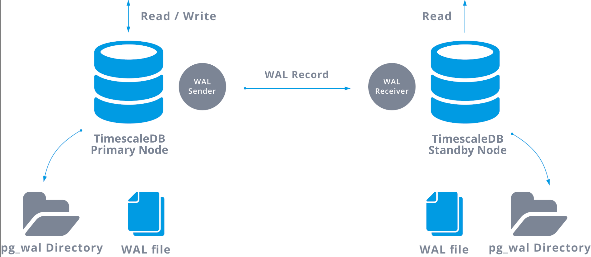

Self-Managed Enterprise Edition requires you to install a database by default. You can optionally use an external self-managed database with your Self-Managed Enterprise Edition installation. This enables you to separate your data from node execution. To use an external self-managed TimescaleDB with your Harness Self-Managed Enterprise Edition installation, you must ensure that your hardware, software, and network meet the minimum requirements for installation and configuration. This tutorial describes how to deploy TimescaleDB with VMs and replication.

The controller-worker replication setup described in this tutorial ensures data redundancy and fault tolerance, providing a robust and reliable environment to manage your TimescaleDB.

## Limitations

TimescaleDB VMs offer many advantages, but there are a few limitations to consider:

- Resource overhead: Running a VM incurs resource overhead, such as CPU and memory usage, which may impact the performance of the PostgreSQL database.

- Hardware dependency: VM performance is influenced by the underlying hardware. Ensure that the host system provides sufficient resources for the VM to function optimally.

- Complexity: Setting up and managing a VM requires knowledge and expertise in virtualization technologies.

- Maintenance overhead: VMs require regular maintenance, including updates, backups, and monitoring, which adds overhead compared to a native TimescaleDB installation.

## Hardware requirements

Harness recommends a PostgreSQL three-member replica set configuration with the following minimum hardware:

- Three nodes
- Four CPU (3*4 = 12 CPU)
- 24GB RAM (324 = 72GB RAM)
- 300GB SSD data storage, depending on your requirements

## Software requirements

External database setup requires the following software:

- Supported OS: TimescaleDB supports Debian 11, Ubuntu, and CentOS


## Network requirements

Ensure the following:

- Set allowlisting of VMs so each VM can send traffic. Add the source using TimescaleDB, for example, the Kubernetes cluster service range to your allowlist.

- Reserve internal and external static addresses for each VM.

- Add port 5432 to the NAT firewall settings allowlist on the application cluster so it can connect to the TimescaleDB instance. TimescaleDB uses 5432 as the default communication port. This enables communication between Harness services running in a Self-Managed Enterprise Edition cluster and a self-managed TimescaleDB cluster.

## Architecture



TimescaleDB replication architecture uses the native replication capabilities of PostgreSQL to ensure high availability and fault tolerance. It employs a controller-worker configuration, where the controller node handles read and write operations, while the worker nodes act as standby databases for data replication. 

Write-ahead logs (WAL) are generated on the controller node and streamed to the standby nodes, allowing them to apply the changes and maintain data consistency. TimescaleDB extends the replication protocol with optimizations specific to time-series data, ensuring accurate replication of time-series operations and metadata. 

In the event of controller node failure, a standby node can be promoted as the new controller, ensuring uninterrupted data access and minimal downtime. PostgreSQL does not provide support for automatic failover.

For more information, go to [Streaming replication](https://www.postgresql.org/docs/current/warm-standby.html#STREAMING-REPLICATION) and [Write-ahead logging](https://www.postgresql.org/docs/current/wal-intro.html) in the PostgreSQL documentation.

### High availability

To create a highly-available setup, there will be a DNS record that always points to the primary node of your TimescaleDB replication setup. You can use service discovery with a third-party tool (etcd/Consul/Zookeeper) to track your current primary node's IP address and health status.

You can update the DNS record dynamically using a script or use the service discovery tool's built-in functionality.


## Set up TimescaleDB VMs on Debian-based systems

:::caution
If you installed PostgreSQL through a method other than the apt package manager maintained by Debian or Ubuntu archive, you may receive errors when following these instructions. Harness recommends that you uninstall existing PostgreSQL installations before you continue.
:::

To set up a TimescaleDB VM, do the following:

1. Connect to the VM and make sure you are running as root to prevent permission issues.

   ```
   sudo su -
   ```

2. Add the PostgreSQL third-party repository to get the latest PostgreSQL packages.

   ```
   apt install gnupg postgresql-common apt-transport-https lsb-release wget
   ```

3. Run the PostgreSQL repository setup script.

   ```
   /usr/share/postgresql-common/pgdg/apt.postgresql.org.sh
   ```

4. Add the TimescaleDB third party repository.

   Debian:
   
   ```
   echo "deb https://packagecloud.io/timescale/timescaledb/debian/ $(lsb_release -c -s) main" | sudo tee /etc/apt/sources.list.d/timescaledb.list
   ```

   Ubuntu 21.10 and later:

   ```
   wget --quiet -O - https://packagecloud.io/timescale/timescaledb/gpgkey | sudo gpg --dearmor -o /etc/apt/trusted.gpg.d/timescaledb.gpg
   ```

5. Install the TimescaleDB GPG key.

   ```
   wget --quiet -O - https://packagecloud.io/timescale/timescaledb/gpgkey | sudo apt-key add -
   ```

6. Update your local repository list.

   ```
   apt update
   ```

7. Install TimescaleDB.

   ```
   apt install timescaledb-2-postgresql-13
   ```

   The output should look similar to the following:

   ```
   Ver Cluster Port Status Owner    Data directory              Log file
   13  main    5432 down   postgres /var/lib/postgresql/13/main /var/log/postgresql/postgresql-13-main.log
   ```

8. Run TimescaleDB tune.

   ```
   timescaledb-tune --quiet --yes
   ```

## Set up the TimescaleDB extension on Debian-based systems

To set up TimescaleDB extension on Debian-based systems, do the following:

1. Restart the service after you enable TimescaleDB using `timescaledb-tune`.

   ```
   systemctl restart postgresql
   ```

2. Open the `psql` command-line utility as the postgres superuser on your local system at the command prompt.

3. Run the following as postgres user (default user for postgres).

   ```
   sudo su - postgres
   ```

4. Run the following.

   ```
   psql
   ```
 
   Upon successful connection, you'll see a message similar to the one below, followed by the psql prompt:

   ```
   psql (13.11 (Debian 13.11-1.pgdg110+1))
   Type "help" for help
   ```

5. Set the password for the postgres user.

   ```
   \password postgres
   ```

6. Exit PostgreSQL.

   ```
   \q
   ```

7. Use the `psql` client to connect to PostgreSQL.

   ```
   psql -U postgres -h localhost
   ```

8. Create an empty database at the `psql` prompt. In this example, our database is `tsdb`.

   ```
   CREATE database tsdb;
   ```
   
9. Connect to the database you created.

   ```
   \c tsdb
   ```

10. Add the TimescaleDB extension.

   ```
   CREATE EXTENSION IF NOT EXISTS timescaledb;
   ```

11. Verify that the TimescaleDB extension is installed using the `\dx` command at the `psql` prompt. The output should be similar to the following.

    ```
    tsdb-# \dx
                                          List of installed extensions
        Name     | Version |   Schema   |                            Description
    -------------+---------+------------+-------------------------------------------------------------------
    plpgsql     | 1.0     | pg_catalog | PL/pgSQL procedural language
    timescaledb | 2.11.2  | public     | Enables scalable inserts and complex queries for time-series data
    (2 rows)
    ```

12. Run the following to connect directly to your database.

   ```
   psql -U postgres -d tsdb -h localhost
   ```

13. Repeat the steps for all VMs.

## Configure replication

When you configure your replication, you will make some updates to controllers and replicas and other updates to only controllers or only replicas.

:::info important
When you create new directories or files, always use the postgres user.
Run the following command before you create a new directory or file.

```
sudo su - postgres
```
:::


To configure replication, do the following:

1. Make sure you are logged in to the VM with superUser access on postgres user.

2. Run the following on one of your replicas.
   
   ```
   sudo su - postgres
   ssh-keygen -t rsa
   // enter three times and generate a key
   // copy the public key in /var/lib/postgresql/.ssh/id_rsa.pub
   ```

3. Copy the certificates to the other replicas in the same directory `/var/lib/postgresql/.ssh/`.

4. Run the following on your controller.

   ```
   cd
   mkdir .ssh
   cd ..ssh
   vi authorization_key
   // paste the public key, enter and paste it again and save, the second key should end with postgres@externalIP
   ```

5. Make the following change to the `pg_hba.conf` file in `/etc/postgresql/13/main/pg_hba.conf` for your controller and replicas. This allows PostgreSQL to accept traffic from other networks and adds them to the allowlist.

   ```
   #host   all             all             127.0.0.1/32           md5
   host    all             all             0.0.0.0/0              md5
   ```

   This example allows everything to the TimescaleDB instance. Harness recommends that you configure your firewall rules to allow only certain IPs to use port 5432.

6. (Optional) Make the following changes to set your allowlist at the database-level.

   ```
   #host    all             all             127.0.0.1/32            md5 <— changes
    host    all             all             <ip range1>             md5 <— changes
    host    all             all             <ip range2>             md5 <— changes
    host    all             all             <replica ip range>      md5 <— changes
    host    all             all             <controller ip range>   md5 <— changes
   ```

7. Change your directory to edit the `postgresql.conf` configuration file.

   ```
   cd /etc/postgresql/13/main/
   ```

8. Set `max_wal_senders` to the number of replicas. Set `max_replication_slots` to the number of replicas plus two. Edit or add the following settings.

   ```
   listen_addresses = '*'
   wal_level = replica
   archive_command = 'test ! -f /var/lib/postgresql/14/main/archive/%f && cp %p /var/lib/postgresql/14/main/archive/%f'
   archive_mode = on
   max_wal_senders = 2
   max_replication_slots = 4
   ```

9. In your controller only, make sure you are running as Postgres.

   ```
   sudo su - postgres
   ```

10. Create an archive directory in `/var/lib/postgresql/13/main`.

   ```
   cd /var/lib/postgresql/13/main
   mkdir archive
   ```

11. Add the following line to the bottom of your `pg_hba.conf` file.

    ```
    host  replication reptest <External IP of Replica>/32  md5
    ```

12. Create a new user, `reptest`, and log in as Postgres.

    ```
    CREATE ROLE reptest WITH REPLICATION PASSWORD 'testpassword' LOGIN;
    ```

    ```
    sudo su - postgres
    run psql
    ```

13. Create the first replication slot at the psql slot. You can use any name. This example uses `replica_1_slot`.
    
    ```
    SELECT * FROM pg_create_physical_replication_slot('replica_1_slot');
    ```

   Repeat this step for each replica.

14. Restart PostgreSQL on your controller and your replicas (run as root).
    
    ```
    service postgresql restart 
    ```

### Initiate replication
After you've completed the above steps, you can initiate your replication. Follow the steps below for your replicas only.

To initiate replication, do the following:

1. Stop the PostgreSQL service.
   
   ```
   service postgresql stop
   ```

2. Copy the existing data and create a backup.
   
   ```
   sudo su - postgres
   ```
 
   ```
   cd /var/lib/postgresql/13
   mv main main.org
   mkdir main
   ```

3. Restore from the base backup, using the IP address of the primary database and the replication username.

   ```
   pg_basebackup -h <PRIMARY_IP> -p 5432 -U reptest -D /var/lib/postgresql/13/main/ -Fp -Xs -R
   ```

   The backup utility prompts you for the `reptest` password.

4. Create a `standby.signal` file in your data directory.
   
   ```
   touch /var/lib/postgresql/13/main/standby.signal
   chmod -R 0700 /var/lib/postgresql/13/main
   ```

   When PostgreSQL finds a `standby.signal` file in its data directory, it starts in recovery mode and streams the WAL through the replication protocol.

5. Restart PostgreSQL in your replicas.

   ```
   service postgresql restart
   ```

6. Run the following to check the logs and verify that the replica works. 
   
   ```
   tail -f /var/lib/postgresql/postgresql-14-main.log
   ```

   The output should be similar to the following.

   ```
   LOG:  entering standby mode
   LOG:  redo starts at 0/3000138
   LOG:  database system is ready to accept read only connections
   LOG:  started streaming WAL from primary at 0/4000000 on timeline 1
   ```

7. Add entries to your primary instance to verify your replica is synchronized with the primary database and prepared to stream.

## Configure your Harness environment and Helm charts

Follow the steps below to set up a Harness Self-Managed Enterprise Edition cluster with an external self-managed TimescaleDB.

1. Run the following command to ensure your new database has the TimescaleDB extension.

   ```bash
   \c template1
   CREATE EXTENSION IF NOT EXISTS timescaledb CASCADE;
   ```

2. Create two databases, `harness` and `harnessti` in the TimescaleDB instance.

3. Create a new secret for your username and password in the same namespace where Harness is installed.

   ```
   kubectl create secret generic tsdb-secret -n <namespace> \
    --from-literal=username=<username-of-postgres-database> \
    --from-literal=password='<password-of-postgres-database>'
   ```

4. Update your `override-prod.yaml` file with the following fields.

   ```yaml
    global:
     database:
       timescaledb:
         installed: false
         # --  provide default values if mongo.installed is set to false
         hosts:
           - hostname.timescale.com:5432
         secretName: "tsdb-secret"
         userKey: "username"
         passwordKey: "password"
         sslEnabled: false
         certName: "tsdb-cert"
         certKey: "cert" 
   ```

### Enable SSL

You have the option to configure SSL on TimescaleDB.

To enable SSL on TimescaleDB, do the following:

1. Run the following.

   ```
   kubectl create secret generic tsdb-secret -n <namespace> --from-file cert=<localCertFile>
   ```

2. Set the following fields in your `override.yaml` file.

   ```yaml
   sslEnabled: true
   certName: "tsdb-cert"
   certKey: "cert"
   ```

## Failover functionality

PostgreSQL provides some failover functionality, where the replica is promoted to primary in the event of a failure. This is available using the `pg_ctl` command or the `trigger_file`; however, PostgreSQL does not provide support for automatic failover.

### Promote standby/secondary to primary

When a primary instance shuts down or is unavailable, the TimescaleDB remains available, but only in read-only mode. You must promote the standby/secondary to primary.

:::info note
Before you promote a replica, make sure the primary is completely down.
:::

To promote the standby/secondary to primary, do the following:

1. Run the `pg_ctl` `promote` command.

   ```
      /usr/lib/postgresql/13/bin/pg_ctl promote -D /var/lib/postgresql/13/main/
      service postgresql restart
   ```

2. Change the host in your Harness instance, and upgrade your Helm charts.

### Recover the former primary

You can recover the former primary VM after you promote the standby/secondary.

Replica promotion affects primary and secondary use in the following way:

- Former primary ↔︎ new secondary

- New primary ↔︎ former secondary ↔︎ former standby

When you convert the standby instance to primary, operations could occur in the new primary, and the former primary may go out of sync. To have the former primary become the new secondary and the former secondary remain as the new primary, you must add host replication.

To recover the former primary and add host replication, do the following.

1. Add the host replication in the `pg_hba.conf` file in the new primary.

   ```
   host    replication     reptest         <EXTERNAL IP of OLD PRIMARY/32       md5
   ```

2. Run the following as root.

   ```
   service postgresql restart
   ```

3. Copy data to recover the former primary.

   ```
   cd /var/lib/postgresql/13
   mv main main.org
   mkdir main
   chmod -R 0700 main
   ```
   ```
   pg_basebackup -h <NEW_PRIMARY_IP> -p 5432 -U reptest -D /var/lib/postgresql/13/main/ -Fp -Xs -R
   ```

   The former primary instance is now a new secondary instance.

## Upgrade TimescaleDB

You can upgrade your self-managed TimescaleDB installation in-place. A major upgrade is when you upgrade from one major version of TimescaleDB to the next major version. For example, when you upgrade from TimescaleDB 13 to TimescaleDB 14.

A minor upgrade is when you upgrade within your current major version of TimescaleDB. For example, when you upgrade from TimescaleDB 13.5, to TimescaleDB 13.6.

For more information, go to [About upgrades](https://docs.timescale.com/self-hosted/latest/upgrades/about-upgrades/) in the TimescaleDB documentation.

## Uninstall TimescaleDB

To uninstall TimescaleDB, do the following:

```
service stop postgresql
sudo apt-get --purge remove {POSTGRESS-PACKAGE NAME}
sudo rm -rf /var/lib/postgresql/
sudo rm -rf /var/log/postgresql/
sudo rm -rf /etc/postgresql/
```
