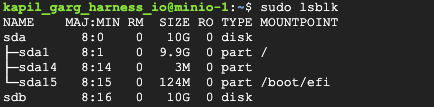

Harness Self-Managed Enterprise Edition enables you to configure self-managed object storage with MinIO. MinIO is an object storage server designed for large-scale private cloud infrastructure. It aggregates persistent volumes into scalable distributed object storage using Amazon S3 REST APIs.

You can install MinIO on your preferred VMs and provide the endpoint in your Harness Helm charts. This topic describes how to set up 4 MinIO servers.

### Prerequisites

Make sure to meet the MinIO prerequisites before you set up self-managed object storage. For prerequisites, go to [Object Storage for Linux](https://min.io/docs/minio/linux/operations/install-deploy-manage/deploy-minio-multi-node-multi-drive.html#prerequisites) in the MinIO documentation.

### MinIO hardware requirements

- 4 VMs
- 4 cores per VM
- 8 GB memory per VM
- 100 GB disk per VM (SSD preferred)
- 1GB/s minimum network bandwidth
- Ubuntu 20.04 LTS operating system

### Nginx hardware requirements

- 1 VM
- 4 cores per VM
- 8 GB memory per VM
- 1GB/s minimum network bandwidth
- Ubuntu 20.04 LTS operating system

### Create an Nginx LoadBalancer VM

To set up MinIO, you must first create a VM for the Nginx LoadBalancer with the above hardware requirements.

To create a new VM instance for the Nginx LoadBalancer, do the following:

1. Select the machine type based on the hardware requirements for Nginx.

2. Change the boot disk to Ubuntu 20.04 LTS.

3. Reserve an internal static IP address.

4. Reserve an external static IP address.

### Create the MinIO server VMs

Next, you must create 4 VMs with the MinIO hardware requirements.

To create the MinIO server VMs, do the following:

1. Create a new VM instance with following configuration.

2. Select the machine type based on the hardware requirements.

3. Change the boot disk to Ubuntu 20.04 LTS.

4. Reserve an internal static IP address.

5. Attach an additional disk to the VM.

### Set up the Nginx LoadBalancer

Next, set up the Nginx LoadBalancer.

To set up the Nginx LoadBalancer, do the following:

1. SSH into the Nginx VM, and install Nginx. For installation instructions, go to [Linux packages](https://nginx.org/en/linux_packages.html#Debian) in the Nginx documentation.

2. Add the sequential hostnames for your MinIO server instances to your `/etc/hosts` file (internal IPs should be MinIO instances).

   ```
   10.123.0.23 minio1.internal
   10.123.0.24 minio2.internal
   10.123.0.25 minio3.internal
   10.123.0.36 minio4.internal
   ```

3. Add the following to the `/etc/nginx/sites-enabled/minio.conf` file.

   ```
   upstream minio_s3 {
      least_conn;
      server minio1.internal:9000;
      server minio2.internal:9000;
      server minio3.internal:9000;
      server minio4.internal:9000;
   }
   
   upstream minio_console {
      least_conn;
      server minio1.internal:9001;
      server minio2.internal:9001;
      server minio3.internal:9001;
      server minio4.internal:9001;
   }
   
   server {
      listen       80;
      listen  [::]:80;
      server_name  <external-ip-of-VM>;
   
      # Allow special characters in headers
      ignore_invalid_headers off;
      # Allow any size file to be uploaded.
      # Set to a value such as 1000m; to restrict file size to a specific value
      client_max_body_size 0;
      # Disable buffering
      proxy_buffering off;
      proxy_request_buffering off;
   
      location / {
         proxy_set_header Host $http_host;
         proxy_set_header X-Real-IP $remote_addr;
         proxy_set_header X-Forwarded-For $proxy_add_x_forwarded_for;
         proxy_set_header X-Forwarded-Proto $scheme;
   
         proxy_connect_timeout 300;
         # Default is HTTP/1, keepalive is only enabled in HTTP/1.1
         proxy_http_version 1.1;
         proxy_set_header Connection "";
         chunked_transfer_encoding off;
   
         proxy_pass http://minio_s3; # This uses the upstream directive definition to load balance
      }
   
      location /minio/ui/ {
         rewrite ^/minio/ui/(.*) /$1 break;
         proxy_set_header Host $http_host;
         proxy_set_header X-Real-IP $remote_addr;
         proxy_set_header X-Forwarded-For $proxy_add_x_forwarded_for;
         proxy_set_header X-Forwarded-Proto $scheme;
         proxy_set_header X-NginX-Proxy true;
   
         # This is necessary to pass the correct IP to be hashed
         real_ip_header X-Real-IP;
   
         proxy_connect_timeout 300;

         # To support websockets in MinIO versions released after January 2023
         proxy_http_version 1.1;
         proxy_set_header Upgrade $http_upgrade;
         proxy_set_header Connection "upgrade";
   
         chunked_transfer_encoding off;
   
         proxy_pass http://minio_console; # This uses the upstream directive definition to load balance
      }
   }
   ```

4. Run the following to start Nginix.

   ```
   nginx sudo nginx -s reload
   ```

### Set up MinIO servers

Now you are ready to set up your MinIO servers.

To configure your MinIO servers, do the following:

1. SSH into one of your MinIO VMs.

2. Create a `minio-user` user and group.

   ```
   sudo groupadd -r minio-user
   sudo useradd -M -r -g minio-user minio-user
   ```

3. Attach the disk device name to the VM using `sudo lsblk`. For example:

   

4. Run the following to format the disk.

   ```
   sudo mkfs.ext4 -m 0 -E lazy_itable_init=0,lazy_journal_init=0,discard /dev/sdb
   ```

5. Run the following to mount the disk.

   ```
   sudo mkdir -p /mnt/disks/disk1
   sudo mount -o discard,defaults /dev/sdb /mnt/disks/disk1
   ```

6. Change the disk permissions and user.

   ```
   sudo chmod a+w /mnt/disks/disk1/
   sudo chown -R minio-user:minio-user /mnt/disks/disk1/
   ```

7. Add hostnames in sequential order in your `/etc/hosts` file.

   ```
   10.128.0.23 minio1.internal
   10.128.0.24 minio2.internal
   10.128.0.25 minio3.internal
   10.128.0.36 minio4.internal
   ```

8. Download and install MinIO.

   ```
   wget https://dl.min.io/server/minio/release/linux-amd64/archive/minio_20230831153116.0.0_amd64.deb -O minio.deb

   sudo dpkg -i minio.deb
   ```

9. Add the following to your `/etc/default/minio` file.

   ```
   # Set the hosts and volumes MinIO uses at startup
   # The command uses MinIO expansion notation {x...y} to denote a
   # sequential series.
   #
   # The following example covers four MinIO hosts
   # with 4 drives each at the specified hostname and drive locations.
   # The command includes the port that each MinIO server listens on
   # (default 9000)
   
   MINIO_VOLUMES="http://minio{1...4}.internal:9000/mnt/disks/disk1"
   
   # Set all MinIO server options
   #
   # The following explicitly sets the MinIO Console listen address to
   # port 9001 on all network interfaces. The default behavior is dynamic port selection.
   
   MINIO_OPTS="--console-address :9001"
   
   # Set the root username. This user has unrestricted permissions to
   # perform S3 and administrative API operations on any resource in the deployment.
   #
   # Defer to your organizations requirements for superadmin user name.
   
   MINIO_ROOT_USER=minioadmin
   
   # Set the root password
   #
   # Use a long, random, unique string that meets your organizations
   # requirements for passwords.
   
   MINIO_ROOT_PASSWORD=password
   
   # Set to the URL of the load balancer for the MinIO deployment
   # This value *must* match across all MinIO servers. If you do
   # not have a load balancer, set this value to to any *one* of the
   # MinIO hosts in the deployment as a temporary measure.
   MINIO_SERVER_URL="http://<external-ip-of-nginx-vm>"
   MINIO_BROWSER=on
   MINIO_BROWSER_REDIRECT_URL="http://<external-ip-of-nginx-vm>/minio/ui"
   ```

10. Start the MinIO service.

   ```
   sudo systemctl start minio.service 
   ```

11. Check the MinIO status.
 
   ```
   sudo systemctl status minio.service
   ```

12. Repeat the process for your other three VMs.
   
### Test MinIO connectivity

To test your MinIO connectivity, do the following:

1. Go to `http://<NGINX_VM_EXTERNAL_IP>`, and sign in using the username and password in your `/etc/default/minio` file.

2. Create a bucket and upload a test file.

3. SSH into one of your MinIO VMs.

4. Check the contents in the `/mnt/disks/disk1/` disk.

### Configure your Harness environment and Helm chart

Now you're ready to configure your Harness Self-Managed Enterprise Edition environment and Helm chart.

To configure your Harness environment and Helm chart, do the following:

1. Create a secret in the namespace where Harness is installed with following data.

   ```yaml
   data:
     root-user: <MINIO_USERNAME>
     root-password: <MINIO_PASSWORD>
   ```

2. Set the following overrides for your installed MinIO with Harness.

   ```yaml
   platform:
     log-service:
       s3:
         endpoint: "http://<NGINX_VM_EXTERNAL_IP>"
       logServiceS3AccessKeyID:
         name: minio
         key: root-user
       logServiceS3SecretAccessKey:
         name: minio
         key: root-password
   ```
