# Manage SLOs using Prometheus metrics

```mdx-code-block
import DelegateInstall from '/tutorials/platform/install-delegate.md';
```

## Background on Service Level Objectives

In technology, the adage that you can not improve what you can’t measure is very true. Indicators and measurements of how well a system is performing can be represented by one of the Service Level (SLx) commitments. There is a trio of metrics, SLAs, SLOs, and SLIs, that paint a picture of the agreement made vs the objectives and actuals to meet the agreement. Focusing on the SLO or Service Level objectives, those are the goals to meet in your system.

Service Level Objectives are goals that need to be met in order to meet Service Level Agreements [SLAs]. Looking at Tom Wilkie’s [RED Method](https://www.weave.works/blog/the-red-method-key-metrics-for-microservices-architecture/) can help you come up with good metrics for SLOs: requests, errors, and duration. Google’s [Four Golden Signals](https://landing.google.com/sre/sre-book/chapters/monitoring-distributed-systems/) are also great metrics to have as SLOs, but also includes saturation.

For example, there might be an SLA defined by the business as “we require 99% uptime”. The SLO to make that happen would be “we need to reply in 1000 ms or less 99% of the time” to meet that agreement.

## Managing and Measuring Your SLOs

Drawing a conclusion can always be tricky especially if data is coming from different sources and services. If you had one and only one service in your organization, the amount of system and business knowledge about this one service would be easy to disseminate. Though that is not the case for any organization as the number of services increase and domain expertise does not stay within a singular individual.

A myth about SLOs is that they are static in nature. As technology, capabilities, and features change, SLOs need to adapt with them. In an age of dial up internet, the example SLO of “we need to reply in 1000ms or less 99% of the time” would be impossible. As cloud infrastructure and internet speeds increased over the decades, that SLO seems very possible.

SLIs are used to measure your SLOs. SLO Management would not be possible without including the SLIs. In the response example, the SLI would be an actual response time which the SLO tracks against. In the below example, we will be setting up an SLO and SLI.

## Getting Started with SLO Management

Harness provides a module called Service Reliability Management to help with your SLO Management, if you have not already, [request a Harness SRM Account](https://harness.io/demo/srm). Once signed up, the next step to on-ramp you to the Harness Platform is to install a Harness Delegate.

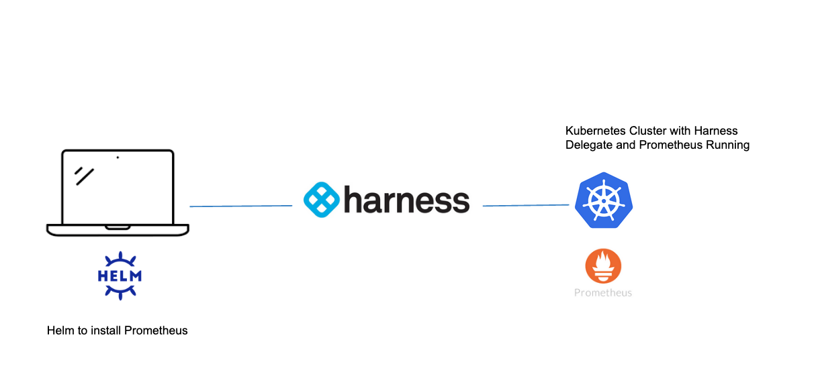

In this example, will use [Prometheus](https://prometheus.io/), an open source monitoring solution, to intercept metrics from an example application. The Open Observability Group has an [example application](https://github.com/open-o11y/prometheus-sample-app) which can be deployed to Kubernetes that writes to Prometheus metrics.

## Install Prometheus

An easy way to install Prometheus on your Kubernetes cluster is to use [Helm](https://helm.sh/).

```
helm repo add prometheus-community https://prometheus-community.github.io/helm-charts

helm repo update

helm upgrade --install prometheus prometheus-community/prometheus \
--namespace prometheus --create-namespace
```

Once installed, there are a few ways to access your Prometheus Web UI. It is not recommended with workloads of substance to expose this to the public. For this example, can expose via [NodePort](https://kubernetes.io/docs/concepts/services-networking/service/).

```
kubectl expose deployment -n prometheus prometheus-server --type=NodePort --name=prometheus-service
```

With a NodePort, you access the Service deployed on the cluster via your browser with _node_public_ip:nodeport_.

You can find your a Kubernetes node’s public IP by running:

```
kubectl get nodes -o wide
```


Then can grab the NodePort.

```
kubectl get svc -n prometheus
```


In this case, the _node_ip:nodeport_ combo is http://35.223.10.37:31796.

Note: If you are using a cloud rendition of Kubernetes e.g. EKS/GKE/AKS, by default your firewall might not allow for TCP traffic over NodePort range. Can open up specifically for each NodePort or give a range to cover all NodePorts; TCP ports 30000-32768.

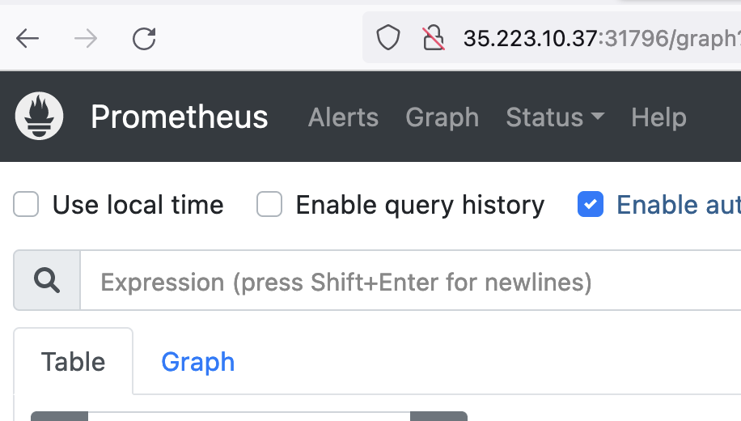

Now you are ready to deploy an application that writes to Prometheus.

## Deploying an Application That Writes to Prometheus

Following the [Open Observability Group’s Sample Application](https://github.com/open-o11y/prometheus-sample-app), you can build from source or use an already built rendition that we have built.

E.g
https://raw.githubusercontent.com/harness-apps/developer-hub-apps/main/applications/prometheus-sample-app/prometheus-sample-app-k8s-deployment.yaml

```
Kubectl apply -f https://raw.githubusercontent.com/harness-apps/developer-hub-apps/main/applications/prometheus-sample-app/prometheus-sample-app-k8s-deployment.yaml
```


With the application installed, now you can explore some metrics with Prometheus then wire those metrics to Harness.

## Prometheus Metrics

Prometheus groups metrics in several ways. There are [four metric primitive types](https://prometheus.io/docs/concepts/metric_types/) that Prometheus supports. Querying these metrics are handled by Prometheus’s query language, or [PromQL](https://prometheus.io/docs/prometheus/latest/querying/basics/).

If this is your first time delving into Prometheus or just want to find out more about what your applications are sending in, this [Prometheus Blog](https://promlabs.com/blog/2020/12/17/promql-queries-for-exploring-your-metrics) is a good resource to explore your metrics when the metric names are unknown. Below is a PromQL query to list all available metrics in your Prometheus instance.

```
group by(__name__) ({__name__!=""})
```

Running that query, will notice all four metric types are being written by the example application.


The _test_gauge0_ metric is a good metric to take a look at. A [Gauge](https://prometheus.io/docs/concepts/metric_types/#gauge) in Prometheus is a metric that represents a singular numerical value. How the sample application is designed will increase and decrease the gauge counter over time, which if this was a real life gauge could represent something like memory pressure or response time.

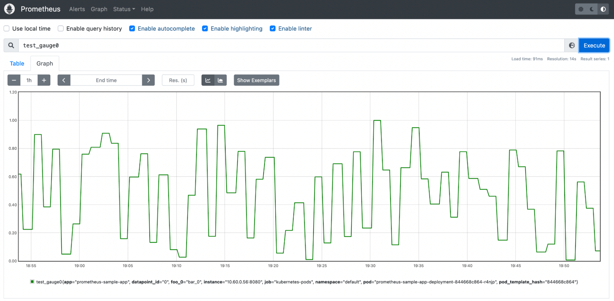

With this metric, you are now able to start to manage this metric.

## Getting Started With Your First SLO

Configure your service metrics/telemetry as SLOs to Harness SRM has a few Harness Objects to be created. If you have not already, request to sign up for a [Harness SRM Account](https://harness.io/demo/srm). If this is your first time leveraging Harness, Harness has a concept of Projects. The Default Project is more than adequate to wire in your first SLO. 

### Install Delegate

You will also need to wire in a [Kubernetes Delegate](../platform/install-delegate) if you have not done so already.

<details>

		<summary>Install Delegate</summary>
<DelegateInstall />
</details>

### Creating Your First SLO

In the Harness Platform, head to Service Reliability -> SLOs inside the Default Project.

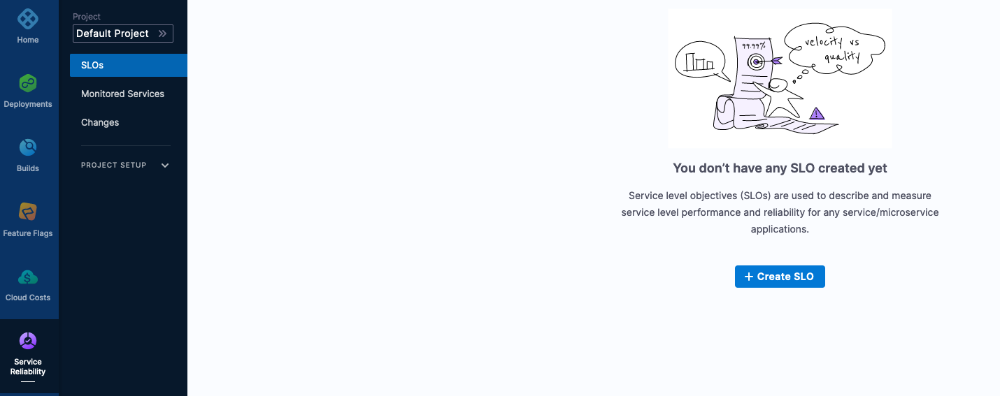

Click on + Create SLO. Can name the SLO, “myslo”. Harness does need to define what you will be monitoring, which is a Monitored Service. In the Monitored Service Name, create a new Monitored Service.

- Service [create in-line]: my-slo-app
- Environment [create-in-line]: kubernetes

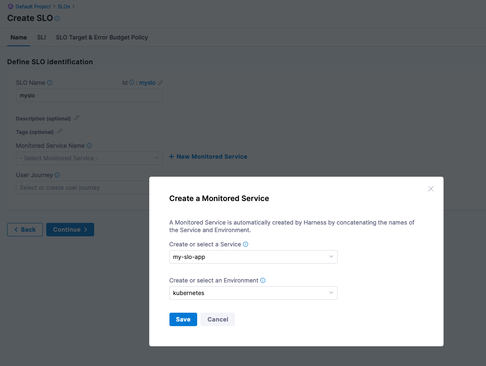

Click Save. Can also name this journey that a user or system will be taking on by creating a new User Journey object. Can create a new User Journey object called “myjourney”.

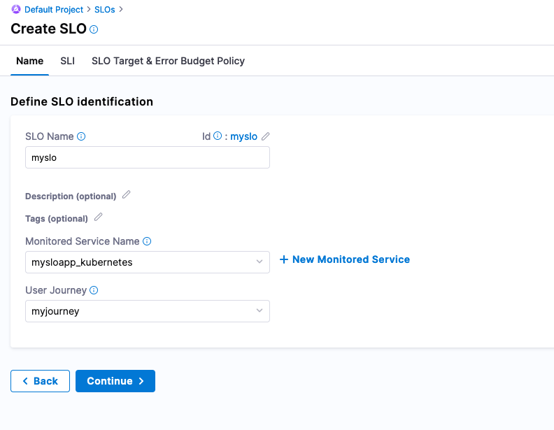

Click Continue. Now you are ready to wire in the Service Level Indicator [SLI] that feed into this SLO. Since the test_summary0_sum\{\} metric has a consistent upward trend, this can be used to simulate a latency metric. Now you are ready to configure wiring in Prometheus to Harness.

Configure SLI queries -> + New Health Source

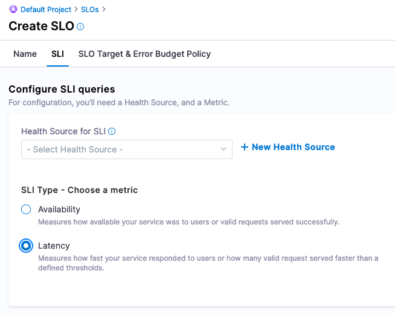

Configuring Prometheus to Harness, add a new Prometheus Health Source with a name of “myprominstance”.

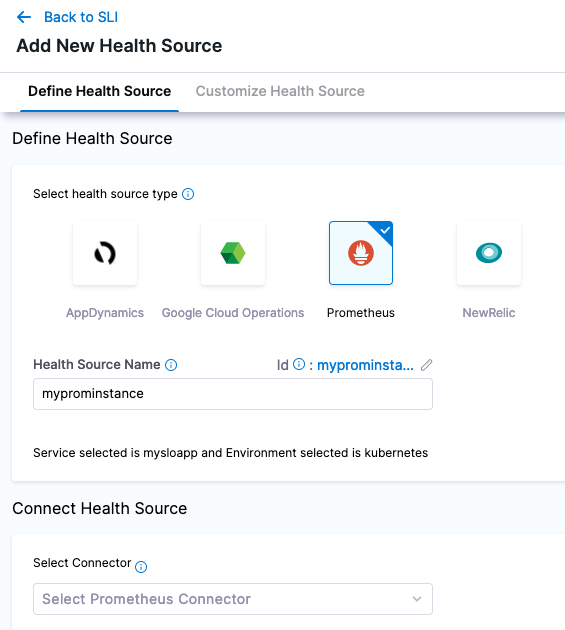

Create a new Prometheus Connector with the name “kubernetesprom”.

In the Credentials Section, can give the NodePort address or the address on how you exposed Prometheus’s 9090 port.

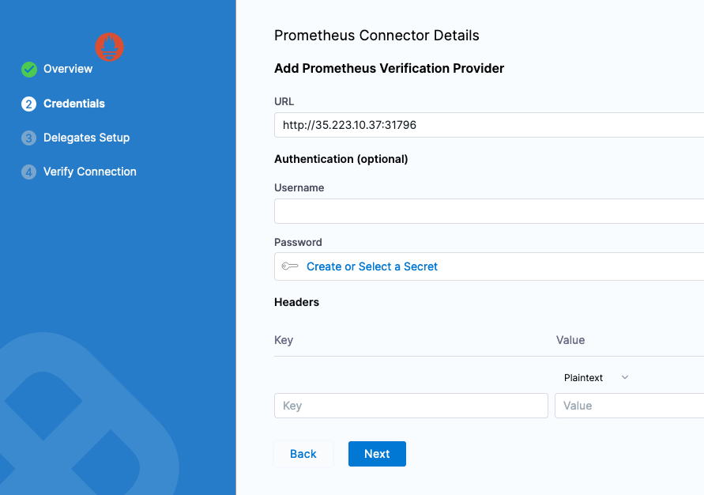

Click Next and select a Harness Delegate to perform this connection. Can select any available Harness Delegate.

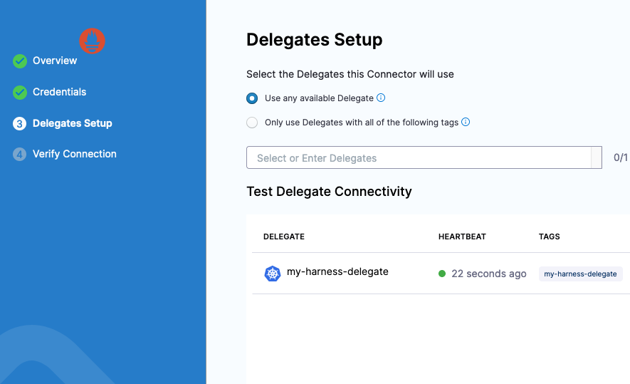

Click Save and your connection to Prometheus will be validated. Now you are ready to wire in the Prometheus Query as a Health Source.

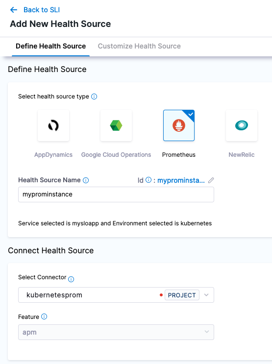

Click Next after wiring in the Connector. Using the Build your Query, the metric we want to focus on is “test_gauge0” and will filter on the “app” field with the example app label, “prometheus-sample-app”. We can duplicate the filter on Environment and Service since that is the singular metric we want.

- Prometheus Metric: test_gauge0
- Environment Filter: app:prometheus-sample-app
- Service Filter: app:prometheus-sample-app

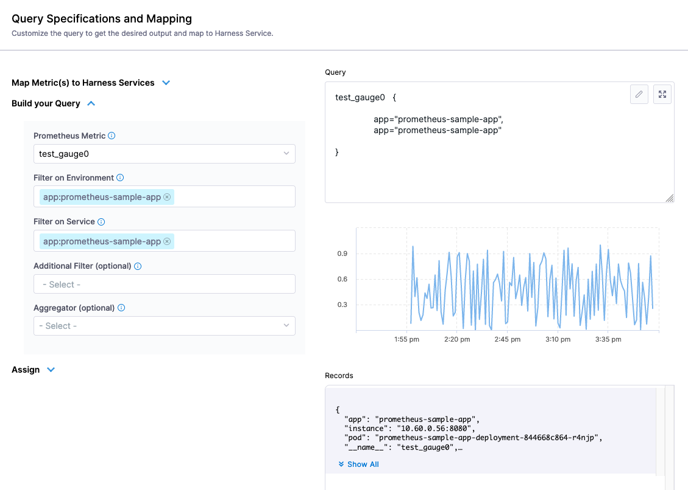

In the Assign section, select this as an SLI.

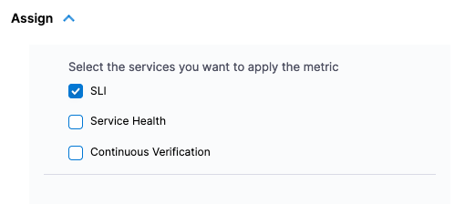

Click Save and now you can pick the metrics powering the SLI. Taking a closer look at the sample Gauge in Prometheus, a sample of 0.60 seems to be a good midpoint on this metric going up and down. We can pretend that this Gauge represents some sort of response time metric and the lower the score, the better.

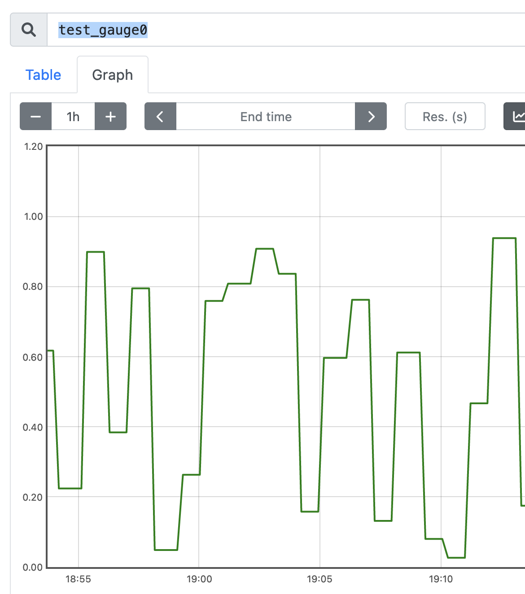

When configuring the SLI, can set this to a Threshold based metric. The Objective Value of what we are stating is “good” is less than or equal to 0.60. If data is missing in our Gauge, we can also consider this “bad”.

Metric for valid requests: Prometheus Metric [was connected during the connecting step].

- Objective Value: 0.60
- SLI value is good if: \<=
- Consider missing data: Bad


### Set SLO Target

Click Continue to set up the SLO Target [based on the SLI] and [Error Budget](https://www.atlassian.com/incident-management/kpis/error-budget) [amount of time system can fail] Policy. A goal we can set is that 50% of requests need to be \<= to our Objective Value e.g this is our SLI. Since we are setting 50% of the target, we are also stating that 50% of the week if we set a rolling 7 day period can be included in our Error Budget which is indicated by Harness.

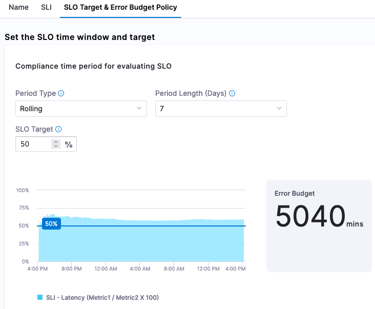

Click Save and now you have the ability to actively monitor and manage your SLOs. SLOs can be renegotiated much easier with Harness without having to calculate them.


If this SLO is too aggressive or too lenient, Harness can provide the actual service data to help make that determination. In this example, we set the SLO target at 50% which is not a very good SLO. Changing the SLO target to be more aggressive, for example 99%, can be changed via the UI. 

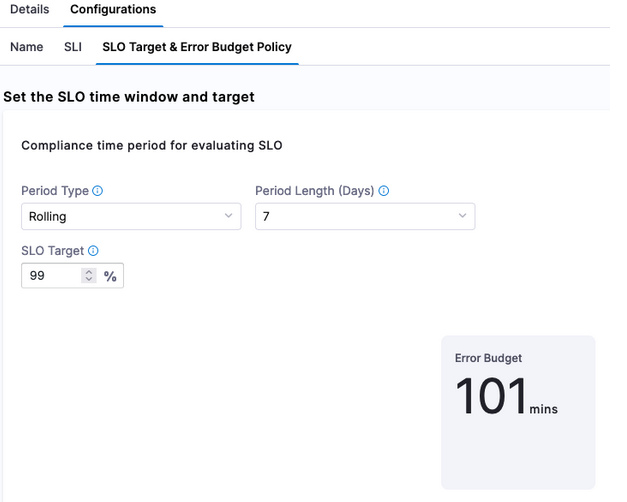


