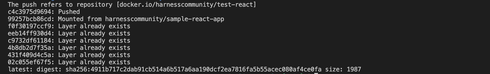
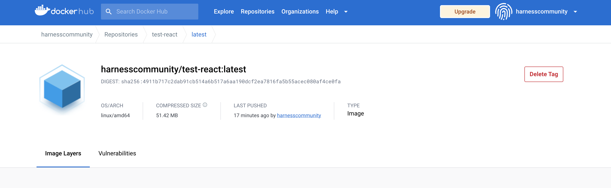

<!-- backup storage of this tutorial in case any info is needed in the future -->
<!-- ---
sidebar_position: 6
title: React application
description: Build and test a sample React application in a CI pipeline.
keywords: [Hosted Build, Continuous Integration, Developer Guide, CI Tutorial]
slug: /ci-pipelines/build/react
--- -->

# Build, test, and publish a Docker image for a sample React application

## What is Continuous Integration?

Continuous Integration is an approach to development of software where changes in the codebase are continuously merged into a shared repository or branch. The combined codebase is then built into a test application over which automated tests are run to find and track any potential bug. The discovered application defects are then turned back over to the developers to fix.

The objectives of any CI process is to:
- Find bugs faster.
- Reduce time for software validation and releases.
- Ensure higher product quality.

In this tutorial we'll be working on a React application hosted in GitHub. Check out the codebase of the application [here](https://github.com/harnesscommunity/react-pipeline-sample).

First, we'll understand how we can build our application locally and push the Docker image to Docker Hub and then create a Harness CI pipeline to automate the entire process implementing the following functions:

1. Build and test the sample react application.
2. Build the Docker image and publish it on Docker Hub.

```mdx-code-block
import CISignupTip from '/tutorials/shared/ci-signup-tip.md';
```

<CISignupTip />

## How to build the app locally

To create a new React project you can use the tool npx, provided you have an npm version of at least 5.2. In this case we already have the project set up and the project structure is given below:

```bash
react-sample-app
├── README.md
├── node_modules
├── package.json
├── package-lock.json
├── .gitignore
├── Dockerfile
├── nginx
├── LICENSE
├── public
└── src
```

We'll need NPM and Docker to build and package our application. If you don’t have those runtimes, on a Windows Machine, you can use Chocolatey to install, or if using a Mac, Homebrew.

In this guide we'll be using Docker to store our application as an image. Docker makes it very easy for other peers to use the application with the support of the different Docker registries that are available in the market. Here we'll be using Docker Hub as the Docker registry. If you do not have a registry available to you, you can create a Docker Hub account and create a repository, for example, "test-react".

Use the below command format to build you Docker image locally and then push the image to Docker Hub registry:

```
docker build --tag your_user/repo:tag .
docker push your_user/repo:tag
```

For example, in my case, at the root of the project:

```
docker build --tag harnesscommunity/test-react:latest .
docker push harnesscommunity/test-react:latest
```


You can validate that this has been placed into the Docker Registry.




## Create your pipeline

```mdx-code-block
import Tabs from '@theme/Tabs';
import TabItem from '@theme/TabItem';
```

1. Fork the repository https://github.com/harness-community/react-pipeline-sample into your GitHub account.
2. Follow the **Get Started** wizard in Harness CI.

```mdx-code-block
<Tabs>
<TabItem value="newaccount" label="New account" default>
```
3. [Sign up](https://app.harness.io/auth/#/signup/?module=ci&?utm_source=website&utm_medium=harness-developer-hub&utm_campaign=ci-plg&utm_content=get-started) for a new Harness account. Select the **Continuous Integration** module after your initial sign-in. This brings you to the **Get Started** wizard.
```mdx-code-block
</TabItem>
<TabItem value="existingaccount" label="Existing account">
```
3. [Log in](https://app.harness.io/auth/#/signin) to your Harness account. You can either create a new project or select an existing project, and then select the **Continuous Integration** module. In the **Project** pane, expand the **Project Setup** menu, and then select **Get Started**.
```mdx-code-block
</TabItem>
</Tabs>
```

4. When you are prompted to select a repository, search for **react-pipeline-sample**, select the repository that you forked in the previous step, and then select **Configure Pipeline**.
5. Select **Starter Pipeline**, and then select **Create Pipeline**.

### Docker Hub connector

You need a [Docker Hub](https://hub.docker.com/) connector. This connector is used to establish the communication between the Docker registry, for example, Docker Hub in this tutorial and Harness CI App.

If you have not created a Docker Hub connector yet, follow these steps.

<details><summary>Create connector</summary>
<p>

```mdx-code-block
import DockerHubConnector from '/tutorials/shared/dockerhub-connector-includes.md';
```

<DockerHubConnector />

</p>
</details>

:::info

The Docker connector needs an access token with **Read, Write, Delete** permissions.

:::

### Modify the pipeline

1. From the left pane, select **Pipelines**, and then select your **react-pipeline-sample** pipeline from the list.

2. Switch from the **Visual** view to the **YAML** view, and then select **Edit YAML**. (By default the YAML editor is on read mode. Here you'll need to enable the edit option for YAML editor)

A starter pipeline is created with a single stage. It should look similar to this:

```yaml
pipeline:
  name: Build react sample pipeline
  identifier: Build_react_sample_pipeline
  orgIdentifier: default
  // highlight-start
  stages:
    - stage:
        name: Build
        identifier: Build
        type: CI
        spec:
          cloneCodebase: true
          execution:
            steps:
              - step:
                  type: Run
                  name: Echo Welcome Message
                  identifier: Run
                  spec:
                    shell: Sh
                    command: echo "Welcome to Harness CI"
          platform:
            os: Linux
            arch: Amd64
          runtime:
            type: Cloud
            spec: {}
  // highlight-end
  properties:
    ci:
      codebase:
        connectorRef: account.Github_OAuth
        repoName: your_user/react-sample-pipeline
        build: <+input>
```

3. Replace the sample `stages` section with the following `variables` and `stages` sections:

```yaml
  variables:
    - name: DOCKERHUB_USERNAME
      type: String
      description: Your Docker Hub username
      value: <+input>
  stages:
    - stage:
        name: Build
        identifier: Build
        type: CI
        spec:
          cloneCodebase: true
          execution:
            steps:
              - step:
                  type: Run
                  name: install node modules
                  identifier: install_node_modules
                  spec:
                    shell: Sh
                    command: npm install
              - step:
                  type: Run
                  name: build app
                  identifier: build_app
                  spec:
                    shell: Sh
                    command: npm run build
              - step:
                  type: Run
                  name: run tests
                  identifier: run_tests
                  spec:
                    shell: Sh
                    command: "npm run test"
              - step:
                  type: BuildAndPushDockerRegistry
                  name: Build and Push an image to Docker Registry
                  identifier: BuildandPushanimagetoDockerRegistry
                  spec:
                    connectorRef: harnesscommunitydocker
                    repo: <+pipeline.variables.DOCKERHUB_USERNAME>/test-react
                    tags:
                      - <+pipeline.sequenceId>
          platform:
            os: Linux
            arch: Amd64
          runtime:
            type: Cloud
            spec: {}

```

:::info

This configuration requires the Docker Hub connector ID to be `Docker_Hub`. If your connector ID is different, replace `Docker_Hub` with the correct ID.

:::

4. Select **Save** in the YAML editor.

## Run your pipeline

1. In the **Pipeline Studio**, select **Run**.
2. Enter your Docker Hub username in the `DOCKERHUB_USERNAME` field.
2. In the **Build Type** field, select **Git Branch**, and then enter **main** in the **Branch Name** field.
3. Select **Run Pipeline**.
4. Observe each step of the pipeline execution. When the first stage completes, test results appear on the **Tests** tab.


:::tip

For a comprehensive guide on application testing, Harness provides O'Reilly's **Full Stack Testing** book for free at https://harness.io/resources/oreilly-full-stack-testing.

:::
