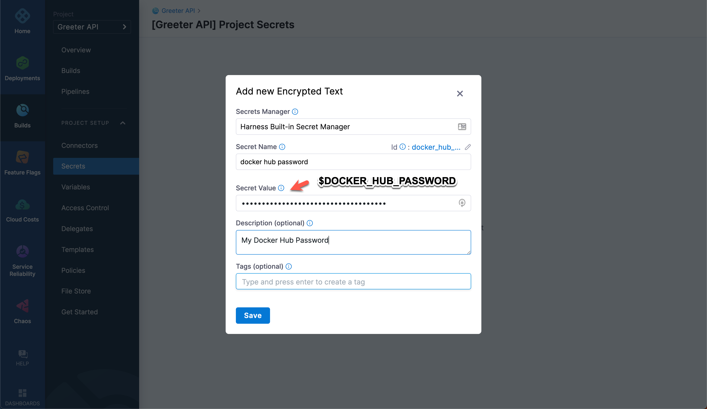

<!-- backup in case this info is needed in future -->
<!-- ---
sidebar_position: 7
title: Rust application
description: Use a CI pipeline to build and push a multi-arch application container image.
keywords: [Hosted Build, Continuous Integration, Hosted, CI Tutorial,Rust]
slug: /ci-pipelines/build/rust
--- -->

# Build Rust application containers

This tutorial shows how you can use a Harness Continuous Integration (CI) pipeline to build a multi-architecture [Rust](https://rust-lang.org) application container image and push it to a Docker container registry.

You'll learn how to:

- [x] Create [__projects__](https://developer.harness.io/docs/getting-started/learn-harness-key-concepts/#organizations-and-projects) in your Harness account.
- [x] Add [__secrets__](https://developer.harness.io/docs/getting-started/learn-harness-key-concepts/#secrets-management) to projects.
- [x] Add a Docker Registry [__Connector__](https://developer.harness.io/docs/getting-started/learn-harness-key-concepts/#connectors) to a project.
- [x] Use a CI pipeline to build and push a multi-architecture Rust application container image.

In this tutorial, you'll use [Rust](https://rust-lang.org) to build a simple REST API called `greeter-api`.

## Prerequisites

In addition to a Harness account, you need the following accounts and tools:

- A [GitHub](https://github.com) account where you can fork the tutorial repo
- A Docker registry account, such as [Docker Hub](https://hub.docker.com) or [Quay.io](https://quay.io)
- [Drone CLI](https://docs.drone.io/cli/install/) to build the application locally
- [Docker Desktop](https://www.docker.com/products/docker-desktop/)

```mdx-code-block
import CISignupTip from '/tutorials/shared/ci-signup-tip.md';
```

<CISignupTip />

## Configure the container registry

To avoid scenarios where builds only work on specific machines, you can use Docker containers to provide clean environments that run specified toolsets. This is a __DevOps__ best practice that helps identify potential problems throughout development.

[Drone by Harness](https://drone.io) is an open source CI platform that helps developers build and test on local machines without manually installing different tools for each language.

Before building the application, you need a location to store build artifacts, which are also known as container images. Externally-hosted locations are ideal because they are more accessible. Container image storage spaces are called __Container Registries__. Examples of container registry providers include Docker Hub, Quay.io, Harbor, Google Artifact Registry (GAR), and Elastic Container Registry (ECR).

This tutorial pushes a `fruits-api` application container image to a [Docker Hub](https://hub.docker.com/) repository named `fruits-api`. You can use another container registry if you prefer.

1. Create a public repository named `fruits-api` in your container registry.


2. Test your `fruits-api` repository by manually building and pushing an application image to the registry. First, log in to the Docker Hub account associated with the `fruits-api` repository:

  ```shell
   echo -n "$DOCKER_HUB_PASSWORD" |\
     docker login -u `$DOCKER_HUB_USERNAME` --password-stdin
   ```

3. This tutorial uses a sample repo referred to as the tutorial repo or `$TUTORIAL_GIT_REPO`. Clone the [tutorial repo](https://github.com/harness-apps/rust-greeter):

   ```shell
   #  clone rust-greeter repository
   git clone https://github.com/harness-apps/rust-greeter.git \
     && cd "$(basename "$_" .git)"
   # navigate to the clone repository folder
   export TUTORIAL_HOME="$PWD"
   ```

   :::tip

   [GitHub CLI](https://cli.github.com/) is useful for working with GitHub repositories on the command line.

   :::

4. Fork the tutorial repository:

   ```shell
   gh repo fork
   ```

   :::note

   You can also fork the [tutorial repo](https://github.com/harness-apps/rust-greeter) from the GitHub web UI.

   :::

## Use Drone to build and push an image

Run a simple [Drone](https://drone.io) pipeline locally to build and push an application image from your computer to your `fruits-api` repository.

1. Copy `$TUTORIAL_HOME/.env.example` to `$TUTORIAL_HOME/.env`:

   ```shell
   cp $TUTORIAL_HOME/.env.example $TUTORIAL_HOME/.env
   ```

2. Edit the `$TUTORIAL_HOME/.env` as follows, replacing `$DOCKER_HUB_USERNAME`, `DOCKER_HUB_PASSWORD` with the username and password for the Docker Hub account associated with the `fruits-api` repository:

   ```properties
   PLUGIN_REGISTRY=docker.io
   PLUGIN_USERNAME=$DOCKER_HUB_USERNAME
   PLUGIN_PASSWORD=$DOCKER_HUB_PASSWORD
   PLUGIN_REPO=$DOCKER_HUB_USERNAME/rust-greeter
   PLUGIN_TAG=0.0.1
   ```

3. Use Drone to build the image and push it to Docker Hub:

   ```shell
   drone exec --trusted --env-file=.env
   ```

This command runs a simple **pipeline**. The pipeline's `push` step uses [drone-docker-buildx](https://drone-plugin-index.geekdocs.de/plugins/drone-docker-buildx/), which can build multi-architecture container images. The pipeline you'll create in this tutorial builds `linux/arm64` and `linux/amd64` images.


4. Wait while the pipeline runs. It can take some time to build and push, because Drone tries to pull container images if they don't already exist. A successful run produces output similar to the following:

   ```text
   ...
   [push:350] The push refers to repository [docker.io/$DOCKER_HUB_USERNAME/rust-greeter:0.0.1]
   [push:351] 639e874c7280: Preparing
   [push:352] 96e320b34b54: Preparing
   [push:353] c306578afebb: Preparing
   [push:354] 96e320b34b54: Layer already exists
   [push:355] c306578afebb: Pushed
   [push:356] 639e874c7280: Pushed
   ...
   ```

5. To check the pushed image, navigate to `https://hub.docker.com/repository/docker/$DOCKER_HUB_USERNAME/rust-greeter`.

If you monitored your machine while running `drone exec`, you may have noticed a temporary slowdown. This might not be a problem for a single engineer, but scaling this process up to dozens, hundreds, or even thousands of engineers can strain system resources. Fortunately, modern continuous integration platforms use distributed nodes to support infrastructure at scale. [Harness CI](https://www.harness.io/products/continuous-integration) supports scaling and helps you externalize, centralize, and automate the build processes, as demonstrated in the next part of this tutorial.

## Build the Harness CI pipeline

The `drone exec` command you ran in the previous section is adequate while you're learning or building locally for yourself. However, when working on a team to deliver enterprise applications, you need to offload, centralize, and automate this process. With Harness CI, you can create pipelines that make your build processes repeatable, consistent, and distributed.

The rest of this tutorial shows how to create a Harness CI pipelines that mimics the local `drone exec` steps that build and push a multi-architecture application container image to a container registry.

While the Harness platform has several modules, this tutorial focuses on the Continuous Integration (CI) module. If you don't already have a Harness account, [sign up for a Harness account](https://app.harness.io/auth/#/signup/?module=ci&?utm_source=website&utm_medium=harness-developer-hub&utm_campaign=ci-plg&utm_content=get-started).


### Compare build infrastructure options

Pipelines require build infrastructure to run. When you create CI pipelines, you can use either Harness-hosted infrastructure or bring your own build infrastructure. This tutorial uses Harness-hosted infrastructure, also called Harness Cloud.

```mdx-code-block
<Tabs>
<TabItem value="cloud" label="Harness Cloud" default>
```

[Harness Cloud](/docs/continuous-integration/use-ci/set-up-build-infrastructure/use-harness-cloud-build-infrastructure) uses Harness-hosted machines to run builds. Harness maintains and upgrades these machines, which gives you more time to focus on development.


```mdx-code-block
</TabItem>
<TabItem value="self" label="Self-hosted infrastructure">
```

With self-hosted build infrastructure, your pipelines run on your local machines or your Kubernetes clusters. To learn about self-hosted options, go to [Set up build infrastructure](/docs/category/set-up-build-infrastructure).


```mdx-code-block
</TabItem>
</Tabs>
```

### Create a GitHub personal access token

For this tutorial, Harness needs access to your fork of the tutorial repo on GitHub. GitHub personal access tokens are the preferred mode for providing Github credentials.

The GitHub documentation explains how to [Create a personal access token](https://docs.github.com/en/authentication/keeping-your-account-and-data-secure/creating-a-personal-access-token).

If you are using an existing personal access token, make sure it has the `admin:repo_hook` and `user` scopes.


:::important

The __token__ is displayed only one time. Copy the token and save it to your password manager or another secure place. The rest of this tutorial refers to this token value as `$GITHUB_PAT`.

:::

### Create a project

In the Harness Platform, you declare and configure resources, such as pipelines, secrets, and connectors. The availability of these resources depends on the scope where the resource was declared. Resources can be available across an entire account, to an organization within an account, or limited to a single project. For this tutorial, you'll create all resources at the project scope.

1. Log in to your Harness account that you created earlier and create a project. If you haven't created a project before, select **Create a project**. If you've already created a project, select the active project on the navigation menu, select **View All Projects**, and then select **New Project**.

   

2. Name the new project _Greeter API_, leave the other options as their defaults, and then select __Save and Continue__.

   

3. Select the **Continuous Integration** module, and then select **Go to Module**.

   

### Create a pipeline

The Harness CI pipeline wizard creates a basic pipeline for you.

1. Select __Get Started__ to launch the pipeline wizard.

   

2. If you do not have any Git repository connectors at either the account or organization level, select __GitHub__ as the repository type, select the __Access token__ authentication method, input your GitHub personal access token (`$GITHUB_PAT`) in the __Access Token__ field, and select __Test Connection__ to verify your credentials.

   

3. Select __Next: Select Repository__, choose your fork of the tutorial repo `rust-greeter`, and then select __Next: Configure Pipeline__.

   

   :::info

   Make sure you choose your personal fork of the [tutorial repo](https://github.com/harness-apps/rust-greeter).

   If your account has a Git repo connector at the account or organization level, the wizard may generate a list of repositories for you to choose from.

   If the wizard generated a list of repos but your tutorial repo fork isn't listed, then you need to add a GitHub connector so that Harness can access your tutorial repo fork. Since you can't add a new connector in the wizard, you can turn off **Clone Git Repository** and then configure your pipeline's **Codebase** after exiting the wizard.

   :::

4. Select __Starter Pipeline__ and then select __Create Pipeline__.

   

You can use either the visual editor or the YAML editor to add pipeline steps. This tutorial uses the visual editor.


Initially, your starter pipeline has a single stage, called _Build_, and single step, called _Echo Welcome Message_. You'll modify this stage so that the pipeline builds and pushes a multi-architecture Rust application container image to Docker Hub. However, first you must configure additional resources that the steps require, namely secrets and connectors.

### Create a Docker Hub password secret

1. Under __Project Setup__, select __Secrets__.

   

2. Select __New Secret__, and then select __Text__.

   

3. On the __Add new Encrypted Text__ window, populate the fields as follows, and then select __Save__.

   - __Secrets Manager__: __Harness Built-in Secret Manager__
   - __Secret Name__: _docker hub password_
   - __Secret Value__: Docker Hub password for the account associated with the `fruits-api` repo
   - __Description__ and __Tags__: Optional

   

4. On the secrets list, make a note of the `id` for the __docker hub password__. You need this `id` later for your CI pipeline.

### Create a Docker Hub Registry connector

You must add a __connector__ that allows Harness to connect to your Docker Hub container registry.

1. Under __Project Setup__, select __Connectors__.

   

2. Select __New Connector__ and then select __Docker Registry__,

   

3. Follow the prompts in the new connector wizard. On the __Overview__ page, enter _docker hub_ as the connector __Name__. Then select __Continue__ to configure the credentials.

   

4. On the __Details__ page, select **Docker Hub** as the provider type, and then enter the URL for the Docker registry where you created the `fruits-api` repo.
5. For **Authentication**, select **Username and Password**, enter the Docker Hub username, select the __docker hub password__ secret that you created earlier, and then select __Continue__.

   

6. Select __Connect through Harness Platform__.

   

7. Select __Save and Continue__ to run the connection test,

   

8. If the connection is successful, select __Finish__.

   

### Add service dependency, wait, and test steps

1. Go back to __Pipelines__ and select the __Build rust-greeter__ pipeline that you created earlier.

   

2. Select the __Build__ stage.

   

3. Delete the __Echo Welcome Message__ step by selecting the `x` that appears when you hover over the step.
4. Select __Save__ to save the pipeline.

Next, you'll use a **Background** step to add a dependent service called `rgreeter`.

<details>
<summary>How can Harness pipeline steps connect to dependent services?</summary>

Harness pipelines support a concept called __Service Dependencies__, which are detached services that are accessible to all steps in a stage. Service dependencies support workflows such as:

- Integration testing: Set up a service and then run tests against that service.
- Running Docker-in-Docker: Set up a [DinD service](https://ngdocs.harness.io/article/ajehk588p4) to process Docker commands in **Run** steps.

Later in this tutorial, you'll use the _Integration testing_ workflow to make a step called `test` connect to a dependent service called `rgreeter` and run integration test cases against it.

</details>

5. Select **Add Step**, select **Add Step** again, and then select **Background** from the Step Library.
6. Configure the standard step settings as follows:

   * **Name:** `rgreeter`
   * **Description:** `runs the Greeter API service.`
   * **Shell:** Bash
   * **Command:** `cargo run --target-dir=/tmp/build`

   

7. Expand **Additional Configuration**. Select your Docker Hub connector for the **Container Registry**, and then specify the **Image** as `<your_DockerHub_registry>/rust-zig-builder:v0.1.0`.
8. Add the following two **Environment Variables**:

   |  Key    | Value   |
   | ---  | ----------- |
   |`PORT`|`8080`|
   |`RUST_LOG`|`info`|

   

9. Select __Apply Changes__ to save the step, and then select __Save__ to save the pipeline.

When the pipeline runs, the `rgreeter` service takes a few minutes to start up. To prevent steps from running before the service starts, add a wait to the pipeline.

10. Select **Add Step**, select **Add Step** again, and then select **Run** from the Step Library.
11. Configure the standard step settings as follows:

   * **Name:** `wait for service`
   * **Description:** `wait for the rgreeter service to be ready.`
   * **Shell:** Sh
   * **Command:**

      ```shell
      apk add -U --no-cache curl
      until curl --output /dev/null --silent --head --fail $SERVICE_URL ; do sleep 5; done;
      ```

12. Expand **Additional Configuration**. Select your Docker Hub connector for the **Container Registry**, and then specify the **Image** as `alpine`.

   

13. The wait step needs the URL of the `rgreeter` service from the **Background** step. This URL is usually formed from the service ID and port number. In your **Run** step's **Environment Variables**, add an environment variable called `SERVICE_URL` with the value `http://rgreeter:8080`.

   

14. Select  __Apply Changes__ to save the step, and then select __Save__ to save the pipeline.
15. Add another **Run** step with the following settings:

   * **Name:** `test`
   * **Description:** `Run unit and integration tests`
   * **Shell:** Bash
   * **Command:** `cargo test --target-dir=/tmp/build`
   * **Container Registry:** Your Docker Hub connector
   * **Image:** `<your_DockerHub_registry>/rust-zig-builder:v0.1.0`

   

16. For the `test` step to connect to the `rgreeter` service, add an environment variable called `SERVICE_URL` with the value `http://rgreeter:8080`

   

17. Select __Apply Changes__ to save the step, and then select __Save__ to save the pipeline.
18. Click **Run** to verify that the pipeline is able to test the Rust application. On the __Run Pipeline__ screen, make sure __Git Branch__ is selected and the __Branch Name__ is set to _main_. Select __Run Pipeline__ to start the pipeline run.

   

19. Wait while the pipeline runs to make sure it succeeds.

   

   :::tip

   Select a step to view the step's logs.

   :::

If your pipeline succeeded, add two more steps to build your Rust application image and push it to your container registry.

### Add build and push steps

1. Go back to the Pipeline Studio. From the build execution page, you can select __Edit Pipeline__ to get back the __Pipeline Studio__.
2. Select the __Build__ stage, and add another **Run** step with the following settings:

   * **Name:** `build`
   * **Description:** `Build the application and cross compile the binary with architectures linux/arm64 and linux/amd64`
   * **Shell:** Bash
   * **Command:** `task cross`
   * **Container Registry:** Your Docker Hub connector
   * **Image:** `<your_DockerHub_registry>/rust-zig-builder:v0.1.0`

   :::info

   The `build` step's **Command** uses [Taskfile](https://taskfile.dev). Task is a task runner/build tool that aims to be simpler and easier to use than, for example, [GNU Make](https://www.gnu.org/software/make/).

   `task cross` executes the [Taskfile.yaml](https://github.com/harness-apps/rust-greeter/blob/main/Taskfile.yaml#L95-L101) that does cross compilation.

   :::

   

3. Select __Apply Changes__ to save the step, and then add a final **Run** step with the following settings:

   * **Name:** `push`
   * **Description:** `Publish the multi architecture images to container registry`
   * **Shell:** Bash
   * **Command:**

    ```shell
    echo "$IMAGE_REGISTRY_PASSWORD" | \
    docker login "$IMAGE_REGISTRY" -u "$IMAGE_REGISTRY_USER" --password-stdin
    docker buildx inspect "buildx-multi-arch" ||\
      docker buildx create --name="buildx-multi-arch" --driver=docker-container --driver-opt=network=host
    docker buildx build --builder="buildx-multi-arch" --push \
      --tag "$IMAGE_REGISTRY/$IMAGE_REPO:$IMAGE_TAG" \
      --tag "$IMAGE_REGISTRY/$IMAGE_REPO:latest" \
      --platform="linux/amd64" --platform="linux/arm64" \
      --file Dockerfile "$CONTEXT"
    ```

   

4. The `push` step's **Command** runs the `docker buildx build` that builds a multi-architecture image for the platforms `linux/amd64` and `linux/arm64`. This script uses several environment variables. You must add these variables to the step's **Environment Variables**:

   |  Key    | Value    |
   | ---  | ----------- |
   |`DOCKER_HUB_USERNAME`| The username for the Docker Hub account where you want to push the image|
   |`DOCKER_HUB_PASSWORD`| `<+secrets.getValue("docker_hub_password")>`|
   |`CONTEXT`| `/harness/target`|
   |`IMAGE_REGISTRY`| `docker.io`|
   |`IMAGE_REPO`| `YOUR_DOCKERHUB_USERNAME/rust-greeter`|
   |`IMAGE_TAG`| `<+codebase.shortCommitSha>`|

   

   :::important

   The `DOCKER_HUB_PASSWORD` and `IMAGE_TAG` environment variable values must be the __Expression__ type. Select the thumbtack to change the value type.

   `secrets.getValue` is an expression that allows Harness to get the value from your `docker_hub_password` secret that you created earlier in the tutorial. For more information, go to [Add and Reference Text Secrets - Reference encrypted text by identifier](https://developer.harness.io/docs/platform/Secrets/add-use-text-secrets/#step-3-reference-the-encrypted-text-by-identifier).

   `codebase.shortCommitSha` allows you to get the Git commit short SHA. It is one of several [Build-in codebase variables](https://developer.harness.io/docs/continuous-integration/use-ci/codebase-configuration/built-in-cie-codebase-variables-reference).

   :::

5. Select __Apply Changes__ to save the step, and then select __Save__ to save the pipeline.

  

6. Click **Run** to verify that the pipeline can test, build, and push your multi-architecture Rust application. On the __Run Pipeline__ screen, make sure __Git Branch__ is selected and the __Branch Name__ is set to _main_. Select __Run Pipeline__ to start the pipeline run.

   

7. If the pipeline succeeds, go to your Docker Hub repo. Check that the tags `latest` and `last git commit sha` are present.

   

## Use Docker Compose to test the application

You can use [Docker Compose](https://docs.docker.com/compose/) to test the Rust application, for example:

```dockercompose
services:
  helloworld:
    image: "$DOCKER_HUB_USERNAME/rust-greeter"
    pull_policy: always
    environment:
      - RUST_LOG=info
      - PORT=8080
    ports:
      - "8080:8080"
```

Use these URLs to verify the application:

- `http://localhost:8080/`: Returns plain text `Hello World!`
- `http://localhost:8080/`: Returns a JSON object containing `"message": "Hello! Anonymous!"`
- `http://localhost:8080/?name=Jack`: Returns a JSON object containing `"message": "Hello! Jack!"`

## Optional exercise: Improve build times

You may have noticed that the Rust build downloads crates from the registry for each step: `rgreeter`, `test` and `build`. You can improve build times by allowing steps to share a cache. For more information, go to [Share and Cache CI Data](https://developer.harness.io/docs/category/share-and-cache-ci-data).

If you want to try this with your Rust app tutorial pipeline, you'll need to add two additional steps to create and restore a cache. Here are some hints to help you with this exercise:

- You need to cache `/usr/local/cargo/registry` and make it available to all steps.
- Add one step before `rgreeter` that restores or downloads the cache.
- Add one step after `push` that uploads the cache.

## Continue your Continuous Integration journey

With CI pipelines you can consistently execute your builds at any time. Try modifying the pipeline trigger to watch for SCM events so that, for example, each commit automatically kicks off the pipeline. All objects you create are available to reuse in your pipelines.

You can also save your build pipelines as part of your source code. Everything that you do in Harness is represented by YAML; you can store it all alongside your project files.

After you build an artifact, you can use the Harness Continuous Delivery (CD) module to deploy your artifact. If you're ready to try CD, check out the [CD Tutorials](/tutorials/cd-pipelines#all-tutorials).
