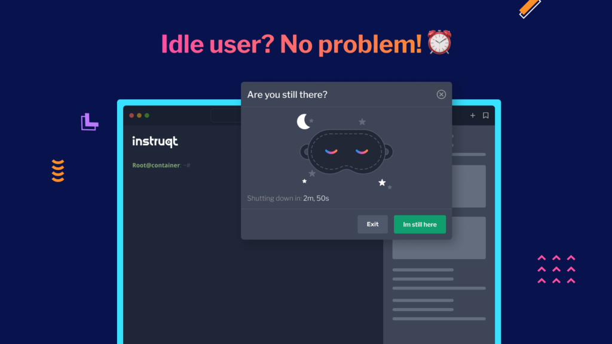

# Harness University Frequently Asked Questions (FAQs)

This FAQ page is designed to assist customers who are experiencing common issues while attempting to complete Harness certifications on our platform. From resolving exam glitches to managing time during the hands-on exam, this guide aims to provide quick and effective solutions beyond our [Instructions](/university/instructions) section.

## Table of Contents

- [Exam gets "Stuck"](#exam-gets-stuck)
- [Trouble with the Hands-On Exam](#trouble-with-the-hands-on-exam)
- [Running out of time in Hands-On Exam](#running-out-of-time-in-hands-on-exam)
- [Issues with Course Registration](#issues-with-course-registration)
- [Requesting Accommodations for Exams ](#requesting-accommodations-for-exams)
- [Retakes for Exams ](#paid-exam-retakes)
- [Inquires about Instructor-Led Training ](#inquiries-about-instructor-led-training)
- [Contact Information](#contact-information)

---

## Exam gets "Stuck"

### What should I do if my exam gets stuck on the "loading" screen?

If you encounter a "loading..." message followed by an error that says "There was a problem. Please try again later", your exam has gotten "stuck". 

#### How do I fix this?
Please email our certification team at [certifications@harness.io](mailto:certifications@harness.io) to resolve the issue. 

#### What if I used a coupon code?
If you initially used a coupon code during your registration, you will need to re-enter it once the error is cleared.

---

## Trouble with the Hands-On Exam

### I can't load/open the Hands-On portion of the exam, what should I do?

This usually occurs because right-click is not enabled on the exam. You can manually copy and paste the URL into a new tab to access the Hands-On portion. You can use `Command+C/Command+V` for Mac or `Ctrl+C/Ctrl+V` for Windows.

---

## Running Out of Time in Hands-On Exam

### What should I do if I'm running out of time or need to step away from the Hands-On exam?

Two options are available:

1. **Are You Still There?**: If you've been idle, an "Are you still there?" pop-up will appear. Click on the "I'm still here" button to restart the timer.
    

2. **Extend Time Limit**: If you need more time to complete challenges, click on the "Extend Time Limit" button located in the upper right corner of your screen.
    

---

## Issues with Course Registration

### How do I register for a course?

Follow the on-screen instructions to register for a course. If you encounter any problems, please email [certifications@harness.io](mailto:certifications@harness.io).

### I can't find the course I'm looking for, what should I do?

Use the navigation within the Skilljar dashboard to find your desired course. If you still can't locate it, email [certifications@harness.io](mailto:certifications@harness.io).

### How do I use a coupon code during registration?

Enter your coupon code in the designated box during the checkout process. If the code doesn't work, please email [certifications@harness.io](mailto:certifications@harness.io).

### How do I retake a paid exam?
For the Admin and Architect level exams, we allow for up to two retakes on paid exams. 

* If you have purchased an exam [not via coupon code] and need to retake,  please e-mail [certifications@harness.io](mailto:certifications@harness.io) so we can provide a retake coupon code.
* If you redeemed a coupon code, please re-apply the coupon code when retaking.

---

## Requesting Accommodations for Exams

Testing accommodations are considered on a case-by-case basis. Our exams include retakes per the tier and the exams are not proctored [exams can be taken at any time]. Developer level certifications which are free have five retakes and Admin/Architect which are paid level certifications have two retakes per payment. Due to current platform restrictions, we can only provide limited accommodations at this time. Please reach out to us at [certifications@harness.io](mailto:certifications@harness.io) prior to attempting an exam if accommodations are needed. 

### List of Technology in Exams

* Caveon Scorpion for knowledge questions. 
* Instruqt for hands-on portions. 

---

## Paid Exam Retakes

For the Admin and Architect level exams, we allow for up to two retakes on paid exams.

- If you have purchased an exam [not via coupon code] and need to retake,  please e-mail [certifications@harness.io](mailto:certifications@harness.io) so we can provide a retake coupon code.
- If you redeemed a coupon code, please re-apply the coupon code when retaking.

---

## Inquiries about Instructor-Led Training

### What formats are Instructor-Led Trainings available in?
Instructor-Led Trainings [e.g ILTs] are available in the following formats:
* Dedicated. Either virtual or on-site. 
* Shared-Virtual [e.g vILT]. This is per a [shared virtual calendar](https://university-registration.harness.io/calendar). 

### Minimum Enrollment Requirement
To ensure a productive and engaging learning environment, we require a minimum number of students to enroll in each shared vILT course. If the minimum enrollment is not met, the following steps will be taken:

* Notification of Cancellation: Registered participants will receive a notification if the course is canceled due to insufficient enrollment.
* Alternative Session Registration: Participants will be provided with options to register for another session that meets the minimum enrollment criteria.
* Notification of Cancellation: If a course does not meet the minimum enrollment requirement you will be notified via email at least 5 business days before the scheduled start date of the course and the notification will include instructions on how to register for an alternative session.

### vILT Rescheduling Options
In the event of a course cancellation:
* Alternative Sessions: You will have the option to register for any upcoming session of the same course- you can view the available sessions [here](https://university-registration.harness.io/calendar).
* Priority Enrollment: Participants from a canceled session will receive priority enrollment for rescheduled sessions.
  
### What is the cost for ILT
Instructor-Led Training has tiers of costs depending on format. All ILTs has access to the 
[Platform Pre-Req Course](https://university-registration.harness.io/introduction-to-the-harness-platform). 

* Dedicated: $12,000 for up to 12 students virtually. On-site will be the $12,000 + travel. 
* Virtual: $1,000 per student, per module. 

You can leverage your [Harness Service Catalog Dollars](https://www.harness.io/legal/service-catalog-dollars) for payment
of ILTs or purchase via SKU or for virutal online via SkillJar. 

---

## Contact Information

For any other queries or technical difficulties, please don't hesitate to contact us at [certifications@harness.io](mailto:certifications@harness.io).

